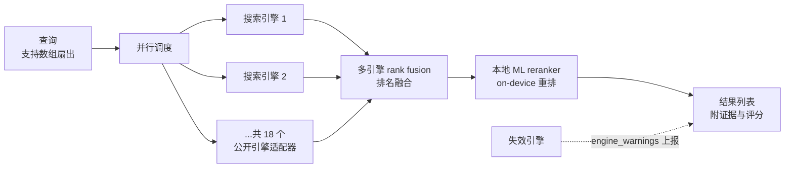
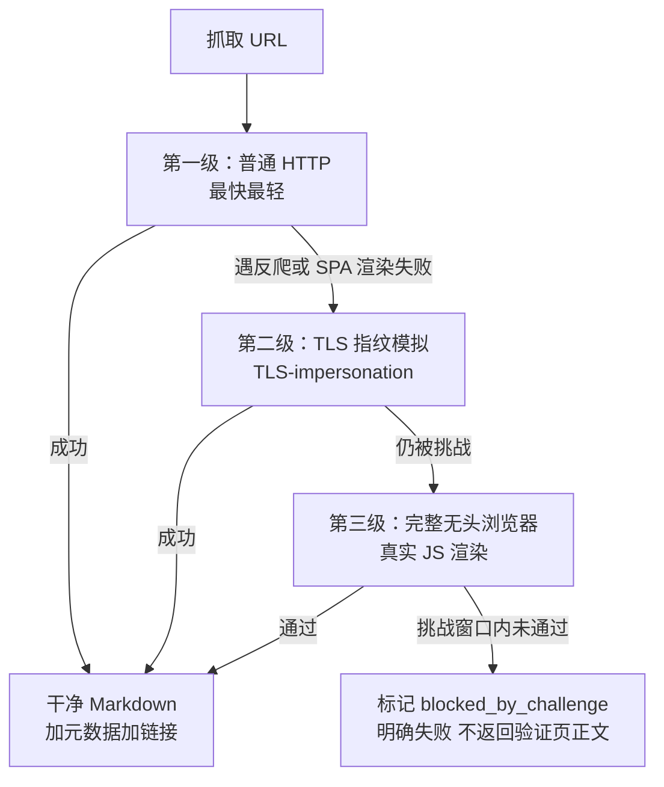

# 01 · 机制拆解：证据契约与诚实输出

> 事实锚点：F-009、F-010、F-011、F-013、F-039、F-040、F-014、F-015

Agent 联网最大的信任问题不是"搜不到"，而是"搜到了但你不知道它凭什么这么说"。wigolo 的设计主线是**让每条结果可审计**：证据定位到字节、失败显式上报、弱结果主动打标。本篇拆解四个机制。

## 机制一：18 引擎并行 + 本地重排的搜索管线

要点（F-009、F-010）：

1. **并行扇出**：一次查询同时打到 18 个直连公开搜索引擎；query 参数支持数组，一次调用并行查多个问题
2. **排名融合**：多引擎结果做 rank fusion——单个引擎抽风不影响整体，这是博文"某个引擎挂了影响不大"的结构性原因（F-030）
3. **本地重排**：融合后交给 on-device 排序模型精排，模型在本机运行，无云端推理费
4. **失效可见**：没响应/降级的引擎进入返回体的 `engine_warnings`、`engine_telemetry`、`engine_pool` 字段，`wigolo doctor` 还有逐引擎状态表（缺 key 的可选引擎会点名 env 变量，如 `WIGOLO_GITHUB_TOKEN`、`BRAVE_API_KEY`）（F-044）

## 机制二：字节级证据契约

每条返回结果携带统一的证据字段（F-010、F-039）：

| 字段 | 含义 |
|------|------|
| `citation_id` | 引用 ID，Agent 写报告时可逐条回指 |
| `source_span` | 证据在原文中的**字节偏移**（start/end），定位精确到字符区间而非"大概在页面上" |
| `evidence_score` | 置信度评分，含子项：`final`（综合）/ `semantic`（语义）/ `lexical`（词面）/ `engine_consensus`（引擎共识度） |
| `freshness_signal` | 新鲜度信号：`published`（发布时间）+ `confidence`（置信度） |
| `junk` 标签 | 质量差的结果被评分器主动标记，不与正常结果混排 |
| 陈旧缓存标记 | 命中过期缓存时显式标注，不伪装成新鲜结果 |

这解释了博文作者的使用感受（F-026）：让 Agent 查最新版本文档时，答案带原文位置，"不怕它编"——Agent 的每个论断都能回到源页面的具体字节区间核对。官方四工具对比中，wigolo 也是唯一给出这种证据粒度的（F-031）。

## 机制三：fetch 的三级升级路由

抓页面不是"一个 HTTP 请求"那么简单，反爬和 JS 渲染是两大拦路虎。wigolo 的 fetch 按成本逐级升级（F-011、F-040）：

关键设计：

- **升级是自动的**：调用方只说"抓这个 URL"，路由在内部完成（F-011）
- **通关复用**：某域名已通过的 challenge clearance 会缓存复用，不重复闯关（F-040）
- **失败诚实**：过不去就标 `blocked_by_challenge`，绝不把"请点击验证"的页面包装成正文返回（F-013）
- **超能力附加项**：PDF 解析、登录态会话、页面动作（click/type/scroll/screenshot）、单 section 抽取（F-012、F-040）

> 边界诚实声明（F-047）：IP 信誉是被评分的——datacenter IP（VPS/CI/云主机）上部分挑战站即使浏览器路由也过不去，而同一请求从住宅网络可以过。这是运行环境属性而非工具缺陷；官方提供的可选杠杆是配信誉匹配的代理（`USE_PROXY=true` + `PROXY_URL`，凭据进 OS keychain）。

## 机制四：crawl 与 extract 的批处理纪律

**crawl（整站爬取）**（F-014）：

- 模式：BFS / DFS / sitemap / map-only（只出地图不抓正文）
- 礼貌默认：遵守 robots.txt、按域名限速与爬取延迟、页面预算面向研究而非批量收割
- 输出：自动去样板内容（导航/页脚/广告），保留正文

**extract（结构化抽取）**（F-015）：

- 内置识别：表格、JSON-LD、metadata、品牌资产，以及 Article / Recipe / Product 等命名 schema
- 自定义：传 JSON Schema 描述你要的字段，返回结构化结果
- 与 fetch 的分工：fetch 产出"给人/Agent 读的 Markdown"，extract 产出"给程序用的结构化数据"

## 记忆机制：cache 与 find_similar

查过的内容不是用完即弃（F-016、F-017）：

- **cache**：所有抓取结果进本地缓存，支持**关键词 + 混合语义**检索（embedding 在本地跑）；重复查询即时返回、零费用、断网可用。TTL 可调（`CACHE_TTL_SEARCH` / `CACHE_TTL_CONTENT`），需要强新鲜度时传 `force_refresh: true`
- **find_similar**：给一个 URL 或概念，**关键词 + 语义 + 实时网页**三路融合找相似内容
- 降级语义：embedding 模型缺失时语义检索回退关键词匹配，功能不中断（linux-arm64 当前即此状态，见 [02 架构](02-local-first-architecture.md)）

## 边界与时效

- 18 个引擎适配器、评分字段名以官方 docs/tools.md 与 docs/configuration.md 为准（版本 0.2.0）
- `blocked_by_challenge` 的通过率与运行网络环境强相关，住宅网络优于 datacenter IP（F-047）
- 下一篇：[02 本地优先架构与部署边界](02-local-first-architecture.md)
