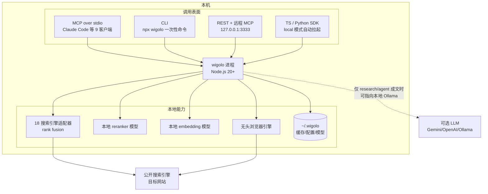

# 02 · 本地优先架构与部署边界

> 事实锚点：F-006、F-037、F-038、F-041、F-042、F-045~F-049、F-052

## 本地优先意味着什么

"Local-first" 在 wigolo 里不是营销词，而是具体的架构约束（F-006、F-034）：

- **数据面在本机**：缓存、抓取内容、embedding/重排模型、配置全部在 `~/.wigolo/`（Windows：`%USERPROFILE%\.wigolo`）
- **核心路径无云依赖**：搜索、抓取、爬取、抽取、缓存、相似发现六个工具不需要任何账号或 Key，也不经过任何 wigolo 厂商服务器——请求从你的机器直接发到 18 个公开搜索引擎和目标网站
- **外发只有两类**：①搜索/抓取本身发往公开网站的流量；②可选的 LLM 调用（research/agent 写报告时，且可指向本地 Ollama）
- **遥测默认关闭**：仅 `WIGOLO_TELEMETRY=1` 显式 opt-in 才写 NDJSON 到 `~/.wigolo/telemetry/`；日志默认全走 stderr，不写隐藏日志目录（F-048）

## 架构全景

## keyless 与 LLM 的边界

这是使用前最需要搞清楚的一条线（F-037、F-038）：

| 能力 | 无 Key | 配 LLM 后 |
|------|--------|-----------|
| search / fetch / crawl / extract / cache / find_similar | ✅ 完整功能 | 同左 |
| research | 返回结构化证据简报（材料+引用） | 输出成文研究报告 |
| agent | 返回结构化证据简报 | 自主规划并产出综合结果 |
| search --format answer | 结果列表 | 直接给答案段落 |

LLM provider 六选一（F-038）：

- `gemini`：官方推荐的免费档，Key 在 aistudio.google.com/apikey 领取
- `anthropic` / `openai` / `groq`：对应各家 API
- `ollama`：**完全本地**的模型，整机零外发（博文作者的选择，F-025）
- 任意 OpenAI 兼容端点

配置方式为环境变量：`WIGOLO_LLM_PROVIDER` + 对应 Key（如 `GEMINI_API_KEY`）。

## 四种部署形态

1. **本地 MCP（最常用）**：`npx wigolo init --agents=claude-code`，Agent 通过 stdio 调用（F-023）
2. **本地 CLI/脚本**：`npx wigolo search "..."`，任意工具加 `--json` 出机器可读结果（F-043）
3. **本地/自托管 REST**：`wigolo serve` 起 HTTP 服务，n8n、远程 Agent、curl 都能调；Docker 镜像 `ghcr.io/knockoutez/wigolo`（F-041、F-042）
4. **嵌入式 SDK**：`npm install wigolo-sdk` 或 `pip install wigolo`，local 模式自动发现/拉起 daemon，无需单独 serve（F-042）

REST 安全设计是 **fail-closed**（F-041）：默认只绑 loopback；要绑非 loopback 地址必须显式设 `WIGOLO_API_TOKEN`（或 `--allow-unauthenticated` 明确承担风险），端口占用时不自动换端口而是报错提示可用端口。

## 降级矩阵：组件挂了会怎样

官方文档明确列出每个组件失效时的退化行为（F-044、F-046）：

| 失效组件 | 退化行为 |
|----------|----------|
| 浏览器引擎 | JS 渲染页回退普通 HTTP（部分 SPA 内容可能缺失） |
| embedding 模型 | find_similar 与语义缓存排序回退关键词匹配 |
| reranker 模型 | 少一层 ML 精排，多引擎 rank fusion 仍生效 |
| 无 LLM Key | research/agent/answer 返回结构化证据而非成文 |
| 单个搜索引擎 | 结果照常返回，失效引擎进 engine_warnings |

linux-arm64 特殊情况（F-046）：embeddings tokenizer 暂无 ARM 预编译二进制，语义功能不可用、回退关键词；需要语义能力请用 x64 主机（官方标注未来版本跟进）。

## 网络环境适配（F-049）

- **公司代理**：`USE_PROXY=true` + `PROXY_URL`（凭据进 OS keychain 不落盘）；TLS 审计代理再设 `NODE_EXTRA_CA_CERTS`
- **慢网/区域限制**：模型与浏览器下载支持断点续跑；`init --no-warmup` 跳过全部下载、首次使用时按需懒加载；浏览器 CDN 受限可设 `PLAYWRIGHT_DOWNLOAD_HOST` 镜像
- **空气间隙/离线机**：在联网机 `wigolo warmup --all` 后拷贝其 `~/.wigolo` 到目标机预置模型与浏览器（注意：查询时仍需联网，预置的只是下载物）
- **Windows**：Node 20+ 即可，PowerShell 设环境变量语法 `$env:WIGOLO_SEARCH="hybrid"`；其余命令/Unix 完全一致

## 磁盘与卸载

- 占用构成（F-045）：embedding+reranking 模型约 250MB + 可选浏览器引擎约 0.5–1GB
- `npx wigolo init --no-warmup`：先不下载，用到再懒加载
- `wigolo config --cleanup`：回收模型/浏览器磁盘
- `wigolo config --uninstall --yes`：完整卸载

## 扩展点（F-052）

- **11 个 agent skill packs**（docs/skills.md）：面向不同研究场景的技能包，带安装回执
- **插件机制**（docs/plugins.md）：自定义搜索引擎适配器与自定义提取器
- **配置体系**（docs/configuration.md）：config.json + 环境变量，搜索后端三档 core / searxng / hybrid（`WIGOLO_SEARCH`），缓存 TTL、代理、模型开关均可调

## 边界与时效

- 本篇命令/字段以 0.2.0 版官方文档为准；客户端矩阵（9 个）与框架包（4 个）可能随版本增加
- datacenter IP 的挑战通过率限制见 [01 证据契约](01-evidence-contract.md) 机制三
- 概念层结束，进入 [examples/](../examples/index.md) 动手实践
