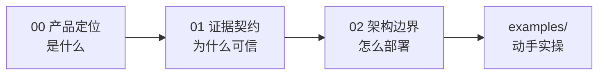

# 概念学习路径

本知识包包含 3 篇概念文档，从产品定位到证据机制再到架构边界。

## 学习路径

| 顺序 | 文档 | 核心内容 | 预计阅读 |
|------|------|----------|----------|
| 1 | [00 wigolo 是什么](00-product-overview.md) | 本地优先定位、十工具地图、四种接入表面、选型对比、AGPL | 7 min |
| 2 | [01 证据契约与诚实输出](01-evidence-contract.md) | 18 引擎融合管线、字节级证据字段、fetch 三级路由、缓存语义 | 8 min |
| 3 | [02 本地优先架构与部署边界](02-local-first-architecture.md) | 数据面、keyless/LLM 边界、部署形态、降级矩阵、网络适配 | 8 min |

## 路径图



阅读完概念层后，进入 [examples/](../examples/index.md) 动手实践。

```{toctree}
:hidden:

00-product-overview
01-evidence-contract
02-local-first-architecture
```
