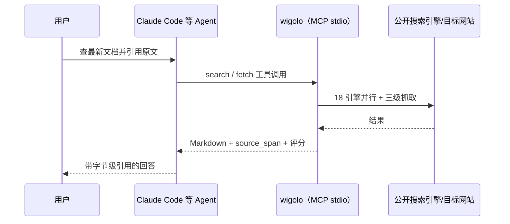

# 实战 01 · 接入 Agent 与配置 LLM

> 事实锚点：F-023、F-025、F-034、F-037、F-038
> 命令来源：官方 README、docs/getting-started.md（2026-09-02 核验）

## 方式一：一键自动接线（推荐）

初始化时用 `--agents` 点名你的客户端，逗号分隔多个（F-023）：

```bash
npx wigolo init --agents=claude-code,cursor
```

官方 auto-wire 矩阵支持的 9 个客户端（F-034）：

| 参数值 | 客户端 |
|--------|--------|
| `claude-code` | Claude Code |
| `cursor` | Cursor |
| `codex` | OpenAI Codex CLI |
| `gemini-cli` | Gemini CLI |
| `opencode` | OpenCode |
| `vscode` | VS Code（Copilot 等） |
| `windsurf` | Windsurf |
| `zed` | Zed |
| `antigravity` | Antigravity |

接线完成后，Agent 直接拥有全部 10 个 wigolo 工具及"何时该用哪个"的说明。你要做的只是用自然语言提需求，例如"查一下 MCP 协议最新的授权规范，引用原文"。



## 方式二：手动配置 MCP

如果你的客户端不在自动矩阵里，或想自己管理配置，手动加一个 MCP Server 即可。命令固定为 `npx -y wigolo`（stdio 传输）：

```json
{
  "mcpServers": {
    "wigolo": {
      "command": "npx",
      "args": ["-y", "wigolo"]
    }
  }
}
```

按客户端惯例写入对应配置文件（如 Claude Code 的 `~/.claude.json` / 项目 `.mcp.json`，Cursor 的 `~/.cursor/mcp.json`），重启客户端后即可看到 10 个工具。

## 配置 LLM（可选，但建议配）

**不配置也能正常使用**：search/fetch/crawl/extract/cache/find_similar 六个核心工具完全 keyless；research/agent 会返回结构化证据简报，由上层 Agent 自己组织成文（F-037）。

想要 research/agent 直接产出成文报告，配一个 LLM provider（F-038）：

| provider | 环境变量 | 说明 |
|----------|----------|------|
| gemini（官方推荐免费档） | `WIGOLO_LLM_PROVIDER=gemini` + `GEMINI_API_KEY=<key>` | 免费 Key 在 aistudio.google.com/apikey 领取 |
| ollama（整机零外发） | `WIGOLO_LLM_PROVIDER=ollama` | 本地模型，博文作者的选择 |
| anthropic / openai / groq | `WIGOLO_LLM_PROVIDER=<厂商>` + 对应 Key env | 各家 API |
| OpenAI 兼容端点 | 配置 base URL + Key | 自建/第三方网关 |

PowerShell（Windows）设置示例：

```powershell
$env:WIGOLO_LLM_PROVIDER = "gemini"
$env:GEMINI_API_KEY = "你的key"
npx wigolo doctor   # 确认 "configured LLM providers" 一项已识别
```

macOS / Linux：

```bash
export WIGOLO_LLM_PROVIDER=gemini
export GEMINI_API_KEY=你的key
npx wigolo doctor
```

> 持久化写入 shell profile（`$PROFILE` / `.bashrc`）或 wigolo 的 config.json 即可长期生效；具体配置项见官方 docs/configuration.md。

## 接线后验证

1. `npx wigolo doctor`：确认数据目录、浏览器引擎、本地模型、LLM provider 全部就绪
2. `npx wigolo verify`：真实网络端到端冒烟，退出码 0 即通过
3. 在 Agent 里发一句需要联网的请求，确认它调用 wigolo 工具且返回带评分与引用

---

上一篇：[实战 00 · 安装、体检与卸载](00-install-and-doctor.md) ｜ 下一篇：[实战 02 · 十工具 CLI 实战](02-ten-tools-hands-on.md)
