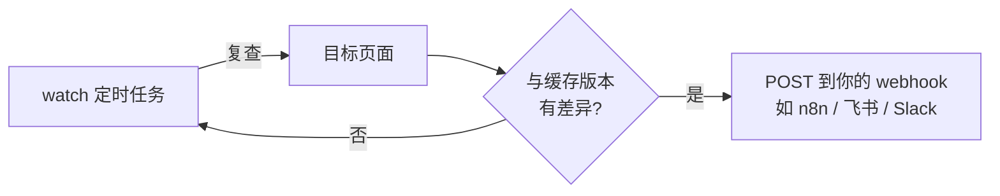

# 实战 02 · 十工具 CLI 实战

> 事实锚点：F-008~F-021、F-037、F-043
> 命令来源：官方 docs/getting-started.md、README 工具契约（2026-09-02 核验）
> 说明：每个工具都有三种等价调用面——CLI（`npx wigolo <tool>`）、MCP 工具调用、REST（`POST /v1/<tool>`）。本篇以 CLI 为主，参数语义在三种面上一致；不确定参数名时先跑 `npx wigolo <tool> --help`。

## 工具一：search —— 18 引擎并行搜索

```bash
# 基础搜索（官方文档原样例）
npx wigolo search "css container queries" --limit=2

# 多个问题一次调用：query 传数组，引擎并行扇出
npx wigolo search '["local-first web search", "MCP web tools comparison"]' --json

# 强新鲜度：绕过缓存重查（新闻/定价/变更日志场景）
npx wigolo search "wigolo release notes" --json
# 工具参数：force_refresh=true（MCP/REST 调用体中）
```

返回中重点看（F-039）：`results[]` 的 `title`/`url`/`score`、`citation_id`、`source_span`、`evidence_score`（final/semantic/lexical/engine_consensus）、`engine_warnings`（失效引擎名单）。

配好 LLM 后可直接要答案段落：`search --format answer`（无 key 时返回结构化结果列表，F-037）。

## 工具二：fetch —— 单页抓取转 Markdown

```bash
# 官方原样例：抓页面并限制长度
npx wigolo fetch https://example.com --max-content-chars=400
```

能力要点（F-011、F-012、F-040）：

- 自动三级升级：普通 HTTP → TLS 指纹模拟 → 无头浏览器，JS 渲染页也能拿
- 输出干净 Markdown + 元数据 + 链接；PDF 可直接抓
- 支持登录态会话、页面动作（click/type/scroll/screenshot）、只抽某个 section
- 反爬过不去时结果标 `blocked_by_challenge`——这是显式失败，不是把验证页当正文

## 工具三：crawl —— 整站多页爬取

工具语义（F-014）：

- 模式：`bfs`（广度优先）/ `dfs`（深度优先）/ `sitemap`（按 sitemap.xml）/ `map-only`（只出页面地图不抓正文）
- 默认遵守 robots.txt、按域名限速与爬取延迟、自动去样板内容（导航/页脚/广告）
- 页面预算面向研究而非批量收割

典型用法（MCP/REST 调用参数示意）：

```json
{
  "url": "https://example.com/docs",
  "mode": "bfs",
  "max_pages": 50
}
```

CLI：`npx wigolo crawl https://example.com/docs --json`（具体参数名以 `--help` 为准）。

## 工具四：extract —— 结构化数据抽取

- 内置识别：表格、JSON-LD、metadata、品牌资产，以及 Article / Recipe / Product 等命名 schema（F-015）
- 自定义：传 JSON Schema 描述目标字段，返回结构化结果

自定义 schema 调用示意：

```json
{
  "url": "https://example.com/products",
  "schema": {
    "type": "object",
    "properties": {
      "products": {
        "type": "array",
        "items": {
          "type": "object",
          "properties": {
            "name": {"type": "string"},
            "price": {"type": "string"}
          }
        }
      }
    }
  }
}
```

与 fetch 的分工：fetch 给人/Agent 读 Markdown；extract 给程序喂结构化数据。

## 工具五：cache —— 本地知识缓存

```bash
# 查看缓存统计
npx wigolo cache stats

# 按 URL 模式清理缓存
npx wigolo cache clear --url-pattern="*example.com*"
```

- 所有抓取结果自动入本地缓存，支持**关键词 + 语义**混合检索（embedding 本地跑，F-016）
- 重复查询即时返回、零费用、断网可用
- TTL 可调：`CACHE_TTL_SEARCH`、`CACHE_TTL_CONTENT`；要最新数据传 `force_refresh: true`
- 命中陈旧缓存时结果会显式标注，不伪装成新鲜内容

## 工具六：find_similar —— 相似页面发现

给一个 URL 或概念，返回相关页面（F-017）。检索三路融合：**关键词 + 本地语义 + 实时网页**。

```bash
npx wigolo find_similar "https://example.com/article" --json
```

适合"这个主题还有哪些靠谱资料"的发散场景。linux-arm64 上语义路暂不可用、回退关键词（F-046）。

## 工具七：research —— 多步研究报告

把一个研究问题交给它（F-018）：自动分解为子问题 → 并行扇出搜索 → 抓取证据 → 综合成**带引用的报告**。

- 需要 LLM（F-037/F-038）；未配 key 时不报错，返回结构化证据简报（材料 + citation_id），交给上层 Agent 成文
- 适合：竞品调研、技术选型、"帮我把某主题最新资料研究清楚"

## 工具八：agent —— 自主数据采集

给目标与约束，它自主规划并执行（F-019）：`plan → search → fetch → extract → synthesize`，带步骤日志，可设时间预算与输出 schema。

- 同样需要 LLM；无 key 退化为证据简报
- 适合：跨站点拼数据（如"把这几个项目的定价页都抓下来对比"）、长流程采集

## 工具九：diff —— 页面变化对比

对已抓过的页面再抓一次，输出与上次访问的差异（F-021）：

```bash
npx wigolo diff https://example.com/changelog --json
```

适合发布说明、定价页、文档版本的人工核查。

## 工具十：watch —— 变更监听推送

定时复查页面，检测到变化时往 **webhook** 推送（F-021、F-027）：

- 博文作者实践：挂项目更新日志/定价页，有更新自动通知
- 与 diff 的关系：diff 是"手动对比一次"，watch 是"定时对比 + 推送"



## 输出约定（所有工具通用）

- 任意工具命令加 `--json`：stdout 输出机器可读结果，便于 jq/脚本处理
- 日志全部走 stderr，不污染 stdout 数据管道
- 失败不静默：失效引擎、挑战墙、陈旧缓存、降级组件全部显式标注

---

上一篇：[实战 01 · 接入 Agent](01-connect-agents.md) ｜ 下一篇：[实战 03 · REST 与 SDK 集成](03-rest-sdk-integration.md)
