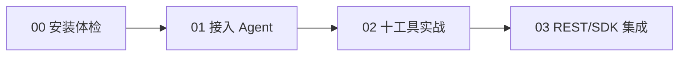

# 实战路径

本知识包包含 4 篇实战文档，所有命令均来自官方 README / docs（2026-09-02 核验），可直接照做。

## 前置条件

- Node.js 20/22/24 LTS
- 约 1.5GB 磁盘（模型 + 浏览器引擎，可用 `--no-warmup` 延迟下载）
- 核心功能无需任何 API Key

## 实战路径

| 顺序 | 文档 | 核心内容 | 预计 |
|------|------|----------|------|
| 1 | [00 安装、体检与卸载](00-install-and-doctor.md) | init 全变体、doctor/verify/warmup、故障速查、清理卸载 | 8 min |
| 2 | [01 接入 Agent 与配置 LLM](01-connect-agents.md) | --agents 一键接线 9 客户端、手动 MCP 配置、Gemini/Ollama | 6 min |
| 3 | [02 十工具 CLI 实战](02-ten-tools-hands-on.md) | search/fetch/crawl/extract/cache/find_similar/research/agent/diff/watch | 12 min |
| 4 | [03 REST 与 SDK 集成](03-rest-sdk-integration.md) | serve + curl/n8n、TS/Python SDK、框架包、Docker 自托管 | 8 min |

## 路径图



建议路径：先完成 00 跑通 `npx wigolo verify`，再按自己的使用面选读 01（Agent 用户）或 03（自动化/开发者）。02 是工具手册，可按需查阅。

```{toctree}
:hidden:

00-install-and-doctor
01-connect-agents
02-ten-tools-hands-on
03-rest-sdk-integration
```
