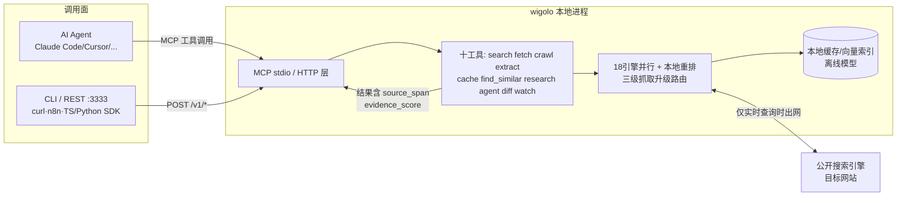

# wigolo

> **来源**：微信公众号"极客之家"开源项目推荐文
> **原文**：[《wigolo：零 API Key、零费用的本地优先 Agent 网络搜索工具》](https://mp.weixin.qq.com/s/RiMdKJGEFY8AmNQvDXWtyA)
> **开源仓库**：https://github.com/KnockOutEZ/wigolo （许可证 AGPL-3.0）
> **P0 核验**：10 项关键声明全部 ✅ 通过，2 项口径标注（详见 [verification.md](references/verification.md)）


> **⏰ 时效性提示**：本包事实于 2026-09-02 对照 GitHub 官方仓库 README/docs/llms.txt 核验。wigolo 处于活跃迭代期，命令参数与能力清单以官方仓库为准；3 个月后（stale_after: 2026-12-02）建议复核。两处口径标注：① Firecrawl 免费额度数字仅博文单源，未取得官方定价页旁证；② 博文确切发布日期未从公开页面检出。

## 一句话定位

wigolo 是一个**本地优先（local-first）的 Web 情报工具**：以 MCP Server 为主要形态，给 AI Agent 装上"上网能力"——18 个搜索引擎并行检索、三级升级路由抓取、整站爬取、结构化抽取、本地语义缓存、多步自主研究、页面变更监听共 10 个工具；核心功能**无需任何 API Key、零按量费用**，缓存与模型全部落在本地 `~/.wigolo/`。

## 60 秒快速开始

```bash
npx wigolo init          # 初始化 ~/.wigolo（模型+浏览器引擎自动 warmup）
npx wigolo doctor        # 体检：数据目录/引擎/模型/LLM provider
npx wigolo search "css container queries" --limit=2   # 首次真实搜索
npx wigolo init --agents=claude-code,cursor           # 一键接入 Agent
```

不接 Agent 也能用：`npx wigolo serve` 起本地 REST（127.0.0.1:3333），curl/n8n/SDK 任意调用。

## 核心机制



设计铁律：**能本地做的不出网**——搜索走公开搜索引擎免费端点，抓取/重排/embedding 本地完成；出网行为显式可见，结果带字节级证据与置信度评分，失败（引擎失效、挑战墙、陈旧缓存）一律显式标注而非静默兜底。

## 知识结构

```
wigolo/
├── index.md                              ← 本页
├── images/
│   └── wigolo-banner.jpg                 ← seedream 生成的概念横幅
├── concepts/
│   ├── index.md
│   ├── 00-product-overview.md            ← 产品定位、十工具地图、选型对比、AGPL
│   ├── 01-evidence-contract.md           ← 18引擎重排管线、证据契约、三级抓取
│   └── 02-local-first-architecture.md    ← 数据面、keyless边界、部署形态、降级矩阵
├── examples/
│   ├── index.md
│   ├── 00-install-and-doctor.md          ← 安装、doctor/verify、故障速查、卸载
│   ├── 01-connect-agents.md              ← --agents 一键接线、手动MCP、LLM配置
│   ├── 02-ten-tools-hands-on.md          ← 十工具 CLI 实战手册
│   └── 03-rest-sdk-integration.md        ← REST+n8n、TS/Python SDK、框架包、Docker
├── references/
│   ├── index.md
│   ├── article-source.md                 ← F-001~F-052 事实登记（双份：博文+核验）
│   └── verification.md                   ← P0 核验报告（10✅ + 2 口径标注）
└── log.md
```

## 分层导航

### 概念层（3 篇）

1. [产品定位与十工具地图](concepts/00-product-overview.md) — 一句话定位、项目档案、十工具分组 Mermaid 图、四种接入表面、与 Firecrawl/Tavily/Exa 选型对比、AGPL-3.0 许可证含义
2. [证据契约：可审计的搜索与抓取](concepts/01-evidence-contract.md) — 18 引擎并行+本地重排管线、source_span/evidence_score/engine_warnings 字段、fetch 三级升级路由、crawl/extract 批处理纪律、记忆机制
3. [本地优先架构](concepts/02-local-first-architecture.md) — `~/.wigolo` 数据面、keyless 与 LLM 边界、四种部署形态、降级矩阵、网络环境适配、磁盘与卸载、扩展点

### 实战层（4 篇，全部命令经官方文档核验）

1. [安装、体检与卸载](examples/00-install-and-doctor.md) — init 全变体、doctor/verify/warmup、常见故障速查表、清理与卸载、离线机预置
2. [接入 Agent 与配置 LLM](examples/01-connect-agents.md) — `--agents` 一键接线 9 个客户端、手动 MCP JSON 配置、Gemini 免费档/Ollama 本地 LLM 配置与验证
3. [十工具 CLI 实战](examples/02-ten-tools-hands-on.md) — search/fetch/crawl/extract/cache/find_similar/research/agent/diff/watch 逐个上手，含参数与输出约定
4. [REST 与 SDK 集成](examples/03-rest-sdk-integration.md) — `serve` REST + curl/n8n、fail-closed 远程令牌、TS/Python SDK embedded local、LangChain/CrewAI/LlamaIndex/Vercel 框架包、Docker 自托管

### 信源层（2 篇）

- [事实登记](references/article-source.md) — F-001~F-052（博文 33 条 + 核验补充 19 条），信源距离分级
- [核验报告](references/verification.md) — 10 项 P0 全 ✅、2 项口径标注、勘误四张清单、时效边界

## 信任与生命周期

- **事实基数**：52 条（F-001~F-052；博文 33 + 核验补充 19）
- **P0 核验**：10 ✅ / 0 ❌；口径标注 2 项（Firecrawl 免费额度单源、博文发布日期未检出）
- **信源距离**：一级信源（GitHub 官方仓库 README/docs/llms.txt）核验全部可复现声明；博文为第三方推荐文
- **status**：verified
- **stale_after**：2026-12-02（工具迭代活跃，3 个月后复核命令与能力清单）

## 已知边界与注意事项

1. **AGPL-3.0 许可证**：把 wigolo 当工具调用（个人/公司内/接进任意 Agent/仅调用它的产品）**零义务**；仅当**修改 wigolo 本体并把修改版作为网络服务提供给他人**时才触发源码开源条款（官方 FAQ 口径，F-051）
2. **research / agent 两个工具需要 LLM**：未配 provider 时不报错，返回结构化证据简报由上层 Agent 成文；search/fetch/crawl/extract/cache/find_similar 六个核心工具完全 keyless
3. **数据中心 IP 折损**：VPS/云主机上强反爬站点挑战墙通过率低于住宅网络，失败显式标记 `blocked_by_challenge`，可配信誉匹配代理
4. **linux-arm64 语义路暂缺**：find_similar/cache 的语义检索回退到关键词路，Windows/macOS/Intel Linux 不受影响
5. **磁盘占用**：warmup 下载本地模型与浏览器引擎约 1.5GB；`--no-warmup` 可延迟下载
6. **watch 推送依赖 webhook**：变更通知需自备接收端（n8n/飞书/Slack 等）
7. 博文与 Firecrawl/Tavily/Exa 的成本对比中，Firecrawl 免费额度数字为博文单源，采纳前请以官方定价页复核

```{toctree}
:hidden:
:maxdepth: 2

concepts/index
examples/index
references/index
log
```