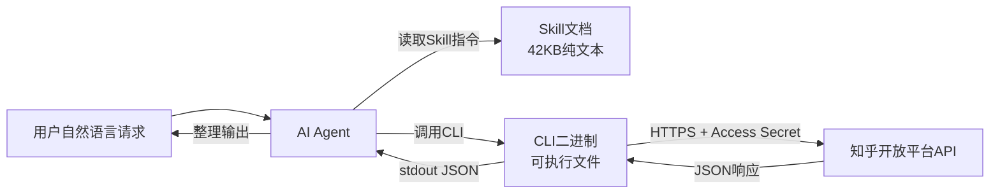

# 01 接入方式与技术架构

> 对应事实：F-037、F-046、F-051~F-060、F-099~F-102
> 知识层级：机制层
> 勘误落实：E-001（源文称两种接入方式，实际为三种）

## 一、三种接入方式

知乎数据开放平台提供**三种**接入方式 [E-001]，而非部分早期文章提到的两种：

| 接入方式 | 定位 | 适用场景 | 是否需要本地安装 |
|----------|------|----------|------------------|
| API 直接调用 | 底层基础接口 | 自研系统、服务端集成 | 否（HTTP 调用） |
| Skill + CLI 组合 | Agent 常用方式 | Claude Code / Cursor / Codex 等 Agent | 是（CLI 二进制） |
| 托管式 MCP 服务 | Agent 常用方式 | 支持 MCP 协议的 Agent | 否（托管式） |

> **勘误说明** [E-001]：早期文章（S5 等）提到"两种接入方式：Skill+CLI 组合、托管式 MCP 服务"，实际官方提供三种接入方式——API 直接调用是底层基础，Skill+CLI 和 MCP 是面向 Agent 的两种封装方式。三者共用同一套后端接口和 Access Secret [F-055]。

### Skill + CLI 组合方式

- **Skill**：约 42KB 的纯文本压缩包，包含调用指令规范 [F-038] [F-053]
- **CLI**：二进制可执行文件，负责实际的 API 调用 [F-039] [F-054]
- Agent 通过读取 Skill 中的指令规范，自动调用 CLI 二进制执行操作 [F-046]

### 托管式 MCP 服务

- 无需本地安装 CLI 二进制
- 通过 MCP 协议直接对接知乎开放平台的托管服务
- 与 Skill+CLI 方式共用同一套 Access Secret [F-047]

### API 直接调用

- 底层 HTTP API 接口
- 三种接入方式的共同基础
- 适合服务端集成或自定义开发

## 二、调用链路详解

### Skill + CLI 调用链路

完整调用链路 [F-046] [F-051]：

1. 用户用自然语言向 Agent 提问
2. AI 按照 Skill 中的指令规范，识别需要调用的 Zhihu CLI 命令
3. AI 调用 CLI 二进制可执行文件
4. CLI 携带 Access Secret 通过 HTTPS 请求知乎开放平台 [F-060]
5. 开放平台返回 JSON 格式数据
6. AI 读取 CLI 的 stdout 输出，整理为自然语言回答

### MCP 调用链路特点

MCP 方式跳过了本地 CLI 二进制环节，Agent 通过 MCP 协议直接与知乎托管的 MCP 服务通信，后端仍然调用同一套开放平台接口 [F-055]。

## 三、输出约定

Zhihu CLI 遵循严格的输出约定 [F-022] [F-052]：

| 输出通道 | 内容 | 格式 |
|----------|------|------|
| stdout | 正常业务数据 | JSON |
| stderr | 诊断信息、进度、日志 | 文本 |
| 错误返回 | 错误信息 | 稳定 JSON 错误码 |

这种设计使得 Agent 可以可靠地解析 CLI 输出：
- 从 stdout 读取结构化的 JSON 数据
- 从 stderr 获取调试和诊断信息
- 通过 JSON 错误码统一处理异常

## 四、技术架构要点

### 后端接口共用

三种接入方式（API、Skill+CLI、MCP）共用**同一套后端接口**和同一套 Access Secret [F-055] [F-102]。这意味着：

- 无论用哪种方式接入，数据能力完全一致
- 同一个 Access Secret 可以在不同接入方式间通用
- 后端迭代升级对所有接入方式同步生效

### 全网搜索技术架构

全网搜索采用以下技术架构 [厂商自述] [F-056] [F-057]：

| 架构特性 | 说明 | 核验状态 |
|----------|------|----------|
| 双源融合 | 全网+知乎双源融合架构 | ⚠️ 厂商自述，多源转述一致 |
| 实时索引 | 分钟级实时索引更新 | ⚠️ 厂商自述，无独立实测 |
| 响应延迟 | 平均 600ms | ⚠️ 技术媒体报道，非第三方实测 |
| 索引规模 | 百亿级 | ⚠️ 厂商自述，无法独立核验 |

### 流式输出

answer（直答）命令支持流式输出（SSE/流式响应机制） [F-023] [F-059]，可以实现类似 ChatGPT 的逐字输出效果，提升用户体验。

## 五、两种 Agent 接入方式对比

| 维度 | Skill + CLI | 托管式 MCP |
|------|-------------|------------|
| 本地安装 | 需要安装 CLI 二进制 | 不需要 |
| 适用 Agent | Claude Code、Cursor、Codex 等支持 Skill 的 Agent | 支持 MCP 协议的 Agent |
| 数据能力 | 完全一致（共用后端） | 完全一致（共用后端） |
| Access Secret | 需要配置 | 需要配置 |
| 供应链安全 | 本地二进制需校验（四道校验机制） | 托管式，无需本地校验 |
| 网络要求 | 可访问开放平台即可 | 需访问 MCP 服务端点 |
| 调试便利 | stderr 诊断信息直接可见 | 依赖 MCP 宿主的日志 |
