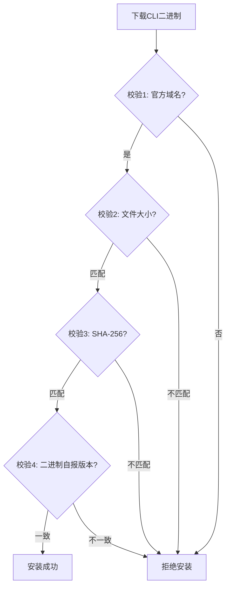

# 02 安全设计与凭证管理

> 对应事实：F-035、F-036、F-043、F-045、F-061~F-070
> 知识层级：机制层

## 一、供应链安全校验

Zhihu CLI 采用官方 first-party 技能，HTTPS-only 下载 [F-061]。为确保供应链安全，CLI 二进制下载时执行**四道校验** [F-062]：

### 四道校验详解

| 校验项 | 说明 | 事实编号 |
|--------|------|----------|
| 官方域名 | 下载源必须来自官方域名，确保供应链可信 | [F-067] |
| 文件大小 | 校验文件大小是否匹配预期值 | [F-068] |
| SHA-256 哈希 | 校验文件完整性，防止篡改 | [F-070] |
| 二进制自报版本 | 校验二进制文件自身报告的版本号是否一致 | [F-069] |

> 也有来源描述为"SHA-256 + 文件大小 + 版本三重校验" [F-063]，与"四道校验"的表述差异在于是否将"官方域名"单独计为一项。本质上都是确保下载文件的真实性和完整性。

### Skill 与 CLI 的安全定位

- **Skill**：约 42KB 纯文本压缩包 [F-053]，仅包含调用指令规范，不包含可执行代码，风险极低
- **CLI**：二进制可执行文件 [F-054]，需要严格的供应链安全校验

## 二、凭证管理设计

### Access Secret 的作用

Access Secret 是调用开放平台接口的凭证 [F-045]，获取 Access Secret 需要先完成实名认证 [F-044]。

### 系统级凭证存储

Access Secret 存储在系统原生凭证管理中，**无明文落盘** [F-064]：

| 操作系统 | 凭证存储方式 | 事实编号 |
|----------|-------------|----------|
| macOS | Keychain（钥匙串） | [F-035] |
| Windows | Credential Manager（凭证库） | [F-035] [F-036] |

这种设计的安全优势：
1. 利用操作系统原生的安全存储机制
2. 凭证不会以明文形式出现在配置文件、环境变量或日志中
3. 遵循系统级的访问控制和加密保护

### 权限最小化设计

- CLI 安装在用户目录下，不需要管理员权限
- 不修改系统 PATH 环境变量（或采用用户级 PATH 修改）
- 仅在需要时通过系统凭证库读取 Access Secret

## 三、鉴权与传输安全

### Bearer Token 鉴权

鉴权方式采用 Bearer Token 机制 [F-066]。技术文章中也确认使用 `Authorization: Bearer + ZHIHU_ACCESS_SECRET` 的方式进行鉴权 [P0-006]。

### X-Request-Timestamp 时间戳校验

官方采用 **Bearer Token + X-Request-Timestamp 秒级时间戳双重校验** [官方文档确认] [F-043] [F-058]。

> ✅ **核验结论** [P0-006]：已通过官方 API 文档确认，所有开放平台 API 均要求 `X-Request-Timestamp` 请求头，与服务端时间相差不能超过 10 分钟。时间戳校验的目的是防止重放攻击。

### 用户数据 API 的 X-OAuth-Token 扩展鉴权

对于用户数据类 API（创作内容、关注、收藏等），在 Bearer Token + 时间戳的基础上，还支持通过 `X-OAuth-Token` 请求头传入 **OAuth 访问凭证**，用于查询已授权的其他用户数据 [F-141]：

| 场景 | X-OAuth-Token | 查询对象 |
|------|---------------|----------|
| 查询本人数据 | 不传 | 当前调用方（即 Access Secret 所属账号） |
| 查询授权用户数据 | 传入 OAuth access_token | 该 OAuth 凭证对应的已授权用户 |

### HTTPS 通信安全

CLI 与开放平台通过 HTTPS 通信 [F-060]，确保传输过程中的数据加密和完整性保护。

### OAuth 2.0 授权流程安全

知乎 OAuth 服务采用标准 **OAuth 2.0 Authorization Code Flow** [F-137]，具有以下安全设计：

1. **授权码模式**：使用 authorization_code 间接换取 access_token，避免令牌直接暴露在浏览器重定向中
2. **后端交换**：authorization_code 的交换和 access_token 的使用应在应用后端完成，避免泄露 app_key 和用户令牌 [F-139]
3. **授权页二次确认**：申请获取的用户权限会在用户授权时展示给用户进行二次确认

## 四、安全审计结论

有作者评估 Zhihu CLI 的安全审计结论为 **P2/安全** [F-065]。

> ⚠️ **核验说明** [P0-009]：该结论仅来自单一来源（S1 腾讯云开发者社区文章），无官方审计报告可查，应视为作者评估结论而非官方安全评级。

## 五、Windows 安装安全注意事项

Windows 平台有一个已知的安装坑：PowerShell 5.1 对 UTF-8 无 BOM 编码的 `.ps1` 文件会报解析错误 [F-040]。这虽然不是安全漏洞，但可能导致安装脚本执行失败，需要注意：

- 建议使用 PowerShell 7+ 版本
- 确保安装脚本使用 UTF-8 with BOM 编码
- 或通过其他方式（如直接下载二进制）安装
