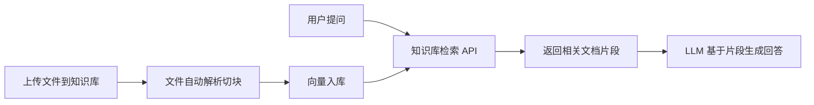
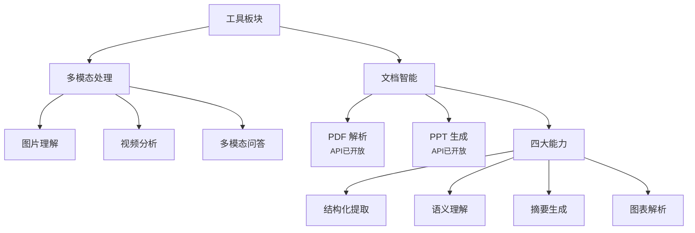

# 03 核心能力与命令

> 对应事实：F-011~F-023、F-028~F-030、F-089~F-094
> 知识层级：事实层 + 机制层

## 一、搜索能力

Zhihu CLI 的 `search` 命令支持两种搜索范围 [F-015]：

### 知乎站内搜索（search zhihu）

- 搜索知乎站内的问答、文章、专栏等内容
- 依托知乎社区的专业内容积累
- 结果带有知乎平台的内容质量背书（L1-L5 分级）[F-007]

### 全网搜索（search global）

全网搜索是知乎数据开放平台的核心能力之一，提供以下技术特性 [厂商自述] [F-012]：

| 特性 | 参数 | 说明 |
|------|------|------|
| 索引规模 | 百亿级 | 全网网页索引 [F-030] |
| 架构 | 双源融合 | 全网+知乎双源融合 [F-056] |
| 更新频率 | 分钟级 | 实时分钟级索引更新 [F-028] |
| 响应延迟 | 约 600ms | 平均响应延迟 [F-029] |

> ⚠️ 以上数据均为厂商自述或技术媒体转述，无独立第三方实测验证 [P0-002][P0-003][P0-004]。

#### 全网搜索高级能力 [官方文档验证]

全网搜索 API 提供以下高级参数：

| 参数 | 说明 |
|------|------|
| `Count` | 返回数量，默认 10，最大 20 |
| `SearchDB` | 索引库选择：`all`（全部，默认）/ `realtime`（实时库）/ `static`（静态库） |
| `Filter` | 高级筛选表达式，支持按站点和发布时间过滤 |

**Filter 语法示例**：

```
# 按站点过滤
host=="example.com"

# 按站点 + 发布时间组合
host=="example.com" AND publish_time>=1778494631

# 多站点 + 时间范围
(host=="example.com" OR host=="news.example.com") AND publish_time>1778494631
```

> **支持字段**：`host`（站点域名，支持 ==/!=）、`publish_time`（发布时间，支持 ==/!=/>/</>=/<=）
> **逻辑符**：AND（优先级高）、OR（优先级低），可用括号明确优先级
> **注意**：`host=="zhihu.com"` 及其子域名不支持；仅站内搜索请使用 `zhihu_search` 接口

### 全网搜索的产品定位与可信度机制 [产品介绍页]

全网搜索定位为"专为大模型设计的高可信搜索引擎"，核心价值在于**内容质量 + 信源可信度**双重保障 [F-201]。

#### 高可信度三重保障

| 保障维度 | 具体机制 | 来源 |
|---------|----------|------|
| 权威信息整合 | 优先收录政府网站及官网等高权威来源 | [F-204] |
| 理性讨论氛围 | 注重事实与逻辑链的深度讨论，为 AI 应用提供可靠信息参考 | [F-204] |
| 内容溯源要求 | 引用数据时展示具体作者信息，确保可追溯性和权威性 | [F-204] |

#### 四大应用场景

| 场景 | 说明 |
|------|------|
| **大模型训练** | 利用授权数据 API 的海量、高质量数据，训练出更智能、更懂中文的大语言模型 |
| **智能问答系统** | 基于全网搜索或站内搜索 API，构建能够提供精准、深度回答的智能客服或问答机器人 |
| **内容创作辅助** | 为内容创作平台提供灵感、素材和事实核查支持，提升内容生产效率和质量 |
| **垂直领域搜索** | 在金融、医疗、法律等垂直领域，构建基于知乎专业内容的深度搜索引擎 |

> 💡 来源：[F-205]

### 知乎搜索的专业背书与差异化价值 [产品介绍页]

知乎搜索仅返回知乎站内内容，核心差异化在于**专业深度 + 可验证性** [F-208]。

#### 专业背书三机制

| 机制 | 说明 | 来源 |
|------|------|------|
| 多维专业验证 | 基于知乎独特的赞同/反对机制及专业认证体系，通过多方观点交叉验证，保障客观性与严谨性 | [F-212] |
| 理性讨论传统 | 坚持"谢邀，利益相关"的理性讨论传统，注重事实引用与逻辑拆解，提供深度逻辑链条参考 | [F-215] |
| 全链路内容溯源 | 每一条搜索结果均可追溯至真实、专业的创作者身份，确保信息透明度与版权合规性 | [F-212] |

#### 内容分级体系

知乎建立了 **L1-L5 深度内容分级体系**，优先提取 L3 及以上高价值"硬核"内容，确保 AI 获取的语料处于行业领先水平 [F-210]。

#### 四大应用场景

| 场景 | 说明 |
|------|------|
| **大模型指令微调与训练** | 利用经过社区验证的高质量 Q&A 对、长篇文章及专业专栏，提升模型在复杂逻辑推导和中文语境下的表达能力 |
| **专业级知识问答（RAG）** | 构建具备"专家思维"的智能助理，提供深入到"方法论"与"行业洞察"的专业解答 |
| **深度内容创作辅助** | 提供真实的个人见解、多维度的观点碰撞及专业案例，帮助创作者挖掘灵感、获取一线实战经验 |
| **垂直领域深度搜索** | 在金融、医疗、法律等垂直领域，获取可溯源、可验证的行业洞察 |

> 💡 来源：[F-213]

### 两种搜索的适用场景

| 场景 | 推荐搜索范围 | 原因 |
|------|-------------|------|
| 专业问题解答 | zhihu | 知乎内容质量高、有分级体系 |
| 最新资讯获取 | global | 全网索引更新快、覆盖广 |
| 技术问题排查 | global | 可搜索 GitHub、技术博客等外部资源 |
| 行业观点参考 | zhihu | 专业创作者的深度分析 |

## 二、热榜能力

### 命令

- `hot` 命令 [F-014]
- `trending` 命令 [F-013] [F-016]

> 两个命令都用于获取知乎热榜，可能是同一功能的不同命名（不同 Skill 版本或 CLI 版本可能有差异）。

### API 参数 [官方文档验证]

| 参数 | 类型 | 默认值 | 边界 |
|------|------|--------|------|
| `Limit` | Int32 | 30 | 最大 30，<=0 或 >30 自动回退为 30 |

### 响应字段

热榜 API 返回以下字段：

| 字段 | 类型 | 说明 |
|------|------|------|
| `Total` | Int64 | 实际返回的热榜条数 |
| `Items[].Title` | String | 热榜标题 |
| `Items[].Url` | String | 热榜对应的知乎链接 |
| `Items[].ThumbnailUrl` | String | 缩略图 URL（无封面时为空字符串） |
| `Items[].Summary` | String | 内容摘要（无摘要时为空字符串） |

> **说明**：当前仅返回问题和文章两类热榜内容。

### 能力特点与产品定位 [产品介绍页]

知乎热榜定位为**实时热点与舆论动态的数据源**，核心价值不仅是榜单数据，更在于知乎社区的专业深度解读 [F-216] [F-217]。

#### 两大核心价值

| 价值维度 | 说明 | 来源 |
|---------|------|------|
| 综合热度榜单 | 基于知乎站内及社区热点综合计算，全面反映话题实时热度与讨论广度，是市场情绪的晴雨表 | [F-217] |
| 专业深度解读 | 依托知乎社区的专业力量，提供深入分析与讨论，甚至有相关方亲自答疑，带来超越事件本身的洞见 | [F-217] |

#### 极致性能体验

| 特性 | 说明 | 来源 |
|------|------|------|
| 毫秒级响应 | API 接口响应速度达到毫秒级别，确保第一时间获取最新鲜的热点资讯 | [F-218] |
| 极简数据结构 | 提供清晰简洁的数据结构（排名+标题+热度值），便于快速解析与集成 | [F-218] |
| 轻量化前端适配 | 专为新闻侧边栏、APP 热搜位、大屏监控等轻量化前端展示场景设计 | [F-218] |

#### 数据源优势

| 特性 | 说明 | 来源 |
|------|------|------|
| 综合算法加权 | 热度值由浏览量、互动量、时间衰减等多维度综合计算，真实反映当前社会关注焦点 | [F-219] |
| 实时榜单更新 | 榜单数据实时更新，完整覆盖科技、财经、社会、娱乐等各大热点领域 | [F-219] |
| 热度趋势可追踪 | 返回当前热度值，可结合时序存储自行构建话题热度趋势图，洞察舆情走向 | [F-219] |

### 典型用途

- 了解当下舆论热点
- 选题灵感发现 [F-076]
- 热榜数据分析
- 定时推送通知 [F-083]
- 轻量化前端嵌入（新闻侧边栏 / APP 热搜位 / 大屏监控）[F-220]

## 三、直答能力

### 命令

- `ask` 命令 [F-013] [F-017]
- `answer` 命令 [F-014] [F-017]

> 两个命令都用于知乎直答，可能是同一功能的不同命名。

### 三档模型 [官方文档验证]

知乎直答 API 提供 **3 个模型档位**，分别对应不同的使用场景：

| 模型 ID | 名称 | 定位 | 特点 |
|---------|------|------|------|
| `zhida-fast-1p5` | 快速回答 | 速度优先 | 响应快，适合简单问题 |
| `zhida-thinking-1p5` | 深度思考 | 质量优先 | 带推理过程（reasoning_content），适合复杂问题 |
| `zhida-agent` | 智能思考 / Agent 模式 | Agent 级智能 | 最高级能力 |

> **说明**：实际可用模型还会受租户授权配置影响。`zhida-fast-1p5 和 zhida-thinking-1p5 支持 role、content 上下文传参。

### 三档产品模式 [产品介绍页]

> ⚠️ **概念区分**：这里的"产品模式"（Simple / Deep / DeepSearch）是**产品功能层面**的划分，面向用户描述使用场景；而上面的"三档模型"（`zhida-fast-1p5` 等）是 **API 调用层**的模型 ID 参数。两者是不同维度，详见下方"产品模式 vs API模型"说明。

除了 API 层的模型档位划分，产品层面直答提供 **3 种模式**，从轻量问答到深度研究按需选择 [F-221]：

| 模式 | 定位 | 核心特点 | 适合场景 | 来源 |
|------|------|----------|---------|------|
| **Simple**<br/>快速直答 | 速度优先 | 快速给出简洁明了的答案，响应速度最快、Token 消耗最低 | 简单问答、日常信息获取 | [F-222] |
| **Deep**<br/>专业深析 | 质量优先 | 基于知乎海量专业知识库，提供详细深度的专业解答，支持多角度分析 | 专业性问题、需要理论+实践+延伸思考 | [F-223] |
| **DeepSearch**<br/>实时研究 | 搜索增强 | 结合搜索引擎实时检索，整合多权威来源后深度研究和综合分析 | 需要最新信息、跨领域复杂查询 | [F-224] |

#### 模式对比

| 维度 | Simple | Deep | DeepSearch |
|------|--------|------|------------|
| 响应速度 | 极快 | 中等 | 较慢 |
| Token 消耗 | 低 | 中 | 高 |
| 信息实时性 | 知识库 | 知识库 | 实时 |
| 适合场景 | 简单问答 / 信息获取 | 专业复杂的问题 | 基于搜索深度研究 |

> 💡 来源：[F-225]

#### 产品模式 vs API 模型：如何选择？

两者是**不同维度的划分**，不可直接等同：

| 维度 | 产品模式（Simple/Deep/DeepSearch） | API 模型（zhida-fast-1p5 等） |
|------|-----------------------------------|------------------------------|
| **层级** | 产品功能层 | API 调用参数层 |
| **面向对象** | 终端用户、产品选型 | 开发者、API 调用 |
| **来源** | 产品介绍页 [F-221] | 官方 API 文档 [F-109~F-111] |
| **分类依据** | 使用场景 + 能力深度 | 模型能力 + 响应速度 |
| **数量** | 3 种模式 | 3 个模型 ID |

**选型建议**：
- 如果你是**开发者**：以 API 模型 ID 为准，参考模型档位选择 `zhida-fast-1p5` / `zhida-thinking-1p5` / `zhida-agent`
- 如果你是**产品经理或终端用户**：以产品模式为准，按场景选择 Simple / Deep / DeepSearch
- 两者**可能存在对应关系**（如 Simple 对应 fast、Deep 对应 thinking、DeepSearch 对应 agent），但**官方未明确映射规则**，以上对应仅为合理推测，不保证准确

> 📌 核心结论：开发时用模型 ID，产品沟通时用模式名称，不要假设 Simple = zhida-fast-1p5。

### 流式输出

answer 命令支持流式输出（SSE/流式响应） [F-023] [F-059]，这意味着：

- 答案逐字/逐段输出，提升体验
- 不需要等待完整答案生成即可开始阅读
- 类似 ChatGPT 等主流 AI 产品的交互方式

**响应格式**：

- 非流式（`stream=false`）：完整 JSON 响应，包含 `reasoning_content`（推理过程）和 `content`（最终回答）
- 流式（`stream=true`）：SSE 逐块返回，通过 `data: {...}` 格式推送，以 `data: [DONE]` 结束
- 心跳机制：服务端会发送 `: keep-alive` 心跳注释

### API 接口规范 [官方文档验证]

| 项目 | 说明 |
|------|------|
| HTTP URL | `https://developer.zhihu.com/v1/chat/completions` |
| Method | POST |
| 请求类型 | application/json |
| 响应类型 | application/json（非流式）/ text/event-stream（流式） |
| 必填参数 | `model`（模型）、`messages`（消息列表） |
| 可选参数 | `stream`（是否流式，默认 false） |

> **注意**：当前仅保证 `model`、`messages`、`stream` 三个字段的能力语义，其他字段不作为正式支持。

### 知识库对接

支持接入知乎直答知识库 [F-020]，可以基于私有知识库进行问答。

## 四、知识库 RAG 能力

> 对应事实：F-151~F-180

知乎开放平台提供知识库能力，包含知识库列表、内容列表、文件上传、语义检索 4 个 API [F-151]，可组合实现"上传→解析→检索"的完整 RAG 工作流。

### 4.1 知识库管理

- **知识库列表**：支持按 `Scope`（`all` / `created` / `subscribed`）过滤查看当前用户的知识库 [F-152]
- 每个知识库包含 `KnowledgeBaseID`、名称、描述、关系（`created`/`subscribed`/`both`）、可见性、内容数量等元数据 [F-153]
- 每个用户有且仅有一个**默认知识库**（`IsDefault=true`），上传文件时不指定知识库则进入默认库 [F-154]

### 4.2 内容管理

- **内容列表**：使用**游标分页**（Cursor-based pagination）浏览知识库内容，`Limit` 范围 1..20，默认 20 条/页 [F-155]
- 内容类型覆盖 `file` / `answer` / `article` / `unknown` 四种 [F-156]
- 每条内容包含 `RecallContentID`、标题、摘要、创建/更新时间、原始来源地址（`OriginUrl`）等字段 [F-157]
- 分页以 `HasMore` 为准，不要根据本页条数推断是否结束 [F-158]

### 4.3 文件上传

- 支持 **15+ 种文件格式**：`pdf`、`md`、`txt`、`ppt`、`pptx`、`xlsx`、`xls`、`docx`、`doc`、`webp`、`png`、`jpg`、`mobi`、`epub`、`csv`、`azw3` [F-159]
- 单文件最大 **100 MB**，使用 `multipart/form-data` 上传 [F-160]
- **同步接口**：上传后立即完成解析并挂载到知识库，较大文件可能需要较长时间 [F-161]
- 相同文件仅在前一次仍处于同步处理阶段时被拦截；进入终态后可再次上传 [F-162]
- 调用方取消请求不代表上传和解析一定同步取消，不要对超时或未知结果自动重试 [F-163]

### 4.4 语义检索

- 使用 RAG 从指定知识库或召回范围中检索相关文档片段 [F-164]
- 支持**两种召回范围指定方式**，可同时传入取并集：
  - `KnowledgeBaseIDs`：指定具体知识库 ID 列表
  - `RecallScopes`：按范围召回，支持 `personal` / `subscription` / `public` [F-165]
- 返回结果按文档级聚合（`Limit` 按文档数，不按片段数），每个文档包含 `Content`（命中片段数组）、`DocName`、`RecallContentID`、`OriginUrl` 等 [F-166]
- `Limit` 范围 1..10，默认 10 [F-167]

### 4.5 典型 RAG 工作流



## 五、文档工具能力

> 对应事实：F-181~F-200、F-226~F-235

工具板块定位为**"多模态与文档智能处理"**，核心是释放非结构化数据的价值 [F-226]。

### 5.0 能力全景 [产品介绍页]

工具板块包含两大方向：**多模态处理**（图文/视频/问答）和**文档智能**（PDF 解析/PPT 生成/四大能力）。



#### 多模态能力 ⚠️ 产品规划中

多模态处理支持图片、视频等多种媒体格式的智能分析与理解，可对图像内容进行识别、描述、问答等操作，并结合知乎知识库进行深度解读 [F-227] [F-229]。

三大子能力：
- **图片理解**：识别、描述图像内容
- **视频分析**：分析视频内容
- **多模态问答**：基于多模态内容进行问答交互

> ⚠️ **当前状态**：多模态能力（图片理解/视频分析/多模态问答）仅在产品介绍页展示，官方 API 文档中**暂未列出对应接口**，处于规划或内测阶段 [F-230]。
>
> 📌 **跟进方式**：定期查看 [知乎开放平台-工具产品页](https://developer.zhihu.com/tool) 及 API 文档更新，待接口开放后重新核验 [P0-053]。

#### 文档智能四大能力

文档智能处理是**端到端的文档 AI 处理管线**，从原始文件到结构化知识一步到位 [F-231]：

| 能力 | 说明 | API 实现状态 | 来源 |
|------|------|-------------|------|
| **结构化提取** | 自动识别文档层级，提取标题、段落、列表等结构化元素 | ✅ 已部分实现（PDF 解析 API 的 blocks + type） | [F-232] |
| **语义理解** | 超越简单文字匹配，深度理解文档语义，支持模糊问答 | ⚠️ 产品层规划（需结合知识库 RAG） | [F-233] |
| **摘要生成** | 自动生成文档摘要，支持自定义摘要长度和侧重点 | ⚠️ 产品层规划（PDF 解析可能返回 summary，见 F-194） | [F-234] |
| **图表解析** | 识别并理解文档中的图表、流程图，转化为可查询的结构化数据 | ✅ 已部分实现（PDF 解析的 figure 块） | [F-235] |

> 📌 **核验状态**：四大能力为产品层描述 [P0-054]。结构化提取与图表解析已通过 PDF 解析 API 部分验证；语义理解和摘要生成目前需要结合知识库 RAG 或其他能力间接实现，独立 API 尚未开放。
>
> 跟进方式：关注官方产品迭代，待独立 API 开放后重新核验完整度。

知乎开放平台提供两类**异步任务模式**的文档工具 API：PDF 解析与 PPT 生成。两者共享相同的任务状态机设计 [F-181]。

### 5.1 异步任务通用模式

两个工具接口都遵循**创建任务 → 轮询状态 → 获取结果**的三步（或四步）异步模式：

| 阶段 | PDF 解析 | PPT 生成 |
|------|----------|----------|
| 上传资源 | 上传 PDF 文件获取 `file_id` | 无需上传，直接传知乎链接 |
| 创建任务 | POST `/pdf-parse/tasks` | POST `/ppt-generation/tasks` |
| 轮询状态 | GET `/pdf-parse/tasks/{task_id}` | GET `/ppt-generation/tasks/{task_id}` |
| 状态机 | pending → running → succeeded/failed | pending → running → succeeded/failed |
| 结果下载 | `result.url`（JSON 格式解析结果） | `result.url`（PPTX 文件） |

**通用约定：**
- 任务状态统一为 4 种：`pending` / `running` / `succeeded` / `failed` [F-182]
- 进度 `progress` 范围 0 到 1 [F-183]
- 成功时 `result` 非空，失败时 `error` 非空（含 `code` 和 `message`）[F-184]
- 支持 `Idempotency-Key` 幂等键，同一 key + 同一参数重复调用返回同一 `task_id` [F-185]
- 下载链接有效期较短，过期后重新查询任务可获得新链接 [F-186]
- 都有**活跃任务数超限**（40003）和**额度不足**（30002）错误 [F-187]

### 5.2 PDF 解析工具

**调用流程（4 步）：** 上传文件 → 创建任务 → 轮询 → 下载结果 [F-188]

- **文件上传**：`POST /resources/v1/files`，最大 100MB，上传后文件 24 小时内有效 [F-189]
- **解析结果格式**：JSON 格式，按页组织，每页包含多个内容块（`blocks`）[F-190]
- **内容块类型**：`title` / `text` / `formula` / `figure`（图片）[F-191]
- 每个块带有坐标 `box`（`[x1, y1, x2, y2]` 归一化坐标）[F-192]
- 图片块以 Base64 内嵌，不包含 `data:image/...;base64,` 前缀 [F-193]
- 可能返回 PDF 摘要（`summary`）[F-194]
- 调用方应兼容未知的 type 和后续新增字段（向前兼容）[F-195]

### 5.3 PPT 生成工具

**调用流程（3 步）：** 创建任务 → 轮询 → 下载 PPTX [F-196]

- **输入**：知乎回答或文章链接（支持 3 种 URL 格式）+ 期望页数（6~21 页）[F-197]
- 支持的 URL 格式：
  - `https://www.zhihu.com/question/{qid}/answer/{aid}`
  - `https://www.zhihu.com/answer/{aid}`
  - `https://zhuanlan.zhihu.com/p/{article_id}` [F-198]
- **输出**：PPTX 文件下载链接 [F-199]
- `num_pages` 为期望生成页数，参数范围 6 到 21 [F-200]

## 六、个人数据能力

`me` 命令组包含三个子命令 [F-018]。API 层面，知乎用户数据共包含 **5 个接口**，统一归属 `user_data` 额度项 [F-136~F-145]。

### 统一鉴权模式

所有用户数据 API 采用 **双凭证 + 范围控制** 的统一模式：

| 凭证 | 必填 | 说明 |
|------|------|------|
| `Authorization: Bearer <access_secret>` | 是 | 开放平台接口鉴权凭证 |
| `X-Request-Timestamp` | 是 | 秒级 Unix 时间戳，与服务端时间相差不超过 10 分钟 |
| `X-OAuth-Token` | 否 | 不传时查询**本人**数据；传入时查询该 OAuth 凭证对应的**已授权用户**数据 |

> 💡 **设计要点**：用同一个 API 端点，通过 `X-OAuth-Token` 请求头区分"查自己"还是"查授权用户"，降低接入复杂度。

### me contents — 我的创作

- 获取用户自己的创作内容 [F-089]
- **API 端点**：`/api/v1/user/contents` [F-140]
- 支持内容类型：`all` / `answer` / `article` / `zvideo` / `pin` / `question`（6 种）
- 支持分页（Offset/Limit，默认 20，最大 50）
- 支持排序：按时间（`ts`）或点赞数（`like_count`），正序/倒序
- 可用于：创作数据分析、风格蒸馏、内容备份等

### me followees — 我的关注

- 获取用户关注的账号列表 [F-093]
- **API 端点**：`/api/v1/user/followees` [F-142]
- 支持分页（默认 20，最大 50）
- 返回信息：用户名、头像、签名、性别、粉丝数
- 可用于：兴趣图谱分析、关注列表管理

### me favorites — 我的收藏

个人收藏能力包含 **3 个层级**的 API：

| 层级 | API 端点 | 功能 | 分页 |
|------|----------|------|------|
| 近期收藏（扁平） | `/api/v1/user/collections` | 获取近期收藏内容，跨收藏夹 | 否（仅 Limit） |
| 收藏夹列表 | `/api/v1/user/favlists` | 获取所有收藏夹（名称/描述/是否公开） | 否（仅 Limit） |
| 收藏夹内容 | `/api/v1/user/favlist_contents` | 获取指定收藏夹内的内容 | 是（Offset/Limit） |

- **收藏内容 Item** 统一包含：内容类型、URL、创建时间、收藏时间、点赞/评论/收藏数、标题、摘要、所在收藏夹列表、作者信息 [F-143]
- 可用于：知识管理、收藏夹整理、二次阅读

### OAuth 授权与他人数据

如果需要读取其他用户的数据（而非自己的），需通过 **知乎 OAuth 2.0** 流程获取用户授权 [F-136]：

1. 引导用户跳转至知乎授权页（`https://openapi.zhihu.com/authorize`）
2. 用户确认授权后，平台重定向回 `redirect_uri` 并携带 `authorization_code`
3. 后端用 `code` 调用 `https://openapi.zhihu.com/access_token` 换取 `access_token`
4. 将 `access_token` 放入 `X-OAuth-Token` 请求头，调用用户数据 API

> ⚠️ **安全**：authorization_code 交换和 access_token 使用应在后端完成，避免泄露 app_key 和用户令牌 [F-139]。

### 个人数据的价值

社区观点认为，让 Agent 读取分析自己过去积累的知乎内容是最有价值的玩法之一 [F-077]。公共内容 + 个人数据结合的玩法具有独特价值 [F-084]。

## 七、额度体系与辅助命令

### quota — 额度查询

`quota` 命令用于查询额度使用情况 [F-019]，支持查询体验额度 [F-021]。

> **注意**：额度查询本身不消耗业务额度。

### 7 项统一额度体系 [官方文档验证]

知乎开放平台采用**统一额度体系**，共 7 个额度项，每日自然日重置：

| API ID | 名称 | 覆盖范围 | 说明 |
|--------|------|----------|------|
| `global_search` | 全网搜 | 全网搜索 | 公共内容 |
| `zhihu_search` | 知乎搜索 | 知乎内容搜索 | 公共内容 |
| `hot_list` | 热榜 | 知乎热榜 | 公共内容 |
| `user_data` | 知乎用户数据 | 创作、关注、收藏及收藏夹数据 | 个人数据 |
| `zhida_openai` | 直答 | 直答服务 | AI 问答 |
| `knowledge` | 知识库 | 上传、列表、内容列表及检索 | RAG / 知识库 |
| `tools` | 小工具 | PDF 解析及 PPT 生成 | 工具类 |

#### 额度池合并规则

- **knowledge 额度池**：知识库文件上传、知识库列表、知识库内容列表和知识库检索 **共用一个日额度池**，统一返回 `knowledge` 项
- **tools 额度池**：PDF 解析与 PPT 生成 **共用** `tools` 项

#### 查询方式

- 不传 `APIIDs` 参数时，返回全部 7 项额度
- 可通过逗号分隔的 `APIIDs` 参数只查询指定项
- 返回字段：`APIID` / `APIName` / `TotalQuota`（总额度）/ `TotalUsed`（已用）/ `RemainingQuota`（剩余，最低为 0）

⏰ 截至 2026 年 9 月，邀测阶段免费额度为 5000 次/天 [F-006]（2026 年 5 月为 1000 次/天，后扩容）[E-002]。

## 八、输出约定

Zhihu CLI 遵循严格的输出约定 [F-022] [F-052]：

| 输出通道 | 内容 | 格式 |
|----------|------|------|
| **stdout** | 正常业务数据 | JSON 格式 |
| **stderr** | 诊断信息、进度日志 | 文本格式 |
| **错误返回** | 错误信息 | 稳定 JSON 错误码 |

这种设计的优势：
- Agent 可以可靠地解析 stdout 中的结构化 JSON 数据
- stderr 提供人类可读的诊断信息，便于调试
- 错误码稳定，便于程序化处理异常情况
