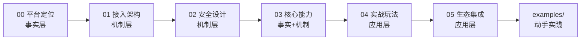

# 概念学习路径

本知识包包含 6 篇概念文档，从平台定位到技术架构，再到安全设计、核心能力、实战玩法和生态集成，逐层深入。

## 学习路径

| 顺序 | 文档 | 核心内容 | 知识层级 | 预计阅读 |
|------|------|----------|----------|----------|
| 1 | [00 平台与产品介绍](00-platform-overview.md) | 平台定位、产品矩阵、内容质量保障、邀测阶段信息 | 事实层 | 6 min |
| 2 | [01 接入方式与技术架构](01-access-architecture.md) | 三种接入方式、调用链路、输出约定、技术架构 | 机制层 | 8 min |
| 3 | [02 安全设计与凭证管理](02-security-credentials.md) | 供应链四道校验、凭证存储、鉴权机制、安全审计 | 机制层 | 6 min |
| 4 | [03 核心能力与命令](03-core-capabilities.md) | 搜索、热榜、直答、个人数据四大能力详解 | 事实层+机制层 | 7 min |
| 5 | [04 实战玩法与创意应用](04-practical-playbooks.md) | 五种实战玩法：创作体检、风格蒸馏、选题雷达等 | 应用层 | 8 min |
| 6 | [05 生态集成与兼容性](05-ecosystem-integration.md) | Agent 平台支持、系统兼容性、第三方生态 | 应用层 | 5 min |

## 路径图



阅读完概念层后，进入 [examples/](../examples/index.md) 动手实践。

---

```{toctree}
:hidden:
:maxdepth: 2

00-platform-overview
01-access-architecture
02-security-credentials
03-core-capabilities
04-practical-playbooks
05-ecosystem-integration
```
