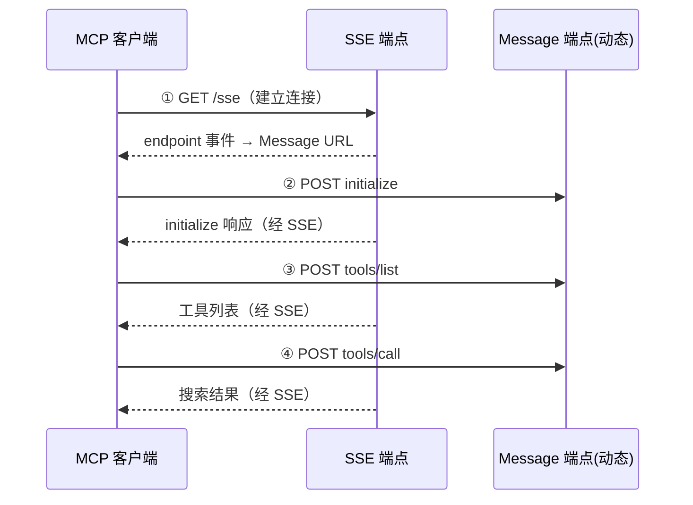
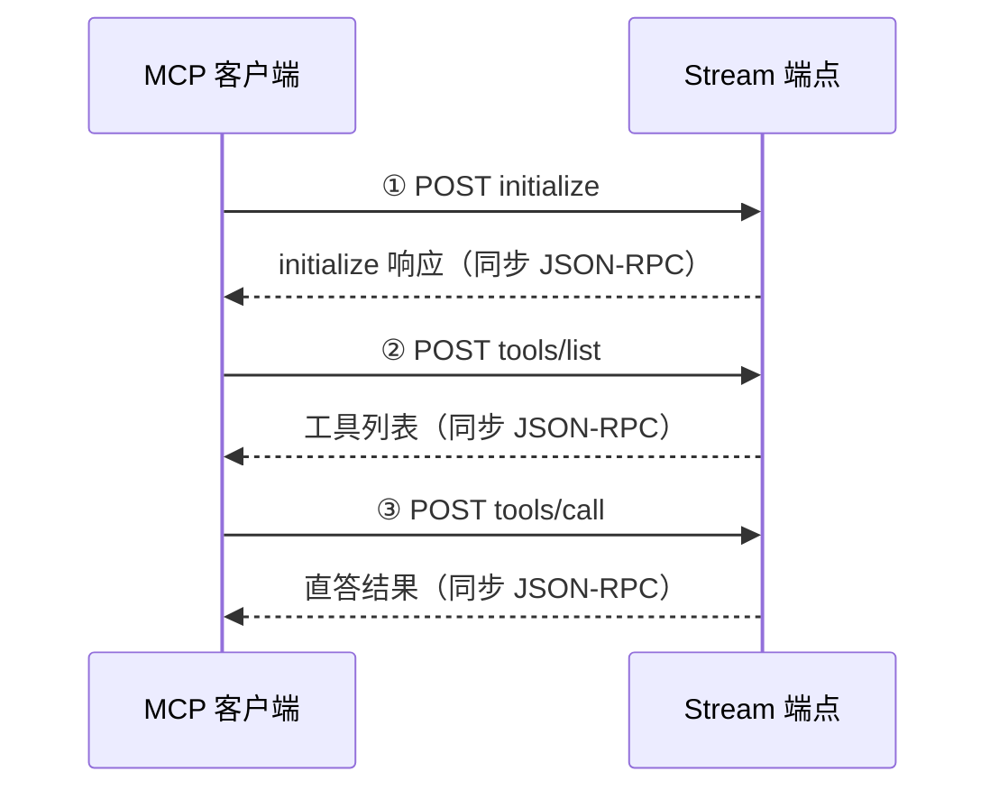

# 04 MCP 接入实操指南

> 适用对象：需要将知乎数据开放平台能力接入支持 MCP 协议的 Agent / 助手 / 工作流系统的开发者
> 前置条件：已获取 Access Secret（见 [01 注册与安装](01-setup-installation.md)）

---

## 一、快速概览

知乎开放平台提供多个 MCP 服务，不同能力使用**不同的 MCP 传输模式**：

| MCP 服务 | 工具名 | 传输模式 | 端点 | 协议版本 |
|----------|--------|---------|------|---------|
| 知乎搜索 MCP | `zhihu_search` | MCP over SSE | SSE URL + Message URL（动态） | 2024-11-05 |
| 全网搜索 MCP | `global_search` | MCP over SSE | SSE URL + Message URL（动态） | 2024-11-05 |
| 知乎热榜 MCP | `hot_list` | MCP over SSE | SSE URL + Message URL（动态） | 2024-11-05 |
| 直答 MCP | `zhida` | MCP Streamable HTTP | 单一 stream 端点 | 2025-10-28 |

> **关键差异**：
> - **SSE 模式**（搜索/热榜）：先建立 SSE 长连接获取 message 地址，后续请求发到动态 message 地址，响应经 SSE 异步返回
> - **Streamable HTTP 模式**（直答）：所有请求都发到同一个 stream 端点，同步返回 JSON-RPC 结果

**鉴权方式统一**：`Authorization: Bearer <your_access_secret>`

---

## 二、zhihu_search_mcp 接入（SSE 模式）

### 2.1 端点信息

| 项目 | 值 |
|------|-----|
| SSE URL | `https://developer.zhihu.com/api/mcp/zhihu_search/v1/sse` |
| Message URL | 动态返回（含 sessionId） |
| 传输方式 | MCP over SSE |
| 工具名 | `zhihu_search` |
| 协议版本 | 2024-11-05 |

### 2.2 四步接入流程



#### 第 1 步：建立 SSE 连接

```bash
curl -N 'https://developer.zhihu.com/api/mcp/zhihu_search/v1/sse' \
  -H 'Authorization: Bearer <your_access_secret>' \
  -H 'Accept: text/event-stream'
```

**预期返回**（endpoint 事件）：

```
event: endpoint
data: /api/mcp/zhihu_search/v1/message?sessionId=xxxxxx
```

> 记下完整的 Message URL：`https://developer.zhihu.com` + data 中的路径。后续所有请求都发到这个地址。

#### 第 2 步：初始化 MCP 会话

```bash
curl -X POST "https://developer.zhihu.com/api/mcp/zhihu_search/v1/message?sessionId=xxxxxx" \
  -H 'Authorization: Bearer <your_access_secret>' \
  -H 'Content-Type: application/json' \
  -d '{
    "jsonrpc": "2.0",
    "id": 1,
    "method": "initialize",
    "params": {
      "protocolVersion": "2024-11-05",
      "clientInfo": {
        "name": "my-agent",
        "version": "1.0.0"
      },
      "capabilities": {}
    }
  }'
```

> Message 端点通常先返回 HTTP 202 Accepted，实际响应通过 SSE 通道异步送达。

#### 第 3 步：获取工具列表

```bash
curl -X POST "$MESSAGE_URL" \
  -H 'Authorization: Bearer <your_access_secret>' \
  -H 'Content-Type: application/json' \
  -d '{
    "jsonrpc": "2.0",
    "id": 2,
    "method": "tools/list"
  }'
```

#### 第 4 步：调用搜索工具

```bash
curl -X POST "$MESSAGE_URL" \
  -H 'Authorization: Bearer <your_access_secret>' \
  -H 'Content-Type: application/json' \
  -d '{
    "jsonrpc": "2.0",
    "id": 3,
    "method": "tools/call",
    "params": {
      "name": "zhihu_search",
      "arguments": {
        "query": "RAG 检索增强生成",
        "count": 5
      }
    }
  }'
```

### 2.3 工具参数

| 参数 | 类型 | 必填 | 说明 |
|------|------|------|------|
| `query` | String | 是 | 搜索关键词，长度 2-100 字符 |
| `count` | Number | 否 | 返回条数，1-10，默认 10 |

### 2.4 返回格式

工具结果为 MCP text 类型，文本内容是 XML 格式：

```xml
<zhihu_search query="RAG 检索增强生成">
<search_item 
  title="RAG 入门完全指南" 
  content_type="Article" 
  url="https://zhuanlan.zhihu.com/p/xxx" 
  author_name="技术博主" 
  authority_level="3" 
  ranking_score="0.95">
本文详细介绍 RAG 的基本概念、核心组件和实现方式...
</search_item>
</zhihu_search>
```

> **建议**：将整段 XML 原样交给模型消费，不要自行裁剪字段。

### 2.5 全网搜索 / 热榜 MCP（同 SSE 模式）

`global_search_mcp` 和 `hot_list_mcp` 也使用 SSE 模式，接入流程完全一致，只需替换 SSE URL 和工具名：

| MCP 服务 | SSE URL | 工具名 |
|----------|---------|--------|
| 全网搜索 | `https://developer.zhihu.com/api/mcp/global_search/v1/sse` | `global_search` |
| 知乎热榜 | `https://developer.zhihu.com/api/mcp/hot_list/v1/sse` | `hot_list` |

全网搜索工具额外支持 `filter`（站点/时间筛选）和 `search_db`（索引库选择）参数，详见 [官方 API 参考](../references/official-api-reference.md#三、全网搜索-api)。

---

## 三、zhida_mcp 接入（Streamable HTTP 模式）

### 3.1 端点信息

| 项目 | 值 |
|------|-----|
| HTTP URL | `https://developer.zhihu.com/api/mcp/zhida/v1/stream` |
| HTTP Method | POST |
| 传输方式 | MCP Streamable HTTP |
| 工具名 | `zhida` |
| 协议版本 | 2025-10-28 |

> **注意**：直答 MCP 使用**单一端点**承载所有请求（initialize / tools/list / tools/call），不需要先建立 SSE 连接。

### 3.2 三步接入流程



#### 第 1 步：初始化 MCP 会话

```bash
curl -X POST 'https://developer.zhihu.com/api/mcp/zhida/v1/stream' \
  -H 'Authorization: Bearer <your_access_secret>' \
  -H 'Content-Type: application/json' \
  -d '{
    "jsonrpc": "2.0",
    "id": 1,
    "method": "initialize",
    "params": {
      "protocolVersion": "2025-10-28",
      "clientInfo": {
        "name": "my-agent",
        "version": "1.0.0"
      },
      "capabilities": {}
    }
  }'
```

#### 第 2 步：获取工具列表

```bash
curl -X POST 'https://developer.zhihu.com/api/mcp/zhida/v1/stream' \
  -H 'Authorization: Bearer <your_access_secret>' \
  -H 'Content-Type: application/json' \
  -d '{
    "jsonrpc": "2.0",
    "id": 2,
    "method": "tools/list"
  }'
```

#### 第 3 步：调用直答工具

```bash
curl -X POST 'https://developer.zhihu.com/api/mcp/zhida/v1/stream' \
  -H 'Authorization: Bearer <your_access_secret>' \
  -H 'Content-Type: application/json' \
  -d '{
    "jsonrpc": "2.0",
    "id": 3,
    "method": "tools/call",
    "params": {
      "name": "zhida",
      "arguments": {
        "query": "怎么理解 RAG 技术？",
        "model": "zhida-fast-1p5"
      }
    }
  }'
```

### 3.3 工具参数

| 参数 | 类型 | 必填 | 说明 |
|------|------|------|------|
| `query` | String | 是 | 用户问题 |
| `model` | String | 是 | 直答模型档位 |
| `member_id` | Number | 否 | 预留字段，可不传 |

### 3.4 模型档位选择

| 模型 ID | 名称 | 适用场景 |
|---------|------|---------|
| `zhida-fast-1p5` | 快速回答 | 日常使用，推荐默认 |
| `zhida-thinking-1p5` | 深度思考 | 复杂问题，带推理过程 |
| `zhida-agent` | 智能思考 / Agent 模式 | 最高级能力 |

### 3.5 返回示例

```json
{
  "jsonrpc": "2.0",
  "id": 3,
  "result": {
    "content": [
      {
        "type": "text",
        "text": "RAG（Retrieval-Augmented Generation，检索增强生成）是一种将信息检索与大语言模型结合的技术方案..."
      }
    ],
    "isError": false
  }
}
```

> **说明**：MCP 层默认等待直答完整输出后再返回工具结果。如需消费增量事件或更丰富的思考过程，建议直接使用[直答原生 API](../references/official-api-reference.md#五、直答-api)（支持 stream=true 流式输出）。

---

## 四、常见问题排错

### Q1: SSE 连接成功但 message 请求返回 401？

**原因**：SSE 连接和 message 请求都需要携带鉴权头。

**解决**：确保所有请求（包括 message POST）都携带 `Authorization: Bearer <your_access_secret>`。

### Q2: message 请求返回 202 Accepted 但 SSE 收不到响应？

**可能原因**：
1. SSE 连接已断开
2. sessionId 过期或不匹配

**排查**：
- 检查 SSE 连接是否保持活跃
- 确认使用的 message URL 是最近一次 endpoint 事件返回的
- 重新建立 SSE 连接获取新的 sessionId

### Q3: 工具调用结果是空的？

**排查**：
- 检查工具名拼写是否正确（`zhihu_search` / `zhida` / `global_search` / `hot_list`）
- 检查参数名和类型是否正确
- 查看额度是否充足（可调用[额度查询 API](../references/official-api-reference.md#六、额度查询-api)）

### Q4: 直答 MCP 支持流式输出吗？

直答 MCP 的 `tools/call` 默认等待完整回答后返回（一次性返回）。**如需流式输出，请使用直答原生 API**（`/v1/chat/completions` + `stream=true`），而不是 MCP tool 调用。

### Q5: 每次都要手动走 4 步流程吗？

不需要。推荐使用**现成的 MCP Client 库**（如 Python 的 `mcp` 包、Node.js 的 `@modelcontextprotocol/sdk`），它们会自动处理 initialize、tools/list、session 管理等底层细节，你只需关注工具调用即可。

### Q6: SSE 连接超时断开了怎么办？如何自动重连？

MCP over SSE 模式下，SSE 长连接可能因网络波动、服务端空闲超时、负载均衡切换等原因断开。以下是完整的排查与重连方案：

#### 第一步：判断是否真的断开

SSE 连接断开的典型现象：
- message 请求返回 HTTP 202，但 SSE 通道迟迟收不到响应
- 尝试读取 SSE 流时收到 EOF 或连接重置错误
- 浏览器/客户端的 `readyState` 变为 `CLOSED`（2）

**快速验证**：在保持 SSE 连接的终端里，看是否还有数据流输出。如果长时间（>30 秒）没有任何事件（连心跳都没有），大概率已断开。

#### 第二步：重连操作步骤（手动）

```bash
# 1. 重新建立 SSE 连接
curl -N 'https://developer.zhihu.com/api/mcp/zhihu_search/v1/sse' \
  -H 'Authorization: Bearer <your_access_secret>' \
  -H 'Accept: text/event-stream'

# 2. 等待新的 endpoint 事件，获取新的 message URL（新的 sessionId）
# 3. 用新的 MESSAGE_URL 重新发送 initialize 和 tools/list
# 4. 继续正常调用工具
```

> **重要**：重连后必须重新走 initialize → tools/list 流程，因为服务端是新的 session，旧 session 的状态不会保留。

#### 第三步：自动重连实现要点（代码级）

如果你在自己实现 MCP Client，自动重连需要处理以下关键点：

| 关键点 | 说明 | 推荐方案 |
|--------|------|---------|
| **断开检测** | 监听 SSE 的 error/close 事件，或心跳超时检测 | 心跳超时阈值建议 60 秒（服务端有 `: keep-alive` 心跳） |
| **重连退避** | 避免断开后立即疯狂重连打爆服务端 | 指数退避：1s → 2s → 4s → 8s → 最大 30s |
| **session 重置** | 重连后旧 sessionId 失效，所有上下文丢失 | 重新建立 SSE → 重新 initialize → 重新 tools/list |
| **请求补发** | 断开时正在进行的 tools/call 如何处理 | 判断请求是否已发出：未发出则重发；已发出则建议报错让上层重试 |
| **幂等性** | 搜索/热榜查询是幂等的，重发安全 | 直答类生成式请求需评估是否允许重发 |

**Python 伪代码示例**（指数退避重连）：

```python
import time
import httpx

max_retries = 5
base_delay = 1  # 秒

def connect_sse_with_retry(url, headers):
    for attempt in range(max_retries):
        try:
            with httpx.stream("GET", url, headers=headers, timeout=None) as response:
                # 处理 SSE 流...
                return  # 正常退出
        except Exception as e:
            if attempt == max_retries - 1:
                raise  # 最后一次重试失败，抛出
            delay = base_delay * (2 ** attempt)
            print(f"SSE 断开，{delay}s 后重连（第 {attempt+1}/{max_retries} 次）...")
            time.sleep(delay)
```

#### 第四步：排查频繁断开的原因

如果 SSE 频繁断开（比如几分钟就断一次），排查以下可能：

| 可能原因 | 排查方法 | 解决方案 |
|---------|---------|---------|
| 本地网络不稳定 | ping 测试、移动网络对比 | 切换稳定网络 |
| 代理 / 防火墙超时 | 检查是否走了公司代理 | 为 SSE 域名配置直连或增大代理超时 |
| 服务端负载均衡切换 | 同一连接长时间后被切走 | 属于正常现象，依赖自动重连即可 |
| 客户端空闲被服务端清理 | 长时间不发请求后断开 | 定期发送轻量请求（如 tools/list）保活 |
| 额度耗尽触发断开 | 检查额度使用情况 | 调用额度查询 API 确认 [官方API参考](../references/official-api-reference.md#六、额度查询-api) |

> **提示**：如果使用的是官方 MCP SDK 或成熟的 MCP Client，通常已经内置了自动重连机制，你不需要手动处理。只有在自己实现 SSE 客户端时才需要关注以上细节。

---

## 五、接入方式选择决策

| 场景 | 推荐方式 |
|------|---------|
| 只需要搜索 / 热榜能力 | Skill + CLI（最简单） |
| 需要接入 MCP 生态的工作流 | MCP 服务 |
| 需要直答流式输出 / 推理过程 | 直答原生 API（stream=true） |
| 服务端集成、完全自定义 | API 直接调用 |

详细对比见 [接入方式与技术架构](../concepts/01-access-architecture.md)。
