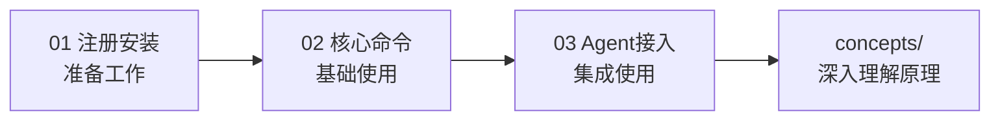

# 实战操作指南

本知识包包含 3 篇操作文档，从注册安装到命令使用再到 Agent 接入，带你一步步上手 Zhihu CLI。

## 学习路径

| 顺序 | 文档 | 核心内容 | 预计阅读 |
|------|------|----------|----------|
| 1 | [01 注册与安装](01-setup-installation.md) | 开放平台注册、实名认证、CLI 安装、Access Secret 配置 | 8 min |
| 2 | [02 核心命令使用](02-core-commands.md) | search/hot/answer/me 四大命令实战示例 | 10 min |
| 3 | [03 Agent 接入配置](03-agent-integration.md) | 以 Claude Code 为例的 Skill/MCP 接入配置流程 | 8 min |

## 路径图



建议先阅读 [concepts/](../concepts/index.md) 了解整体架构，再回到 examples 动手实践。

---

```{toctree}
:hidden:
:maxdepth: 2

01-setup-installation
02-core-commands
03-agent-integration
```
