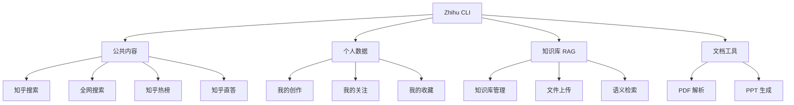

# zhihu-cli

> **官方平台**：[知乎数据开放平台](https://developer.zhihu.com) [F-048]
> **产品阶段**：邀测阶段（截至 2026 年 9 月）[F-005]
> **免费额度**：5000 次/天（邀测阶段，2026 年 Q3 扩容至此）[F-006] [E-002]
> **当前版本**：v0.5.0 [F-009]
> **P0 核验**：55 项，41 ✅ 14 ⚠️ 0 ❌（详见 [verification.md](references/verification.md)）
> **事实基数**：235 条（F-001 ~ F-235）
> **官方 API 参考**：[official-api-reference.md](references/official-api-reference.md)

## 项目一句话

Zhihu CLI 是知乎数据开放平台给 AI Agent 提供的官方命令行工具 [F-001]，将**公共内容 + 个人数据 + 知识库 RAG** 同时交到 AI 手中 [F-004]——支持搜索、热榜、直答、知识库 RAG、文档工具（PDF 解析/PPT 生成）、个人数据六大能力，可通过 API、Skill+CLI、MCP 三种方式接入 [E-001]。

## 核心价值



社区观点认为，Zhihu CLI 最大价值在于**公共内容 + 个人数据同时交到 AI 手中** [F-004]，这是其他搜索类工具不具备的独特优势 [F-084]。

## 知识结构

```
zhihu-cli/
├── index.md                          ← 你在这里
├── log.md                            ← 变更日志
├── concepts/                         ← 概念层（6 篇）
│   ├── index.md
│   ├── 00-platform-overview.md       ← 平台与产品介绍
│   ├── 01-access-architecture.md     ← 接入方式与技术架构
│   ├── 02-security-credentials.md    ← 安全设计与凭证管理
│   ├── 03-core-capabilities.md       ← 核心能力与命令
│   ├── 04-practical-playbooks.md     ← 实战玩法与创意应用
│   └── 05-ecosystem-integration.md   ← 生态集成与兼容性
├── examples/                         ← 操作层（4 篇）
│   ├── index.md
│   ├── 01-setup-installation.md      ← 注册与安装
│   ├── 02-core-commands.md           ← 核心命令使用
│   ├── 03-agent-integration.md       ← Agent 接入配置
│   └── 04-mcp-integration.md         ← MCP 接入实操指南
└── references/                       ← 参考层（4 篇）
    ├── index.md
    ├── official-api-reference.md    ← 官方 API 接口参考手册
    ├── article-source.md             ← F-001~F-135 事实登记
    └── verification.md               ← P0 核验报告
```

## 分层导航

### 概念层（6 篇）

| 文档 | 核心内容 | 知识层级 |
|------|----------|----------|
| [00 平台与产品介绍](concepts/00-platform-overview.md) | 平台定位、六大产品、内容分级、邀测信息 | 事实层 |
| [01 接入方式与技术架构](concepts/01-access-architecture.md) | 三种接入方式、MCP over SSE、一能力三入口、调用链路、输出约定 | 机制层 |
| [02 安全设计与凭证管理](concepts/02-security-credentials.md) | 四道校验、Keychain 存储、鉴权机制 | 机制层 |
| [03 核心能力与命令](concepts/03-core-capabilities.md) | 搜索/热榜/直答/知识库RAG/文档工具/个人数据/额度体系详解 | 事实+机制 |
| [04 实战玩法与创意应用](concepts/04-practical-playbooks.md) | 五种实战玩法 + 创意方向 | 应用层 |
| [05 生态集成与兼容性](concepts/05-ecosystem-integration.md) | Agent 支持、平台兼容、第三方生态 | 应用层 |

### 操作层（4 篇）

| 文档 | 核心内容 |
|------|----------|
| [01 注册与安装](examples/01-setup-installation.md) | 开放平台注册、CLI 安装、Access Secret 配置、Windows 避坑 |
| [02 核心命令使用](examples/02-core-commands.md) | search/hot/answer/me 四大命令实战示例 |
| [03 Agent 接入配置](examples/03-agent-integration.md) | Claude Code Skill/MCP 接入配置流程 |
| [04 MCP 接入实操指南](examples/04-mcp-integration.md) | zhihu_search_mcp / zhida_mcp 配置、curl 示例、排错指南 |

### 信源层（4 篇）

| 文档 | 内容 | 条目数 |
|------|------|--------|
| [官方 API 参考](references/official-api-reference.md) | 搜索/热榜/直答/额度 + 用户数据 5 接口 + 知识库 4 接口 + 工具 2 接口 + OAuth + MCP + 鉴权 + 错误码完整规格 | - |
| [事实登记](references/article-source.md) | F-001~F-200 完整事实底账 | 200 条 |
| [核验报告](references/verification.md) | 45 项 P0 核验 + 3 条勘误 + 时效边界 | - |
| [参考索引](references/index.md) | 外部信源与参考资源导航 | - |

## 信任与生命周期

| 项目 | 状态 |
|------|------|
| **事实基数** | 235 条（F-001~F-235） |
| **P0 核验** | 55 项：41 ✅ 确认 / 14 ⚠️ 部分确认 / 0 ❌ 错误 |
| **勘误项** | 3 条（E-001~E-003） |
| **厂商自述** | 约 35 项（含产品页宣传性内容，无法独立核验） |
| **官方文档验证** | 95 条（F-106~F-200，来自 S7 官方技术文档） |
| **产品介绍页补充** | 35 条（F-201~F-235，来自 S8 产品介绍页） |
| **status** | verified |
| **stale_after** | 2026-12-31 |

## 时效性提示

⏰ 本知识包信息具有时效性，以下内容可能随时间变化：

- **免费额度**：5000 次/天（2026 年 9 月时点），2026 年 5 月为 1000 次/天 [E-002]
- **产品阶段**：邀测阶段，正式发布时间未定 [F-005]
- **版本号**：v0.5.0，产品快速迭代中 [F-009]
- **接入方式**：API + Skill + MCP 三种，可能新增 [E-001]

**建议**：关键数据以官方最新公告为准（<https://developer.zhihu.com>）。

## 已知边界

1. 全网搜索的百亿索引、600ms 延迟等数据为厂商自述，无独立第三方实测 [P0-002][P0-003]
2. 安全审计 P2/安全为作者评估结论，非官方审计报告 [P0-009]
3. 老狼创作数据存在 9年/430篇 vs 15年/49万字 两种口径（统计维度不同）[P0-010]
4. uv 安装方式为社区推荐，未见官方明确推荐 [P0-011]
5. 全网+知乎双源融合架构的内部实现细节无法独立核验 [P0-013]
6. 多模态能力（图片理解/视频分析/多模态问答）仅在产品页展示，官方 API 文档暂未列出对应接口，处于规划或内测阶段 [P0-053]

> ✅ 2026-09-05 更新：Bearer Token + X-Request-Timestamp 双重校验机制（原第 2 条）已通过官方 API 文档确认，移出已知边界。直答三档模型、MCP over SSE 架构、统一额度体系、API 参数边界、用户数据 5 接口（内容/关注/收藏/收藏夹列表/收藏夹内容）、OAuth 2.0 集成流程等均已通过官方文档确认。
>
> ✅ 2026-09-05 新增："工具""知识库"边界问题（原 P0-014）已通过 6 个新增官方 API 文档完整解答，移出已知边界。知识库 4 个 API（列表/内容列表/上传/检索）与文档工具 2 个 API（PDF 解析/PPT 生成）均已完整核验。
>
> ✅ 2026-09-05 新增（产品介绍页补充）：通过产品介绍页（S8 信源）补充全网搜索/知乎搜索/热榜/直答/工具 5 个产品页的产品定位、核心优势、应用场景等内容，新增 35 条事实（F-201~F-235）和 10 项 P0 核验（P0-046~P0-055）。多模态能力（图片理解/视频分析）在产品页展示但 API 文档暂未开放，已列入已知边界。

---

```{toctree}
:hidden:
:maxdepth: 2

concepts/index
examples/index
references/index
log
```
