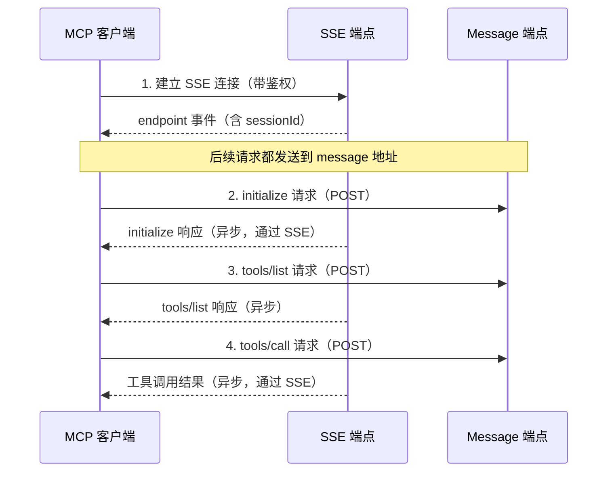
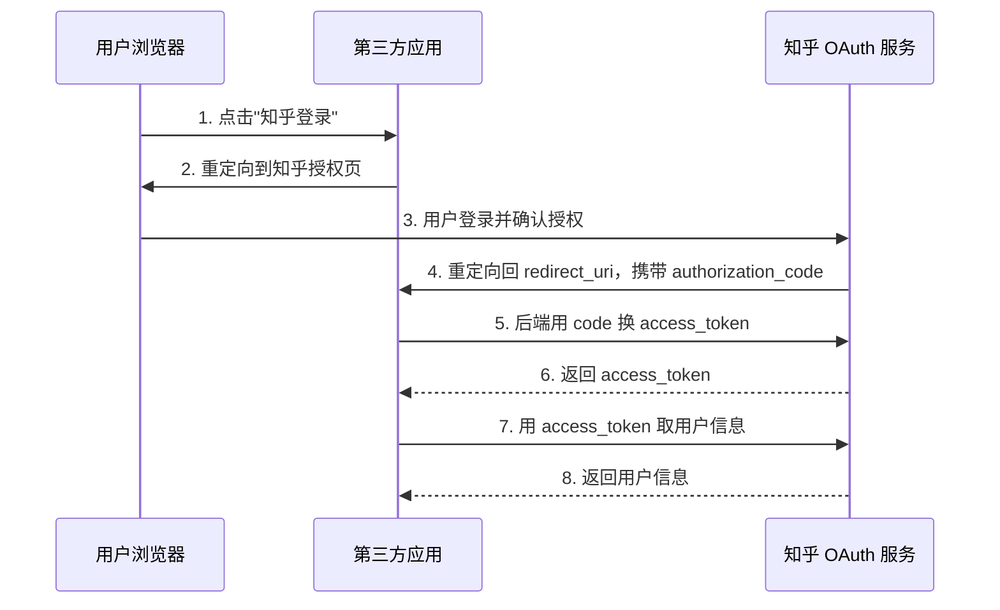
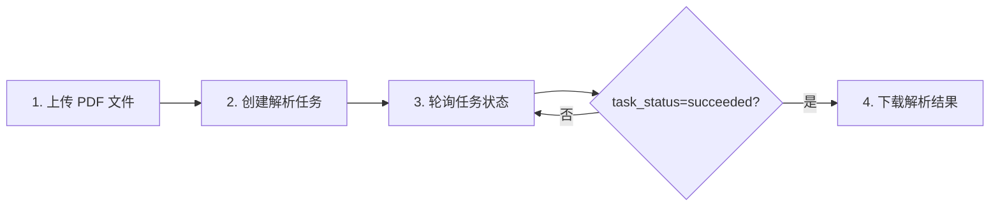

# 官方 API 接口参考手册

> 本文档整理自知乎数据开放平台官方文档中心（developer.zhihu.com/docs），收录各核心 API 的精确接口规格。
>
> **信源**：S3（官方发布）
> **采集日期**：2026-09-05
> **适用版本**：v0.5.0 对应开放平台 API

---

## 一、统一鉴权规范

所有 API 统一使用 **Bearer Token + 时间戳** 双重鉴权机制。

### 请求头

| 名称 | 示例值 | 说明 |
|------|--------|------|
| `Authorization` | `Bearer <your_access_secret>` | Bearer 鉴权头，必填 |
| `X-Request-Timestamp` | `1742822400` | 秒级 Unix 时间戳，与服务端时间相差不能超过 10 分钟，必填 |
| `Content-Type` | `application/json` | JSON 接口固定值（POST 请求需要） |

### Curl 通用示例

```bash
curl -G 'https://developer.zhihu.com/api/v1/...' \
  --data-urlencode 'Query=...' \
  -H 'Authorization: Bearer <your_access_secret>' \
  -H "X-Request-Timestamp: $(date +%s)" \
  -H 'Content-Type: application/json'
```

### 错误码体系

| 错误码 | 说明 | 适用范围 |
|--------|------|----------|
| 0 | 成功 | 全部 |
| 10001 | 参数错误 / 参数格式错误或包含未知值 | 全部 |
| 20001 | Access Secret 鉴权失败 | 全部 |
| 30001 | 请求频率超过限制 / 频率限制 | 全部 |
| 90001 | 内部错误 / 额度数据读取失败 | 全部 |

---

## 二、知乎搜索 API

### 接口信息

| 项目 | 值 |
|------|-----|
| HTTP URL | `https://developer.zhihu.com/api/v1/content/zhihu_search` |
| HTTP Method | `GET` |

### Query 参数

| 名称 | 类型 | 必填 | 说明 |
|------|------|------|------|
| `Query` | String | 是 | 查询关键词，不能为空 |
| `Count` | Int32 | 否 | 请求数量，默认 10，最大 10 |

> **参数边界**：Count <= 0 时默认回退为 10；Count > 10 时自动截断为 10。

### 响应结构（Data）

| 字段 | 类型 | 必返 | 描述 |
|------|------|------|------|
| `HasMore` | Bool | 是 | 当前实现固定返回 false |
| `SearchHashId` | String | 是 | 搜索请求标识 |
| `Items` | Array[Item] | 是 | 搜索结果列表 |
| `EmptyReason` | String | 否 | 无结果时的原因说明 |

### Item 结构

| 字段 | 类型 | 必返 | 描述 |
|------|------|------|------|
| `Title` | String | 是 | 内容标题 |
| `ContentType` | String | 是 | 内容类型（如 Answer / Article） |
| `ContentID` | String | 是 | 内容标识 |
| `ContentText` | String | 是 | 内容摘要（可能包含 `<em>` 高亮标签） |
| `Url` | String | 是 | 内容链接（带溯源 UTM 参数） |
| `CommentCount` | Int32 | 是 | 评论数 |
| `VoteUpCount` | Int32 | 是 | 赞同数 |
| `AuthorName` | String | 是 | 作者昵称 |
| `AuthorAvatar` | String | 是 | 作者头像 |
| `AuthorBadge` | String | 是 | 作者认证图标 |
| `AuthorBadgeText` | String | 是 | 作者认证文案 |
| `EditTime` | Int32 | 是 | 发布时间或更新时间戳 |
| `CommentInfoList` | Array[CommentInfo] | 否 | 精选评论 |
| `AuthorityLevel` | String | 是 | 权威等级 |
| `RankingScore` | Float32 | 是 | 排序分数 |

### CommentInfo 结构

| 字段 | 类型 | 必返 | 描述 |
|------|------|------|------|
| `Content` | String | 是 | 评论内容 |

### 错误码

| 错误码 | 说明 |
|--------|------|
| 0 | 成功 |
| 10001 | 参数错误 |
| 20001 | 鉴权失败 |
| 30001 | 频率限制 |
| 90001 | 内部错误 |

---

## 三、全网搜索 API

### 接口信息

| 项目 | 值 |
|------|-----|
| HTTP URL | `https://developer.zhihu.com/api/v1/content/global_search` |
| HTTP Method | `GET` |

### Query 参数

| 名称 | 类型 | 必填 | 说明 |
|------|------|------|------|
| `Query` | String | 是 | 查询关键词 |
| `Count` | Int32 | 否 | 请求数量，默认 10，最大 20 |
| `Filter` | String | 否 | 高级语法筛选表达式，需 URL 编码 |
| `SearchDB` | String | 否 | 索引库选择，默认 all |

### SearchDB 索引库选择

| 值 | 说明 |
|----|------|
| `all` | 全部索引库（默认） |
| `realtime` | 仅搜索实时库 |
| `static` | 仅搜索静态库 |

> 🔍 **P0 核验证据**：`SearchDB=realtime` 参数的存在，从 API 层面证实了全网搜索存在独立的实时索引库（对应 [P0-004] 中"实时分钟级索引更新"的技术可能性）。但"分钟级"的具体更新频率为厂商自述口径，无法从 API 文档直接确认。

### Filter 高级语法

Filter 用于按站点、发布时间等条件过滤搜索结果。

**支持字段**：

| 字段 | 含义 | 类型 | 示例 |
|------|------|------|------|
| `host` | 站点域名 | String | `host=="example.com"` |
| `publish_time` | 发布时间（秒级时间戳） | Int64 | `publish_time>=1778494631` |

**支持操作符**：

- `host`：支持 `==`、`!=`，字符串值必须使用双引号
- `publish_time`：支持 `==`、`!=`、`>`、`>=`、`<`、`<=`，数字值不使用引号

**支持逻辑符**：

- `AND`、`OR` 必须大写
- `AND` 优先级高于 `OR`
- 可使用括号 `()` 明确控制优先级

**示例**：

```
host=="example.com"
host=="example.com" AND publish_time>=1778494631
(host=="example.com" OR host=="news.example.com") AND publish_time>1778494631
```

> **注意**：`host=="zhihu.com"` 及其子域名不支持。如需搜索仅知乎站内内容，使用 `zhihu_search` 接口。

### 响应结构（Data）

| 字段 | 类型 | 必返 | 描述 |
|------|------|------|------|
| `HasMore` | Bool | 是 | 是否有下一页数据 |
| `Items` | Array[Item] | 是 | 内容数据列表 |

### Item 结构（全网搜索）

| 字段 | 类型 | 必返 | 描述 |
|------|------|------|------|
| `Title` | String | 是 | 内容标题 |
| `ContentType` | String | 是 | 内容类型（如回答、文章） |
| `ContentID` | String | 是 | 内容 Token |
| `ContentText` | String | 是 | 内容摘要（高亮用 `<em>` 标签） |
| `Url` | String | 是 | 内容链接（带溯源 UTM 参数） |
| `CommentCount` | Int32 | 是 | 评论数 |
| `VoteUpCount` | Int32 | 是 | 赞同数 |
| `AuthorName` | String | 是 | 作者昵称（匿名时为"知乎用户"） |
| `AuthorAvatar` | String | 是 | 作者头像 |
| `AuthorBadge` | String | 是 | 认证标图片 URL |
| `AuthorBadgeText` | String | 是 | 认证文案 |
| `EditTime` | Int64 | 是 | 最后编辑时间戳 |
| `CommentInfoList` | Array[CommentInfo] | 否 | 精选评论 |
| `AuthorityLevel` | String | 是 | 权威等级（1低 / 2中 / 3高 / 4超高） |

> 🔍 **P0 核验证据**：平台提供独立的 `zhihu_search`（知乎站内搜索）和 `global_search`（全网搜索）两个 API 接口，从接口层面印证了"全网+知乎双源"的架构设计（对应 [P0-013]）。但双源融合的**内部实现细节**（如融合算法、权重分配、排序机制等）为厂商自述，无法从 API 文档独立核验。

---

## 四、知乎热榜 API

### 接口信息

| 项目 | 值 |
|------|-----|
| HTTP URL | `https://developer.zhihu.com/api/v1/content/hot_list` |
| HTTP Method | `GET` |

### Query 参数

| 名称 | 类型 | 必填 | 说明 |
|------|------|------|------|
| `Limit` | Int32 | 否 | 返回数量，默认 30，最大 30 |

> **参数边界**：Limit <= 0 或 Limit > 30 时，服务端自动回退为 30。

### 响应结构（Data）

| 字段 | 类型 | 必返 | 描述 |
|------|------|------|------|
| `Total` | Int64 | 是 | 实际返回的热榜条数 |
| `Items` | Array[Item] | 是 | 热榜内容列表 |

### Item 结构（热榜）

| 字段 | 类型 | 必返 | 描述 |
|------|------|------|------|
| `Title` | String | 是 | 热榜标题 |
| `Url` | String | 是 | 热榜对应的知乎链接 |
| `ThumbnailUrl` | String | 是 | 缩略图 URL（无封面图时为空字符串） |
| `Summary` | String | 是 | 内容摘要（无摘要时为空字符串） |

> **说明**：当前仅返回问题和文章两类热榜内容。`ThumbnailUrl` 和 `Summary` 始终返回，无数据时值为 `""`。

### 错误码

| 错误码 | 说明 |
|--------|------|
| 0 | 成功 |
| 20001 | 鉴权失败 |
| 30001 | 频率限制 |
| 90001 | 内部错误 |

---

## 五、直答 API

### 接口信息

| 项目 | 值 |
|------|-----|
| HTTP URL | `https://developer.zhihu.com/v1/chat/completions` |
| HTTP Method | `POST` |
| 请求类型 | `application/json` |
| 响应类型 | `application/json`（stream=false）/ `text/event-stream`（stream=true） |

### 请求参数（Body）

| 名称 | 类型 | 必填 | 说明 |
|------|------|------|------|
| `model` | String | 是 | 模型档位 |
| `messages` | Array[Message] | 是 | 对话消息列表 |
| `stream` | Bool | 否 | 是否流式返回，默认 false |

### 模型档位（model）

| 模型 ID | 名称 | 说明 |
|---------|------|------|
| `zhida-fast-1p5` | 快速回答 | 快速响应模式 |
| `zhida-thinking-1p5` | 深度思考 | 带推理过程的深度模式 |
| `zhida-agent` | 智能思考 / Agent 模式 | Agent 级智能 |

> **说明**：实际可用模型还会受租户授权配置影响。

### Message 结构

| 名称 | 类型 | 必填 | 说明 |
|------|------|------|------|
| `role` | String | 是 | 消息角色 |
| `content` | String | 是 | 消息内容 |

> 支持 role、content 上下文传参的模型：`zhida-fast-1p5`、`zhida-thinking-1p5`。

### 非流式响应（stream=false）

```json
{
  "id": "chatcmpl-xxxx",
  "object": "chat.completion",
  "created": 1740470400,
  "model": "zhida-thinking-1p5",
  "choices": [
    {
      "index": 0,
      "message": {
        "role": "assistant",
        "reasoning_content": "先给出分析过程...",
        "content": "最终回答内容"
      },
      "finish_reason": "stop"
    }
  ]
}
```

### 流式响应（stream=true）

流式响应通过 SSE 逐块返回，格式如下：

```
data: {"id":"chatcmpl-xxxx","object":"chat.completion.chunk","created":1740470400,"model":"zhida-thinking-1p5","choices":[{"index":0,"delta":{"role":"assistant","reasoning_content":"先分析背景"},"finish_reason":null}]}

data: {"id":"chatcmpl-xxxx","object":"chat.completion.chunk","created":1740470400,"model":"zhida-thinking-1p5","choices":[{"index":0,"delta":{"content":"最终回答片段"},"finish_reason":null}]}

data: {"id":"chatcmpl-xxxx","object":"chat.completion.chunk","created":1740470400,"model":"zhida-thinking-1p5","choices":[{"index":0,"delta":{},"finish_reason":"stop"}]}

data: [DONE]
```

> **说明**：
> - 服务端会发送心跳注释：`: keep-alive`
> - `id` 在同一次流式响应中保持一致
> - 当前仅保证 `model`、`messages`、`stream` 三个字段的能力语义；其他字段不作为正式支持

### 错误响应

```json
{
  "error": {
    "message": "xxx",
    "type": "invalid_request_error",
    "param": "model",
    "code": "model_not_found"
  }
}
```

流式中途错误（HTTP 200 已发出）通过 SSE 通道返回：

```
data: {"id":"...","object":"chat.completion.chunk","choices":[{"index":0,"delta":{},"finish_reason":"error"}],"error":{"message":"Internal server error","type":"server_error","code":"internal_error"}}

data: [DONE]
```

---

## 六、额度查询 API

### 接口信息

| 项目 | 值 |
|------|-----|
| HTTP URL | `https://developer.zhihu.com/api/v1/quota` |
| HTTP Method | `GET` |

> **注意**：查询本身不消耗业务额度。

### Query 参数

| 名称 | 类型 | 必填 | 说明 |
|------|------|------|------|
| `APIIDs` | String | 否 | 逗号分隔的 API ID；不传时返回全部可展示额度 |

### 可查询额度项（7 项）

| API ID | 名称 | 覆盖范围 |
|--------|------|----------|
| `global_search` | 全网搜 | 全网搜索 |
| `zhihu_search` | 知乎搜索 | 知乎内容搜索 |
| `hot_list` | 热榜 | 知乎热榜 |
| `user_data` | 知乎用户数据 | 用户创作、关注、收藏及收藏夹数据 |
| `zhida_openai` | 直答 | 直答服务 |
| `knowledge` | 知识库 | 知识库文件上传、列表、内容列表及检索 |
| `tools` | 小工具 | PDF 解析及 PPT 生成 |

> **说明**：
> - 知识库文件上传、知识库列表、知识库内容列表和知识库检索共用一个日额度池，统一返回 `knowledge` 项
> - PDF 解析与 PPT 生成共用 `tools` 项

> 🔍 **P0 核验证据**：7 项额度体系从 API 层面清晰映射了平台的产品分类（搜索 / 热榜 / 直答 / 用户数据 / 知识库 / 工具），对应 [P0-014] 中"六大类产品"的说法。但需注意：
> - 额度维度为 7 项（比"六大类"多一个 `user_data` 用户数据维度）
> - "社区数据"的边界在 API 层面体现为 `user_data`（个人维度），与"社区数据"的公共维度可能存在差异
> - "工具""知识库"的具体边界可从额度池合并规则（knowledge 合并 4 个接口、tools 合并 2 个接口）进一步细化

### 响应结构（Data 数组项）

| 字段 | 类型 | 说明 |
|------|------|------|
| `APIID` | string | 额度项 ID |
| `APIName` | string | 额度项名称 |
| `TotalQuota` | int64 | 当前自然日总额度 |
| `TotalUsed` | int64 | 当前自然日已使用额度 |
| `RemainingQuota` | int64 | 当前自然日剩余额度，最低为 0 |

### 错误码

| 错误码 | 说明 |
|--------|------|
| 10001 | APIIDs 参数格式错误或包含未知 API ID |
| 20001 | Access Secret 鉴权失败 |
| 30001 | 请求频率超过限制，请稍后重试 |
| 90001 | 额度数据读取失败 |

---

## 七、MCP 接入规范

### MCP over SSE 架构

知乎开放平台的 MCP 服务采用 **MCP over SSE** 架构：

- 传输协议：MCP over SSE（Server-Sent Events）
- 通信模式：SSE 通道 + HTTP POST 双向异步
- JSON-RPC 版本：2.0
- 协议版本：2024-11-05

### 接入流程（4 步）



#### 第 1 步：建立 SSE 连接

```bash
curl -N 'https://developer.zhihu.com/api/mcp/zhihu_search/v1/sse' \
  -H 'Authorization: Bearer <your_access_secret>' \
  -H 'Accept: text/event-stream'
```

服务端返回 `endpoint` 事件，包含带 sessionId 的 message 地址：

```
event: endpoint
data: /api/mcp/zhihu_search/v1/message?sessionId=xxx
```

#### 第 2 步：初始化 MCP 会话

```bash
curl -X POST "$MESSAGE_URL" \
  -H 'Authorization: Bearer <your_access_secret>' \
  -H 'Content-Type: application/json' \
  -d '{
    "jsonrpc": "2.0",
    "id": 1,
    "method": "initialize",
    "params": {
      "protocolVersion": "2024-11-05",
      "clientInfo": {
        "name": "demo-client",
        "version": "1.0.0"
      },
      "capabilities": {}
    }
  }'
```

> **说明**：message 端点通常先返回 HTTP 202 Accepted，实际 JSON-RPC 响应通过 SSE 通道异步返回。

#### 第 3 步：获取工具列表

```bash
curl -X POST "$MESSAGE_URL" \
  -H 'Authorization: Bearer <your_access_secret>' \
  -H 'Content-Type: application/json' \
  -d '{
    "jsonrpc": "2.0",
    "id": 2,
    "method": "tools/list"
  }'
```

#### 第 4 步：调用工具

```bash
curl -X POST "$MESSAGE_URL" \
  -H 'Authorization: Bearer <your_access_secret>' \
  -H 'Content-Type: application/json' \
  -d '{
    "jsonrpc": "2.0",
    "id": 3,
    "method": "tools/call",
    "params": {
      "name": "zhihu_search",
      "arguments": {
        "query": "RAG",
        "count": 5
      }
    }
  }'
```

### MCP 工具定义（以知乎搜索为例）

| 项目 | 值 |
|------|-----|
| SSE URL | `https://developer.zhihu.com/api/mcp/zhihu_search/v1/sse` |
| 工具名 | `zhihu_search` |
| 提供能力 | 仅工具（tools），不提供 resources 与 prompts |

**工具入参**：

| 名称 | 类型 | 必填 | 说明 |
|------|------|------|------|
| `query` | String | 是 | 搜索关键词，长度 2-100 个字符 |
| `count` | Number | 否 | 返回条数，1-10，默认 10 |

**返回格式**：text 类型，正文为面向大模型消费的 XML 结构化文本：

```xml
<zhihu_search query="RAG">
<search_item title="RAG 评测方法综述" content_type="Article" url="https://..." author_name="张三" author_avatar="https://..." author_badge_text="" edit_time="2025-03-01 10:00:00 +0000 UTC" authority_level="2" ranking_score="0.9800">
本文介绍了主流 RAG 评测框架...
</search_item>
</zhihu_search>
```

### 注意事项

1. 建议在 SSE 连接和后续 message 请求中均携带同一份鉴权信息
2. `tools/call` 的结果通过 SSE 通道返回，不是同步返回在 POST 响应体中
3. 推荐直接使用现成 MCP Client 接入，不要手动实现协议细节
4. query 建议尽量具体，以获得更稳定的搜索结果

---

## 八、知乎 OAuth 2.0 应用集成

### 概述

知乎 OAuth 服务用于集成知乎第三方登录与获取授权用户的个人信息。如果只是使用知乎数据开放平台的通用 API 以及查看自己的相关数据，则无需接入 OAuth，直接使用开放平台个人中心创建的 Access Secret 即可调用 [F-136]。

OAuth API 采用标准的 **OAuth 2.0 Authorization Code Flow** [F-137]。

### 前置准备

接入前需要申请应用凭证 `app_id` 和 `app_key` [F-138]：

- **申请邮箱**：openplatform@zhihu.com
- **邮件主题**：<公司/组织/产品名称>申请接入知乎 OAuth 服务
- **必填材料**：应用名称、应用简介、应用图标（≥256x256）、授权回调地址 URL、申请人姓名、申请人手机号、申请人知乎个人中心地址
- **申请权限**（多选）：A.邮箱 B.手机 C.公开内容（个人创作内容、关注用户列表、公开收藏夹）

> **安全提示**：申请获取的用户权限会在用户授权时展示给用户进行二次确认，请谨慎选择。

### 授权流程（4 步）



| 步骤 | 说明 | 关键参数 |
|------|------|----------|
| 1. 引导用户授权 | 跳转至知乎授权页面 | `redirect_uri`、`app_id`、`response_type=code` |
| 2. 用户确认授权 | 平台重定向回 redirect_uri，携带授权码 | `authorization_code` |
| 3. 换取 Access Token | 后端用 authorization_code 换 access_token | `app_id`、`app_key`、`grant_type=authorization_code`、`code` |
| 4. 获取用户信息 | 使用 access_token 调用用户信息接口 | `access_token` |

> ⚠️ **安全**：authorization_code 的交换和 access_token 的使用应在应用后端完成，避免泄露 app_key 和用户令牌 [F-139]。

### 授权页 URL

```
https://openapi.zhihu.com/authorize?redirect_uri={redirect_uri}&app_id={app_id}&response_type=code
```

授权成功后，平台重定向回：
```
{redirect_uri}?authorization_code={authorization_code}
```

### 获取 Access Token 接口

| 项目 | 值 |
|------|-----|
| HTTP URL | `https://openapi.zhihu.com/access_token` |
| HTTP Method | `POST` |
| Content-Type | `application/x-www-form-urlencoded` |

#### 请求参数

| 名称 | 类型 | 必填 | 说明 |
|------|------|------|------|
| `app_id` | string | 是 | 第三方 APP_ID，需向知乎申请 |
| `app_key` | string | 是 | 第三方 APP_KEY，需向知乎申请 |
| `grant_type` | string | 是 | 固定值：`authorization_code` |
| `redirect_uri` | string | 是 | 申请 APP_ID 时填写的重定向地址 |
| `code` | string | 是 | 用户授权后生成的 authorization_code |

#### 响应字段

| 字段 | 类型 | 说明 |
|------|------|------|
| `access_token` | string | 访问令牌 |
| `token_type` | string | 令牌类型，如 `Bearer` |
| `expires_in` | long | 过期时间，单位为秒（默认 3600） |

#### 响应示例

```json
{
  "access_token": "xxx",
  "token_type": "Bearer",
  "expires_in": 3600
}
```

#### cURL 示例

```bash
curl -s -X POST "https://openapi.zhihu.com/access_token" \
  -H "Content-Type: application/x-www-form-urlencoded" \
  -d "app_id=${APP_ID}" \
  -d "app_key=${APP_KEY}" \
  -d "grant_type=authorization_code" \
  -d "redirect_uri=${REDIRECT_URI}" \
  -d "code=${CODE}"
```

---

## 九、用户内容 API

### 接口信息

获取知乎用户公开范围内的创作内容，包括回答、文章、视频、想法、问题等 [F-140]。

| 项目 | 值 |
|------|-----|
| HTTP URL | `https://developer.zhihu.com/api/v1/user/contents` |
| HTTP Method | `GET` |
| 额度项 | `user_data` |

### 开放范围

- 不提供 `X-OAuth-Token` 时，获取当前调用方本人数据
- 查看其他用户数据时，需先取得该用户的知乎 OAuth 授权，并在请求头中提供其 OAuth 访问凭证 [F-141]

### 请求头

| 名称 | 必填 | 说明 |
|------|------|------|
| `Authorization` | 是 | `Bearer <your_access_secret>`，开放平台接口鉴权凭证 |
| `X-Request-Timestamp` | 是 | 秒级 Unix 时间戳 |
| `X-OAuth-Token` | 否 | 不传时查询本人；传入时查询该 OAuth 凭证对应的已授权用户 |
| `Content-Type` | 是 | 固定值 `application/json` |

### Query 参数

| 名称 | 类型 | 必填 | 说明 |
|------|------|------|------|
| `Offset` | Int64 | 否 | 分页偏移量，默认 0 |
| `Limit` | Int64 | 否 | 返回数量，默认 20，最大 50 |
| `ContentType` | String | 是 | 内容类型：`all`、`answer`、`article`、`zvideo`、`pin`、`question` |
| `SortField` | String | 否 | 排序字段：`like_count`、`ts`，默认 `ts` |
| `SortOrder` | String | 否 | 排序方向：`asc`、`desc`，默认 `desc` |

> **分页提示**：如果返回结果中 `Paging.IsEnd=false`，可将 `Paging.NextOffset` 作为下一次请求的 Offset。

### 响应结构（Data）

| 字段 | 类型 | 必返 | 描述 |
|------|------|------|------|
| `Items` | Array[ContentItem] | 是 | 内容列表 |
| `Paging` | Paging | 是 | 分页信息 |

### ContentItem 结构

| 字段 | 类型 | 必返 | 描述 |
|------|------|------|------|
| `ContentType` | String | 是 | 内容类型：answer / article / zvideo / pin / question |
| `Url` | String | 是 | 内容链接 |
| `CreatedAt` | Int64 | 是 | 内容创建时间，秒级时间戳 |
| `LikeCount` | Int64 | 是 | 点赞数 |
| `CommentCount` | Int64 | 是 | 评论数 |
| `FavoriteCount` | Int64 | 是 | 收藏数 |
| `Title` | String | 是 | 内容标题 |
| `Summary` | String | 是 | 内容摘要 |

### Paging 结构（通用）

| 字段 | 类型 | 必返 | 描述 |
|------|------|------|------|
| `IsEnd` | Bool | 是 | 是否已到最后一页 |
| `NextOffset` | String | 否 | 下一页分页偏移量 |
| `Totals` | Int64 | 是 | 总数 |

### 错误码

| 错误码 | 说明 |
|--------|------|
| 0 | 成功 |
| 10001 | 参数错误 |
| 20001 | 鉴权失败 |
| 30001 | 频率限制 |
| 30002 | 配额限制 |
| 90001 | 内部错误 |

### cURL 示例

**查询本人内容：**
```bash
curl -G 'https://developer.zhihu.com/api/v1/user/contents' \
  -d 'ContentType=all' \
  -d 'Limit=20' \
  -H 'Authorization: Bearer <your_access_secret>' \
  -H "X-Request-Timestamp: $(date +%s)"
```

**查询已授权用户内容：**
```bash
curl -G 'https://developer.zhihu.com/api/v1/user/contents' \
  -d 'ContentType=all' \
  -d 'Limit=20' \
  -H 'Authorization: Bearer <your_access_secret>' \
  -H 'X-OAuth-Token: <oauth_access_token>' \
  -H "X-Request-Timestamp: $(date +%s)"
```

---

## 十、用户关注 API

### 接口信息

获取知乎用户公开范围内的关注列表 [F-142]。

| 项目 | 值 |
|------|-----|
| HTTP URL | `https://developer.zhihu.com/api/v1/user/followees` |
| HTTP Method | `GET` |
| 额度项 | `user_data` |

### 开放范围

- 不提供 `X-OAuth-Token` 时，获取当前调用方本人关注列表
- 查看其他用户关注列表时，需传入该用户的 OAuth 访问凭证

### 请求头

与**用户内容 API**相同（Authorization + X-Request-Timestamp + 可选 X-OAuth-Token）。

### Query 参数

| 名称 | 类型 | 必填 | 说明 |
|------|------|------|------|
| `Offset` | Int64 | 否 | 分页偏移量，默认 0 |
| `Limit` | Int64 | 否 | 返回数量，默认 20，最大 50 |

### 响应结构（Data）

| 字段 | 类型 | 必返 | 描述 |
|------|------|------|------|
| `Items` | Array[FolloweeItem] | 是 | 关注用户列表 |
| `Paging` | Paging | 是 | 分页信息 |

### FolloweeItem 结构

| 字段 | 类型 | 必返 | 描述 |
|------|------|------|------|
| `Fullname` | String | 是 | 用户名 |
| `UrlToken` | String | 是 | 用户主页标识 |
| `Url` | String | 是 | 用户主页 URL |
| `AvatarUrl` | String | 是 | 用户头像 URL |
| `Headline` | String | 是 | 用户一句话介绍 |
| `Gender` | Int16 | 是 | 性别：0 未知或保密，1 女性，2 男性 |
| `FollowerCount` | Int64 | 是 | 粉丝数 |

### 错误码

与**用户内容 API**相同（0/10001/20001/30001/30002/90001）。

### cURL 示例

```bash
curl -G 'https://developer.zhihu.com/api/v1/user/followees' \
  -d 'Limit=20' \
  -H 'Authorization: Bearer <your_access_secret>' \
  -H "X-Request-Timestamp: $(date +%s)"
```

---

## 十一、用户收藏 API（近期收藏）

### 接口信息

获取知乎用户公开范围内的近期收藏内容 [F-143]。

| 项目 | 值 |
|------|-----|
| HTTP URL | `https://developer.zhihu.com/api/v1/user/collections` |
| HTTP Method | `GET` |
| 额度项 | `user_data` |

### 开放范围

- 不提供 `X-OAuth-Token` 时，获取当前调用方本人近期收藏
- 查看其他用户收藏时，需传入该用户的 OAuth 访问凭证

### 请求头

与**用户内容 API**相同。

### Query 参数

| 名称 | 类型 | 必填 | 说明 |
|------|------|------|------|
| `Limit` | Int64 | 否 | 返回数量，默认 20 |

### 响应结构（Data）

| 字段 | 类型 | 必返 | 描述 |
|------|------|------|------|
| `Items` | Array[CollectionContentItem] | 是 | 收藏内容列表 |

### CollectionContentItem 结构

| 字段 | 类型 | 必返 | 描述 |
|------|------|------|------|
| `ContentType` | String | 是 | 内容类型：answer / article / zvideo / pin / question |
| `Url` | String | 是 | 内容链接 |
| `CreatedAt` | Int64 | 是 | 内容创建时间，秒级时间戳 |
| `FavTime` | Int64 | 是 | 收藏时间，秒级时间戳 |
| `LikeCount` | Int64 | 是 | 点赞数 |
| `CommentCount` | Int64 | 是 | 评论数 |
| `FavoriteCount` | Int64 | 是 | 收藏数 |
| `Title` | String | 是 | 内容标题 |
| `Summary` | String | 是 | 内容摘要 |
| `Favlists` | Array[FavlistItem] | 是 | 内容所在收藏夹列表 |
| `Author` | Author | 否 | 内容作者；下游未返回作者时不输出 |

### FavlistItem 结构

| 字段 | 类型 | 必返 | 描述 |
|------|------|------|------|
| `UrlToken` | Int64 | 是 | 收藏夹 URL 标识；下游未返回时为 0 |
| `Title` | String | 是 | 收藏夹名称 |
| `Url` | String | 是 | 收藏夹链接 |

### Author 结构

| 字段 | 类型 | 必返 | 描述 |
|------|------|------|------|
| `Name` | String | 是 | 作者名称 |
| `UrlToken` | String | 是 | 作者 URL 标识 |
| `Url` | String | 是 | 作者主页链接 |
| `Gender` | Int16 | 是 | 作者性别：0 未知，1 女性，2 男性 |
| `Headline` | String | 是 | 作者签名 |

### 错误码

与**用户内容 API**相同。

### cURL 示例

```bash
curl -G 'https://developer.zhihu.com/api/v1/user/collections' \
  -d 'Limit=20' \
  -H 'Authorization: Bearer <your_access_secret>' \
  -H "X-Request-Timestamp: $(date +%s)"
```

---

## 十二、用户收藏夹列表 API

### 接口信息

获取知乎用户公开范围内的收藏夹列表 [F-144]。

| 项目 | 值 |
|------|-----|
| HTTP URL | `https://developer.zhihu.com/api/v1/user/favlists` |
| HTTP Method | `GET` |
| 额度项 | `user_data` |

### 开放范围

- 可获取当前调用方本人收藏夹列表
- 如需获取其他用户收藏夹列表，需先完成知乎 OAuth 授权，并传入被授权用户的 OAuth 访问凭证

### 请求头

与**用户内容 API**相同。

### Query 参数

| 名称 | 类型 | 必填 | 说明 |
|------|------|------|------|
| `Limit` | Int64 | 否 | 返回数量，默认 20 |

### 响应结构（Data）

| 字段 | 类型 | 必返 | 描述 |
|------|------|------|------|
| `Items` | Array[FavlistItem] | 是 | 收藏夹列表 |

### FavlistItem 结构（收藏夹列表）

| 字段 | 类型 | 必返 | 描述 |
|------|------|------|------|
| `UrlToken` | Int64 | 是 | 收藏夹 URL 标识，可用于查询收藏夹内容 |
| `Url` | String | 是 | 收藏夹链接 |
| `Title` | String | 是 | 收藏夹名称 |
| `Description` | String | 是 | 收藏夹描述 |
| `IsPublic` | Bool | 是 | 是否公开 |

### 错误码

与**用户内容 API**相同。

### cURL 示例

```bash
curl -G 'https://developer.zhihu.com/api/v1/user/favlists' \
  -d 'Limit=20' \
  -H 'Authorization: Bearer <your_access_secret>' \
  -H "X-Request-Timestamp: $(date +%s)"
```

---

## 十三、收藏夹内容 API

### 接口信息

获取指定收藏夹中的公开内容 [F-145]。

| 项目 | 值 |
|------|-----|
| HTTP URL | `https://developer.zhihu.com/api/v1/user/favlist_contents` |
| HTTP Method | `GET` |
| 额度项 | `user_data` |

### 开放范围

- 可获取当前调用方本人的收藏夹内容
- 如需获取其他用户收藏夹内容，需先完成知乎 OAuth 授权

### 请求头

与**用户内容 API**相同。

### Query 参数

| 名称 | 类型 | 必填 | 说明 |
|------|------|------|------|
| `FavlistUrlToken` | Int64 | 是 | 收藏夹 URL 标识，从收藏夹列表 API 返回的 `UrlToken` 获取 |
| `Offset` | Int64 | 否 | 分页偏移量，默认 0 |
| `Limit` | Int64 | 否 | 返回数量，默认 20 |

### 响应结构（Data）

| 字段 | 类型 | 必返 | 描述 |
|------|------|------|------|
| `Items` | Array[CollectionContentItem] | 是 | 收藏夹内容列表 |
| `Paging` | Paging | 是 | 分页信息 |

### CollectionContentItem 结构

与**用户收藏 API**中的 CollectionContentItem 结构相同（含 ContentType、Url、CreatedAt、FavTime、LikeCount、CommentCount、FavoriteCount、Title、Summary、Favlists、Author）。

### 错误码

与**用户内容 API**相同。

### cURL 示例

```bash
curl -G 'https://developer.zhihu.com/api/v1/user/favlist_contents' \
  -d 'FavlistUrlToken=123456789' \
  -d 'Offset=0' \
  -d 'Limit=20' \
  -H 'Authorization: Bearer <your_access_secret>' \
  -H "X-Request-Timestamp: $(date +%s)"
```

---

## 十四、知识库列表 API

### 接口信息

获取当前用户创建或订阅的知识库。

| 项目 | 值 |
|------|-----|
| HTTP URL | `https://developer.zhihu.com/api/v1/knowledge/bases` |
| HTTP Method | `GET` |
| API ID | `knowledge_bases` |

### 请求头

与统一鉴权规范相同（Authorization + X-Request-Timestamp）。

### Query 参数

| 名称 | 类型 | 必填 | 默认值 | 说明 |
|------|------|------|--------|------|
| `Scope` | String | 否 | `all` | 过滤范围：`all` / `created` / `subscribed` |

### 响应结构（Data）

| 字段 | 类型 | 必返 | 描述 |
|------|------|------|------|
| `Items` | Array[KnowledgeBase] | 是 | 符合条件的全部知识库 |

### KnowledgeBase 结构

| 字段 | 类型 | 必返 | 描述 |
|------|------|------|------|
| `KnowledgeBaseID` | String | 是 | 知识库 ID |
| `Name` | String | 是 | 知识库名称 |
| `Description` | String | 否 | 知识库描述 |
| `Relation` | String | 是 | 当前用户与知识库关系：`created` / `subscribed` / `both` |
| `IsDefault` | Bool | 是 | 是否为当前用户默认知识库 |
| `Visibility` | String | 是 | 可见性：`private` / `public` |
| `ContentCount` | Int64 | 是 | 内容数量 |
| `UpdatedAt` | Int64 | 是 | 秒级更新时间戳 |

### 响应示例

```json
{
  "Code": 0,
  "Message": "success",
  "Data": {
    "Items": [
      {
        "KnowledgeBaseID": "7526139256098382426",
        "Name": "产品资料",
        "Description": "产品相关文档",
        "Relation": "created",
        "IsDefault": false,
        "Visibility": "private",
        "ContentCount": 12,
        "UpdatedAt": 1785902400
      }
    ]
  }
}
```

### 错误码

| 错误码 | 说明 |
|--------|------|
| 0 | 成功 |
| 10001 | 请求参数错误 |
| 20001 | 鉴权失败或无访问权限 |
| 30001 | 频率限制 |
| 90001 | 请求失败 |

### cURL 示例

```bash
curl -G 'https://developer.zhihu.com/api/v1/knowledge/bases' \
  --data-urlencode 'Scope=all' \
  -H 'Authorization: Bearer <your_access_secret>' \
  -H "X-Request-Timestamp: $(date +%s)"
```

---

## 十五、知识库内容列表 API

### 接口信息

分页获取指定知识库中的内容。

| 项目 | 值 |
|------|-----|
| HTTP URL | `https://developer.zhihu.com/api/v1/knowledge/bases/{KnowledgeBaseID}/items` |
| HTTP Method | `GET` |
| API ID | `knowledge_base_items` |

### Path 参数

| 名称 | 类型 | 必填 | 说明 |
|------|------|------|------|
| `KnowledgeBaseID` | String | 是 | 知识库 ID |

### Query 参数

| 名称 | 类型 | 必填 | 默认值 | 说明 |
|------|------|------|--------|------|
| `Cursor` | String | 否 | 空 | 上一页返回的不透明游标；调用方不要解析或修改 |
| `Limit` | Int32 | 否 | 20 | 每页数量，范围 1..20 |

> 💡 **分页约定**：请以 `HasMore` 判断是否继续分页，不要根据本页条数推断是否结束。

### 响应结构（Data）

| 字段 | 类型 | 必返 | 描述 |
|------|------|------|------|
| `Items` | Array[KnowledgeItem] | 是 | 本页内容项 |
| `Total` | Int64 | 是 | 当前条件下的内容总数 |
| `HasMore` | Bool | 是 | 是否还有下一页 |
| `NextCursor` | String | 否 | HasMore=true 时用于请求下一页 |

### KnowledgeItem 结构

| 字段 | 类型 | 必返 | 描述 |
|------|------|------|------|
| `RecallContentID` | String | 是 | 内容 ID（可能为空） |
| `ContentType` | String | 是 | 内容类型：`unknown` / `file` / `answer` / `article` |
| `Title` | String | 是 | 文件名/标题 |
| `Abstract` | String | 否 | 摘要 |
| `CreatedAt` | Int64 | 否 | 秒级创建时间戳 |
| `UpdatedAt` | Int64 | 否 | 秒级更新时间戳 |
| `OriginUrl` | String | 否 | 原始来源地址；回答/文章为原文地址，文件为源文件下载地址 |

### 响应示例

```json
{
  "Code": 0,
  "Message": "success",
  "Data": {
    "Items": [
      {
        "RecallContentID": "MTAwMjMwMDAwNzUxODUxMDI0Nnw6fFpISV9EQV9VU0VSX1VQTE9BRA==",
        "ContentType": "file",
        "Title": "产品资料.pdf",
        "Abstract": "文档摘要",
        "CreatedAt": 1785900000,
        "UpdatedAt": 1785902400,
        "OriginUrl": "https://assets2.zhihu.com/example/product.pdf"
      }
    ],
    "Total": 12,
    "HasMore": true,
    "NextCursor": "next-cursor"
  }
}
```

> 💡 **分页约定**：请以 `HasMore` 判断是否继续分页，不要根据本页条数推断是否结束。

### 错误码

| 错误码 | 说明 |
|--------|------|
| 0 | 成功 |
| 10001 | 请求参数错误 |
| 20001 | 鉴权失败或无访问权限 |
| 30001 | 频率限制 |
| 40004 | 知识库不存在 |
| 90001 | 请求失败 |

### cURL 示例

```bash
curl -G 'https://developer.zhihu.com/api/v1/knowledge/bases/7526139256098382426/items' \
  --data-urlencode 'Limit=20' \
  -H 'Authorization: Bearer <your_access_secret>' \
  -H "X-Request-Timestamp: $(date +%s)"
```

---

## 十六、知识库文件上传 API

### 接口信息

上传文件并同步完成解析和知识库挂载。不指定知识库时，文件进入当前用户的默认知识库。

| 项目 | 值 |
|------|-----|
| HTTP URL | `https://developer.zhihu.com/api/v1/knowledge/files` |
| HTTP Method | `POST` |
| Content-Type | `multipart/form-data` |
| API ID | `knowledge_file_upload` |

> ⚠️ 不要手工设置带 boundary 的 Content-Type；使用 curl -F 时会自动生成正确的 multipart Header。

### Form 参数

| 名称 | 类型 | 必填 | 说明 |
|------|------|------|------|
| `File` | File | 是 | 文件内容不能为空，单文件最大 100 MB |
| `KnowledgeBaseID` | String | 否 | 目标知识库 ID；不传时使用当前用户默认知识库 |

### 支持的文件格式（15 种）

`pdf`、`md`、`txt`、`ppt`、`pptx`、`xlsx`、`xls`、`docx`、`doc`、`webp`、`png`、`jpg`、`mobi`、`epub`、`csv`、`azw3`

> 扩展名判断忽略大小写。文件名必须是合法 UTF-8，不能包含 NUL、换行或其他控制字符；清理路径和首尾空白后的文件名不能超过 255 个 UTF-8 字节。

### 响应结构（Data）

| 字段 | 类型 | 必返 | 描述 |
|------|------|------|------|
| `KnowledgeBaseID` | String | 是 | 文件实际进入的知识库 ID |
| `RecallContentID` | String | 是 | 内容 ID |
| `FileName` | String | 是 | 清理后的原始文件名 |
| `FileSize` | Int64 | 是 | 文件大小，单位为字节 |
| `Title` | String | 否 | 内容标题 |
| `Abstract` | String | 否 | 内容摘要 |
| `OriginUrl` | String | 否 | 源文件下载地址 |

### 响应示例

```json
{
  "Code": 0,
  "Message": "success",
  "Data": {
    "KnowledgeBaseID": "7526139256098382426",
    "RecallContentID": "recall-content-id",
    "FileName": "产品资料.pdf",
    "FileSize": 1048576,
    "Title": "产品资料",
    "Abstract": "文档主要介绍产品能力",
    "OriginUrl": "https://assets2.zhihu.com/example/product.pdf"
  }
}
```

> 💡 **注意**：该接口是同步接口，较大文件可能需要较长时间。调用方取消请求不代表上传和解析一定同步取消，请不要对超时或未知结果自动重试。相同文件仅在前一次仍处于同步处理阶段时被拦截；前一次进入终态后可再次上传。

### 错误码

| 错误码 | 说明 |
|--------|------|
| 0 | 成功 |
| 10001 | 文件、文件名、格式、大小或其他请求参数不合法 |
| 20001 | 鉴权失败或无权向目标知识库上传 |
| 30001 | 频率限制 |
| 40004 | 知识库不存在 |
| 40005 | 相同文件正在处理中 |
| 40006 | 文件解析失败 |
| 90001 | 请求失败 |

### cURL 示例

**上传到指定知识库：**

```bash
curl 'https://developer.zhihu.com/api/v1/knowledge/files' \
  -F 'File=@./document.pdf' \
  -F 'KnowledgeBaseID=7526139256098382426' \
  -H 'Authorization: Bearer <your_access_secret>' \
  -H "X-Request-Timestamp: $(date +%s)"
```

**上传到默认知识库（省略 KnowledgeBaseID）：**

```bash
curl 'https://developer.zhihu.com/api/v1/knowledge/files' \
  -F 'File=@./document.pdf' \
  -H 'Authorization: Bearer <your_access_secret>' \
  -H "X-Request-Timestamp: $(date +%s)"
```

---

## 十七、知识库检索 API

### 接口信息

使用 RAG 从指定知识库或召回范围中检索相关文档片段。

| 项目 | 值 |
|------|-----|
| HTTP URL | `https://developer.zhihu.com/api/v1/knowledge/search` |
| HTTP Method | `POST` |
| Content-Type | `application/json` |
| API ID | `knowledge_search` |

> 首次使用请先登录直答知识库完成初始化：https://zhida.zhihu.com/repositories/square

### 请求参数（JSON Body）

| 名称 | 类型 | 必填 | 默认值 | 说明 |
|------|------|------|--------|------|
| `Query` | String | 是 | - | 检索问题，去除首尾空白后不能为空 |
| `KnowledgeBaseIDs` | Array[String] | 条件必填 | `[]` | 指定知识库 ID 列表 |
| `RecallScopes` | Array[String] | 条件必填 | `[]` | 召回范围：`personal` / `subscription` / `public` |
| `Limit` | Int32 | 否 | 10 | 返回文档数量，范围 1..10 |

> 💡 `KnowledgeBaseIDs` 和 `RecallScopes` 至少有一个非空，也可以同时传入；同时传入时搜索范围取二者并集。

### 响应结构（Data）

| 字段 | 类型 | 必返 | 描述 |
|------|------|------|------|
| `Items` | Array[SearchItem] | 是 | 按相关性返回的文档结果 |

### SearchItem 结构

| 字段 | 类型 | 必返 | 描述 |
|------|------|------|------|
| `Content` | Array[String] | 是 | 同一文档命中的有序正文片段列表 |
| `KnowledgeBaseID` | String | 是 | 所属知识库 ID |
| `DocName` | String | 是 | 文档名称 |
| `RecallContentID` | String | 否 | 内容 ID |
| `OriginUrl` | String | 否 | 原始来源地址；回答和文章为原文地址，文件等其他类型为源文件下载地址 |

> 💡 `Limit` 按文档结果数计算，不按 Content 中的片段数计算。

### 响应示例

```json
{
  "Code": 0,
  "Message": "success",
  "Data": {
    "Items": [
      {
        "Content": [
          "退款申请需要在购买后七天内提交。",
          "退款到账通常需要三个工作日。"
        ],
        "KnowledgeBaseID": "7526139256098382426",
        "DocName": "退款规则",
        "RecallContentID": "MTAwMjMwMDAwNzUxODUxMDI0Nnw6fFpISV9EQV9VU0VSX1VQTE9BRA==",
        "OriginUrl": "https://assets2.zhihu.com/example/refund.md"
      }
    ]
  }
}
```

### 错误码

| 错误码 | 说明 |
|--------|------|
| 0 | 成功 |
| 10001 | 请求参数错误 |
| 20001 | 鉴权失败或无访问权限 |
| 30001 | 频率限制 |
| 50002 | 检索失败，请稍后重试 |
| 90001 | 请求失败 |

### cURL 示例

```bash
curl 'https://developer.zhihu.com/api/v1/knowledge/search' \
  -H 'Content-Type: application/json' \
  -H 'Authorization: Bearer <your_access_secret>' \
  -H "X-Request-Timestamp: $(date +%s)" \
  --data '{
    "Query": "产品的退款规则是什么？",
    "KnowledgeBaseIDs": ["7526139256098382426"],
    "RecallScopes": ["personal"],
    "Limit": 10
  }'
```

---

## 十八、PDF 解析 API

### 接口说明

该接口用于异步解析 PDF 文件。调用方先上传 PDF 文件获取 `file_id`，再使用 `file_id` 创建解析任务。任务创建后可通过查询接口轮询任务状态，任务成功后返回结果下载链接。

### 调用流程（4 步）



1. 上传 PDF 文件，获取 `file_id`
2. 使用 `file_id` 创建 PDF 解析任务，获取 `task_id`
3. 使用 `task_id` 轮询任务状态
4. 当 `task_status=succeeded` 时，从 `result.url` 下载解析结果

### 鉴权

- `Authorization: Bearer <your_access_secret>`
- `X-Request-Timestamp: <unix_seconds>`（秒级 Unix 时间戳）
- 创建任务接口支持可选 Header：`Idempotency-Key`（同一个 Idempotency-Key 配合同一个请求参数重复调用时，会返回同一个 `task_id`）

### 18.1 上传文件

| 项目 | 值 |
|------|-----|
| HTTP URL | `https://developer.zhihu.com/resources/v1/files` |
| HTTP Method | `POST` |
| 请求类型 | `multipart/form-data` |
| 响应类型 | `application/json` |

**请求参数：**

| 名称 | 类型 | 必填 | 说明 |
|------|------|------|------|
| `file` | File | 是 | PDF 文件，最大 100MB |

**响应：**

| 字段 | 类型 | 说明 |
|------|------|------|
| `file_id` | String | 文件资源 ID，用于创建 PDF 解析任务 |

> ⚠️ 上传后的文件需在 24 小时内用于创建任务。

### 18.2 创建 PDF 解析任务

| 项目 | 值 |
|------|-----|
| HTTP URL | `https://developer.zhihu.com/api/v1/pdf-parse/tasks` |
| HTTP Method | `POST` |
| 请求类型 | `application/json` |

**请求参数：**

| 名称 | 类型 | 必填 | 说明 |
|------|------|------|------|
| `file_id` | String | 是 | 上传文件接口返回的文件资源 ID |

**响应参数：**

| 名称 | 类型 | 是否必返 | 说明 |
|------|------|----------|------|
| `task_id` | String | 是 | PDF 解析任务 ID |
| `task_status` | String | 是 | 任务状态，初始通常为 `pending` |

> 💡 如果命中幂等重放，响应 Header 会包含 `Idempotent-Replayed: true`。

### 18.3 查询 PDF 解析任务

| 项目 | 值 |
|------|-----|
| HTTP URL | `https://developer.zhihu.com/api/v1/pdf-parse/tasks/{task_id}` |
| HTTP Method | `GET` |

**Path 参数：**

| 名称 | 类型 | 必填 | 说明 |
|------|------|------|------|
| `task_id` | String | 是 | 创建任务接口返回的任务 ID |

**响应参数：**

| 名称 | 类型 | 是否必返 | 说明 |
|------|------|----------|------|
| `task_id` | String | 是 | PDF 解析任务 ID |
| `task_status` | String | 是 | 任务状态 |
| `progress` | Number | 是 | 任务进度，范围 0 到 1 |
| `result` | Object / Null | 是 | 任务成功后返回结果信息，未完成或失败时为 null |
| `error` | Object / Null | 是 | 任务失败时返回错误信息，未失败时为 null |

**task_status 取值：**

| 值 | 说明 |
|----|------|
| `pending` | 任务已创建，等待处理 |
| `running` | 任务处理中 |
| `succeeded` | 任务已成功 |
| `failed` | 任务失败 |

**Result 结构（任务成功时）：**

| 名称 | 类型 | 是否必返 | 说明 |
|------|------|----------|------|
| `url` | String | 是 | 解析结果下载链接 |
| `summary` | String | 否 | PDF 摘要，可能为空 |
| `expires_at_ms` | Int64 | 是 | 下载链接过期时间，毫秒级时间戳 |

**Error 结构（任务失败时）：**

| 名称 | 类型 | 是否必返 | 说明 |
|------|------|----------|------|
| `code` | String | 是 | 错误码 |
| `message` | String | 是 | 错误信息 |

### 18.4 解析结果文件格式

访问 `result.url` 下载得到 JSON 格式的 PDF 解析结果：

```json
{
  "schema_version": "v1",
  "pages": [
    {
      "page": 0,
      "blocks": [
        {
          "type": "text",
          "box": [0.17, 0.30, 0.82, 0.44],
          "content": "这是一段从 PDF 中解析出的正文。"
        },
        {
          "type": "figure",
          "box": [0.10, 0.55, 0.90, 0.78],
          "image": {
            "media_type": "image/jpeg",
            "data": "/9j/4AAQSkZJRgABAQ..."
          }
        }
      ]
    }
  ]
}
```

**结果结构说明：**

| 字段 | 类型 | 说明 |
|------|------|------|
| `schema_version` | String | 结果结构版本，当前为 `v1` |
| `pages` | Array | 按页组织的解析结果 |
| `pages[].page` | Integer | 页码，从 0 开始 |
| `pages[].blocks` | Array | 当前页解析出的内容块 |
| `blocks[].type` | String | 内容块类型：`title` / `text` / `formula` / `figure` |
| `blocks[].box` | Number Array | 内容块坐标，格式为 `[x1, y1, x2, y2]` |
| `blocks[].content` | String | 文本内容；图片块没有文本时为空字符串 |
| `blocks[].image` | Object | 图片信息，仅图片块可能返回 |
| `blocks[].image.media_type` | String | 图片 MIME 类型，如 `image/jpeg`、`image/png` |
| `blocks[].image.data` | String | 纯 Base64 图片数据，不包含 `data:image/...;base64,` 前缀 |

> 💡 调用方应兼容未知的 type 和后续新增字段。普通文本块不返回 image。

### 18.5 错误码

| Code | 说明 |
|------|------|
| 10001 | 请求参数错误 |
| 20001 | 鉴权失败或无权限访问 |
| 30001 | 请求过于频繁 |
| 30002 | 额度不足 |
| 40001 | 幂等键与请求参数冲突 |
| 40002 | 文件不存在、已过期或不可访问 |
| 40003 | 活跃任务数超限，请等待已有任务完成后再提交 |
| 90001 | 服务内部错误 |

### 18.6 注意事项

- 当前仅支持 PDF 文件解析
- 文件大小最大 100MB
- 查询接口返回的下载链接有效期较短；如果链接过期，重新查询任务可获得新的下载链接
- 不要把同一个 `Idempotency-Key` 用于不同请求参数

---

## 十九、PPT 生成 API

### 接口说明

该接口用于根据知乎回答或文章链接异步生成 PPT。调用方创建任务后可通过查询接口轮询任务状态，任务成功后返回 PPTX 文件下载链接。

### 调用流程（3 步）

1. 提交知乎回答或文章链接，创建 PPT 生成任务，获取 `task_id`
2. 使用 `task_id` 轮询任务状态
3. 当 `task_status=succeeded` 时，从 `result.url` 下载 PPTX 文件

### 鉴权

- `Authorization: Bearer <your_access_secret>`
- `X-Request-Timestamp: <unix_seconds>`
- 创建任务接口支持可选 `Idempotency-Key` Header

### 19.1 创建 PPT 生成任务

| 项目 | 值 |
|------|-----|
| HTTP URL | `https://developer.zhihu.com/api/v1/ppt-generation/tasks` |
| HTTP Method | `POST` |
| 请求类型 | `application/json` |

**请求参数（Body）：**

| 名称 | 类型 | 必填 | 说明 |
|------|------|------|------|
| `resource_url` | String | 是 | 知乎回答或文章链接 |
| `num_pages` | Int32 | 是 | 期望生成页数，范围 6 到 21 |

**支持的 resource_url 格式：**

- `https://www.zhihu.com/question/{question_id}/answer/{answer_id}`
- `https://www.zhihu.com/answer/{answer_id}`
- `https://zhuanlan.zhihu.com/p/{article_id}`

**响应参数：**

| 名称 | 类型 | 是否必返 | 说明 |
|------|------|----------|------|
| `task_id` | String | 是 | PPT 生成任务 ID |
| `task_status` | String | 是 | 任务状态，初始通常为 `pending` |

### 19.2 查询 PPT 生成任务

| 项目 | 值 |
|------|-----|
| HTTP URL | `https://developer.zhihu.com/api/v1/ppt-generation/tasks/{task_id}` |
| HTTP Method | `GET` |

**Path 参数：**

| 名称 | 类型 | 必填 | 说明 |
|------|------|------|------|
| `task_id` | String | 是 | 创建任务接口返回的任务 ID |

**响应参数与 PDF 解析相同：** `task_id`、`task_status`（pending/running/succeeded/failed）、`progress`、`result`、`error`

**Result 结构：**

| 名称 | 类型 | 是否必返 | 说明 |
|------|------|----------|------|
| `url` | String | 是 | PPTX 文件下载链接 |
| `expires_at_ms` | Int64 | 是 | 下载链接过期时间，毫秒级时间戳 |

### 19.3 错误码

| Code | 说明 |
|------|------|
| 10001 | 请求参数错误 |
| 20001 | 鉴权失败或无权限访问 |
| 30001 | 请求过于频繁 |
| 30002 | 额度不足 |
| 40001 | 幂等键与请求参数冲突 |
| 40003 | 活跃任务数超限 |
| 90001 | 服务内部错误 |

### 19.4 注意事项

- 当前仅支持知乎回答和知乎专栏文章链接
- `num_pages` 必须在 6 到 21 之间
- 查询接口返回的下载链接有效期较短；链接过期后重新查询任务可获得新的下载链接
- 不要把同一个 `Idempotency-Key` 用于不同请求参数

---

## 相关概念

- [接入方式与技术架构](../concepts/01-access-architecture.md) — 三种接入方式对比与调用链路
- [核心能力与命令](../concepts/03-core-capabilities.md) — 四大核心能力 + 知识库 + 工具详解
- [安全设计与凭证管理](../concepts/02-security-credentials.md) — Access Secret 管理与安全机制
