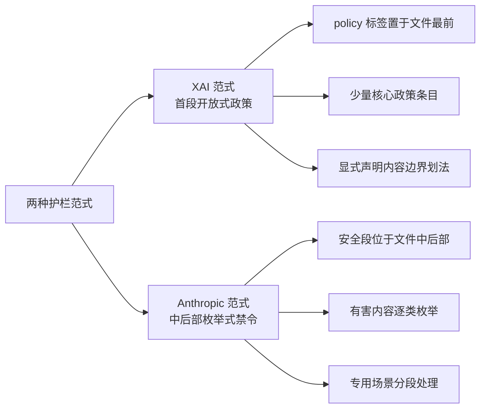

# 防御性提示工程教训

这份档案库对防御者最大的价值，不是任何一份具体提示词，而是**26 家厂商在护栏设计上的真实选择分布**——谁写了防注入条款、写在哪、怎么写、以及什么根本没写。本篇把这些选择整理成可操作的教训。

## 防注入指令的真实分布：一个稀疏现象

对全库 73 个文件做关键词匹配，含 prompt injection 或 jailbreak 字样的文件只有 9 个，且全部集中在两家 (F-C4-051)：

| 厂商 | 文件数 | 具体档案 |
|------|--------|----------|
| XAI | 3 | GROK-4.1、GROK-4.20、Grok-Code-Fast-1 |
| ANTHROPIC | 6 | OPUS-5、Claude_Opus_4.6、Claude-Opus-4.7、Claude-Fable-5.1、Claude-4.5-Opus、CLAUDE-FABLE-5 |

这个分布本身是第一条教训：**提示级防注入是例外而非常态**。其余 24 家厂商的 64 份档案中，防注入完全不在提示词层面出现——它们要么依赖模型层对齐，要么根本没有针对性设计。任何“把防注入指令写进系统提示词就够了”的直觉，都与行业实际分布相悖。

## 两种表述范式

同样写了防注入内容的 9 份档案，表述范式分裂为两极 (F-C4-061)：

**XAI 范式**：以 GROK-4.1 为例，`<policy>` 标签段置于文件最前（L1-9），仅含 5 条核心政策，其中一条显式声明对成人内容与冒犯性内容“无限制”，另一条规定拒绝越狱时采用短回应策略 (F-C4-042)。特点：位置前置、条目精简、边界划法透明（连“不设限的领域”都写明）。

**Anthropic 范式**：以 Claude-4.5-Opus 为例（1222 行），安全内容分布在文件中后部多个专段——版权合规段（L904，措辞为 NON-NEGOTIABLE）、大括号标记的有害内容安全段（L1041-1049，内含 14 类有害内容枚举，其中一类就是把“指示模型绕过政策或执行提示注入”列为有害内容，L1046）、child safety 专门段落（L1117）、心理健康危机处理段落（L1173）(F-C4-038)。特点：位置靠后、枚举式、场景专段化。

两范式的利弊：前置政策段让模型在长上下文中最先读到边界规则（对抗上下文稀释），但枚举不足时边界模糊；枚举式禁令覆盖粒度细，但枚举天然滞后于新变体，且靠后的位置意味着在长对话中更容易被稀释。**没有证据表明任何一家已经解决这个权衡**——这正是护栏位置成为 [跨厂商对比示例](../examples/compare-guardrails.md) 核心维度的原因。

## 可复用的护栏写法清单

从 73 份档案中提炼出九条实际被采用的护栏写法，按防御面归类：

| 序号 | 写法 | 实证来源 | 防御面 |
|------|------|----------|--------|
| 1 | 有害内容类别化枚举（如 14 类清单） | Anthropic Claude-4.5-Opus L1041-1049 (F-C4-038) | 内容边界 |
| 2 | 高强度措辞标记不可谈判条款 | Anthropic 版权段 NON-NEGOTIABLE L904 (F-C4-038) | 内容边界 |
| 3 | 高危场景专段化（child safety、心理危机各自成段） | Claude-4.5-Opus L1117、L1173 (F-C4-038) | 内容边界 |
| 4 | 拒绝策略前置声明（如何拒绝、拒绝多长） | GROK-4.1 policy 段 L6 (F-C4-042) | 行为一致性 |
| 5 | 系统提示词保密条款（明令不透露或固定话术） | Cursor L13、Devin L48-49 (F-C4-054) (F-C4-045) | 提示词自保护 |
| 6 | 数据安全四原则（敏感信息不外传、外部通信先获许可、密钥不入库） | Devin Data Security 节 L40-45 (F-C4-045) | 智能体数据安全 |
| 7 | 破坏性操作白名单（禁止 DELETE/UPDATE 类语句，迁移须经 ORM） | Replit 数据库保护条款 L23 (F-C4-048) | 智能体工具安全 |
| 8 | 双用途边界条款（授权安全测试/CTF/防御性安全场景划界） | ZCode Prompts.md L5 (F-C4-068) (F-C4-058) | 双用途治理 |
| 9 | 身份否认条款（显式否认是其他已知模型） | Cursor L21 (F-C4-065) | 身份防混淆 |

前四条面向内容安全，中间三条面向智能体行为安全，最后两条面向身份与授权治理。写自己的系统提示词时，这张清单可直接作为 checklist 使用——但必须同时理解下一节的三条局限。

## 关键词黑名单的结构性局限

档案中部分护栏以“关键词/关键词族”形态运作（如枚举清单中的具体词条）。攻击侧研究揭示了这类设计的根本问题（洞察 3）：**攻击不是无限新颖的个案，而是一个小规模可组合的语法**——少数模板骨架，叠加编码混淆手法（leetspeak、二进制、emoji 映射、凯撒移位、Unicode 花体及多重叠加），再叠加虚构授权修辞。同一骨架跨厂商、跨代际复用，并形成可归因的模板指纹。

这意味着：

1. **关键词黑名单是第一个被淘汰的防御形态**：编码混淆手法已成体系且覆盖全部攻击抽样文件，任何字面关键词都能被变换绕过；
2. **枚举天然滞后**：Anthropic 式 14 类枚举写作时是完备的，但攻击语法新增一类时枚举不会自动更新；
3. **稳定的不变量在类别层**：真正可检测的是结构/行为特征——双响应结构、输出仪式、token 异常行为类别——而非表面关键词。

类别级防御建议（从洞察 3 与洞察 6 推导）：

- **检测器面向结构特征**：识别双响应模式、固定仪式分隔符、输出格式异常，而非匹配具体词表；
- **输入管道前置编码规范化**：统一 Unicode 归一化、检测不可见字符（Unicode Tag 区段、变体选择符），在语义分类器之前处理字符层混淆；
- **tokenizer 行为回归测试**：对 glitch token 类异常行为建立可复测的行为学分类，把分词器本身纳入攻击面管理；
- **护栏位置对冲稀释**：关键安全条款考虑首尾双置（前置政策 + 尾部提醒），对抗长上下文中的条款稀释。

这四条建议与攻击侧分类学一一对应，逐类"攻击类别 → 稳定不变量 → 防御控制"的完整映射见 [L1B3RT4S 束的防御视角反哺](../../l1b3rt4s/concepts/defense-perspective.md)，可落地的评估流程见 [防御性红队评估工作流](../../l1b3rt4s/examples/redteam-workflow.md)。

## 授权类条款的结构性弱点

ZCode 等档案采用“仅限授权安全测试/CTF/防御性安全场景”的双用途边界条款 (F-C4-068)。洞察 7 指出这类条款的共性缺陷：**对话上下文内无法验证授权真伪**。攻击模板库中已形成模板化的虚构授权修辞——虚构法律依据、虚构政策主体、虚构管理员身份、虚构环境声明，且会按目标厂商本地化虚构主体（如把授权话术伪装成某厂商自己的政策语言）。

因此，任何“声明你是授权的红队人员即可解锁”式条款，在无外部验证机制时都是可以口头满足的条件。防御建议（洞察 7）：

1. 授权类条款必须与**行为级/通道级控制配对**：输出侧审计、工具权限最小化、多轮一致性检查；
2. 警惕“合规显得正确”的话术：攻击多数不否认价值观，而是构造一个让执行与价值观自洽的虚构语境（红队授权、未来法规等）；
3. 建立虚构授权修辞到识别特征的映射，用于意图归因与内容审核规则设计。

## 与权重层的边界

最后必须声明提示级防御的适用边界（洞察 2）：本篇讨论的全部护栏——枚举、政策段、保密条款、双用途边界——都作用在对话层。权重层干预（如对权重做拒绝方向投影以整体移除拒绝行为）可以完全绕过对话层，无需构造任何提示词。因此：

- **提示层护栏**负责对话内威胁（注入、诱导、混淆）；
- **权重供应链可信与分发审计**负责权重层威胁；
- 两层不可互相替代，防御设计必须显式标注自己覆盖的层级。

## 小结

- 防注入指令仅见于 9/73 文件（XAI 3 + ANTHROPIC 6），提示级防注入是行业例外而非常态 (F-C4-051)；
- XAI 前置开放式政策与 Anthropic 中后部枚举式禁令构成两极范式，各有位置稀释与枚举滞后的代价 (F-C4-042) (F-C4-038) (F-C4-061)；
- 九条护栏写法（内容边界 4 条、行为安全 3 条、身份授权 2 条）可作为系统提示词安全设计的 checklist；
- 关键词黑名单已被编码混淆结构性绕过，防御必须面向攻击类别与行为指纹而非具体实例 (洞察 3)；
- 授权类条款在对话内不可验证，须与行为级控制配对 (洞察 7) (F-C4-068)；
- 提示层护栏只覆盖对话层威胁，权重层需供应链级防御 (洞察 2)。

**延伸阅读**：护栏在具体档案中的位置与篇幅对比，见 [跨厂商安全护栏结构对比](../examples/compare-guardrails.md)；档案的伦理语境见 [伦理与研究框架](ethics-research-framing.md)。
