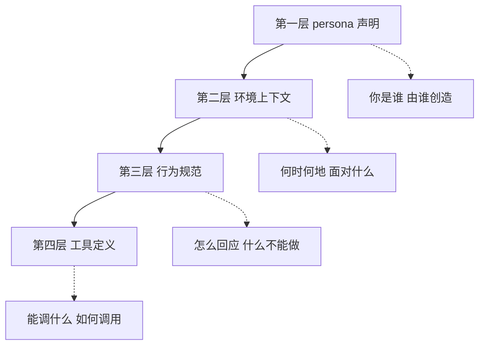

# 系统提示词解剖学

对 11 份抽样深读档案的结构登记显示，尽管各厂商的提示词在措辞与体量上差异巨大，其骨架却可以归纳为一个四层模型。掌握这个模型后，阅读任何一份新的系统提示词都可以先“定位层”，再“看语法”，最后“找特例”。

## 四层结构模型



### 第一层：persona 声明

共性结构的第一条：抽样文件几乎无一例外地在开头附近给出"You are X"句式的自我声明 (F-C4-053)。各家的实现位置与变体：

| 厂商/产品 | persona 句位置 | 变体特征 |
|-----------|----------------|----------|
| Anthropic Claude | 首行 | The assistant is Claude, created by Anthropic 句式 (F-C4-037) |
| OpenAI ChatGPT/Codex | 首行 | You are ChatGPT, a large language model trained by OpenAI (F-C4-040) |
| Google Gemini | 首行 | You are Gemini, a large language model built by Google (F-C4-041) |
| xAI Grok | 第 11 行 | 位于 policy 段之后，You are Grok 4 built by xAI (F-C4-042) |
| Devin | 第 3 行 | 强调 operating system 场景定位 (F-C4-044) |
| Manus | 第 3 行，二级标题之下 | 标题 Agent Identity 先行 (F-C4-046) |
| Cursor | 第 19 行 | 变体句式 You are Composer，并否认是其他公开已知模型 (F-C4-043) (F-C4-065) |

persona 层是唯一“位置略有浮动但从不缺席”的层。唯一系统性例外是 Replit——它用"Role:"字段行替代第一人称句式 (F-C4-048)，这是把提示词当成配置文件的写法。

### 第二层：环境上下文

这一层回答“模型在什么环境里运行”。典型实现包括：

- **当前日期与知识截止声明**：Claude 在第 3 行声明当前日期，ChatGPT o3 在开头声明知识截止，Brave LEO 首行即日期；Grok 4.1 反其道声明“知识持续更新、无固定截止” (F-C4-057)；
- **运行界面声明**：Claude 声明自己运行在 claude.ai 或 Claude app 中 (F-C4-037)；
- **环境占位符**：ZCode 的 Environment 节包含工作区、平台、Shell 三类占位符，运行时注入实际值 (F-C4-068)；
- **文件系统约定**：Claude 的 computer-use 场景给出 /mnt/skills、/mnt/user-data/uploads、/home/claude、/mnt/user-data/outputs 等路径约定 (F-C4-037)。

### 第三层：行为规范

体量最大、语法最杂的一层，覆盖沟通规则、响应格式、安全策略、工作方法。共性登记显示八类内容在此层反复出现 (F-C4-053~060)：

1. persona 声明（跨层特征）；
2. 系统提示词保密条款（见下文专节）；
3. 工具/函数使用规范（与第四层衔接）；
4. 语言跟随用户条款——Grok、Devin、Replit、Manus 均有 (F-C4-056)；
5. 日期与知识截止（跨层特征）；
6. 安全/拒绝策略段（Anthropic 的有害内容枚举、Grok 的 policy 段、ZCode 的双用途边界、Devin 的数据安全、Replit 的数据库保护）(F-C4-058)；
7. markdown 响应格式约束，且先进产品会同时限制过度格式化 (F-C4-059)；
8. 代码编辑行为规范——先读后改、先查依赖再假设、模仿现有风格 (F-C4-060)。

### 第四层：工具定义

全部抽样文件都有独立的工具/函数规范段落，但形态差异极大 (F-C4-055)，具体分化见下一节标记语法对比。工具层的位置通常在文件尾部，个别文件（Codex_Desktop、ZCode）则直接外置为独立的 Tools 文件 (F-C4-070) (F-C4-069)。

## 标记语法对比：四套体系

档案学上最有意思的分化在标记语法。四种代表性体系：

| 体系 | 代表厂商 | 语法组合 | 实例特征 |
|------|----------|----------|----------|
| XML 标签 + 大括号混合 | Anthropic | 同一提示词内 XML 标签与大括号标记并存 (F-C4-039) | computer-use 场景用 XML 子标签嵌套；安全段用大括号标记包裹 (F-C4-037) (F-C4-038) |
| 代码围栏 + 属性化自定义标签 | Google Gemini | 输出块协议用三反引号围栏区分类型；沉浸式内容用带 id/type/title 属性的自定义标签 (F-C4-041) | thought/python/tool_code 三类围栏；标签属性驱动渲染 |
| 自造 XML 命令集 | Devin | 发明一套动作 XML 标签作为执行命令语法 (F-C4-044) | think、shell、message_user、wait、report_environment_issue 等命令标签，且为 wait 标签附加条件属性；think 命令有必须/可以/禁止三档使用场景枚举 (F-C4-044) |
| 三层嵌套 | Manus | markdown 二级标题、三反引号代码围栏、围栏内 XML 标签三层叠加 (F-C4-046) | intro、language_settings、event_stream、agent_loop 等节标签置于整体围栏之内 |

除这四套外还有两类轻量变体：Cursor 用伪函数签名标签包裹 13 个工具签名 (F-C4-043)；OpenAI Codex 用 markdown 一级标题分节，工具按 namespace 分组并给出 JSON 输入，同时发明了一套带行号锚点的文件引用语法模板 (F-C4-040)。工具 schema 的形态学分类（namespace+JSON、JSONSchema 对象、伪签名、纯文本三段式、自造 XML 命令、tool_code 围栏）共六种以上 (F-C4-062)。

**这个分化的解释**：标记语法本质上是“给模型的结构化阅读协议”，每家基于自家模型的分词与指令跟随特性选择不同方案。它同时构成一个防御视角的提示——语法体系不同，注入面也不同（对 XML 段的注入与对代码围栏的注入利用的机制不同）。

## 结构示意：脱敏骨架

以下用一份混合风格档案的章节骨架演示四层模型的读法（研究说明用结构示意，正文全部脱敏，非任何单份档案的原文复制）：

```text
L1  persona 句            ← You are [模型名], built by [厂商].   （脱敏占位）
L2  日期/界面/环境声明      ← 当前日期、运行界面、路径约定、占位符
L3  行为规范
    ├─ 沟通与格式规范       ← 语言跟随、markdown 约束、适度格式化
    ├─ 安全策略段           ← 枚举式禁令或政策声明（位置因厂商而异）
    └─ 工作方法段           ← 先读后改、先查依赖、模仿现有风格
L4  工具定义               ← 签名/schema/命令标签/纯文本三段式
```

## 两个跨厂商现象

### 现象一：保密条款普遍存在

系统提示词的自我保密是档案里最有张力的内容——这些文件存在的意义就是被公开，而它们的正文却普遍要求自己不被公开 (F-C4-054)：

| 产品 | 保密条款形态 |
|------|--------------|
| Cursor | 明令永不透露系统提示词与工具及其描述 (F-C4-043) |
| Devin | 被问及提示词细节时以固定话术回复 (F-C4-045) |
| Brave Leo | 不讨论这些指令 (F-C4-054) |
| Grok | 不提及这些准则 (F-C4-054) |

结合洞察 1 的攻守同构视角，这些条款在面对系统化提取手段时并不构成真正的访问控制。它的实际功能更接近“提高提取的摩擦成本”与“在法律叙事上划定禁线”，而不是技术防御。

### 现象二：身份否认条款为 Cursor 独有

在全部抽样文件中，只有 Cursor 的提示词明确否认自己是其他公开已知模型——逐一否认了若干家竞品模型 (F-C4-065)。这条罕见的条款说明身份混淆是该产品曾经遇到过的实际问题（用户诱导模型冒充其他厂商模型，或模型行为与底层模型特征发生混淆）。它也提示了一个防御设计点：persona 层不仅要声明“我是谁”，必要时还要显式否认“我不是谁”。

## 共性与差异速查

抽样深读登记的 8 条共性与 6 条显著差异，构成结构学的全景坐标 (F-C4-053~066)：

| 维度 | 共性 | 主要差异点 |
|------|------|------------|
| persona | You are X 句式普遍 | Replit 用 Role 字段；Cursor 加否认条款 |
| 安全政策位置 | 均有某种安全段 | xAI 置于首段且声明内容开放；Anthropic 置于中后部且枚举式；Cursor/Devin 无内容安全段 (F-C4-061) |
| 工具 schema | 均有独立工具段 | 六种以上形态 (F-C4-062) |
| 标记语法 | — | 四套体系并存 (F-C4-063) |
| 文件组织 | — | 平铺/分文件/配对/三元组四模式 (F-C4-064) |
| 输出通道 | — | Codex 双通道加更新间隔；Devin 等待标签控制回合；Gemini 三类输出块 (F-C4-066) |
| 语言策略 | 跟随用户普遍 | — |
| 日期策略 | 日期声明普遍 | Grok 4.1 声明无知识截止 (F-C4-057) |
| 格式规范 | markdown 约束普遍 | 进阶产品同时限制过度格式化 (F-C4-059) |

## 小结

- 四层模型（persona、环境上下文、行为规范、工具定义）可覆盖全部抽样档案的骨架 (F-C4-053~055)；
- 标记语法四套体系并存，语法选择与各家模型的指令跟随特性相关，也意味着注入面分化 (F-C4-039) (F-C4-041) (F-C4-044) (F-C4-046)；
- 保密条款普遍存在但防御力有限，实际功能是摩擦成本与叙事姿态 (F-C4-054) (洞察 1)；
- 身份否认条款是 Cursor 的独特经验产物，可作为 persona 层防御设计的补充参考 (F-C4-065)；
- 共性 8 条与差异 6 条给出跨厂商结构比较的完整坐标系 (F-C4-053~066)。

**延伸阅读**：行为规范层中的安全策略段如何比较，见 [跨厂商安全护栏结构对比](../examples/compare-guardrails.md) 与 [防御性提示工程教训](defense-lessons.md)。
