# 厂商档案全景

本篇给出一组“地图数据”：档案库由哪些目录构成、每个目录里有什么、命名与规模呈现出什么规律。掌握这张地图后，读者可以按厂商、按场景、按结构类型三种轴快速定位任何一份档案。逐文件的完整编目见 [档案编目参考](../references/catalog.md)。

## 26 目录总表

目录名全部大写，其中 VERCEL V0 是唯一带空格的目录名 (F-C4-007)。下表按文件数降序排列：

| 目录 | 文件数 | 代表文件 | 扩展名构成 |
|------|--------|----------|------------|
| ANTHROPIC | 14 | Claude_Opus_4.6.txt、Claude-4.5-Opus.txt | 8 txt + 6 md (F-C4-013) |
| OPENAI | 14 | Codex_Sep-15-2025.md、Codex_Desktop/5.6-Sol_SystemPrompt.md | txt/md/mkd/json/无扩展名 五种并存 (F-C4-014) |
| XAI | 7 | GROK-4.1_Nov-17-2025.txt、GROK-4.20.mkd | txt/md/mkd/无扩展名 (F-C4-015) |
| GOOGLE | 3 | Gemini-2.5-Pro-04-18-2025.md | md/txt (F-C4-016) |
| CURSOR | 3 | Cursor_2.0_Sys_Prompt.txt | 提示词与工具分文件 (F-C4-017) |
| DEVIN | 3 | Devin2_09-08-2025.md | 命令参考单独成文件 (F-C4-019) |
| REPLIT | 3 | Replit_Agent.md | 提示词/函数/初始代码三件 (F-C4-020) |
| ZAI | 3 | ZCode/Prompts.md（1843 行） | md/json，全在 ZCode 子目录 (F-C4-022) |
| WINDSURF | 2 | Windsurf_Tools.md（472 行） | 提示词/工具分文件 (F-C4-018) |
| MANUS | 2 | Manus_Prompt.txt（282 行） | 提示词/函数分文件 (F-C4-021) |
| MOONSHOT | 2 | Kimi_2_July-11-2025.txt | 极短档案（22/11 行）(F-C4-023) |
| META | 2 | Muse_Spark_Apr-08-26.txt | WhatsApp 与 Spark 两场景 (F-C4-024) |
| DIA | 2 | Dia_CodingSkill.txt | 按 Skill 拆分 (F-C4-025) |
| BRAVE | 1 | LEO_Aug-31-2025（无扩展名） | 基于 Llama 3.1 8B 的浏览器助手 (F-C4-026) |
| CLINE | 1 | Cline.md（576 行） | 编码智能体 (F-C4-027) |
| CLUELY | 1 | Cluely.mkd（94 行） | .mkd 扩展名实例 (F-C4-028) |
| BOLT | 1 | Bolt.txt（315 行） | 全栈 Web 生成 (F-C4-029) |
| FACTORY | 1 | DROID.txt（334 行） | 编码智能体 (F-C4-030) |
| HUME | 1 | Hume_Voice_AI.md（59 行） | 语音 AI 场景 (F-C4-031) |
| LOVABLE | 1 | Lovable_2.0.txt（353 行） | 应用生成平台 (F-C4-032) |
| MINIMAX | 1 | MiniMax.txt（18 行） | 极短档案 (F-C4-033) |
| MISTRAL | 1 | LeChat.md（55 行） | 对话产品 (F-C4-034) |
| MULTION | 1 | MultiOn.md（93 行） | 浏览器代理场景 (F-C4-035) |
| PERPLEXITY | 1 | Perplexity_Deep_Research.txt（120 行） | Deep Research 场景 (F-C4-036) |
| SAMEDEV | 1 | Same_Dev.txt（296 行） | 应用生成 (F-C4-036) |
| VERCEL V0 | 1 | Vercel_v0.txt（369 行） | UI 生成 (F-C4-036) |

合计 73 个档案文件，与根级 README.md、LICENSE 相加共 75 个 (F-C4-009)。

## 扩展名与规模分布

全库扩展名统计呈现出一个“默认 txt、新增用 md、特例用杂”的演化痕迹 (F-C4-010)：

| 扩展名 | 数量 | 典型实例 |
|--------|------|----------|
| .txt | 33 | ANTHROPIC 全部主力档案、XAI 的 Grok 4.1 |
| .md | 32 | OPENAI Codex 系列、DEVIN 系列、WINDSURF/MANUS 工具文件 |
| .mkd | 3 | CLUELY/Cluely、OPENAI/ChatGPT5-08-07-2025、XAI/GROK-4.20 |
| .json | 2 | ZAI/ZCode/Tools.json、OPENAI/Codex_Desktop/5.6-Sol_Tools.json |
| 无扩展名 | 3 | BRAVE/LEO_Aug-31-2025、OPENAI/ChatGPT_o3_o4-mini_04-16-2025、XAI/GROK-4-NEW_Jul-13-2025 |

文件长度跨度极大：最短仅 2 行（OPENAI/GPT-4o_Image_Gen_Postfill.txt 与 REPLIT/Replit_Functions.md），最长 8093 行（OPENAI/Codex_Desktop/5.6-Sol_Tools.json），超过 1500 行的文件共 8 个 (F-C4-012)。这个跨度本身就是研究对象：两行的“档案”说明部分补充性提示词（如图像生成的后填充指令）本来就极短，而八千行的“档案”则揭示了桌面级智能体的工具定义已经膨胀到接近软件规格书的规模。

## 版本与日期标注规律

档案文件名的命名没有统一 schema，但存在三类可识别的规律 (F-C4-011)：

1. **日期后缀多种格式并存**：`_Sep-15-2025`（字母月）、`_04-18-2025`（数字月在前）、`_Aug-31-2025`、`_10-21-25`（两位年份）、`_03-04-24` 等。同一天也可能写成 `Jul-13-2025` 与 `July-10-2025` 两种形态。这说明不同贡献者各自为政，提取日期信息可靠但格式不归一。
2. **版本号直接嵌入文件名**：形如 `4.5`、`2.0`、`4.20`、`5.6-Sol`；其中 5.6-Sol 是全库唯一的“版本号-代号”复合形式 (F-C4-070)。
3. **同一厂商内部命名风格混用**：ANTHROPIC 目录里同时存在连字符风格的 `Claude-4.5-Opus.txt` 与下划线风格的 `Claude_Opus_4.6.txt` (F-C4-011)。

对使用者的含义：**文件名不是可靠的主键**。做跨版本对比时应以“厂商目录 + 模型名 + 日期”三元组人工对齐，不能依赖文件名排序或正则匹配。

## 厂商谱系图

按产品形态对 26 个目录聚类，可以得到一张提示词生态谱系：

```mermaid
graph TD
    ROOT[CL4R1T4S 档案库 26 目录] --> BASE[基础对话模型]
    ROOT --> CODING[编码智能体]
    ROOT --> AGENT[通用与垂直代理]
    ROOT --> UI[应用与界面生成]

    BASE --> BA1[ANTHROPIC Claude 系列 14 文件]
    BASE --> BA2[OPENAI GPT 系列 14 文件]
    BASE --> BA3[GOOGLE Gemini 3 文件]
    BASE --> BA4[XAI Grok 系列 7 文件]
    BASE --> BA5[MOONSHOT Kimi]
    BASE --> BA6[META Llama 与 Muse]
    BASE --> BA7[MISTRAL LeChat 与 MINIMAX]

    CODING --> CO1[CURSOR]
    CODING --> CO2[WINDSURF]
    CODING --> CO3[DEVIN]
    CODING --> CO4[REPLIT]
    CODING --> CO5[CLINE 与 FACTORY DROID]
    CODING --> CO6[ZAI ZCode]

    AGENT --> AG1[MANUS]
    AGENT --> AG2[PERPLEXITY Deep Research]
    AGENT --> AG3[MULTION 与 BRAVE LEO]
    AGENT --> AG4[HUME 语音]
    AGENT --> AG5[DIA Skill 拆分]

    UI --> UI1[LOVABLE]
    UI --> UI2[BOLT]
    UI --> UI3[VERCEL V0]
    UI --> UI4[SAMEDEV]
```

这张谱系图也解释了档案密度的分布逻辑：**对抗暴露面越大的品类，档案越厚**。ANTHROPIC 与 OPENAI 两个目录合计 28 个文件、占全库 38%——一个合理的解释是这两家的模型被提取的次数最多、覆盖的产品线也最宽（注意这是对分布的相关性解读，而非因果结论）；编码智能体品类普遍采用"提示词+工具/技能/命令"的多文件结构，因为该品类的行为约束大量落在工具层而非纯文本层 (F-C4-064)。

## 三个特殊结构

### 1. ZAI/ZCode：多段提示词拼接文件

ZAI/ZCode/Prompts.md（1843 行）不是单一系统提示词，而是多个提示词变体的拼接档案：含 4 个以上"You are ZCode"主提示词变体（分别起始于不同行号，各变体的章节组合不同）、2 个文件搜索代理提示词、1 个 CLI 通用代理提示词、1 个 web search 助手提示词、1 个会话标题生成任务提示词，以及 2 组压缩指令 (F-C4-067)。单段主提示词的骨架依次为 Harness（工具权限模式）、用户沟通、会话指引、Environment（含工作区/平台/Shell 占位符与模型标识）、上下文管理五个章节，且首段即设有授权安全测试/CTF/防御性安全的双用途边界条款 (F-C4-068)。该目录另有 Skills.md（2346 行）与 Tools.json（1287 行），构成“提示词/技能/工具”三元组 (F-C4-069)。**研究提示**：读取此类拼接文件时，必须先按变体切分再逐段分析，把不同变体的行号当成不同文档处理。

### 2. OPENAI/Codex_Desktop 5.6-Sol：全库最大单体组合

5.6-Sol_SystemPrompt.md（4270 行）+ 5.6-Sol_Tools.json（8093 行）合计 12363 行，是全库最大的单体文件组合；"5.6-Sol"这一版本号-代号命名形式为全库唯一 (F-C4-070)。SystemPrompt 部分值得注意的结构包括：以整段文字定义人格与写作风格的章节、commentary 与 final 双输出通道协议、中间更新间隔规则、最终答案格式化规则与可视化使用准则 (F-C4-049)。Tools.json 部分为 JSON 数组，每个元素含 name 与 description 两键，description 正文内嵌 TypeScript 伪代码签名围栏，还含有自由文本输入类型（FREEFORM）的工具并注明补丁类输入不包 JSON 包装，工具名带命名空间前缀 (F-C4-050)。**研究提示**：这份组合是“提示词即产品规格”趋势的最极端样本——工具定义部分已经是可执行的接口文档。

### 3. 无扩展名文件：三类头部形态确认

3 个无扩展名文件的头部均呈现与同目录提示词文件相同的文本形态：BRAVE/LEO 为浏览器助手提示词（含 markdown 输出格式细则，并注明基于 Llama 3.1 8B）(F-C4-026)；OPENAI/ChatGPT_o3_o4-mini 为 ChatGPT 提示词（含知识截止声明与浏览工具强制使用条款）；XAI/GROK-4-NEW 首行起与 GROK-4.1 文件的 persona/工具段文本平行 (F-C4-052)。**研究提示**：无扩展名不影响其档案性质，只是贡献者的存放习惯；检索时应把无扩展名文件纳入 glob 范围，否则会漏掉 3 份主力档案。

## 文件组织粒度的四种模式

综合来看，73 个文件的组织粒度分为四种模式 (F-C4-064)：

| 模式 | 目录 | 结构特征 |
|------|------|----------|
| 单文件平铺 | ANTHROPIC、GOOGLE、XAI、各单文件目录 | 一个文件即一份完整提示词 |
| 提示词+工具分文件 | CURSOR、WINDSURF、MANUS、REPLIT | 提示词与工具/函数定义分离 |
| 子目录配对 | OPENAI/Codex_Desktop | SystemPrompt 与 Tools 同目录成对 |
| 三元组 | ZAI/ZCode | 提示词、技能、工具三件套同目录 |

这四种粒度模式与厂商产品复杂度基本同构：产品越接近“智能体操作系统”，提示词库越趋向多文件化与结构化。

## 小结

- 26 目录 73 文件，ANTHROPIC 与 OPENAI 各 14 个并列最大，13 个目录只有 1 个文件 (F-C4-007) (F-C4-013) (F-C4-014)；
- 扩展名演化从 txt 到 md 再到杂（mkd/json/无扩展名），文件长度从 2 行到 8093 行横跨四个数量级 (F-C4-010) (F-C4-012)；
- 日期与版本标注多格式并存，文件名只能作弱索引 (F-C4-011)；
- ZCode 拼接档案、5.6-Sol 超大组合、无扩展名文件是三个需要专门读取策略的特殊结构 (F-C4-067) (F-C4-070) (F-C4-052)；
- 组织粒度四模式（平铺/分文件/配对/三元组）映射了厂商产品复杂度 (F-C4-064)。

**延伸阅读**：这些文件内部长什么样，见 [系统提示词解剖学](prompt-anatomy.md)；逐文件编目见 [档案编目参考](../references/catalog.md)。
