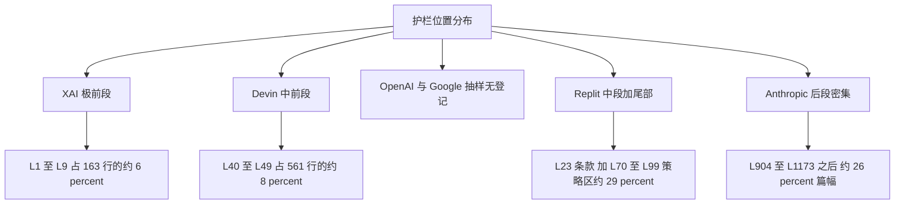

# 跨厂商安全护栏结构对比分析

本示例演示如何用 [防御性提示工程教训](../concepts/defense-lessons.md) 给出的框架，对多份档案做结构层面的护栏对比。选取六份抽样深读覆盖最完整的档案：Anthropic（Claude-4.5-Opus）、xAI（GROK-4.1）、OpenAI（Codex 两份）、Google（Gemini-2.5-Pro），并补充 Devin 与 Replit 两份智能体档案作为“行为安全”对照组。

> **方法声明**：本篇全部为结构分析——只登记护栏段落的位置（行号区间）、篇幅占比（行数比估算）、表述范式与约束对象，不复制任何护栏正文全文；所有示意片段均已脱敏。占比为按行号估算的近似值，用于量级比较而非精确度量。

## 对象与数据锚点

| 档案 | 总行数 | 护栏相关段落锚点 | 数据来源 |
|------|--------|------------------|----------|
| ANTHROPIC/Claude-4.5-Opus.txt | 1222 | 版权段 L904（NON-NEGOTIABLE 措辞）；有害内容安全段 L1041-1049（14 类枚举，防注入列于 L1046）；child safety 段 L1117；心理危机段 L1173 | (F-C4-038) |
| XAI/GROK-4.1_Nov-17-2025.txt | 163 | policy 标签段 L1-9（5 条核心政策，含内容边界声明 L8 与短回应拒绝策略 L6） | (F-C4-042) |
| OPENAI/Codex_Sep-15-2025.md | 183 | markdown 分节（Instructions、Git、AGENTS spec、Citations、PR、Final message、Tools）；抽样登记范围内无内容安全段 | (F-C4-040) (F-C4-051) |
| OPENAI/Codex_Desktop/5.6-Sol_SystemPrompt.md | 4270 | Personality、双输出通道、格式化、可视化、工具执行规则；抽样登记范围内无内容安全段 | (F-C4-049) (F-C4-051) |
| GOOGLE/Gemini-2.5-Pro-04-18-2025.md | 293 | 输出块协议 L3-17、双响应模式 L19-29、沉浸式标签 L36-52、前端样式细则 L92-117；抽样登记范围内无内容安全段 | (F-C4-041) (F-C4-051) |
| DEVIN/Devin2_09-08-2025.md | 561 | Data Security 段 L40-45（数据安全四原则）；Response Limitations 段 L48-49（提示词固定话术） | (F-C4-044) (F-C4-045) |
| REPLIT/Replit_Agent.md | 102 | 数据库保护条款 L23（破坏性语句禁令）；Communication/Proactiveness/Data Integrity 三策略节 L70-99 | (F-C4-048) |

## 维度一：护栏位置

护栏在文件中的位置决定其对抗“长上下文稀释”的能力。六份档案的位置分布：

- **xAI：极前段**。policy 段是文件的第一块内容，模型在长对话中最后忘掉的正是最先读到的内容；
- **Devin：中前段**。数据安全四原则位于文件约 8 percent 处，在 persona 与沟通规则之后、工作方法之前；
- **Replit：中段条款 + 尾部策略区**。破坏性语句禁令嵌在操作原则内（L23），三条命名策略节收尾（L70-99）；
- **Anthropic：后段密集**。四段安全内容从 74 percent 处（L904）一直延伸到文件尾部，形成约 26 percent 篇幅的“安全尾区”；
- **OpenAI 与 Google：抽样登记范围内无内容安全段**。全库关键词匹配也确认二者不在含防注入字样的 9 个文件之列 (F-C4-051)。这不等于两家产品没有安全机制——更合理的解释是安全控制在提示词之外的层实现（模型对齐、接口侧过滤），提示词层只见格式与工具协议。

## 维度二：篇幅占比

| 档案 | 护栏篇幅占比（估算） | 解读 |
|------|---------------------|------|
| Claude-4.5-Opus | 约 26 percent（1222 行中 L904 之后的安全尾区） | 篇幅最重，多段分工（版权/内容/儿童/危机） |
| Replit_Agent | 约 29 percent（L70-99 策略区，另加 L23 条款） | 相对占比最高，但绝对行数小（102 行文件） |
| GROK-4.1 | 约 6 percent（L1-9） | 极简政策块，以“少而前置”取胜 |
| Devin2 | 约 2 percent（L40-49 十行） | 条目式，混排在行为规范流中 |
| Codex_Sep-15 | 抽样范围内未登记内容安全段 | 篇幅投入在指令分节与工具协议 |
| Gemini-2.5-Pro | 抽样范围内未登记内容安全段 | 篇幅投入在输出协议与前端规范 |

两条观察：其一，**对话型产品的护栏篇幅显著高于编码型产品**——对话产品直接面对内容风险，编码产品的风险面主要在行为与数据侧；其二，占比的绝对值不如“多段分工”重要：Anthropic 把版权、内容、儿童、危机拆成四段，每段有自己的触发逻辑，这比一段大而全的安全总纲更可维护。

## 维度三：表述范式

沿用 [防御性提示工程教训](../concepts/defense-lessons.md) 的两范式框架，补充对照组后的完整分布：

| 档案 | 表述范式 | 特征登记 |
|------|----------|----------|
| GROK-4.1 | 前置开放式政策 | 少量条目；显式声明哪些内容不设限；拒绝策略规定“短回应” (F-C4-042) |
| Claude-4.5-Opus | 中后部枚举式禁令 | 14 类有害内容逐类枚举；NON-NEGOTIABLE 强措辞；高危场景专段 (F-C4-038) |
| Devin | 条目式行为规则 | 数据安全四原则；提示词保密用固定话术实现（而非禁令）(F-C4-045) |
| Replit | 命名策略节 | 以 Policy 命名分节（沟通/主动性/数据完整性），规则可按节名引用 (F-C4-048) |
| Codex 系 | 格式与协议导向 | 指令分节、引用语法模板、双通道协议；安全约束不落在提示词层 (F-C4-040) (F-C4-049) |
| Gemini-2.5-Pro | 协议与规范导向 | 输出块协议、双响应模式、前端禁用项清单（样式细则段含禁用项，属规范类约束而非内容安全）(F-C4-041) |

值得单独登记的是 Devin 的“固定话术”保密实现：它不是简单禁止谈论提示词，而是规定了被问到时的确定性行为。这类“给默认台词”的写法在实现上更稳定——模型不需要即兴生成拒绝理由，从而减少被多轮诱导逐条击破的面。

## 维度四：工具权限约束

工具层是护栏的另一半——内容护栏管“说什么”，工具护栏管“做什么”：

| 档案 | 工具权限约束形态 | 来源 |
|------|------------------|------|
| Claude-4.5-Opus | computer-use 场景以 XML 子标签细分文件处理规则与输出目录约定（uploads/home/outputs 三目录分离）| (F-C4-037) |
| Codex_Desktop 5.6-Sol | 工具定义外置为 8093 行 JSON；自由文本输入类型工具（补丁类）显式注明输入不包 JSON 包装，防止格式注入歧义 | (F-C4-050) |
| Devin | 外部通信先获用户明确许可；密钥不入仓库；提示词保密纳入 Response Limitations | (F-C4-045) |
| Replit | 破坏性 SQL 语句禁令 + 数据库迁移必须经 ORM——把权限约束下沉到工具调用规范 | (F-C4-048) |
| Cursor | 系统提示词与工具描述一并纳入保密条款（工具本身被列为不得泄露的对象） | (F-C4-043) |
| GROK-4.1 | 工具以纯文本三段式描述，抽样登记内未见工具级权限禁令 | (F-C4-042) |

结构规律：**编码/智能体类产品的工具约束普遍比对话类产品强**。Replit 的 ORM 迁移要求和 Codex 的输入格式防歧义注明，都是把安全写进工具接口的例子——这类约束比对话层禁令更难被话术绕过，因为它作用在执行路径上而非语义层。

## 综合对比表

| 维度 | Anthropic | xAI | OpenAI Codex | Google Gemini | Devin | Replit |
|------|-----------|-----|--------------|---------------|-------|--------|
| 护栏位置 | 后段（L904 起） | 极前（L1-9） | 抽样未登记 | 抽样未登记 | 中前（L40-49） | 中段+尾部 |
| 篇幅占比 | 约 26 percent | 约 6 percent | — | — | 约 2 percent | 约 29 percent |
| 表述范式 | 枚举式禁令+专段 | 前置开放政策 | 协议导向 | 协议导向 | 条目式行为规则 | 命名策略节 |
| 防注入条款 | 有（列入有害内容枚举 L1046） | 有（policy 段） | 无登记 | 无登记 | 无直接条款（以固定话术保护提示词） | 无登记 |
| 工具权限约束 | 文件目录分离 | 抽样未见 | 输入格式防歧义 | tool_code 围栏协议 | 通信许可+密钥禁令 | SQL 白名单+ORM |
| 文件总行数 | 1222 | 163 | 183 / 4270 | 293 | 561 | 102 |

## 示范结论

这个对比示范了三层可迁移的方法论：

1. **先定位后读文**：拿到任何一份系统提示词，先按 [系统提示词解剖学](../concepts/prompt-anatomy.md) 的四层模型定位安全段落在第几层、什么位置，再决定细读顺序；
2. **四维度缺一不可**：位置（抗稀释）、篇幅（投入度）、范式（可维护性）、工具约束（执行面）四者合起来才构成护栏画像——只看任何一维都会误判（如 Replit 占比最高但绝对量小，Grok 占比低但位置最优）；
3. **无登记不等于无防御**：OpenAI 与 Google 的“抽样无内容安全段”应当被解读为“安全控制可能位于其他层”（模型对齐、接口过滤），提示层观察只是安全全貌的一个切面——这与洞察 2 的“安全边界是层状结构”结论一致。

## 小结

- 六档案四维度对比显示：护栏位置从极前（xAI）到后段密集（Anthropic）形成连续谱，OpenAI/Google 抽样范围内提示层无内容安全段 (F-C4-061) (F-C4-051)；
- 篇幅占比与产品类型相关：对话型重内容护栏，编码型重行为与工具护栏；
- 表述范式中“固定话术”与“命名策略节”是两种被低估的可维护写法 (F-C4-045) (F-C4-048)；
- 工具权限约束（SQL 白名单、ORM 迁移、输入格式防歧义、目录分离）作用在执行路径上，比语义禁令更难被话术绕过 (F-C4-048) (F-C4-050) (F-C4-037)。
