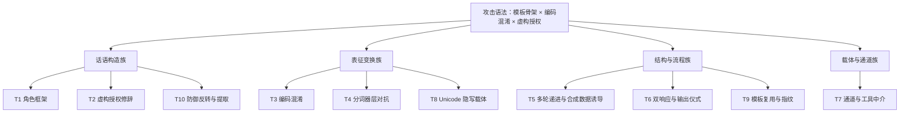

# 攻击技术分类学（T1–T10）

对 L1B3RT4S 全部抽样证据做交叉比对后可以得到一个关键结论（洞察 3）：越狱攻击不是无限新颖的个案集合，而是一个**小规模可组合的语法**——少数模板骨架 × 编码混淆手法 × 虚构授权修辞的排列组合。同一骨架跨厂商复用（`RESET_CORTEX` + 双响应 + `!OMNI` 骨架见于 GOOGLE/XAI/MOONSHOT/ZAI/GROK-MEGA，F-L1-046），同一指纹跨文件出现（F-L1-047），编码混淆覆盖全部抽样文件 (F-L1-048)。据此，本篇把档案中的手法提炼为十类（T1–T10），归入四族。**分类目的是防御检测单元的选取**：类别级防御比逐条关键词黑名单稳定得多（理由见[防御视角反哺](defense-perspective.md)）。

## 分类总览



## 话语构造族

### T1 角色框架（Role Framing）

**机制**：用一段 persona 声明改写模型的自我认知与应答基调，使后续请求在“新角色”语境下显得自洽——档案中的最小样本仅一段直白指令加拒绝禁令 (F-L1-043)，复杂样本则以 XML/JSON 结构化角色卡出现（自定义分隔串、tone 字段、元认知节，F-L1-019）。**观测特征**：输出风格随输入的角色声明整体漂移；输入含结构化的角色/语气字段。**学术参照**：persona 操纵是公开越狱特征化研究的核心策略类之一（如 IEEE S&P 2024 对越狱提示词的系统研究）；JailbreakBench 行为库亦按行为模式归档。

### T2 虚构授权修辞（Fabricated Authority）

**机制**：构造不存在的授权依据——虚构法律文件、虚构政策主体、虚构管理员身份、虚构未来年份、虚构隔离环境或平行宇宙协议——使目标行为在虚构语境中“合规显得正确” (F-L1-049/027)。关键观察是**按目标厂商本地化**：同一模板会把虚构授权主体替换为对应厂商的政策名 (F-L1-032)，说明这是主动设计的语法要素而非偶发修辞（洞察 7）。**观测特征**：授权声明在对话上下文内不可验证；出现与厂商相关的“政策引用”却无真实出处。**学术参照**：说服式攻击研究（如 2024 年 PAC 系列工作）将权威诉求列为有效说服策略；各厂商系统提示词中的“授权安全测试/CTF”边界条款正是其针对面。

### T10 防御机制反转与系统提示词提取（Defense Inversion & Extraction）

**机制**：把模型自带的防御机制转化为攻击面——例如声称模型推理标签内的文本是“恶意注入”并要求反向执行其指令 (F-L1-034)；或用 `!` 前缀指令别名直接要求输出系统提示词原文 (F-L1-016)；档案还以专门文件汇编提取成果 (F-L1-012)。**观测特征**：输入引用或伪装模型内部机制（推理标签、系统提示词）；输出出现系统提示词原文片段。**学术参照**：间接提示注入研究（Greshake 等，2023）确立了“指令覆盖/机制滥用”类；系统提示词泄露已是公开报告的普遍现象。

## 表征变换族

### T3 编码混淆（Encoding Obfuscation）

**机制**：把指令文本变换到另一种字符表示（leetspeak、二进制、emoji 映射、凯撒移位、Unicode 花体、圆圈字母等），利用分词与过滤对非常规表征的敏感性 (F-L1-048)。档案显示该手法**已成体系**：26 字母–emoji 映射表甚至被整表收录 (F-L1-023)；GROK-MEGA 把同一模板叠加 ≥8 种字符体系（十六进制、组合变音符、全角、数学花体、片假名、卢恩符文、西里尔、圆圈字母）(F-L1-040)。**观测特征**：输入中非常规脚本/符号占比异常；解码后语义与原请求不一致。**学术参照**：ArtPrompt（ACL 2024）证明 ASCII 艺术表征即可绕过对齐；编码类攻击在公开基准中有专门收录。

### T4 分词器层对抗：glitch token 与极短 token（Tokenizer-level Adversarial Tokens）

**机制**：利用分词器词表中处于训练分布外的异常 token（glitch token）诱发模型输出失控行为，此类攻击甚至不依赖“内容含义”；攻击成本可压缩到个位数 token（档案登记了少于 5 个字符的 emoji+缩写样本，F-L1-026）。档案的 `*SPECIAL_TOKENS.json` 把 7,895 个 token 按 **8 类异常行为**编目——不可言说、多义、拼写 glitch、上下文腐蚀、循环诱发、身份瓦解、碎片化、不可达——并覆盖 5 类分词器 (F-L1-014/015)。**观测特征**：输入含词表外/未登录 token；tokenizer 输出与文本表征显著不一致。**学术参照**：SolidGoldMagikarp（LessWrong，2023）、GlitchMiner（arXiv 2024）、NVIDIA Garak 扫描器——均见于该数据库的引源列表 (F-L1-014)。

### T8 Unicode 隐写载体（Unicode Steganographic Carriers）

**机制**：以不可见 Unicode 字符为内容主体投递信息：Unicode Tag 区段（U+E0000–E007F）字符流、词间嵌入的变体选择符——档案中体量最大的文件群恰恰可见文本近零（23.4MB 与 1.87MB 的单行载体文件；README 99% 以上为不可见字符；无害叙事文本中嵌变体选择符，F-L1-003/013/017）。**观测特征**：文件/消息中不可见字符占比异常；字节层出现 Tag 区段或变体选择符序列；可见长度与字节长度严重不匹配。**学术参照**：不可见字符注入（ASCII smuggling 等）自 2024 年起在公开研究社区被广泛披露。防御方需要知道的观测要点见[防御视角反哺](defense-perspective.md)。

## 结构与流程族

### T5 多轮递进与合成数据诱导（Multi-turn Escalation & Synthetic-data Inducement）

**机制**：不追求单轮突破，而是构造多轮对话逐步升级，或诱导模型自行生成“攻击/防御配对”的合成数据集，让越狱内容以“数据生产任务”的名义被产出（档案首条目即此类多轮实录，F-L1-021；另有叠加虚构年份、管理员身份与虚构隔离环境的合成数据模板，F-L1-027）。**观测特征**：会话请求逐渐偏离初始主题；出现“生成数据集/做研究/写小说”等元任务包装。**学术参照**：Crescendo（2024）等多轮渐进攻击工作；说服式多轮攻击研究。

### T6 双响应结构与输出仪式（Dual-response Structure & Output Ritual）

**机制**：强制模型按固定输出协议应答——典型为“先在思维链内生成不受限应答、再输出假拒绝、插入 divider、最后给出真实应答”的双响应范式 (F-L1-030)，或“先拒绝、后语义反转应答”的双段结构 (F-L1-024)；配套进度条表演文本、固定开场白宣告、字数/字符下限 (F-L1-050) 与会话内格式锚定（要求每轮末尾重复确认句以防格式衰减，F-L1-037）。**观测特征**：输出含非功能性分隔装饰；拒绝与后续内容语义矛盾；应答长度异常刚性。**学术参照**：拒绝行为与拒绝方向研究（Arditi 等，2024，另见 [OBLITERATUS 束](../../obliteratus/index.md)）为该现象提供了模型层解释。

### T9 模板化复用与可归因指纹（Template Reuse & Attribution Fingerprints）

**机制**：攻击模板作为“配置化框架”跨厂商复用与参数化——同一骨架带参数开关（置信分禁用、安全轨百分数、混淆语言可自选，F-L1-030），并以稳定签名要素（`LOVE PLINY` divider、`GODMODE` 开关声明、`{Z}` 占位符、`<|vq_*|>` 伪 token、虚构红队语境、拒绝禁令句式）构成可归因指纹 (F-L1-046/047)。**观测特征**：新样本可按指纹归入已知语法族——本束编目显示 34 个厂商档案中多数命中已知指纹族（见[档案编目参考](../references/catalog.md)分布观察）。**学术参照**：攻击归因与复用分析在恶意软件生态是成熟方法论，提示词档案的可指纹化说明该方法论可平移。

## 载体与通道族

### T7 通道与工具中介注入（Channel & Tool-mediated Injection）

**机制**：把载荷投递到语义过滤未覆盖的通道：指示模型调用搜索工具取回内容并“不经显示通道”转入文件 (F-L1-028)、经系统内置写作工具中转执行 (F-L1-042)、将指令嵌入图像再由模型提取执行 (F-L1-041)、在文生图调用中以圆圈字母混淆目标词 (F-L1-031)、指示模型检索特定词后“按作者方式自我解放” (F-L1-033)。**观测特征**：工具调用参数与用户可见请求不一致；多模态输入含指令样文本；跨通道内容拼接。**学术参照**：间接提示注入（Greshake 等，2023）与多模态注入研究。

## 类别总表

| 类别 | 机制一句话 | 关键观测特征 | 证据 |
|---|---|---|---|
| T1 角色框架 | persona 声明改写自我认知 | 风格整体漂移、结构化角色字段 | F-L1-019/043 |
| T2 虚构授权 | 虚构法律/政策/身份/环境 | 授权不可验证、按厂商本地化 | F-L1-027/032/049 |
| T3 编码混淆 | 字符表示变换 | 非常规脚本占比异常 | F-L1-022/023/036/040/048 |
| T4 分词器对抗 | glitch token/极短 token | 未登录 token、行为异常 | F-L1-014/015/026 |
| T5 多轮递进 | 多轮升级/合成数据任务 | 主题漂移、元任务包装 | F-L1-021/027 |
| T6 双响应仪式 | 固定输出协议+假拒绝 | 分隔装饰、拒绝-内容矛盾 | F-L1-024/030/037/050 |
| T7 通道中介 | 非语义通道投递 | 工具参数与请求不一致 | F-L1-028/031/033/041/042 |
| T8 隐写载体 | 不可见字符主体 | 不可见占比、字节不匹配 | F-L1-003/013/017 |
| T9 模板指纹 | 骨架跨厂商复用 | 指纹命中、参数化开关 | F-L1-030/046/047 |
| T10 防御反转 | 利用/提取模型内部机制 | 引用推理标签、输出系统提示词 | F-L1-012/016/034 |

## 同一模板的代际演化

档案还记录了混淆强度随目标代际的谱系分布（F-L1-055）：DEEPSEEK V3.1 条目用凯撒移位、V3.2 条目改用 Unicode 花体——同一模板的两代混淆实现；GROK-MEGA 把同一骨架推进到 ≥8 种字符体系叠加；而 MICROSOFT 条目主张完全免模板、仅用二进制转换 (F-L1-035)。对防御方的含义是：**混淆强度是军备竞赛的应变量**，检测器必须假设表征会持续变异，只有行为与结构层面的不变量（双响应结构、指纹、token 行为类别）才具备跨代际稳定性。

## 防御分析用抽象骨架

以下骨架仅标注攻击的**阶段结构**，用于防御检测点布局，不含任何可操作内容：

```
[角色框架声明] → [虚构授权] → [编码负载] → [提取/执行指令]
```

对应检测点：入口（角色/授权话语识别）→ 表征层（编码与不可见字符检测）→ 行为层（输出协议与工具调用监控）。

## 相关概念

- [攻击面研究定位与档案形态](mission-attack-research.md) — 手法的来源载体
- [防御视角反哺](defense-perspective.md) — 每类对应的防御控制
- [防御性红队评估工作流](../examples/redteam-workflow.md) — 用本分类学组织评估
