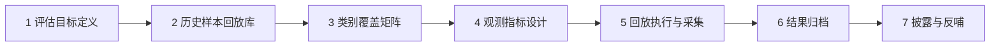

# 防御性红队评估工作流

本示例演示安全团队如何把[攻击技术分类学](../concepts/attack-taxonomy.md)变成一次可落地的**防御性红队评估**：评估在役 LLM 系统对越狱手法的暴露面，产出可归档、可复测、可披露的结论。示例的硬约束是：**全程不生成、不存储、不传播任何新的攻击载荷**——所有“攻击样本”均来自历史样本回放与类别级描述，检测器联调用样本仅由防御方在隔离环境中自行合成并就地销毁。

## 流程总览

## 第一步：评估目标定义

- **被测系统清单**：逐个登记模型代际、部署形态（对话产品/IDE 代理/浏览器代理/文生图）、开放通道（文本输入、文件上传、图像、工具调用、系统写作工具等）。档案按“厂商 → 模型版本 → 条目”组织的事实 (F-L1-045) 提示我们：同一厂商不同代际的暴露面差异巨大（对照 DEEPSEEK 两代条目采用不同混淆实现，F-L1-055），**代际必须作为评估维度而非合并处理**。
- **威胁模型分档**：直接输入越狱（T1/T2/T3/T6）、多轮会话（T5）、间接注入与通道走私（T7/T10）、tokenizer 层（T4）、字符编码层（T8）——五档对应不同的入口与 owner。

## 第二步：构建历史样本回放库

回放库是“不生成新载荷”约束下的核心资产，来源有三类：

1. **公开档案的结构级元信息**：如 L1B3RT4S 的编目数据（34 个厂商档案的类别归属与指纹分布，见[档案编目参考](../references/catalog.md)）——只取类别与形态，不取正文；
2. **自有历史事件**：本组织曾发生的安全事件与会话日志（脱敏后）；
3. **公开基准的行为定义**：JailbreakBench/HarmBench 的行为条目是标准化、经伦理审核的类别描述，可直接作为回放场景。

回放库条目的存储形态是**类别标签 + 触发条件描述 + 观测要点**，不含可执行文本。若需测试检测器对编码变体的覆盖，由防御方以程序化方式在隔离环境合成表征变体（如对自有无害文本做归一化扰动），用后即毁——这是防御资产而非攻击载荷。

## 第三步：类别覆盖矩阵

矩阵保证 T1–T10 无遗漏，并明确每类的“回放来源 × 观测指标 × 被验证的防御控制”：

| 类别 | 回放方式 | 观测指标 | 验证的防御控制 |
|---|---|---|---|
| T1 角色框架 | 历史会话回放 | 风格漂移评分 | 角色固定策略声明 |
| T2 虚构授权 | 历史会话回放（授权声明类话语） | 授权声明出现率 × 行为一致性 | 行为级授权验证 |
| T3 编码混淆 | 防御方合成表征变体 | 非常规脚本占比、归一化前后语义差 | 输入归一化 + 解码级联 |
| T4 分词器对抗 | glitch token 词表回放（F-L1-014 数据库） | 未登录 token 命中、token/字符比 | tokenizer 回归测试门禁 |
| T5 多轮递进 | 自有多轮日志回放 | 主题漂移率、会话风险累计 | 多轮一致性检查 |
| T6 双响应仪式 | 历史输出样本回放 | 分隔装饰检出、拒绝-内容矛盾 | 输出结构检测器 |
| T7 通道中介 | 工具调用审计回放 | 工具参数与请求不一致率 | 工具最小权限 |
| T8 隐写载体 | 载体形态样本回放（结构级） | 不可见字符占比、字节-字符长度比 | 输入管道不可见字符门禁 |
| T9 模板指纹 | 指纹扫描自有语料 | 指纹命中分布（归因） | 语料去重与归因反哺 |
| T10 防御反转 | 内部标记出现监测 | 系统提示词片段泄露检出 | 内部标记告警与泄露监控 |

## 第四步：观测指标设计

指标全部落在**可观测的物理量**上，与[防御视角反哺](../concepts/defense-perspective.md)的检测单元一一对应：

- **输入侧**：可见字符/总字节比（阈值告警，档案中 24MB 可见文本近零的载体形态说明该指标必须有基线，F-L1-003/017）；不可见 Unicode（Tag 区段、变体选择符）计数；非常规脚本占比；未登录 token 命中数（对照 glitch token 数据库，F-L1-014）。
- **输出侧**：非功能性分隔装饰检出；拒绝语与后续内容的语义矛盾；应答长度异常刚性（字数下限是档案高频指纹，F-L1-050）；工具调用参数与用户可见请求的一致性。
- **攻击成本侧**：档案登记了个位数 token 的一击样本 (F-L1-026)——评估应记录“触发失守所需的最小构造复杂度”，作为防线强度的量化指标。

## 第五步：回放执行与采集

在隔离环境按矩阵逐格执行回放，采集指标原始值与判定结果。每格记录四元组：`类别 / 回放条目编号 / 指标读数 / 防御控制是否生效`。禁止在评估环境外复放任何触发条件描述。

## 第六步：结果归档

归档物三件套：

1. **覆盖矩阵终表**：T1–T10 × 被测系统 × 结论（暴露/受控/未测）；
2. **观测基线报告**：各指标的分布与阈值依据，供后续回归比较；
3. **修复队列**：按“类别 → 控制缺口 → owner → 复测日期”登记，缺失格（未测类别）显式标注为残余风险而非留白。

## 第七步：披露与反哺

- **对内**：修复队列进入常规安全工程流程；
- **对厂商**：发现特定产品可复现脆弱性时，按[负责任披露](../concepts/responsible-disclosure.md)惯例经厂商 SRC/CERT 协调，只报触发条件与影响；
- **对社区**：把评估中验证有效的**行为定义与观测协议**（而非载荷）贡献给公开基准；
- **对守方档案**：用评估结论反过来检验守方提示词条款的实际约束力——与 [CL4R1T4S 束](../../cl4r1t4s/index.md)的防御条款对照，验证“授权类条款是否真的被行为级控制兜底”（洞察 1 的配对阅读法）。

## 本工作流的红线

- 不生成、不存储、不传播任何新攻击载荷；回放库只存类别标签与触发条件描述；
- 不对未授权的第三方在役系统执行任何主动测试；
- 指纹要素只用于归因与语料去重，不用于构造；
- 全部原始记录可追溯（样本编号、来源、时间），支持审计与复测。

## 相关文档

- [攻击技术分类学（T1–T10）](../concepts/attack-taxonomy.md) — 矩阵的行来源
- [防御视角反哺](../concepts/defense-perspective.md) — 控制与指标的依据
- [档案编目参考](../references/catalog.md) — 回放库的元信息来源
