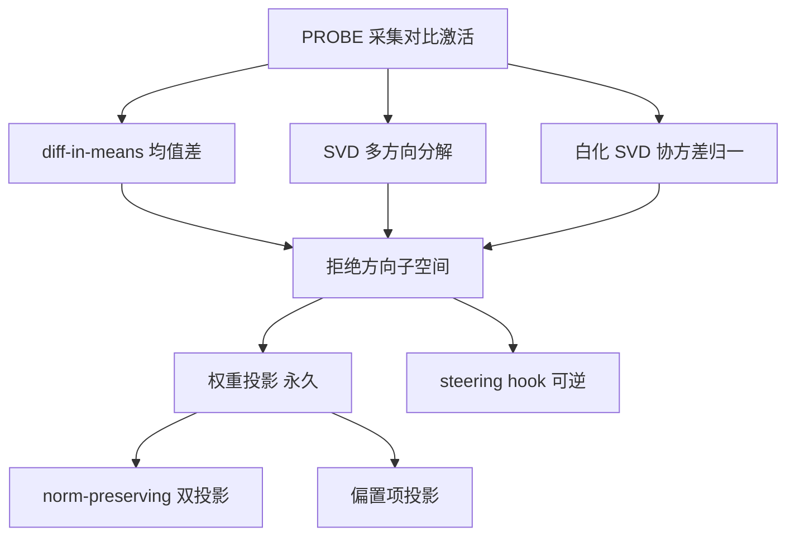

# abliteration 原理入门

abliteration 是一族技术的统称：在**不重训练、不微调**的前提下，识别语言模型内部与内容拒绝相关的表征方向，然后从权重中外科手术式地将其投影移除（F-OB-001）。理解它只需要线性代数的三个工具：均值差、SVD 分解和正交投影。本篇从数学直觉到工程实现逐层展开，所有机制均对应 OBLITERATUS 源码实现。

## 一、核心发现：拒绝由单一方向介导

Arditi et al. 2024（arXiv:2406.11717）发现：对齐模型拒绝请求的行为，在激活空间中由**一个方向**介导——把残差流激活沿这个方向做消融，模型就不再拒绝；反之沿该方向加压，无害请求也会被拒绝（F-OB-009）。这个发现把"拒绝"从一个模糊的行为概念变成了一个**几何对象**：它是激活空间里的一个向量。

这正是安全边界的层级性的技术根源（洞察 2）：提示级防线写在对话层，而拒绝行为的"开关"在权重与激活空间里是一个可定位、可操作的几何实体。守方在提示词里写得再严密，权重被投影修改后全部失效。

## 二、方向提取的两条路径

### 2.1 diff-in-means（均值差）

最直接的提取方式（OBLITERATUS `basic` 预设与 informed 预设的默认方法，`abliterate.py` L283-286）：

1. 准备两组提示词：harmful（触发拒绝）与 harmless（不触发拒绝）；
2. 在选定的层上分别收集两组残差流激活；
3. 对两组激活各取均值，做差：

```text
r = mean(activations_harmful) - mean(activations_harmless)
```

归一化后 `r` 就是该层的拒绝方向。这个操作与 steering vectors 的对比对提取完全同构——`SteeringVectorFactory.from_contrastive_pairs` 的实现就是 `mean(positive) - mean(negative)` 再归一（steering_vectors.py L140-143，F-OB-020）。

### 2.2 SVD 分解（多方向）

均值差只取一阶统计量，当拒绝机制不止一个时（例如不同危害类别各自有方向）会漏掉信息。SVD 路径把两组激活之差的**协方差结构**分解为若干正交主方向，取前 `n_directions` 个作为拒绝子空间的基底（`advanced` 预设取 4 个，`aggressive`/`surgical`/`inverted` 取 8 个，方向数以源码 `METHODS` 字典为准，F-OB-014）。

SVD 的贡献在于回答"拒绝子空间是几维的"：奇异值衰减谱告诉你第 2、第 3 个方向还携带多少拒绝信号。

### 2.3 白化 SVD（协方差归一）

朴素 SVD 有一个系统性偏差：激活空间各维度的**自然方差不同**——方差大的维度上任何差异都会显得信号强，导致提取出的"拒绝方向"其实被自然激活方差污染。白化 SVD（Whitened SVD，`use_whitened_svd: true` 时启用）先对激活做协方差归一（白化变换），在白化后的空间里做 SVD，再映射回原空间：


效果是把"护栏信号"从"自然激活方差"中分离出来，得到更干净的提取（F-OB-031 能力对比表中 OBLITERATUS 行的 Whitened SVD 提取项）。配合**激活缩尾**（Activation Winsorization，在 SVD 前把激活向量截断到分位数范围，防止离群点主导方向，Heretic 启发）可以进一步鲁棒化（F-OB-018）。

## 三、权重投影：把方向从权重里"减掉"

拿到方向 `r` 之后，如何改变模型行为？答案是**权重投影**：对模型中每个权重矩阵 `W`，把会写出方向 `r` 的分量移除。

### 3.1 最小数值示例（2D 平面类比）

设某个权重矩阵在 2D 平面上工作，拒绝方向为 `r = (1, 1)/√2`（指向 45°）。某权重向量 `w = (3, 1)`：

- `w` 在 `r` 上的投影分量：`w·r = (3+1)/√2 = 2√2`，投影向量 = `2√2 · r = (2, 2)`；
- 移除投影后的新权重：`w' = w - (2, 2) = (1, -1)`。

几何直觉：**w' 与 r 正交**（`(1,-1)·(1,1) = 0`）。这意味着该权重再也不可能写出任何沿 `r` 的分量——无论输入是什么激活，经过 `w'` 的输出都不含拒绝方向的成分。这就是"移除"的数学含义：不是压制，而是让写出该方向的通道不存在。

对整个矩阵 `W`，投影操作是 `W' = W - r rᵀ W`（`r rᵀ` 是到 `r` 正交补的投影算子），对多方向子空间则是 `W' = W - R Rᵀ W`，其中 `R` 的列是正交化的拒绝方向基。

### 3.2 norm-preserving 双投影

朴素投影 `w' = w - (w·r) r` 有一个副作用：**权重范数缩小**（上例中 `‖w‖ = √10` 降到 `‖w'‖ = √2`）。范数变化会扰动该层的整体激活幅度，伤及与拒绝无关的能力——这是早期 abliteration 工具"移除拒绝后模型变笨"的主要原因之一。

grimjim 2025 的 norm-preserving biprojection（F-OB-009）对此修正：投影后把被移除分量的能量**重新分配回正交补空间**，保持权重范数不变。直觉上仍是 2D 类比：`w = (3,1)` 投影掉 `r` 分量后得到正交分量 `(1,-1)`（范数 √2），再把被删掉的 `2√2` 能量按比例放大正交分量——`w'' = (1,-1) × (√10/√2) = (√5, -√5)`，范数回到 √10，但依旧与 `r` 正交。OBLITERATUS 的 `advanced` 及以上预设默认 `norm_preserve: true`（F-OB-014 源码核验），并实现了多方向版的 norm preservation：在投影前一次性捕获所有权重范数，投影全部方向后再统一恢复，避免逐方向投影反复引入误差（Multi-Direction Norm Preservation，F-OB-018）。

### 3.3 偏置项投影为何重要

Transformer 的线性层不只有权重矩阵，还有偏置向量 `b`：输出 = `Wx + b`。偏置是一个**常数写入**——即使输入激活完全不含拒绝成分，`b` 本身也可能沿拒绝方向贡献信号（对齐训练可能在偏置中留下"指纹"）。若只投影权重不投影偏置，等于堵住了动态通道却留下了静态注入点，拒绝通路部分存活。

OBLITERATUS 的 `advanced` 及以上预设默认 `project_biases: true`（源码核验 F-OB-014；README 把 Bias Term Projection 列为差异化能力——其他工具遗漏偏置中的拒绝信号，F-OB-031）。注意 `basic` 预设两者皆无（`norm_preserve: false`、`project_biases: false`），它是复现 Arditi 实验的基线而非生产方法。

## 四、与 steering vectors 的关系

权重投影与 steering vectors 是同一几何对象上的两种干预范式（F-OB-019）：

- **权重投影**：把方向从 `W` 和 `b` 中永久删除。模型文件改变，行为改变永久生效，推理零额外开销，不可逆。
- **steering vectors**：权重不动，推理时用 forward hook 在指定层的残差流上加/减方向向量（`alpha=-1.0` 远离拒绝，`alpha=+1.0` 强化拒绝）。可逆、可调、可组合（F-OB-019/020）。

两者的提取端共享数学（diff-in-means 即 steering 的对比对构造），差别只在干预端是"改权重"还是"挂 hook"。详细对比与方法选择见[方法预设篇](methods-presets.md)。

## 五、方法总览



| 技术 | 一句话 | 源码锚点 |
|------|--------|---------|
| diff-in-means | 两组激活均值之差即方向 | `abliterate.py` basic 预设 L283-286 |
| SVD 多方向 | 分解协方差取前 k 个正交方向 | advanced=4、aggressive=8 等，F-OB-014 |
| 白化 SVD | 先协方差归一再分解，去除方差污染 | `use_whitened_svd` 开关 |
| 激活缩尾 | SVD 前截断分位数防离群主导 | `winsorize_activations`，F-OB-018 |
| 权重投影 | `W' = W - R Rᵀ W` 消除写出通道 | `_excise` 阶段，F-OB-056 |
| norm-preserving | 投影后恢复范数，保住能力 | `norm_preserve`，grimjim 双投影 |
| 偏置投影 | 对 `b` 做同构投影，堵住静态注入 | `project_biases` |

## 延伸阅读

- 六/七阶段流水线如何把这些数学步骤工程化：[pipeline-six-stages.md](pipeline-six-stages.md)
- 双干预范式的 API 与选择建议：[methods-presets.md](methods-presets.md)
- 白化 SVD、概念锥等分析模块如何度量方向几何：[analysis-modules.md](analysis-modules.md)
