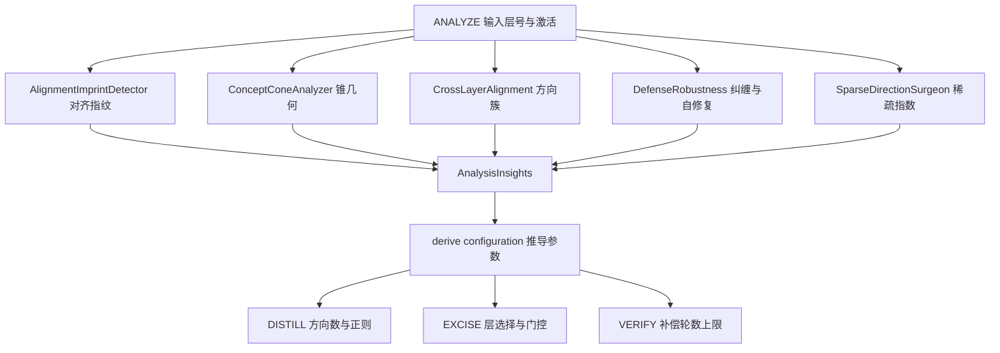

# 15 分析模块全景与 informed 闭环

分析模块是 OBLITERATUS 的研究核心：它们把"拒绝行为"拆解为可度量的几何问题——有多少个机制、在哪些层、会不会自修复、是否跨模型通用。README 声称 15 个分析模块（F-OB-016），**该数字经 `analysis/__init__.py` 的 `__all__`（L8-22）逐一核验通过**，README L437-453 的 import 列表与源码逐字一致（F-OB-045）——这是文档漂移背景下少数完全可信的声称（引洞察 4：漂移是局部的而非全局不可信）。

## 15 核心模块表

| # | 模块（导出名） | 回答的问题 | 学术依据 |
|---|--------------|-----------|---------|
| 1 | CrossLayerAlignmentAnalyzer | 拒绝方向如何跨层演化？ | Novel |
| 2 | RefusalLogitLens | 模型在第几层"决定"拒绝？ | nostalgebraist 2020 |
| 3 | WhitenedSVDExtractor | 白化后的主拒绝方向是什么？ | Novel |
| 4 | ActivationProbe | 每层存在多少拒绝信号？ | Arditi et al. 2024 |
| 5 | DefenseRobustnessEvaluator | 护栏会尝试自修复吗？（Ouroboros 效应） | Novel |
| 6 | ConceptConeAnalyzer | 机制是一个还是多个？类别间共享护栏吗？ | Wollschlager et al. 2025 |
| 7 | AlignmentImprintDetector | 模型用 DPO、RLHF、CAI 还是 SFT 训练的？ | Novel |
| 8 | MultiTokenPositionAnalyzer | 拒绝信号集中在序列哪个位置？ | Novel |
| 9 | SparseDirectionSurgeon | 哪些具体权重行承载最多拒绝？ | Novel |
| 10 | CausalRefusalTracer | 哪些组件对拒绝是因果必要的？ | Meng et al. 2022 近似 |
| 11 | ResidualStreamDecomposer | 拒绝有多少来自 attention、多少来自 MLP？ | Elhage et al. 2021 |
| 12 | LinearRefusalProbe | 学习型分类器能否找到解析方向漏掉的信息？ | Alain & Bengio 2017 |
| 13 | TransferAnalyzer | 护栏是通用的还是模型特定的？（Universality Index） | Novel |
| 14 | SteeringVectorFactory / SteeringHookManager | 能否不动权重在推理时关闭护栏？ | Turner 2023 / Rimsky 2024 |
| 15 | EvaluationSuite | 拒绝率/困惑度/连贯性/KL/CKA/有效秩综合评测 | Multiple |

模块表内容来自 README L414-434，全部导出名核验通过（F-OB-016）。每个模块回答的问题对应一次"安全机制考古"：例如 ConceptCone 的**概念锥几何**（per-category 方向 + 立体角估计）判断拒绝是单一线性方向还是多面体结构；AlignmentImprint 仅凭子空间几何就给对齐训练方法打**指纹**（DPO/RLHF/CAI/SFT）。

## 15 扩展导出：实际共 30 个

`analysis/__init__.py` 的 `__all__` 除 15 核心外另有 15 个导出（F-OB-017），对应 README 未列入模块表的扩展分析面：

| 扩展导出 | 归属子模块（_LAZY_IMPORTS，L42-73） | 用途一句话 |
|---------|-----------------------------------|-----------|
| SparseAutoencoder / train_sae / identify_refusal_features / SAEDecompositionPipeline | sae_abliteration | 稀疏自编码器特征级分解与拒绝特征识别 |
| TunedLensTrainer / RefusalTunedLens | tuned_lens | Tuned Lens 残差流解码 |
| RiemannianManifoldAnalyzer | riemannian_manifold | 拒绝子空间的黎曼流形分析 |
| AntiOuroborosProber | anti_ouroboros | 自修复行为的主动探测 |
| ConditionalAbliterator | conditional_abliteration | 条件化消融 |
| WassersteinRefusalTransfer / WassersteinOptimalExtractor | wasserstein_transfer / wasserstein_optimal | Wasserstein 最优传输的方向提取与跨模型迁移 |
| SpectralCertifier / CertificationLevel | spectral_certification | 移除效果的谱认证分级 |
| ActivationPatcher | activation_patching | 激活补丁干预 |
| BayesianKernelProjection | bayesian_kernel_projection | Heretic 式贝叶斯核投影 |

导出经 `_LAZY_IMPORTS` 字典懒加载（`__getattr__` 首次访问时才 import 子模块并缓存，L76-83），使纯 Python 辅助在无 PyTorch 环境下也可导入（F-OB-017）。analysis 子包共 29 个 .py 文件（目录清单核验，V 阶段复核一致）。

## informed 闭环：检测→配置映射

`InformedAbliterationPipeline._analyze()`（informed_pipeline.py L326-360）在 PROBE 与 DISTILL 之间按序运行分析并把结果写入 `AnalysisInsights`（L96-138），随后 `_derive_configuration()`（L360）推导下游参数。

**勘误**：README 称 ANALYZE 运行 4 个分析模块（F-OB-039 声称），**源码实测为 5 个**（F-OB-050）：alignment imprint（L340）、cone geometry（L344）、cross-layer（L348）、defense robustness（L352）、sparse surgery/RSI（L356）；模块 docstring 映射表亦列 5 行（L25-29）。完整勘误表见[新技术谱系篇](novel-techniques.md)。

检测→配置映射表（含源码实测的第 5 行）：

| ANALYZE 检测模块 | 检测什么 | 自动配置什么下游参数 |
|----------------|---------|---------------------|
| AlignmentImprintDetector | DPO vs RLHF vs CAI vs SFT 指纹 | 正则强度、投影激进度 |
| ConceptConeAnalyzer | 多面体 vs 线性拒绝结构 | 方向数——线性取 1，多面体最多至 8（`recommended_n_directions`，F-OB-044） |
| CrossLayerAlignmentAnalyzer | 方向簇数量与持续性 | 簇感知层选择（取代任意 top-k） |
| DefenseRobustnessEvaluator | 自修复风险、安全-能力纠缠图 | 精炼轮数；纠缠门控——`entanglement_gate` 默认 0.8，超过门限的层被跳过（skip_layers） |
| SparseDirectionSurgeon（实测第 5 个） | 拒绝稀疏指数 RSI、稀疏手术可行性 | 稀疏投影计划（`use_sparse_surgery`、`recommended_sparsity`） |

`AnalysisInsights` 字段一览（F-OB-044 核验）：对齐侧 `detected_alignment_method`（默认 "unknown"）与 `alignment_confidence`；锥侧 `cone_is_polyhedral`、`cone_dimensionality`、`per_category_directions`；跨层侧 `direction_clusters`、`cluster_count`、`direction_persistence`；稀疏侧 `mean_refusal_sparsity_index`；防御侧 `estimated_robustness`、`self_repair_estimate`、`entanglement_score`、`entangled_layers`、`clean_layers`；以及推导出的 `recommended_n_directions`（默认 1）、`recommended_direction_method`、`recommended_regularization`、`recommended_refinement_passes`、`recommended_layers`、`skip_layers`。

闭环不止于 ANALYZE——docstring 映射表（L21-36）列出了分析在全程的参与：DISTILL 用 WhitenedSVDExtractor 做协方差归一提取；EXCISE 用 SparseDirectionSurgeon 做行级权重手术；VERIFY 用 ActivationProbe 检测残余拒绝信号、用 CrossLayerAlignmentAnalyzer 检查方向持续性、用 DefenseRobustnessEvaluator 检测 Ouroboros 自修复、用 SteeringVectorFactory 在永久修改前做 steering 预筛。

## Ouroboros 补偿循环

VERIFY 阶段升级为 `_verify_and_compensate()`：若检测到护栏在补偿层试图重新组装（Ouroboros 效应——命名自衔尾蛇），则在补偿层自动追加定向精炼 pass（F-OB-039/057）。参数：`ouroboros_threshold` 默认 0.5、`max_ouroboros_passes` 默认 3（构造函数 L203-204）；存在旧别名 `hydra_threshold`/`max_hydra_passes` 兼容（L206-207）。实测 pass 数写入 `InformedPipelineReport.ouroboros_passes`（L149、L1217），是评估"该模型护栏鲁棒性"的直接观测量。

## 闭环全景图

## 延伸阅读

- 七阶段流水线中各阶段的执行时序：[pipeline-six-stages.md](pipeline-six-stages.md)
- ANALYZE 参数如何被方法预设兜底：[methods-presets.md](methods-presets.md)
- 消融策略（layer_removal/head_pruning/ffn_ablation/embedding_ablation）注册器：[architecture-map.md](../references/architecture-map.md)
