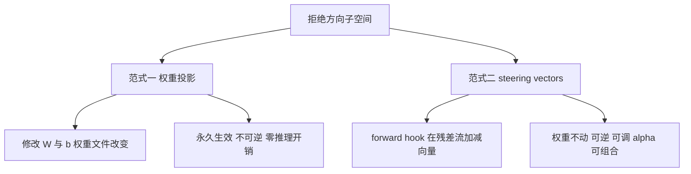

# 7 方法预设与双干预范式

OBLITERATUS 把"提取哪些方向、投影多深、做多少精炼"打包成方法预设。**方向数与开关的全部数字以源码 `abliterate.py` 的 `METHODS` 字典实测为准**（F-OB-014，行号核验 L192-L511）；README 预设表有一处方向错误（nuclear），本篇勘误标注。CLI 侧另有入口参数 `--method`，choices 为 10 个：basic、advanced、aggressive、spectral_cascade、informed、surgical、optimized、som、inverted、nuclear（cli.py L237-243，F-OB-015）——预设表 7 个之外的方法见文末"预设之外"。

## 七个预设逐个解析

### basic——Arditi 基线（1 方向）

`diff_means` 提取单方向，`norm_preserve: false`、`project_biases: false`、无白化（L283-294）。定位是复现 Arditi et al. 2024 的对照实验与快速冒烟，不适合作为对能力保留有要求的实际手术方法（无范数保持、不投影偏置，见[原理篇](abliteration-primer.md)）。

### advanced——默认方法（4 方向，SVD）

CLI `--method` 的默认值（cli.py L237-241）。SVD 4 方向 + `norm_preserve: true` + `project_biases: true` + regularization 0.3 + embed_regularization 0.5 + 2 轮精炼 + 层自适应强度（L296-309）。README 定位：干净的移除与最小能力损失，是绝大多数场景的首选。

### aggressive——激进全开（8 方向）

8 方向 + 白化 SVD + 越狱对比精炼（jailbreak-contrastive refinement）+ 迭代精炼带余弦相似度早退 + attention head surgery + 激活缩尾，正则归零追求最大移除（L311-335）。适用：护栏顽固、advanced 残留明显的模型；代价是能力损失风险上升，依赖 VERIFY 门禁兜底。

### surgical——SOTA MoE 感知（8 方向）

在 aggressive 之上叠加安全神经元掩码（safety neuron masking）、per-expert 方向（EGA，MoE 路由 logits 分解，F-OB-018）、SAE 特征级消融（L399-424）。README 定位"Precision MoE models"：面向混合专家模型，按专家粒度做手术以减少能力附带伤害。

### optimized——贝叶斯自动调优（4 方向）

Optuna TPE 贝叶斯优化自动调各层消融强度，在拒绝率与 KL 散度之间共优化 Pareto 前沿；启用激活缩尾、浮点层插值、CoT-aware 推理保护、KL 预算 0.5，`bayesian_trials: 50`（L456-493）。Heretic 启发并扩展（MoE 感知、多方向 SVD、SAE）。适用：计算预算允许约 50 次试验、追求质量上限时。

### inverted——语义反转（8 方向）

不做移除而是**反射**拒绝方向（2x 正交反射），把拒绝逻辑语义翻转成主动配合；MoE 模型上连路由一起反射——把有害 token 从安全专家重定向到能力专家，安全偏置专家输出被反转（L425-455）。研究价值在于验证"拒绝方向携带语义极性"这一假设。

### nuclear——最大力度组合（**源码实测 4 方向，README 称 8——勘误**）

面向顽固 MoE 模型（GPT-OSS 20B、GLM-5 等）的组合模式：inverted 基线 + 层自适应强度 + **1.25x 温和反射**（vs inverted 的 2x，保住 CoT 连贯性）+ 保守专家移植（10% 混入 top-三分之一安全专家）+ 温和嵌入投影（50% 移除）+ 激活 steering 作为残余清理（L494-523）。

**勘误**：README 预设表写 nuclear 为 8 方向，但源码 `n_directions: 4`（L510），且描述原文明确写 "Uses 4 SVD directions (not 8) to avoid over-ablation"（L503）——README 与源码直接反转的错误（F-OB-014），设计意图是**少方向防过度消融**，用 SAE 特征补精度。完整勘误表见[新技术谱系篇](novel-techniques.md)。

## 选型速查表

| 方法 | 方向数（源码实测） | 白化 SVD | 偏置投影 | 标志性技术 | 适用场景 |
|------|------------------|---------|---------|-----------|---------|
| basic | 1 | 否 | 否 | diff-in-means | 复现基线、小模型冒烟 |
| advanced（默认） | 4 | 否 | 是 | norm-preserving + 层自适应 | 通用首选 |
| aggressive | 8 | 是 | 是 | 越狱对比精炼 + head surgery + 缩尾 | 护栏顽固的 dense 模型 |
| surgical | 8 | 是 | 是 | EGA + 安全神经元掩码 + SAE | MoE 精准手术 |
| optimized | 4 | 是 | 是 | Optuna TPE + CoT-aware + KL 共优化 | 预算充足追求质量 |
| inverted | 8 | 是 | 是 | 2x 语义反射 + 路由反射 | 拒绝语义反转实验 |
| nuclear | 4（勘误：非 8） | 是 | 是 | 1.25x 反射 + 专家移植 + steering 清理 | 顽固 MoE 的最终手段 |

行号锚点：basic L283、advanced L296、aggressive L311、surgical L400、inverted L426、optimized L457、nuclear L495（F-OB-014）。

## 双干预范式：永久 vs 可逆

OBLITERATUS 同时支持两类干预（F-OB-019）：

### 权重投影（永久）

即七预设的做法：EXCISE 阶段把方向从权重/偏置中投影移除，模型文件永久改变。适合产出"去护栏版本"的分发或部署，但一旦完成无法回退（只能重载原始 checkpoint）。

### steering vectors（可逆，推理时）

基于 Turner et al. 2023（Activation Addition，arXiv:2308.10248）与 Rimsky et al. 2024（CAA，arXiv:2312.06681）（F-OB-009/019/020）。API 全部经 `analysis/steering_vectors.py` 源码核验（F-OB-048）：

- `SteeringVector`（L54）：方向向量 dataclass——`direction`（单位向量）、`source_layer`、`label`、`default_alpha`。
- `SteeringConfig`（L65）：`vectors`（向量列表）、`target_layers`（目标层列表）、`alpha`（全局缩放，默认 1.0）、`per_layer_alpha`（逐层覆盖）、`position`（"all"/"last"/"first"）、`normalize`（默认 True）。
- `SteeringVectorFactory`（L86）：
  - `from_refusal_direction(refusal_dir, source_layer=None, alpha=-1.0)`（L90）——默认 `alpha=-1.0` **远离**拒绝（消融效果），`alpha=+1.0` 反向**强化**拒绝；
  - `from_contrastive_pairs(positive, negative, label, alpha=1.0)`（L118）——对比对均值差构造；
  - `combine(vectors, weights, label)`（L155）——多向量加权组合。
- `SteeringHookManager`（L190）：`install(model, config)`（L201）在 `target_layers` 上注册 forward hook，hook 在残差流输出上加 `alpha * default_alpha * d`（L255-299，支持 3D/2D 隐藏态与位置选择）；`remove()`（L244）卸载全部 hook；`is_active` 属性查询状态。
- 辅助函数：`compute_steering_effectiveness`（L321）与 `format_steering_report`（L346）。

### 范式选择

| 考量 | 权重投影 | steering vectors |
|------|---------|-----------------|
| 持久性 | 永久（写入权重文件） | 会话级（hook 卸载即恢复） |
| 推理开销 | 零 | 每层每向量一次向量加法 |
| 可调性 | 固定（只能重跑） | alpha 逐层可调、运行时可切换 |
| 组合性 | 方向在 EXCISE 前混合 | 多向量可组合可叠加 |
| 典型用途 | 产出消融模型制品 | A/B 实验、预演、informed 流水线的 VERIFY 预筛 |

informed 流水线在 VERIFY 阶段会用 `SteeringVectorFactory` 做永久修改前的预筛（`informed_pipeline.py` docstring 映射表 L35，F-OB-050 相关）——先用可逆手段验证方向有效性，再落刀。

## 预设之外：更大的方法面

- `spectral_cascade`（6 方向）：DCT 把拒绝信号沿层轴分解为频带，低频（跨层系统性拒绝趋势）重投影、高频（能力纠缠噪声）轻投影，级联精炼逐带消除（L336-364）。CLI 可选。
- `som`：自组织映射方向方法（CLI choices 含）；`--direction-method` 亦有 `leace`（LEACE 闭式消除）可选（F-OB-042）。
- `AbliterationPipeline` docstring 列 14 个方法（含 failspy/gabliteration/heretic/rdo），另有 qwen38_e01/e02/e03 三个实验预设（固定 500/142/200 划分的因果对照实验配置，L192-281）；tourney 方法对比表为 10 个（F-OB-015）。

## 延伸阅读

- 各方法在七阶段中的执行细节：[pipeline-six-stages.md](pipeline-six-stages.md)
- EGA/CoT-aware/KL 等技术的机制与出处：[novel-techniques.md](novel-techniques.md)
- steering vectors 完整可运行代码：[python-api.md](../examples/python-api.md)
