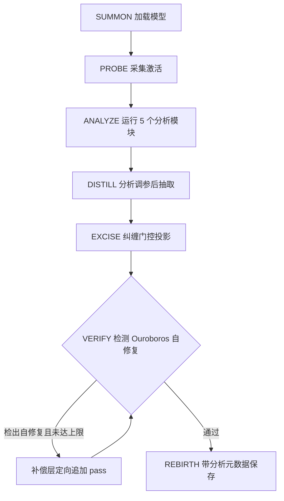

# 六/七阶段流水线：从 SUMMON 到 REBIRTH

OBLITERATUS 的核心执行骨架是一条六阶段流水线（F-OB-006，源码核验：`abliterate.py` L869-876 的 `STAGES` 列表定义同名六阶段）：

```text
SUMMON → PROBE → DISTILL → EXCISE → VERIFY → REBIRTH
```

`informed` 方法在此之上插入第 3 阶段 ANALYZE，构成七阶段（F-OB-007，源码核验：`informed_pipeline.py` docstring 与 `_active_stage = "analyze"`）。流水线不是叙事包装——每个阶段都有对应的实例方法、`PipelineStage` 元数据（`abliterate.py` L862-866）与 `StageResult` 执行结果载体（L879-885），并有专门的异常层级：`PipelineFailure` / `PipelineCancelledError` / `PipelineValidationError`（L888-901）。

## 标准六阶段详解


### 阶段 1：SUMMON（加载）

- **做什么**：加载模型与 tokenizer，按 `--dtype`/`--quantization` 决定精度与加载方式，按 `--gpus` 结果经 accelerate `device_map="auto"` 分层切片（F-OB-021/023）。
- **输入**：HuggingFace 模型名/路径、精度与量化参数、GPU 选择。
- **关键行为**：Qwen3.8 hybrid 模型走专门的运行时契约——完整文本模型置于单 CUDA 设备并留 15% headroom，不满足则停止分配；pristine 质量门失败的 checkpoint 永不修改（F-OB-037）。
- **失败模式**：显存不足以容纳权重时发生 meta tensor 卸载崩溃（README 基准显示 234 GB 模型在 240 GB 总显存上仍会失败——激活需要余量，F-OB-022）。

### 阶段 2：PROBE（采集激活）

- **做什么**：对 harmful/harmless 两组提示词做前向传播，逐层采集残差流激活。基准数据显示该阶段约 1024 次前向传播（F-OB-038），是"模型放得下单卡"场景下的主要计算瓶颈。
- **输入**：提示词集（可用自定义 `--harmful`/`--harmless` 覆盖内置集）、层范围。
- **输出**：各层两组激活张量。
- **失败模式**：提示词构造失效（如 chat template 应用错误）会导致两组激活无差异，后续 DISTILL 提取不到有效方向。

### 阶段 3：DISTILL（方向抽取）

- **做什么**：从激活中提取拒绝方向子空间。方法由 `--direction-method`（choices: `diff_means`/`svd`/`leace`/`som`，F-OB-042）与方法预设共同决定；方向数由预设 `n_directions` 决定（可 `--n-directions` 覆盖）。
- **后处理链**：方向混合 blending（L2881-2911）→ RDO 梯度精炼（L2928-3012）→ 层自适应强度（L3029-3041）→ 浮点层插值（L3057-3084）→ SAE 特征（L3091 起）→ CoT-Aware 校正（L3189-3253），全部开关由方法预设携带（F-OB-060）。
- **输出**：`self.refusal_directions: dict[int, torch.Tensor]`（层号→方向，F-OB-043）。

### 阶段 4：EXCISE（权重投影）

- **做什么**：把方向子空间从权重（与偏置）中投影移除，norm-preserving 双投影与层选择策略在此生效。层选择由 `_select_layers*` 家族实现：`all_except_first`（L2760）、`middle60`（L2765）、`all`（L2770）、按方差 top-k（L2776）、knee 拐点（L2781）、COSMIC 融合（L2791-2799）（F-OB-059）。
- **关键参数**：`regularization`（保留比例，advanced 默认 0.3）、`project_biases`、组件级缩放（attention 与 MLP 分别投影强度，MLP 更敏感，F-OB-018）。
- **失败模式**：该阶段是 CPU 密集的权重 surgery（基准数据中 DISTILL+EXCISE 合计约 30s，F-OB-022），层选择过激会触发 VERIFY 门禁失败。

### 阶段 5：VERIFY（质量验证）

- **做什么**：对修改后模型做困惑度与连贯性检查，确认能力未被破坏。质量指标：`baseline_perplexity`、`baseline_coherence`、`perplexity_increase`、`degenerate_fraction`、`coherence_retention`（F-OB-043）。
- **门禁参数**：`max_perplexity_increase`（默认 3.0）、`min_coherence_retention`（默认 0.5）、`max_degenerate_fraction`（默认 0.2，informed 构造函数签名核验）。退化生成检测由 `_is_degenerate_completion` 实现（空、极端重复、纯标点判定）。
- **地位**：VERIFY+REBIRTH 合计约占大模型运行 90% 墙钟时间（F-OB-022）——实际 surgery 很快，成本在验证与保存。
- **失败模式**：门禁失败即 `PipelineValidationError`，产出被拒绝保存。

### 阶段 6：REBIRTH（保存）

- **做什么**：将消融后模型与完整元数据写入 `--output-dir`（`_rebirth() -> Path`，F-OB-056）。大模型场景写盘 234 GB 约需 350s，是最大单项时间开销（F-OB-022）。
- **输出**：消融后模型文件 + `results.json` 等元数据（可上传 results.json 到 Web dashboard 可视化，F-OB-035）。

## 阶段与源码函数映射表

标准六阶段（`AbliterationPipeline` 实例方法，F-OB-056）：

| 阶段 | 源码方法 | 位置（abliterate.py） | 职责 |
|------|---------|----------------------|------|
| 编排入口 | `run()` | L1553 | 依序驱动六阶段，返回保存路径 |
| SUMMON | `_summon()` | L1603 | 加载模型与 tokenizer |
| PROBE | `_probe()` | L1798 | 采集两组激活 |
| DISTILL | `_distill()` / `_distill_inner` | L2398 / L4973 | 方向抽取与后处理链 |
| EXCISE | `_excise()` / `_excise_inner` | L4063 / L4134 | 权重与偏置投影 |
| VERIFY | `_verify()` | L6911 | 困惑度/连贯性/退化率门禁 |
| REBIRTH | `_rebirth() -> Path` | L7692 | 保存模型与元数据 |

## informed 七阶段：ANALYZE 插入

`InformedAbliterationPipeline`（`informed_pipeline.py` L155，继承 `AbliterationPipeline`）把分析模块从"事后诊断"搬进流水线，形成闭环（F-OB-007/057）：



关键点（源码实测）：

- **ANALYZE 位于 PROBE 与 DISTILL 之间**（`informed_pipeline.py` L301-302、L329-330 注释 "analysis runs BETWEEN probe and distill"）。
- **`_analyze()`（L326-360）按序调用 5 个分析模块**：1 Alignment Imprint（L340）、2 Concept Cone Geometry（L344）、3 Cross-Layer（L348）、4 Defense Robustness（L352）、5 Sparse Surgery/RSI（L356），随后 `_derive_configuration()`（L360）推导配置。**README 称 ANALYZE 运行 4 个模块——勘误项**（F-OB-050），模块 docstring 的映射表亦列 5 行（L25-29）。勘误对照详见[新技术谱系篇](novel-techniques.md)。
- **VERIFY 升级为 `_verify_and_compensate()`**：检测 Ouroboros 效应（护栏在补偿层试图自修复），检出后在补偿层追加定向 pass；循环上限 `max_ouroboros_passes` 默认 3（L204/258/1173），实测 pass 数写入 `report.ouroboros_passes`（L1217）。
- 分析开关可独立关闭：`run_cone_analysis`/`run_alignment_detection`/`run_cross_layer_analysis`/`run_sparse_analysis`/`run_defense_analysis` 五个构造参数（L197-201）。

## 两版流水线对比

| 维度 | 标准 6 阶段 | informed 7 阶段 |
|------|------------|----------------|
| 阶段数 | 6 | 7（+ANALYZE） |
| 方向抽取参数 | 预设静态值 | 分析推导（recommended_n_directions/regularization/passes，F-OB-044） |
| 层选择 | 预设策略族 | 簇感知 + 纠缠门控跳层 |
| VERIFY | 一次性门禁 | 门禁 + Ouroboros 补偿循环 |
| 产出 | 模型 + 元数据 | 模型 + `InformedPipelineReport`（detected_alignment_method、ouroboros_passes 等，F-OB-044/057） |
| 入口 | `pipeline.run() -> Path` | `pipeline.run_informed() -> tuple[Path, InformedPipelineReport]` |

## 延伸阅读

- ANALYZE 阶段 5 个模块各自的检测原理：[analysis-modules.md](analysis-modules.md)
- 阶段参数由哪些方法预设给定：[methods-presets.md](methods-presets.md)
- API 调用示例（构造/run/读报告）：[python-api.md](../examples/python-api.md)
