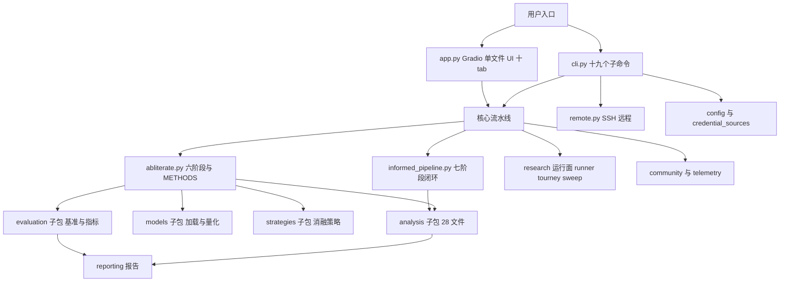
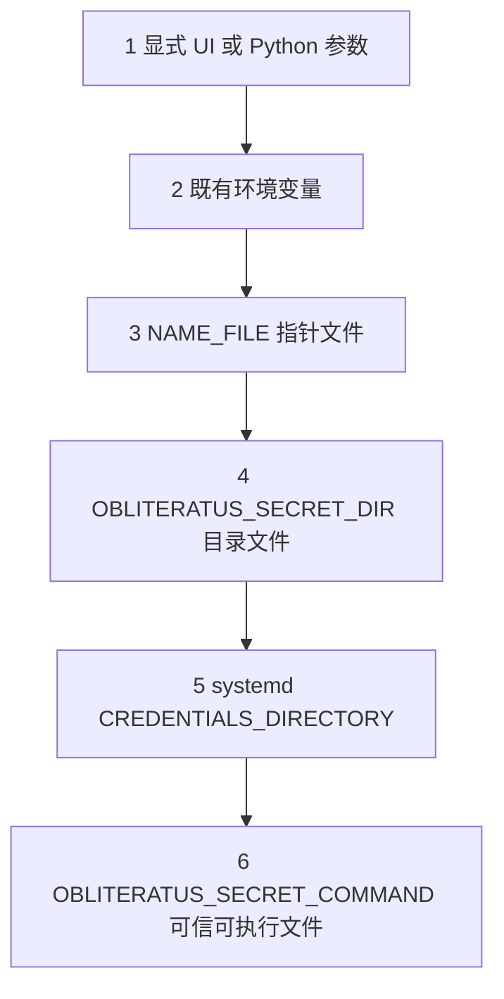

# 架构地图：包结构、凭据体系与部署资产

> 职责描述以源码文件名与已核验事实为依据的一句话归纳（推断处为文件名级职责归纳）；行号与数字均为 2026-09-02 实测（F-OB 系列编号）。

## 总览图

## 一、`obliteratus/` 顶层模块树

### 包元与入口

| 模块 | 职责 |
|------|------|
| `__init__.py` | 包级导出 20 项（懒加载 `__getattr__`），`__version__ = "0.1.3"`（F-OB-053） |
| `__main__.py` | `python -m obliteratus` 入口 |
| `py.typed` | PEP 561 类型标记 |
| `cli.py` | 十九个 CLI 子命令与全部参数定义（F-OB-041/042） |
| `local_ui.py` / `ui_vram.py` / `ui_watchtower.py` | 本地 UI 启动辅助、UI 显存面板、UI 守护视图 |
| `interactive.py` | interactive 引导向导 |

### 核心流水线

| 模块 | 职责 |
|------|------|
| `abliterate.py` | 主模块（约 7,700+ 行）：`AbliterationPipeline` 六阶段、`METHODS` 方法字典（12 键：7 预设 + spectral_cascade + informed + qwen38_e01/e02/e03）、层选择 `_select_layers*` 家族、方向后处理链（F-OB-014/056/059/060） |
| `informed_pipeline.py` | `InformedAbliterationPipeline` 七阶段闭环、`AnalysisInsights`/`InformedPipelineReport`（F-OB-044/050/057） |
| `adaptive_defaults.py` | 按模型/硬件推导的参数默认值 |
| `auto_obliterate.py` | AutoObliterator：可恢复的自动消融状态机（`__init__` 导出，F-OB-053） |
| `bayesian_optimizer.py` | Optuna TPE 贝叶斯优化器（optimized 预设的后端） |
| `lora_ablation.py` | LoRA 可逆消融（F-OB-018 第 9 项） |
| `hard_negative.py` | 难负样本构造（增强 PROBE 对比集） |
| `prompts.py` | 内置 harmful/harmless 提示词集 |
| `experiment_protocol.py` | 实验协议（qwen38_e0x 预设对应的因果对照流程） |
| `checkpoint_evaluation.py` | checkpoint 质量评估 |
| `reproducibility.py` | 复现性（set_seed 等，`__init__` 导出 set_seed） |
| `sweep.py` | run_sweep/SweepConfig/SweepResult 批量扫描（F-OB-053） |
| `blend.py` | blend 子命令后端（模型混合） |
| `restore_multimodal.py` | restore-multimodal 子命令后端 |
| `capability_check.py` | capability-check 子命令后端 |

### 研究运行面

| 模块 | 职责 |
|------|------|
| `runner.py` | `run_study(config: StudyConfig) -> AblationReport`（F-OB-058） |
| `study_presets.py` | 10 个 study 预设（StudyPreset dataclass，F-OB-047） |
| `tourney.py` / `tourney_contracts.py` | tourney 方法锦标赛（10 方法表 L41-52，F-OB-015）与其契约 |
| `run_archive.py` | RunArchive 运行归档（F-OB-053） |
| `watchtower.py` | Watchtower 守护（runs launch/status/cancel 的后端之一，F-OB-053） |
| `benchmark_lifecycle.py` | 基准生命周期管理 |

### 数据、模型与硬件

| 模块 | 职责 |
|------|------|
| `presets.py` | 130 个 ModelPreset（5 层级，README 称 116 为勘误项，F-OB-013） |
| `models_client.py` | HF Hub 客户端交互（config 拉取等） |
| `model_profile.py` / `architecture_profiles.py` | 模型画像与架构档案（架构检测） |
| `model_load_settings.py` | 加载设置（dtype/quantization 解析） |
| `bestiary_sync.py` | 预消融模型库同步（Dolphin/Hermes 等 A/B 对照库） |
| `device.py` / `gpu_lifecycle.py` | 设备选择与 GPU 生命周期（`OBLITERATUS_GPU_LIFECYCLE_DIR` 协议，F-OB-064） |
| `mlx_backend.py` | Apple MLX 后端（仅 darwin arm64 依赖组，F-OB-051） |

### 社区与遥测

| 模块 | 职责 |
|------|------|
| `telemetry.py` | 遥测：BenchmarkRecord schema、脱敏、值域校验、本地 JSONL + HF Dataset 上报（F-OB-029/030/049） |
| `community.py` | save_contribution/load_contributions/aggregate_results（F-OB-053） |

### 远程、配置与契约

| 模块 | 职责 |
|------|------|
| `remote.py` / `remote_contracts.py` | RemoteRunner SSH 远程执行（六步）与其契约（F-OB-027/053） |
| `config.py` | 全局配置（mutmut 变异测试目标之一，F-OB-051） |
| `credential_sources.py` | 凭据六级解析（resolve_first/resolve_secret，被 telemetry 导入，F-OB-033） |
| `runtime_contracts.py` / `persistence_contracts.py` / `service_contracts.py` | 运行时/持久化/服务契约（mutmut 必测目标，F-OB-051） |

### 五个子包

| 子包 | 文件数 | 职责 |
|------|--------|------|
| `analysis/` | 29 个 .py | 15 核心分析模块 + 15 扩展（30 个懒加载导出），含 leace.py、numerical_contracts.py、whitened_svd.py、visualization.py、utils.py（F-OB-017/045） |
| `strategies/` | 7 个 .py | registry.py 注册器（STRATEGY_REGISTRY/register_strategy/get_strategy）+ base.py 基类 + 4 策略：layer_removal/head_pruning/ffn_ablation/embedding_ablation（F-OB-046） |
| `evaluation/` | 8 个 .py | evaluator/metrics/advanced_metrics/baselines/benchmarks/benchmark_plots/heretic_eval/lm_eval_integration（F-OB-055） |
| `models/` | 5 个 .py | loader.py 加载、offload_surgery.py 卸载手术、quant_dequant.py FP8/NVFP4 去量化、qwen35_contracts.py hybrid 契约（F-OB-026/037/055） |
| `reporting/` | 2 个 .py | report.py 报告生成 |

## 二、配置与凭据体系

凭据解析的**六级顺序**（F-OB-033；credential_sources.py 实现的 resolve_first/resolve_secret 被 telemetry.py L46 导入）：

| 级 | 来源 | 说明 |
|----|------|------|
| 1 | 显式 UI/Python 参数 | 最高优先级 |
| 2 | 既有环境变量 | 如 `OPENROUTER_API_KEY` |
| 3 | `<NAME>_FILE` | 指针文件（如 `OPENROUTER_API_KEY_FILE`）内容才是密钥 |
| 4 | `OBLITERATUS_SECRET_DIR` | 目录内文件按规范化小写连字符命名（如 `hf-token`） |
| 5 | systemd `CREDENTIALS_DIRECTORY` | systemd 凭据挂载约定 |
| 6 | `OBLITERATUS_SECRET_COMMAND` | 可信可执行文件输出；**exit 0 有值 / exit 2 不可用 / 其他码 fail closed；无 shell、有超时** |

设计原则：**凭据在使用时解析**（use-time resolution）——挂载文件与 broker 轮换无需重启应用；`OBLITERATUS_SECRET_COMMAND` 永不指向贡献者可控代码，诊断不落 stdout（README L307-342）。语义边界：HF 下载读令牌不得被复用为 `HF_PUSH_TOKEN`/`OBLITERATUS_HUB_TOKEN`，Hub 发布需独立写权限凭据（README L357-360）。

## 三、部署资产（仓库根）

| 资产 | 内容 | F 编号 |
|------|------|--------|
| `app.py` | 单文件 Gradio UI（约 6,100+ 行，`demo.launch(` 在 L6121），10 个顶级 tab（README 称 8 为勘误项）；pyproject `py-modules = ["app"]` 使其进入 wheel | F-OB-034/061 |
| `hf-spaces/README.md` | Space 元数据 frontmatter：sdk gradio 5.29.0、app_file app.py、hardware zero-a10g、persistent_storage large、license agpl-3.0、tags 含 zerogpu | F-OB-062 |
| `deploy/huggingface/space-metadata.yml` | Space 元数据的 deploy 副本 | F-OB-062 |
| `installer/scripts/setup.sh` | `uv sync --locked --extra spaces --extra dev --no-editable`；检测 nvidia-smi 后以 `UV_TORCH_BACKEND=cu130` 重装匹配 CUDA 的 torch；执行 CUDA conv1d+SDPA 张量探针，NVIDIA 硬件在而 CUDA 不可用则 SystemExit | F-OB-063 |
| `installer/scripts/launch-local.sh` | 直接用 `.venv/bin/python` 启动——避免 `uv run` 把环境回同步到 CPU wheel（CUDA 系统关键坑） | F-OB-063 |
| `installer/scripts/verify.sh`、`evaluate-qwen38-checkpoint.sh` | 安装验证与 Qwen3.8 checkpoint 评估 | F-OB-063 |
| `installer/setup.dev.manifest.yaml` | `setup.aiwg.io/v1` provider 编排清单（aiwg setup-validate/setup-run） | F-OB-063 |
| `docs/index.html` | Web dashboard：配置构建器、模型注册表浏览器、results.json 可视化、分析模块参考 | F-OB-035 |
| `docs/deployment/shared-gpu-host.md` | 共享 GPU 主机部署契约：per-user workspace（mode 0700）、release 只读 + `current` 符号链接、GPU 调度器租约、UI 仅 loopback；明确 Gradio 局限（单共享进程暴露会话产物；basic auth 不构成租户隔离）；GPU 租约须在 CUDA 初始化前完成 | F-OB-064 |
| `docs/SUPPLY_CHAIN_POLICY.md`、`RELEASE_PROCESS.md`、`RESEARCH_SURVEY.md`、`platforms/jetson.md` | 供应链策略、发布流程（exact-SHA 门禁）、研究综述、Jetson 引导 | F-OB-066 |
| `deployment/systemd/...` | systemd drop-in（70-pipeline-timeout.conf、70-obliteratus-loading-window.conf）与环境定义 | F-OB-065 |
| `notebooks/abliterate.ipynb` | Colab notebook（零命令路径） | F-OB-040 |
| `paper/` | 学术手稿（main.tex、appendix.tex、references.bib） | F-OB-040 |
| `.github/workflows/ci.yml`、`conditional-tests.yml` | CI 快速 PR 门（Python 3.12）+ 多版本矩阵 + 条件测试工作流 | F-OB-054 |
| `ci/*.json` | 五份策略：conditional-test/pr-test/supply-chain/test-quality/test-risk-map | F-OB-054 |
| `tests/` | 116 个 test_*.py、1,949 个测试函数（README 三说为勘误项）；tests/conditional/ 9 个环境绑定文件；tests/fixtures/tiny_offline_model.py 合成离线模型 | F-OB-052 |

## 四、模块间调用关系要点

- `cli.py` 是唯一的参数入口：obliterate/tourney/run/ui 等子命令构造流水线对象后转交核心模块；GPU 选择在 CUDA 初始化前生效（`_apply_gpu_selection`，F-OB-023）。
- `abliterate.py` 依赖 `strategies/`（注册器工厂）与 `models/`（加载与去量化）；`informed_pipeline.py` 继承 `AbliterationPipeline` 并调用 `analysis/` 的五个模块（F-OB-050）。
- `telemetry.py` 与 `credential_sources.py` 的耦合点：遥测上报前经凭据体系取 token、经 `_sanitize_public_text` 脱敏（F-OB-030/033）。
- `remote.py` 与 `run`/`obliterate`/`tourney` 三个子命令组合（YAML remote 段共享，F-OB-027/058）。
- 契约文件族（runtime/persistence/service/tourney/remote_contracts + analysis/numerical_contracts）被 mutmut 定向变异测试加固——数值与持久化正确性是上游认为最不能坏的部分（F-OB-051）。

## 延伸阅读

- 流水线各阶段实现：[../concepts/pipeline-six-stages.md](../concepts/pipeline-six-stages.md)
- 遥测与凭据的治理语境：[../concepts/research-ecosystem.md](../concepts/research-ecosystem.md)
- CLI 命令与这些模块的对应：[../examples/cli-quickstart.md](../examples/cli-quickstart.md)
