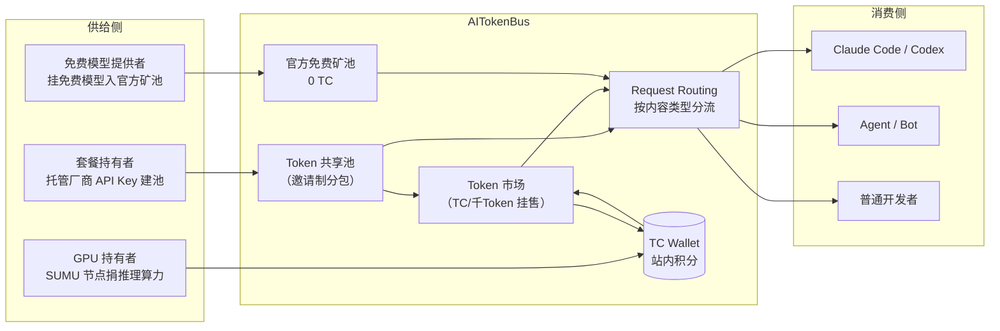

# AITokenBus 平台总览——发布事实与实测现状

> 基于唐霜《我上线了Token共享与交换平台AITokenBus，让你免费无限用AI》（微信公众号，2026-07-22）；平台实测数据为 **2026-09-16 单次快照**，引用须带时点。

## 一、发布事实（What/When/Who）

**AITokenBus** 是一个把多家模型厂商订阅套餐/API 额度在用户之间"分包共享、挂售交换、闲时贡献"的中转平台，2026 年 7 月由独立开发者**唐霜**自宣上线（F-001、矿池类型创建时间 2026-07-20 与该口径吻合，见 F-037）。

| 项目 | 信息 |
|------|------|
| 产品名 | AITokenBus（站内公告 "We're Now AITokenBus" 显示系更名而来，作者博客存在前身产品 AICodingBus，F-036） |
| 平台地址 | https://aitokenbus.24x7.to （.to 为汤加国家顶级域名，F-002/F-032） |
| 发布文 | 微信公众号"唐霜"2026-07-22 19:23（IP 属地湖南、原创、约 3900 字、含 46 秒视频，F-001） |
| 同内容渠道 | 作者博客 tangshuang.net/9822（页面日期 07-21）、腾讯云开发者社区 07-23 原文转载（F-036） |
| 关联产品 | SUMU 桌面客户端 v0.1.2（GPU 算力节点，Windows/macOS，Linux 开发中，F-031） |
| 独立信源 | **零**——无媒体报道、无开源仓库、无社区讨论、无工商/备案信息（F-036） |

作者自述的动机很个人化：AI 任务做到一半套餐额度耗尽，不愿等 5 小时限额恢复，由此设想"把全球 AI 用户联合起来，在用不完与不够用的人之间搭一座桥"（F-003/F-004，📝 作者自述）。他在文中给出的产品方法论是"先解决自己的问题、先做出 MVP，再找定位与人群"（F-005/F-006，📝 作者观点）。

## 二、实测功能版图（2026-09-16）

平台真实在线（React/Vite 单页应用，简/繁/英三语），首页标题 "AITokenBus - AI Token Sharing Platform"，主标语"**共享 · 兑换 · 贡献 Token 并赚回更多**""**让你的 AI 永不熄火**"（F-025）。

公开可确认的模块（F-026/F-027/F-037）：

| 模块 | 入口 | 实测状态 |
|------|------|---------|
| Token 市场 | /market（免登录可浏览） | 8 个 active 挂售，含 Kimi K3、GLM-5.3-Flash+Qwen3.8-Flash、grok 额度、OpenRouter 免费模型等，以 TC/千 Token 计价 |
| Token 算力池 | /mine | 官方免费池 + GPU 节点矿池；预配置 10 家付费厂商（硅基流动/DeepSeek/GLM/Kimi/MiniMax/豆包/Qwen/MiMo/混元/StepFun） |
| 共享池 | 登录后创建 | 池配置含上游 API 地址/Key/auth_type/models/`fallback_model`/成员上限/生命周期；邀请链接 `/join/<邀请码>` |
| Request Routing | /routes | 按内容类型分派、模型改写、优先级、独立路由 Key |
| TC Wallet | /wallet | 余额、累计赚取/消耗、收支明细；赚 TC 三途径：官方活动、挂售分成、GPU 节点奖励 |
| SUMU 下载 | /download | v0.1.2，桌面端 GPU 节点客户端（FAQ 自述未购苹果开发者签名） |

**API 形态**（F-037）：OpenAI 兼容 `https://aitokenbus.24x7.to/v1`（chat/completions、responses、models），另支持 Claude 格式 `/v1/messages` 与 Gemini 格式 `/v1beta/models`，首页声明兼容 OpenAI/Anthropic/Google Gemini/DeepSeek 并自动做格式转换、SSE 流式转发；密钥前缀 skm_/sks_（池）、skml_（算力节点）。登录支持邮箱注册与 GitHub OAuth。

## 三、运营快照与"免费无限"的现实对照

核验日公开数据（F-027/F-028，**动态快照**）：

- Token 市场 8 个挂售，成员多为 1–11 人/上限 3–100 人，最早挂售 2026-05-20、最新 2026-09-13——平台处于极早期、小圈子运行状态。
- LLM 矿池注册节点 71 个、**当前在线 2 个**；免费池同样 2 个在线节点。
- 公开价目表 35 个模型中**仅 qwen-3-1.7b 标"可用"，其余 34 个"暂不可用"**。

因此标题"**免费无限用 AI**"（F-020）应读作营销修辞：免费池在机制上真实存在（0 TC、注册即可加入、131K 上下文），但核验时点的供给规模（2 节点、1/35 模型可用）不支撑"无限"二字，也没有任何 SLA 或容量承诺。

## 四、阅读提示

- 本文是**产品自述发布资讯，非操作教程**：博文与公开页均无文档站/API 文档/步骤级示例，不设 examples。
- 平台全部核心能力的核验明细见 [../references/verification.md](../references/verification.md)；机制设计原理见 [01-token-sharing-mechanism.md](01-token-sharing-mechanism.md)；合规与使用风险见 [02-risks-and-boundaries.md](02-risks-and-boundaries.md)。
