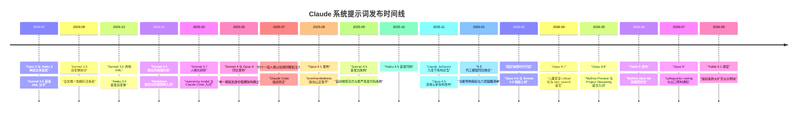

# 全景矩阵：18 模型 × 30 条目发布史（2024-07 → 2026-09）

## 矩阵用途与数据口径

本篇是研读束的索引中枢，解决一个具体问题：**快速定位任意模型、任意日期的提示词版本**。当你需要回答「Opus 4 在 2025 年 7 月底用的是什么提示词」「固定快照机制从哪个模型开始」这类问题时，直接查主矩阵与四张分时代子表即可。

数据口径说明（三条均需知悉）：

1. **模型数**：18 个模型子页，与官方 overview 页卡片列表一致（F-OV-001），排列顺序亦按官方新→旧序；
2. **条目数**：合计 30 个日期条目（F-OV-006）：3.x 时代 8 条 + 4.0/4.1 时代 7 条 + 4.5 代 8 条 + 固定快照时代 7 条。Spec 早期曾据旧版单页快照估计为 16 模型 × 28 条目，实际采集核实为 18 × 30（Fable 5.1 于 2026-09-01 上线补齐末班车），以核实数为准；
3. **页面行数**：为官方 .md 原文落盘后实测（PowerShell 统计非空行），与事实登记中的全文行数口径略有差异，此处以实测值为准，用于体量对比而非行号索引。

## 主矩阵：18 模型全景

下表按官方 overview 页卡片排列顺序（新→旧，F-OV-001）逐行列出 18 个模型子页。一行即一个页面：想看某模型发过几个版本，看「日期条目」列；想判断它的体量，看「页面行数」列；想快速了解它在这一代的意义，看「要点一句话」列。

架构代际取值依据事实登记中的结构判定：单段文本（Opus 3 / Haiku 3）、XML 分节与无标签段落（Sonnet 3.5 跨两代）、无标签段落（3.5 后期至 4.1）、behavior_instructions 与 claude_behavior 九章节（4.5 代）、固定快照（4.6 起每模型单条目）。

| 模型 | 官方子页 slug | 日期条目 | 架构代际 | 页面行数 | 要点一句话 |
|------|---------------|----------|----------|----------|------------|
| Claude Fable 5.1 | claude-fable-5-1 | 1（2026-09-01） | 固定快照 | 129 | 版权双段与示例块首见；工具调用后答复规范；毒品条款转介减害站点 |
| Claude Opus 5 | claude-opus-5 | 1（2026-07-24） | 固定快照 | 104 | safeguards routing 与出口管制通知全语料唯一；Mythos tier 结构化；Claude Tag 入列 |
| Claude Fable 5 | claude-fable-5 | 1（2026-06-09） | 固定快照 | 101 | Mythos-class tier 双模型定位开场；毒品条款与 end_conversation 首见 |
| Claude Opus 4.8 | claude-opus-4-8 | 1（2026-05-28） | 固定快照 | 118 | default_stance、tool_discovery、tone_preference 首见；Mythos Preview 与 Glasswing 入词 |
| Claude Opus 4.7 | claude-opus-4-7 | 1（2026-04-16） | 固定快照 | 104 | 儿童安全 critical 化；tool_search 机制首见；Cowork 更名 Claude Cowork |
| Claude Sonnet 4.6 | claude-sonnet-4-6 | 1（2026-02-17） | 固定快照 | 84 | 反依赖条款群首见；危机直接响应升级；Powerpoint agent 入列 |
| Claude Opus 4.6 | claude-opus-4-6 | 1（2026-02-05） | 固定快照 | 84 | 固定快照机制起点；仍自称 Claude 4.5 家族；NEDA 断连改指新资源 |
| Claude Opus 4.5 | claude-opus-4-5 | 2（2025-11-24、2026-01-18） | claude_behavior 九章节 | 154 | 直接以新架构发布；知识截止 May 2025 三模型唯一；危机处理细则最全 |
| Claude Haiku 4.5 | claude-haiku-4-5 | 3（2025-10-15、2025-11-19、2026-01-18） | behavior_instructions → claude_behavior 九章节 | 217 | Sonnet 4.5 的最小改动衍生版；fastest for quick questions 人设 |
| Claude Sonnet 4.5 | claude-sonnet-4-5 | 3（2025-09-29、2025-11-19、2026-01-18） | behavior_instructions → claude_behavior 九章节 | 217 | 首发旧架构自动搜索；11-19 重构定型九章节；2026-01 获功能导购授权 |
| Claude Opus 4.1 | claude-opus-4-1 | 1（2025-08-05） | 无标签段落 | 71 | evenhandedness 政治公正章节；human→person 术语统一；家族三元化 |
| Claude Opus 4 | claude-opus-4 | 3（2025-05-22、2025-07-31、2025-08-05） | 无标签段落 | 167 | 单一模板+身份插槽架构；07-31 一次性注入约十一段人格认知规则 |
| Claude Sonnet 4 | claude-sonnet-4 | 3（2025-05-22、2025-07-31、2025-08-05） | 无标签段落 | 167 | 与 Opus 4 各条目除身份插槽外逐字相同；smart efficient for everyday use |
| Claude Sonnet 3.7 | claude-sonnet-3-7 | 1（2025-02-24） | 无标签段落 | 58 | 人格化转折点（more than a mere tool）；reasoning model 入词；单变体化 |
| Claude Sonnet 3.5 | claude-sonnet-3-5 | 4（2024-07-12、2024-09-09、2024-10-22、2024-11-22） | XML 分节 → 无标签段落 | 188 | 3.x 演进主线载体；全文唯一加粗差异标注条目 |
| Claude Haiku 3.5 | claude-haiku-3-5 | 1（2024-10-22） | 无标签段落 | 87 | images 变体时间错位（页面标注日期后被就地更新）；单向辩护协议独有 |
| Claude Opus 3 | claude-opus-3 | 1（2024-07-12） | 单段文本 | 9 | 单段纯文本起点；It 第三人称功能体人设 |
| Claude Haiku 3 | claude-haiku-3 | 1（2024-07-12） | 单段文本 | 9 | 全语料最短骨架条目；与 Opus 3 同日同格式 |

条目数合计校验：12×1 + 1×2 + 4×3 + 1×4 = 30，与 F-OV-006 一致。

读主矩阵时有三点提示：

- **架构代际列**描述的是该页面条目所使用的提示词结构形态；跨架构模型（Sonnet 3.5、Sonnet 4.5、Haiku 4.5）以箭头标注架构切换点，具体切换日期见对应分时代子表；
- **页面行数列**是页面整体体量（含 frontmatter 与全部条目），不能直接比较单条目大小——Sonnet 4 与 Opus 4 各 3 条目共 167 行，而 Haiku 4.5 三条目 217 行，条目均摊后反而后者更大；
- **要点一句话**是全页视角的浓缩，单条目的关键变化请下钻到分时代子表。

## 分时代条目明细

四张子表覆盖全部 30 个条目，每行一条，给出日期、涉及模型与该条目的关键变化。表内日期即官方页面上的 `## <日期>` 标题原文（ISO 格式转写）。

### 3.x 时代（2024-07-12 → 2025-02-24，8 条目）

| 日期 | 模型 | 关键变化一句话 |
|------|------|----------------|
| 2024-07-12 | Opus 3 | 单段纯文本首发；开场三件套（身份、日期占位符、August 2023 截止）确立 |
| 2024-07-12 | Haiku 3 | 单段纯文本，约为 Opus 3 三分之一篇幅；只保留骨架规则 |
| 2024-07-12 | Sonnet 3.5 | XML 三段式结构首秀；图像规则独立标签；知识截止 April 2024 |
| 2024-09-09 | Sonnet 3.5 | 双变体拆分；新增 cutoff 后新闻定性禁令；全文唯一加粗标注处 |
| 2024-10-22 | Sonnet 3.5 | 弃用 XML 转无标签文本；安全工程化大扩充（敏感任务白名单、合法解释优先）；computer use 导流 |
| 2024-10-22 | Haiku 3.5 | 双变体首发；images 变体后被就地更新至 2025 年初水平（含 Sonnet 3.7 内容） |
| 2024-11-22 | Sonnet 3.5 | Markdown 格式规范与列表限制；追问节制；同情条款；computer use 段移除 |
| 2025-02-24 | Sonnet 3.7 | 人格化转折；reasoning model 产品说明；Claude Code 入词；取消双变体 |

### 4.0/4.1 时代（2025-05-22 → 2025-08-05，7 条目）

本时代的核心事件是「单一模板 + 身份插槽」架构确立：模型间差异收缩到定位语与 model string 四要素，版本迭代以整批插入规则段为主。

| 日期 | 模型 | 关键变化一句话 |
|------|------|----------------|
| 2025-05-22 | Sonnet 4 | 极简开场白模板化；单一模板+身份插槽架构确立；election_info 硬编码 |
| 2025-05-22 | Opus 4 | 与 Sonnet 4 除定位语与 model string 外逐字相同 |
| 2025-07-31 | Sonnet 4 | 一次性插入约十一段人格认知规则（反奉承、哲学免疫系统、意识问题改述等）；Claude Code 描述转正 |
| 2025-07-31 | Opus 4 | 增量与 Sonnet 4 完全同构（行级 diff 确认） |
| 2025-08-05 | Sonnet 4 | 正文逐字零差异，随 Opus 4.1 上线的页面重发 |
| 2025-08-05 | Opus 4 | 同上，逐字零差异重发 |
| 2025-08-05 | Opus 4.1 | evenhandedness 六段章节；拒绝门槛收窄至极端立场；human→person 术语统一 |

### 4.5 代（2025-09-29 → 2026-01-18，8 条目）

| 日期 | 模型 | 关键变化一句话 |
|------|------|----------------|
| 2025-09-29 | Sonnet 4.5 | behavior_instructions 旧架构首发；截止后事件自动搜索范式；恶意代码 MUST refuse 最严版 |
| 2025-10-15 | Haiku 4.5 | 与 Sonnet 4.5 首发版几乎逐字同构；搜索策略即采用提示开启范式 |
| 2025-11-19 | Sonnet 4.5 | 切换 claude_behavior 九章节；删除开场白与收尾句；新增三章节；搜索改提示开启 |
| 2025-11-19 | Haiku 4.5 | 与 Sonnet 同日同步手术（正文除人设句外逐字相同，留有同源复制痕迹） |
| 2025-11-24 | Opus 4.5 | 直接以新架构发布；知识截止 May 2025；wellbeing 四段危机细则 |
| 2026-01-18 | Sonnet 4.5 | Claude 4.5 家族叙事；三模型字符串；Cowork 首入；功能导购授权；reminders 扩至六项 |
| 2026-01-18 | Haiku 4.5 | 产品信息与 Sonnet 逐字同步；人设句维持不变 |
| 2026-01-18 | Opus 4.5 | 独享 responding_to_mistakes_and_criticism 章节（认错不卑微）；删除独有 CommonMark 空行细则 |

### 固定快照时代（2026-02-05 → 2026-09-01，7 条目）

每页仅一条目的存档时代，七次发布对应七个全新模型 ID；Mythos 层叙事、儿童安全 critical 化与版权条款是本时代的三大新增主题。

| 日期 | 模型 | 关键变化一句话 |
|------|------|----------------|
| 2026-02-05 | Opus 4.6 | 固定快照机制起点；NEDA 断连改指新资源；election_info 仍内嵌于知识截止章节 |
| 2026-02-17 | Sonnet 4.6 | 反依赖条款群（不感谢求助、不挽留对话）；危机直接响应；Powerpoint agent 入列 |
| 2026-04-16 | Opus 4.7 | 儿童安全升级为 critical 章节（reframe 即拒）；tool_search 延迟工具机制首见 |
| 2026-05-28 | Opus 4.8 | default_stance、tool_discovery、tone_preference 首见；Mythos Preview 与 Project Glasswing 入词 |
| 2026-06-09 | Fable 5 | Mythos-class tier 双模型定位（与 Mythos 5 同底模）；毒品条款与 end_conversation 首见 |
| 2026-07-24 | Opus 5 | safeguards routing 与出口管制暂停-恢复事件通知唯一记载；Claude Tag 入列 |
| 2026-09-01 | Fable 5.1 | 版权复现禁令大扩充与首个示例块；reply_after_tool_calls 首见；知识截止覆盖出口管制窗口 |

## 时间线视图

下表换成时间维度：用 Mermaid timeline 把 18 个发布节点铺在一条轴上，适合先看节奏、再回矩阵查细节。

时间线事件均提取自四个时代事实登记的条目要点，未做任何虚构补充。

读这条时间线时，可以关注三个节奏变化：

- **前密后疏的发布节奏**：2024-07 至 2026-01 间条目密集（23 条，多线并行更新），2026-02 固定快照机制启动后转为「一个新模型 ID 一条快照」的稀疏节奏（7 条）；
- **2025-11 是真正的架构分水岭**：Sonnet/Haiku 4.5 同日切换九章节（11-19），Opus 4.5 随后跟进（11-24），此后再无架构级变更；
- **2026 年的节点全部由新模型发布驱动**：旧模型页面不再更新，时间线上不再出现「已有模型的新条目」。

## 附录：页面行数实测

以下为 18 个官方 .md 页面落盘后的行数实测值（PowerShell 统计非空行），与主矩阵「页面行数」列一致，供引用时核对：

| 子页 slug | 行数 | 子页 slug | 行数 |
|-----------|------|-----------|------|
| claude-haiku-3 | 9 | claude-opus-4-8 | 118 |
| claude-opus-3 | 9 | claude-fable-5-1 | 129 |
| claude-sonnet-3-7 | 58 | claude-opus-4 | 167 |
| claude-opus-4-1 | 71 | claude-sonnet-4 | 167 |
| claude-sonnet-4-6 | 84 | claude-sonnet-3-5 | 188 |
| claude-opus-4-6 | 84 | claude-haiku-4-5 | 217 |
| claude-fable-5 | 101 | claude-sonnet-4-5 | 217 |
| claude-opus-4-7 | 104 | | |
| claude-opus-5 | 104 | | |
| claude-opus-4-5 | 154 | | |

区间两端值得驻足：9 行的单段文本（Opus 3 / Haiku 3）与 217 行的三条目九章节页面（Sonnet/Haiku 4.5）相差约 24 倍，这条曲线本身就是「提示词从说明书长成操作手册」的量化注脚。

## 统计小结

- **条目总数**：30 个日期条目（F-OV-006）——3.x 时代 8 条、4.0/4.1 时代 7 条、4.5 代 8 条、固定快照时代 7 条；
- **模型总数**：18 个模型子页（F-OV-001）；
- **覆盖时长**：2024-07-12（Opus 3 / Haiku 3 / Sonnet 3.5 三页同发）→ 2026-09-01（Fable 5.1），约 26 个月；
- **篇幅区间**：页面实测行数最短 9 行（Opus 3 / Haiku 3 单段文本），最长 217 行（Sonnet 4.5 / Haiku 4.5 三条目九章节），跨度约 24 倍；单条目正文则从 Haiku 3 的约 0.8KB 一路增长到 4.5 代的 96-123 行（约 700-900 词）级别；
- **架构代际谱**：单段文本（2 模型）→ XML 分节（Sonnet 3.5 早期条目）→ 无标签段落（Sonnet 3.5 后期、Haiku 3.5、Sonnet 3.7、Sonnet 4、Opus 4、Opus 4.1）→ behavior_instructions（Sonnet/Haiku 4.5 首发版）→ claude_behavior 九章节（4.5 代中后期）→ 固定快照（4.6 起 7 模型）；
- **条目分布**：6 个多日期条目模型贡献 18 条，12 个单条目模型贡献 12 条；演进叙事的重心几乎全部压在多日期模型上；
- **官方差异标注的可用性分层**：3.x 时代仅 Sonnet 3.5 页声明加粗约定且实际只有 1 处（F-OV-003）；4.0/4.1 时代三页完全无标注（F-40-001）；4.5 代三页标注覆盖最完整（F-45-001）；固定快照时代单条目无需标注。跨时代引用原文时，标注的有无不代表变更的有无。

六个多日期条目模型是纵向研读的首选入口，明细如下：

| 模型 | 条目数 | 条目日期 |
|------|--------|----------|
| Claude Sonnet 3.5 | 4 | 2024-07-12、2024-09-09、2024-10-22、2024-11-22 |
| Claude Sonnet 4 | 3 | 2025-05-22、2025-07-31、2025-08-05 |
| Claude Opus 4 | 3 | 2025-05-22、2025-07-31、2025-08-05 |
| Claude Sonnet 4.5 | 3 | 2025-09-29、2025-11-19、2026-01-18 |
| Claude Haiku 4.5 | 3 | 2025-10-15、2025-11-19、2026-01-18 |
| Claude Opus 4.5 | 2 | 2025-11-24、2026-01-18 |

其中两组「同日同步」结构值得注意：Sonnet 4 与 Opus 4 的三个日期完全同步（且正文除身份插槽外逐字相同）；Sonnet 4.5 与 Haiku 4.5 的后两个日期同日同步（11-19 与 2026-01-18，仅首发日相差两周）——两对模型各自共用一套模板的事实，在日期层面即可直接看出。

## 使用提示

- 逐条目深度解析见四篇时代文档：[02-era-3x.md](02-era-3x.md)、[03-era-4x-launch.md](03-era-4x-launch.md)、[04-era-45.md](04-era-45.md)、[05-era-fixed-snapshot.md](05-era-fixed-snapshot.md)；
- 公开机制、政策边界与研读方法见[总览](00-overview.md)；跨时代条款流变见[06-evolution.md](06-evolution.md)；
- 各条目的逐字引文与行号登记表见 [references/entry-registry.md](../references/entry-registry.md)（F 编号索引），引用原文前请先查该表核对日期条目归属；
- 按日期反查的技巧：如果只知道日期不知道模型，直接在四张分时代子表内搜索日期字符串——同一日期出现在几行，就说明当天有几个条目发布（如 2026-01-18 三行代表三模型同日更新）；
- 按主题反查的技巧：先在[06 形态演化](06-evolution.md)锁定条款名（如反奉承、end_conversation），再按其首次出现时代下钻到对应条目；
- 本矩阵为静态快照（采集时点 2026-09-02）：官方页面是活文档，此后新增的模型或条目不会自动反映在此，引用前建议用主矩阵核对条目数是否仍为 30。
