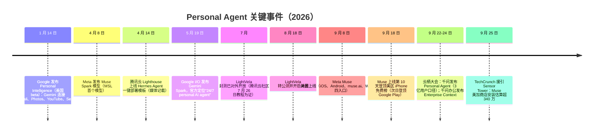

# 2026 年 Personal Agent 集结号：九月时间线与事实层

本文只做事件还原（What/When/Who）。驱动逻辑与竞争格局解读见 [02 篇](02-context-lock-in-war-thesis.md)，产品机制解剖见 [01 篇](01-lightvela-hermes-cloud-agent.md)。

## 时间线

以上每一节点均可在[事实登记](../references/article-source.md)中追溯到 F 编号：Google 两节点见 F-061/F-062；Muse Spark 见 F-047；Lighthouse 模板与 LightVela 公测见 F-051；Muse 上线见 F-046；登顶见 F-049；云栖见 F-057/F-058/F-060；下载量见 F-048。

## Meta Muse：九月的“引爆点”

- **发布**：2026-09-08，Meta 官方新闻室以《Introducing Muse: The World's First Personal AI Agent Built for Everyone》宣布；美国市场，首日开放 iOS App、Android App、网页端 muse.ai 与 WhatsApp 内对话四个入口，限 18 岁以上用户；9 月 17 日新增 Mac 客户端，随后开放加拿大，AI 眼镜当时标注“即将推出”。[F-046](../references/article-source.md)
- **产品形态**：Muse 运行在专属云端计算机（Muse Secure VM）中，自带浏览器，可以开网页、填表、代为协商；用户关闭 App 后长任务继续执行，在需要批准（发邮件、付款）时回来找用户；VM 内另有 Sentinel 监控代理放行联网请求。[F-050](../references/article-source.md)
- **模型与收费**：底层不是 Llama，而是 Meta Superintelligence Labs 的 Muse Spark（2026-04-08 发布）。官方确认“大部分需求免费、更多用量订阅”；媒体多源一致的档位为免费档约 1 亿 token/周、Power 20 美元/月（网页端 16 美元）5 亿 token/周、Maximum 100 美元/月（网页端 80 美元）30 亿 token/周——价格细节属媒体一致口径而非官方逐字价目。[F-047](../references/article-source.md)
- **市场数据（注意口径）**：Sensor Tower 估算经 TechCrunch（2026-09-25，数据截至 9-24）转述，Muse 上线 16 天在 App Store 与 Google Play 的安装量超过 340 万；**该数字仅覆盖当时 Muse 可用的美加市场，不含网页端与 WhatsApp 使用量**，且第三方机构分歧明显（Apptopia 估约 430 万、Appfigures 估约 230 万），应作为区间而非确数引用。登顶发生在上线**第 10 天**（9-18 美区 iPhone 免费榜，9-19 Google Play），比博文所说“两周左右”更快。[F-048、F-049、F-004、F-005](../references/article-source.md)

## 腾讯 LightVela：更早、更安静的一步

- **身份**：官方文档定义为“腾讯轻量云团队推出的云端 Agent 托管产品”，当前提供的产品是开源 Hermes Agent；拥有 lightvela.com（国内）、lightvela.ai（国际）与 lightvela.tencent.com（腾讯子域镜像）三个站点。[F-051、F-010](../references/article-source.md)
- **时间线**：2026-08-18 转入公测并开启计费，比 Muse 上线早约三周；腾讯云社区 2026-07-26 的教程已将其作为在售产品，说明 7 月封测已经存在；媒体另记载腾讯云 Lighthouse 于 2026-04-14 上线业界首个 Hermes Agent 一键部署模板。封测精确起始日无官方定档，“3 月起源”只有单一弱来源。因此“比 Muse 早”的稳妥表述是**以 8 月 18 日公测为锚**。[F-051、F-008](../references/article-source.md)
- **通道**：已接入微信、QQ、企业微信、飞书、钉钉五个国内通道（均有独立官方配置文档；钉钉文档更新至 2026-09-27），国际站另支持 Telegram/WhatsApp/Discord/Slack。机制细节与上游边界见 [01 篇](01-lightvela-hermes-cloud-agent.md)。[F-053、F-016](../references/article-source.md)

## 阿里：同一场云栖，个人与企业两条 Context 线

- **会期**：2026 云栖大会 9 月 22–24 日在杭州举办，主题“智以致用”。[F-057](../references/article-source.md)
- **个人线**：9 月 22 日下午，千问产品负责人郑嗣寿宣布千问正构建全新 Personal Agent 形态，依托 Qwen 3.8 系列，“为 **3 亿用户**提供持续、个性化的智能服务”，并提出构建用户的“全域、终身 Context”；在**用户授权下**接入健康、运动等个人数据，接入海量专业理财数据及机构智能体，并**支持部分用户连接个人持仓**。博文“数亿用户”“连接理财持仓”的概括方向正确，但精确口径以官方通稿为准。[F-058、F-032](../references/article-source.md)
- **企业线**：同一下午的千问办公专场上，陈宇森发表《Context is All You Need》演讲，发布面向企业的上下文数据管理产品“企业上下文（Enterprise Context）”：将企业文档、会议、群聊等“隐性知识”结构化连接、逐层压缩后按需供给 Agent，并打通钉钉/飞书/企业微信数据。博文称其“钉钉 CEO”在任命事实上成立（陈宇森 2026-06-11 起接任钉钉 CEO），但其云栖现场头衔为阿里巴巴集团副总裁、千问办公 CEO。[F-059、F-060、F-033](../references/article-source.md)

## Google：早在一月与五月已落两子

- **Personal Intelligence**：2026-01-14 由 Google Labs VP Josh Woodward 官宣（并非 I/O 节点），美国 beta、面向 AI Pro/Ultra 订阅者、默认关闭；一键连接的对象是 **Gmail、Google Photos、YouTube、Search** 四者（博文漏列 YouTube），且不直接以个人数据训练模型。[F-061、F-035](../references/article-source.md)
- **Gemini Spark**：2026-05-19 Google I/O 发布，官方博文原句即“Gemini Spark: A 24/7 personal AI agent”；跑在 Google Cloud 专用虚拟机上，设备关机后继续工作，由 Gemini 3.5（Flash）+ Antigravity harness 驱动，高风险动作（花钱、发邮件）必须先经用户批准。其发布前内部代号为“Remy”；浏览器操作能力的前身 Project Mariner 已于 2026-05-04 关停，技术并入 Spark 等产品。[F-062](../references/article-source.md)

## 共性形态：四家产品“收敛”在哪

把厂商叙事剥离后，2026 年这批产品共享四个结构特征：

1. **云端常驻**：Agent 运行在用户专属的云端虚拟机/实例中，不依赖本地设备开机（Muse Secure VM、Gemini Spark 云端 VM、LightVela 云端 Hermes 实例）。
2. **长期记忆与主动行为**：记住跨会话事实，可定时执行、主动推送，而不是只在对话窗口内被动应答。
3. **既有入口寄生**：进入用户已经在用的通讯网络（WhatsApp、微信/QQ/企微/飞书/钉钉）或既有账号体系（Gmail/Photos/YouTube/Search、淘宝/支付宝/钉钉），而不是强求新装一个高频 App。
4. **执行而非仅回答**：能操作浏览器、填写表单、跨应用完成多步任务，并在高风险动作前设置人类批准点。

需要注意：“几家同时收敛”是对产品发布事实的归纳，而“收敛后谁赢、入口是否决定胜负”属于博文作者的战略推断，统一在 [02 篇](02-context-lock-in-war-thesis.md)处理。
