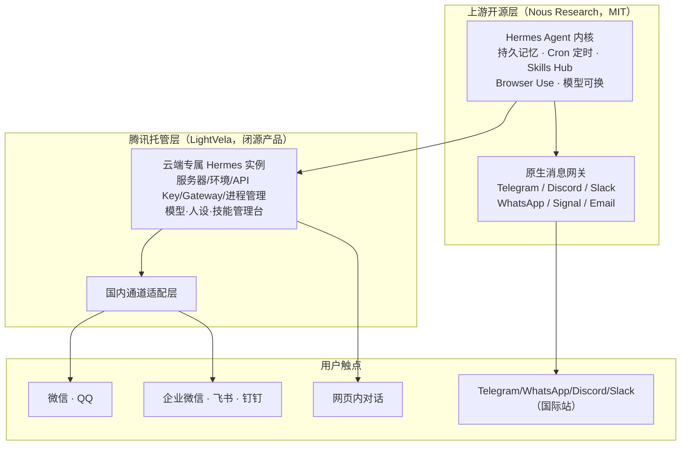

# LightVela 产品解剖：托管开源 Hermes 的云端个人 Agent

## 三层关系：开源内核 → 腾讯托管层 → 国内通道适配

博文一句“腾讯轻量云团队做的产品，目前托管的是开源 Hermes Agent”[F-010](../references/article-source.md) 展开后是清晰的三层结构：

几个容易被“中国版 Muse”比喻掩盖的事实边界：

1. **LightVela 不等于 Hermes**。Hermes Agent 是 Nous Research 以 MIT 许可证开源的项目（GitHub 仓库创建于 2025-07-22，核验时点约 24.9 万 stars——星标是时点数字，会持续变动）；LightVela 是腾讯轻量云团队在其上提供的**托管产品**，官方明确“未来会扩展到更多开箱即用的产品”。[F-052、F-051](../references/article-source.md)
2. **微信等五个国内平台不是 Hermes 上游原生能力**。Hermes 自带的消息网关是 Telegram、Discord、Slack、WhatsApp、Signal、Email（文档另提及 Teams、Home Assistant）；微信/QQ/企业微信/飞书/钉钉由 LightVela 的适配层接入。读开源仓库读不到国内平台支持，读产品文档才能看到——这是“开源内核 + 厂商本地化通道”的典型组合。[F-053、F-025](../references/article-source.md)
3. **腾讯没有重造 Agent 大脑**。博文中“云厂商路线”的概括与官方定位一致：把服务器、环境、模型 API、Gateway、进程管理收进后台，用户面对的是选模型、设人设、装技能、接通道。[F-026、F-027、F-028](../references/article-source.md)

## 实例能力：记忆、定时任务、技能、多模型

| 能力 | 实现方式（官方/上游口径） |
| --- | --- |
| 长期记忆 | Hermes 持久记忆（MEMORY.md/USER.md 与 SQLite 会话存储）；多通道共享同一份记忆与 Agent 行为 |
| 定时任务 | Hermes Cron Scheduling，可定时投递到已接入平台（博文例子：早报、周五项目周报、到点提醒）[F-013] |
| 技能 | Skills Hub 程序性记忆，Agent 可安装技能并从经验生成技能；技能绑定在实例上 |
| 浏览器 | Tool Gateway 中的 cloud browser（Browser Use），支持搜索、浏览器自动化与视觉 |
| 模型可换 | MiniMax、DeepSeek、Kimi、豆包、千问、智谱、文心、MiMo 及任意 OpenAI 兼容端点；官方明确“切换模型不会影响对话记忆”；限制是每实例同一时间仅一个模型生效 |

[F-052、F-054、F-030](../references/article-source.md)

博文“脑子可以换、Agent 的记忆/技能/身份保留”的说法因此不是比喻而是产品机制：模型是可热替换的依赖，实例状态（记忆、人设 Soul、技能、通道）才是用户资产；只有主动删除或重建实例才会永久清除这些状态。[F-054](../references/article-source.md)

## 与 Muse 的同与不同

| 维度 | Meta Muse | 腾讯 LightVela |
| --- | --- | --- |
| Agent 内核 | Muse Spark 模型 + 自研 agentic 栈（MSL） | 开源 Hermes Agent（MIT，Nous Research） |
| 运行位置 | Muse Secure VM（专属云端计算机，Sentinel 监控，规划中 Confidential VM） | 腾讯轻量云托管的云端专属实例 |
| 入口 | 自有 App（iOS/Android/Mac/Web）+ WhatsApp | 网页内对话 + 微信/QQ/企微/飞书/钉钉（国际站另有四个海外平台） |
| 模型策略 | Meta 自有模型封闭驱动 | 模型无关，八家以上国产模型与 OpenAI 兼容端点可切换 |
| 商业模式 | 免费 + 订阅（按 token 用量分档） | 公测期套餐计费（2026-08-18 起） |
| 开放程度 | 闭源产品 | 内核开源、托管层与国内适配层为产品 |

两者趋同的是博文反复强调的部分：云端常驻、关 App 后继续干活、长期记忆、主动提醒、寄生在 IM 里。[F-002、F-006、F-014、F-046、F-050](../references/article-source.md)

## 与 Manus：“保留的 Agent”对照“一个任务”

博文引用的对比文档真实存在。LightVela 官方《LightVela vs Manus》给出的原句是：

> “LightVela 从一个你会**持续使用**的 Agent 开始；Manus 从一个任务开始。”（英文：“LightVela starts with an Agent you keep. Manus starts with a task.”）

博文转写为“长期保留”，语义一致但不是逐字引用。[F-055、F-022](../references/article-source.md)

两者的重心差异：

- **任务型（博文以 Manus 为代表）**：接收完整目标（如“调研 30 家竞品并出报告”），自主查资料、开网页、整理内容，交付一份结果；交互单元是“任务”。
- **陪伴型（LightVela/Muse 的自我定位）**：实例长期存在、跨会话积累记忆与定时职责，交互单元是“持续关系”，复杂任务执行是其上的能力之一。

“外包团队 vs 数字助理”是博文的比喻[F-023]，“两条路线未来会融合（长期 Agent 补复杂任务、任务型 Agent 补记忆与主动性）”是作者预测而非事实[F-024]。实际上 Muse 的长任务执行与 Spark 的多步工作流、Manus 类产品补记忆功能，都能为融合方向提供旁证，但截至本 bundle 生成时没有任何一方完成收敛。

## 合规边界：微信通道不是零风险细节

博文以“把 Agent 塞进微信”为亮点，但没有讨论平台规则。这是读者决策前必须知道的边界：

- 微信安全中心《微信个人账号使用规范》明确禁止使用插件、外挂或**未经腾讯授权的第三方工具/服务**接入微信，处罚可至永久封号；2024-03 微信安全中心公告将“微信机器人（定时群发、自动回复、自动聊天）”与群控、模拟器、多开并列为外挂打击对象。[F-056](../references/article-source.md)
- LightVela 微信通道的形态是“用户扫码授权、由腾讯侧添加官方机器人账号为好友”，与历史上被打击的 itchat/wechaty 扫码登录、Pad 协议、群控路线不同；企业微信通道则走官方机器人接口（当前仅支持 1 对 1，不支持群聊）。[F-053](../references/article-source.md)
- 但**未检索到微信官方针对 LightVela 该接入形态的专门合规背书或豁免声明**。其长期可用性取决于腾讯内部授权状态：通道可能调整，个人号与官方机器人路线的政策也可能变化。企业用途优先评估企业微信/飞书/钉钉这类有官方机器人接口的通道。

## 反常识边界

- “开源”不等于“开箱即用”：自托管 Hermes 仍需自备服务器、模型 API、网关与进程运维；LightVela 卖的正是这层复杂度的消失，而这层在公测期是计费服务，长期价格与配额具有时效性。[F-027、F-051](../references/article-source.md)
- “支持微信”有两种技术含义：官方接口（企微/钉钉/飞书类）与个人号生态。LightVela 文档展示的是授权后添加官方机器人账号，读者不应把它与个人号外挂混为一谈，也不应把它等同于微信官方对第三方 Agent 的永久承诺。
- “模型可换”降低的是模型层锁定，不降低实例层锁定：记忆、技能、人设、通道授权都沉淀在 LightVela 实例内，删除实例即永久清除——迁移成本问题在产品内部同样存在。[F-054](../references/article-source.md)
