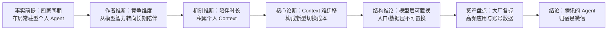

# 从智力竞赛到 Context 锁定：博文论点层拆解

> **分层声明**：本篇处理的是博文的**分析与预测**，不是产品事实。事件与数据见 [00 篇](00-personal-agent-september-2026.md)，产品机制见 [01 篇](01-lightvela-hermes-cloud-agent.md)。以下每条论点都标注“事实前提”与“作者推断”，可被未来事件证伪的部分在文末单列。

## 论证链一览

## 论点一：竞争的标尺从“智力”换成“在场”

- **事实前提**：2026 年 1–9 月，Google（Personal Intelligence、Gemini Spark）、Meta（Muse）、腾讯（LightVela）、阿里（千问 Personal Agent、企业 Context）先后发布常驻云端、带长期记忆、能主动执行的个人 Agent 形态产品；各家官方措辞高度趋同（“24/7 personal AI agent”“持续、个性化的智能服务”“持续使用的 Agent”）。[F-036、F-046、F-051、F-058、F-061、F-062](../references/article-source.md)
- **作者推断**：过去两年行业竞争的主标尺是模型智力——跑分、上下文长度、代码能力、下一代模型发布[F-037]；Personal Agent 出现后，新增的竞争维度是“**谁能长期留在用户身边**”[F-038]。
- **评估**：“同期布局”是事实；“标尺切换”是作者的框架化判断。可观察的支持证据是 Muse 的传播叙事（下载量、WhatsApp 入口）与千问/Google 的发布措辞都在强调持续与个性化而非跑分；但模型智力竞争并未停止（Muse Spark、Qwen 3.8、Gemini 3.5 同期迭代），更准确的说法可能是“标尺叠加”而非“标尺替换”。

## 论点二：Context 是新的切换成本

- **推断链条**：Agent 用得越久，掌握的工作项目、日程、联系人、关注事项乃至用户自己遗忘的承诺越多[F-039]；于是更换 AI 的成本不再只是重下一个 App，而是搬走**记忆、历史、数据、联系人、偏好与长期习惯**——这些构成 Context[F-040]；模型反而越来越容易换，把“脑子”换掉即可[F-041、F-042]。
- **产品层旁证（事实）**：这一推断并非纯思辨——LightVela 的产品设计正是同一组概念的工程化：模型可热替换且“切换模型不会影响对话记忆”，而记忆、技能、人设、通道授权沉淀在实例内，删除实例即永久清除。[F-054](../references/article-source.md) 千问提出的“全域、终身 Context”与 Google 默认关闭、用户逐项授权的 Personal Intelligence，也都在产品命名层面承认 Context 的资产属性。[F-058、F-061](../references/article-source.md)
- **反方可能**：Context 锁定的强度取决于三个尚未被验证的条件——① 跨产品数据可携权（导出/迁移记忆）会不会成为标配；② 用户是否真的长期只使用一个 Agent（多 Agent 并存会稀释锁定）；③ 模型能力再次阶跃时，“重新开始”的成本会不会被更强的冷启动体验抵消。博文对三点均未讨论。

## 论点三：大厂的资产盘点与“入口即归宿”

博文对四家资产的列举属于公开事实层面的盘点[F-043]：

| 厂商 | 个人数据/入口资产（博文列举） | 对应 Agent 落点 |
| --- | --- | --- |
| Google | Gmail、Calendar、Photos、Search | Gemini + Personal Intelligence（授权连接） |
| Meta | WhatsApp、Instagram、Facebook、智能眼镜 | Muse（首日入驻 WhatsApp，眼镜预告） |
| 阿里 | 淘宝、支付宝、高德、飞猪、钉钉 | 千问（个人 Context）+ 千问办公/钉钉（企业 Context） |
| 腾讯 | 微信：联系人、群聊、公众号、小程序、支付、企业微信 | LightVela 已接入微信；最终归属由作者推断为微信 |

- **作者推断**：LightVela 今天看起来只是腾讯轻量云的一个小产品，但若 Personal Agent 成为下一轮 AI 竞争入口，腾讯必须回答“腾讯的 Personal Agent 最后应该住在哪里”，答案不言而喻是微信。[F-044](../references/article-source.md)
- **论证性质**：这是基于资产禀赋的**结构推论**，不是已发生的事实。LightVela 由轻量云团队而非微信团队出品、企业微信通道仅支持 1 对 1、个人微信通道以官方机器人账号形态存在（见 [01 篇合规边界](01-lightvela-hermes-cloud-agent.md#合规边界微信通道不是零风险细节)），都说明微信把 Agent 收为一等公民尚无官方时间表；腾讯内部最终由谁承载个人 Agent（微信事业群、轻量云、或其他团队）是开放问题。
- 博文另提出“让 AI 进入用户原本就在用的沟通网络，可能比培养用户打开新 AI App 更自然”，并判断“它住在哪里”可能和“它有多聪明”一样重要。[F-019](../references/article-source.md) 这是入口论的核心命题，属于作者观点；Muse 借 WhatsApp 传播与 LightVela 借微信触达提供了同向案例，但样本仍少。

## 博文结论的可证伪点

文末结论“竞争从做出更大的 AI App，转向谁能成为你的那个 AI，这场仗才刚开始”[F-045] 可在 `stale_after` 前后用以下信号检验：

1. **留存而非下载**：Muse 及同类产品 3–6 个月后的留存率/活跃数据——高下载低留存将削弱“入口需求被验证”的判断。
2. **通道升级**：微信是否把个人 Agent 升级为一级入口（而非添加机器人账号），或继续维持现有限制；企微/飞书/钉钉通道是否放开群聊与更多接口。
3. **Context 可携性**：头部产品是否提供记忆/数据导出与跨产品迁移；监管是否提出数据可携要求。
4. **组织归属**：腾讯个人 Agent 的承载团队是否从轻量云上升到微信/集团级；阿里千问办公与钉钉、千问 App 的整合是否延续陈宇森线。
5. **路线融合**：任务型 Agent（Manus 类）是否补齐长期记忆与主动服务，常驻型 Agent 是否接管更复杂的长任务——博文预测二者融合[F-024]，可直接对照产品迭代。

## 阅读这篇博文的正确姿势

它的价值在于提出了一个有解释力的框架（**模型层趋同且可替换 → Context 层积累且难迁移 → 入口与数据资产决定终局**），并用四家同期动作做了时点切片；它的局限是作者立场鲜明、预测未设检验条件、对合规与数据可携性讨论缺席。作为知识消费者，建议把 00/01 篇的事实层作为决策输入，把本篇的论点层当作待验证假设，而不是结论。
