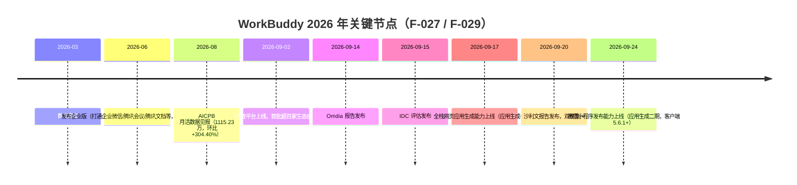

# 双榜第一事件与 WorkBuddy 产品背景

> 本篇对应知识地图第一层（What/When/Who）：博文从哪个事件切入、它评测的产品是什么、这一产品截至 2026-09 处在什么发展阶段。本篇只陈述经过核验的背景事实，不评价实测过程（见 [01](01-one-sentence-mvp-walkthrough.md)）与能力判读方法（见 [02](02-agent-capability-reading.md)）。

## 1. 事件：沙利文报告双榜第一

博文以一份行业报告作为切入：作者称看到沙利文（Frost & Sullivan）《2026 年全球桌面 AI 智能体市场研究报告》，WorkBuddy 同时拿下「中国个人端桌面智能体」与「中国企业级桌面智能体」两个榜单第一（F-002）。核验确认该报告于 **2026-09-20** 发布，央广网、21 世纪经济报道、雷锋网三家媒体同日报道，榜单表述与博文一致（F-024）。

阅读这条声明时需要保留三个限定词，它们也是博文没有拔高的地方：

| 维度 | 准确口径 |
|------|---------|
| 地域 | **中国**（报告名称含「全球」，但双榜范围是中国市场，博文未写成「全球第一」） |
| 品类 | **桌面 AI 智能体**（desktop AI agent），不是泛 AI 助手或大模型总榜 |
| 划分 | 个人端与企业级两个细分市场，WorkBuddy 同时居首 |

报告并非只做排名，其评价体系由两个指数构成（F-025）：

- **产品技术领先指数**：Agentic 能力、Harness 工程、模型适配与可用性、扩展开放——细化到任务规划、工具调用、多 Agent 协作、记忆管理、Computer Use、权限控制、错误恢复、MCP/Skills 与第三方集成等；
- **用户落地实效指数**：桌面体验、多端互联、自动化工作流、企业级能力。

报告将 WorkBuddy 列入面向企业的原生 AI 智能体产品（与 Claude Cowork 等并列），并经媒体转述给出两个醒目的判断：**Harness（模型与外部世界之间的工程化衔接层）是桌面 AI 智能体的「真正胜负手」**；**自定义模型零成本接入构成 WorkBuddy 的「独有护城河」**。这两句是媒体对报告的转述用语，不是腾讯广告语，引用时应保持层级标注（F-025）。

### 同期另外两份机构背书

- **Omdia**（2026-09-14）《全球企业级智能体工作者——2026 年中国市场》：可托付任务效能、团队效能增益、专家与 Skills 生态、执行工程韧性、企业级管控五个维度得分均不低于 4.5，显著高于市场平均；
- **IDC**（2026-09-15）《中国企业级通用 Agent 产品技术评估》：综合得分第一，9 项评估维度中 6 项满分。

两者目前仅见央广网转述、未取得报告原文，按转述级证据对待（F-026）。

## 2. 产品：WorkBuddy 是什么

WorkBuddy 是**腾讯自主研发**、面向办公人群的效率智能体（官方亦称「全能办公 AI 工作台」），与仅做对话问答的聊天机器人定位不同：它可以自主拆解和规划任务、调用工具、在用户授权目录读写本地文件并交付成果（F-023）。

- **形态**：支持 Mac、Windows、Linux 客户端，覆盖桌面、IM、小程序等多端入口（F-023）。
- **专家生态**：官网以「AI 专家团 全场景办公」为定位，称由 **100+ 领域专家**组成虚拟团队，覆盖运营、设计、数据、开发等角色，多专家可并行协作；腾讯云产品页进一步给出软件开发团队的分工样例——产品经理定需求、架构师设计拆任务、工程师实现、QA 验证（F-030）。
- **连接器/技能生态**：通过连接器、专家、Skills 扩展能力边界（产品页称 SkillHub 有 7 万+ Skills，为官方口径）；IM 与办公工具集成是核心卖点之一（F-031）。

> 注意区分两个容易混淆的「微信小程序」：① WorkBuddy 自身的移动端控制入口（官方文档 workbuddymini 页，支持云上/本机双模式）；② **5.6.1 版本新增的「生成并发布用户自己的微信小程序」能力**。博文实测涉及的是第②种，能力细节见 [01](01-one-sentence-mvp-walkthrough.md) §5。

## 3. 时间线：从发布到开放平台（2026 年）

至 2026-09，官方口径 WorkBuddy 已迭代 50+ 版本；开放平台自称是国内首个同时打通硬件、应用、开发者三层生态的 Agent 开放平台；落地覆盖政务、医疗、教育、金融等 50+ 行业，公开客户包括蒙牛、平安、兴业证券、中金公司（F-027，官方/媒体口径）。

## 4. 市场规模旁证：月活数据

科技日报 2026-08-18 援引调研机构 AICPB 数据（F-028）：

- AI 办公**桌面端**国内月活跃用户总量约 **3000 万**；
- WorkBuddy 月活 **1115.23 万**居总榜第一，环比增长 **304.40%**；
- 百度搭子 674.30 万第二；两者合计约占桌面端总活跃的六成。

引用该数据时口径必须写全：**AICPB 统计、桌面端、国内、2026 年 8 月时点**。它与沙利文榜单是两类不同证据——前者衡量用户规模，后者评估竞争力，不能互相替代或合并表述。

## 5. 博文自身的信源属性

本篇知识包的主信源是一篇微信公众号文章《WorkBuddy，提个需求就能做产品了？》（F-032）：

- 标题经网易号「人人都是产品经理社区」同步页确认，同步时间 2026-09-24 17:17，推断公众号原文发布于同日前后；
- 它在小程序发布能力官宣（2026-09-24）当天出现、文末附「不妨亲自试试」的导流语句（F-022），属于**厂商正面实测软文**——实测过程真实可读，但选题、视角与结论对产品有利；
- 微信原文的账号名、精确发布时间以及「是否厂商投放」均无直接证据，不应据同步渠道推断赞助关系并当作事实陈述（F-032）。

因此本束对博文的处理原则是：**事实层（过程描述、可核验的产品能力）与观点层（作者评价）分层登记，核心声明一律外部核验**，核验过程见[核验报告](../references/verification.md)。

## 相关阅读

- [01 一句话到 MVP：实测全流程拆解](01-one-sentence-mvp-walkthrough.md)
- [02 桌面 Agent 能力判读与软文读法](02-agent-capability-reading.md)
- 同组：[WorkBuddy 沙箱公网端点边界](../../workbuddy-sandbox-public-endpoint/index.md)、[腾讯 Buddy 家族产品观察](../../tencent-buddy-family/index.md)
