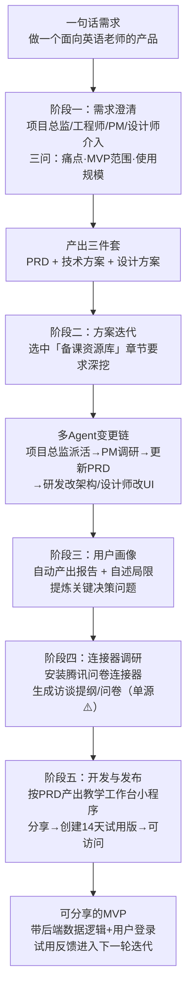

# 一句话到 MVP：五阶段实测全流程拆解

> 本篇对应知识地图第二层（How）：博文作者如何用「一句话需求」测试 WorkBuddy，系统依次做了什么。本篇是**体验叙事的结构化复述，不是可照做的操作教程**——博文步骤以截图承载，文本中没有版本（核验后才知为 5.6.1+）、输入输出与环境记录（F-029），不满足可复现条件。引用时请保留「博文实测口径」与「作者评价」的分层标注。

## 0. 测试设计：刻意不做需求拆解

作者的检验方法是「一句话需求」（F-004）：只表达「我想做个这样的东西」，**不帮系统拆任务、不替它定流程、不告诉它调用什么功能**，分工与推进方式全部由 WorkBuddy 自行决定。任务是从 0 到 1 开发一个面向英语老师的教育类产品，最终产出小程序（F-005）。

这个测试设计的意图很明确：把传统需求工程（需求澄清、角色分工、任务拆分、变更影响面分析）整体交给 Agent，观察其「任务托付」能力而非单点功能。作者的判据在开头已给出——**功能丰富只是基础，面对实际任务能否交付可用成果才是关键**（F-003，作者观点）。

## 1. 全流程一图

## 2. 阶段一：需求澄清与三件套产出

作者在专家团队中选择了「MVP 专家开发团」，其包含产品、设计、研发等不同角色的专家（F-006；该团名是博文口径，官方生态旁证见 F-030：官网称 100+ 领域专家、多专家并行）。

收到一句话需求后，系统调度**项目总监、工程师、产品经理、设计师**四个角色进入工作（F-007），但它没有立即动手，而是先发起澄清，三个问题构成了需求边界框架（F-008）：

1. **核心痛点**：具体想解决老师的哪个痛点？
2. **MVP 范围**：最小可用版本的边界划在哪里？
3. **使用规模**：产品供自己使用、面向校内老师、还是希望不同学校的老师都能用？

作者补充了对老师痛点的初步判断和目标人群设想后，系统很快给出 **PRD、技术方案、设计方案**三份文档，不同角色从各自专业角度分析需求，并把关键问题抛回给作者决策（F-009）。

作者对此的评价是：原本需要产品经理组织的需求讨论由 WorkBuddy 承担，自己只需「给方向、回答关键问题」就能拿到可推进方案（F-010，**作者体验评价**）。

## 3. 阶段二：章节级迭代与多 Agent 变更链

PRD 中规划了「备课资源库」能力。作者认为这一节值得深挖，于是**在 PRD 文档中直接选中该章节**，追加要求「继续考虑怎样进一步提升老师的备课效率」（F-011）。这是一种值得注意的交互方式：变更指令锚定在具体文档片段上，而不是另起对话。

博文描述的变更处理链（F-012）：

1. 「项目总监」Agent 先判断这次变更需要哪些角色参与；
2. 交给「产品经理」Agent 分析需求、开展调研；
3. 调研结论补进 PRD；
4. 同步研发与设计师 Agent，分别更新架构与 UI 设计文档。

作者据此评价：多 Agent 协同能自动判断需求变更的影响面并协调同步，不用逐项提醒（F-012 评点句，**作者体验评价**）。这与沙利文报告技术指数中的「任务规划、多 Agent 协作、工具调用」维度形成呼应，但博文叙事是单一案例展示，不能等同于该能力在任意复杂变更上的普遍表现。

## 4. 阶段三：用户画像、自我披露局限与关键决策问题

作者要求补一份用户画像调研报告。报告完成后，系统**主动说明调研局限**：内容主要根据网上相关用户的帖子整理，要进一步验证还需找老师访谈（F-013）。这种不确定性自我披露是该阶段最值得记录的行为——它没有把网络帖子包装成充分的用户研究。

随后系统结合调研结论，提炼出会影响产品方向的关键问题供作者决策；在作者确认后，又主动追问：是否要据此调整 PRD 中的目标人群与需求优先级（F-014）。

作者把这一阶段的体验归结为「长程记忆」的价值：项目展开后需求、资料、修改记录越来越多，持续上下文使每轮沟通都在已有基础上继续，不必从头解释；他的概括是「WorkBuddy 懂得为什么要做这份调研」（F-015，**作者解读**——长程记忆是产品能力，「懂得」是拟人化体验表述，应与可验证的上下文保持机制区分开）。

## 5. 阶段四：连接器把讨论直接转成调研材料

作者安装「腾讯问卷」连接器后，直接让 WorkBuddy 把此前讨论的问题落实为访谈提纲/问卷等调研材料——无需重复说明调研对象、背景和待验证问题，从而减少跨工具的信息搬运（F-016）。

> **单源边界（F-031）**：WorkBuddy 的连接器/技能生态有官方旁证（SkillHub、IM 与办公工具集成），但**「腾讯问卷」这一具体连接器未在官方公开文档中独立检出，目前仅博文单源**。读者可据此了解设计意图，不应把它当作已核实的连接器目录条目引用。

## 6. 阶段五：按 PRD 开发并发布可访问的小程序

方案确定后，系统按 PRD 继续开发，做出第一版「面向英语老师的教学工作台」小程序（F-017）。发布路径（F-018 博文口径，F-029 核验补全）：

1. 点击小程序预览区域右上角的「分享」；
2. 选择创建试用版小程序；
3. 直接得到一个可访问、可使用的小程序，无需另行部署配置。

核验确认这是 **2026-09-24 上线的微信小程序发布能力**（客户端 **5.6.1 及以上**），官方信息比博文更完整（F-029）：

| 核验项 | 官方口径 |
|--------|---------|
| 底层能力 | 自然语言生成完整小程序，自带云数据库、微信授权/手机号登录、文件存储、AI 调用等云服务，无需自行部署 |
| 有微信小程序账号 | 可发体验版真机测试，再提审正式版 |
| 无账号 | 创建 **14 天试用版**，**不可转为正式版** |
| 身份与操作 | WorkBuddy 以**微信第三方服务商**身份协助代码上传、试用版生成、提审与发布 |
| 能力沿革 | 全栈「应用」生成二期：一期 2026-09-17 上线全栈**网页应用**生成，二期为小程序 |

作者称最终交付的不只是 demo，而是「带后端数据逻辑、支持用户登录使用」的 MVP（F-019 叙述），并认为 MVP 交付时间缩短意味着可以更早交给真实用户试用、获得反馈，把精力放在判断功能价值与下一版改动上（F-019 评点句，**作者体验评价**）。需要注意：博文未提供任何代码审查、性能数据或独立第三方复现，「带后端数据逻辑」应理解为作者在试用中的观察结论。

## 7. 作者的四能力总结与托付命题

博文结尾把全过程归纳为四项能力的衔接（F-020，**作者总结**）：

| 能力 | 在实测中的对应环节 | 对应 F |
|------|-------------------|--------|
| 专家团队 | 把模糊问题想清楚、产出三件套 | F-006~F-010 |
| 多 Agent 协同 | 跟进章节级需求变更、自动同步各角色产物 | F-011、F-012 |
| 长程记忆 | 新信息接上已有讨论、保持决策上下文 | F-013~F-015 |
| 连接器 + 应用发布 | 跨工具生成调研材料；Demo 获得可直接分享的入口，试用问题反哺下一轮 | F-016~F-019 |

最终命题（F-021，**作者观点**）：一个 Agent 能否**理解目标、调度能力、接住变化，并持续把事情推进到结果**，决定了用户愿意把多少工作交给它。对这一命题的结构化解读与软文叙事的识别方法见 [02](02-agent-capability-reading.md)。

## 8. 可复用的阅读要点（非操作步骤）

- 「一句话需求」是一个有效的**评测框架**而非使用建议：真实项目中充分的需求输入仍会显著影响产出质量；
- 观察 Agent 协同要看**变更处理链**（谁判断影响面、谁同步、产物是否联动更新），而不仅是角色数量；
- 对「自主完成」类叙事，应追问三个边界：产物是否可独立访问、账号/数据归属如何、结论有无自我披露局限；
- 文中所有「自动生成 PRD/画像/问卷/小程序」均为单次案例叙事，引用时标注「博文实测口径」。

## 相关阅读

- [00 双榜第一事件与 WorkBuddy 产品背景](00-ranking-event-and-product.md)
- [02 桌面 Agent 能力判读与软文读法](02-agent-capability-reading.md)
- [核验报告：小程序发布能力（F-029）与连接器单源说明（F-031）](../references/verification.md)
