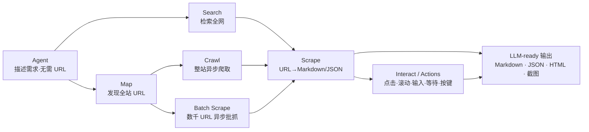

# Firecrawl 是什么：项目身份与七大端点

> 事实层（What）：本篇给出项目身份、可验证的仓库事实与七个核心端点全景。所有数字带 F 编号，可在 [../references/article-source.md](../references/article-source.md) 回溯原文与核验状态。

## 1. 一句话定位

Firecrawl 是一个把「搜索网页、抓取网页、与网页交互」打包成 API 的开源项目，GitHub 仓库 About 的官方定位逐字为 **"The context API to search, scrape, and interact with the web at scale"**（F-004/F-036）。注意这句引语出自仓库 **description 字段**；README 一级标题写的是 "The **API** to search, scrape, and interact…"，"context API" 出现在紧接的第二句——两处措辞官方并行使用（F-036）。

它要解决的是大模型应用最痛的供给问题：训练好的模型只知道「过去」，而 Agent 干活需要实时、完整、干净的网页内容。Firecrawl 的产出物是 **LLM 就绪（LLM-ready）数据**——干净 Markdown、结构化 JSON 与截图（F-009）。

> ℹ️ 本文是**技术综述/开源项目盘点，非一手实测教程**：博文代码片段均转自官方 README 宣传示例，无作者实测过程、版本锁定与运行输出；上手命令仅作生态索引，实操请以官方当前文档为准。

## 2. 仓库事实速查（2026-09-16 核验时点）

| 项 | 值 | 事实 |
|----|-----|------|
| 仓库 | [firecrawl/firecrawl](https://github.com/firecrawl/firecrawl) | GitHub Organization 所有，默认分支 main（F-003/F-035） |
| 创建时间 | 2024-04-15（GitHub）；团队 2022 年以 YC S22 项目起步 | F-035/F-054 |
| 主语言 | TypeScript | F-008/F-035 |
| 许可证 | 主仓库 **AGPL-3.0**；SDK 与部分 UI 组件 **MIT** | F-032/F-062，详见 [02 许可边界](02-access-license-boundaries.md) |
| Star | **181,040**（2026-09-16 API 实测）；博文口径 171,711 对应约 8/28–8/31 | F-005/F-049 |
| Fork / 订阅 | 9,753 forks / 461 subscribers / 626 open issues（早时快照） | F-035 |
| 活跃度 | 高频：08-20~08-31 共 94 个提交，09-16 最新 #4645 | F-049（**博文勘误见下**） |
| 官网 / 文档 | [firecrawl.dev](https://www.firecrawl.dev/) · [docs.firecrawl.dev](https://docs.firecrawl.dev) | F-046 |

### ⚠️ 博文两处事实勘误

1. **「最近一次提交在 2026-08-24」失实（❌）**：commits API 逐日核对，2026-08-20~31 日间有 94 个提交、8 月 31 日当天仍有提交，**博文发布当天（2026-09-01）就有至少 5 个提交**（如 #4490 "(feat/agent) Spark 2 threads"）；核验当日最新提交为 2026-09-16 的 #4645（F-008/F-049）。仓库活跃度比博文描述的更高，而非停在 8 月 24 日。
2. **Star 171,711 的时点要收窄（⚠️）**：博文笼统称「时间拨回 2026 年 8 月」，但 star-history 曲线显示 8 月 1 日约 15.83 万、8 月 24 日约 16.99 万，**171,711 对应约 8 月 28–31 日**；之后 9 月 1 日约 17.39 万、9 月 16 日 18.10 万（F-005/F-049）。数字本身真实，引用时须带具体时点。

## 3. 七大端点：找到网页 → 拿到内容 → 操作页面

官方 README 把能力拆成七个核心端点，覆盖完整数据获取链路（F-010）：

| 端点 | 能力 | 关键事实 |
|------|------|---------|
| **Search** | 像搜索引擎检索全网，直接返回每条结果的**完整页面内容**（标题/正文/Markdown），省掉「搜完再爬一遍」 | README 原文 "full page content from results"；「不是十条链接」是引述方演绎，README 无此对比原话（F-011） |
| **Scrape** | 任意 URL 一键转 Markdown / HTML / 截图 / 结构化 JSON | 最核心能力，「LLM 就绪输出」的起点（F-012/F-009） |
| **Interact** | 抓完页面后继续操作——点击、滚动、输入、等待、按键，可用一句提示词驱动真实网页 | README Why 节列动作原文为 "Click, scroll, write, wait, and press"（F-013/F-023）；REST 形态 `POST /v2/scrape/{scrapeId}/interact`，返回 liveViewUrl（F-041）。**注意：Interact/Actions 现属云端专属能力**（见 [02 开源 vs 云](02-access-license-boundaries.md)，F-055） |
| **Crawl** | 一个请求爬完整站所有 URL，异步任务后台跑，官方 SDK 自动轮询 | 返回 job ID；适合文档站、站点迁移（F-014/F-041） |
| **Map** | 瞬间发现网站全部 URL，支持关键词定位 | `app.map(url, search="pricing")` 直接返回定价相关页面（F-015） |
| **Batch Scrape** | 一次任务异步抓取**数千个 URL**，统一取结果 | README 原文 "thousands of URLs asynchronously"，大规模采集标配（F-016） |
| **Agent** | 最激进的一个：**连 URL 都不用给**，描述需求即可自行搜索、导航、取回 | "No URLs required"（F-017/F-036）；机制详解与能力边界见 [01 Agent 数据工作流](01-agent-data-workflow.md) |

## 4. 两个「省心」承诺及其核验口径

README 用两个数字支撑其可靠性承诺，二者均为**厂商自述基准**，引用时必须带口径（F-024/F-050/F-051）：

- **「覆盖 96% 的网页」**：官网现行口径是在自建的 **1,000-URL 基准数据集 `firecrawl/scrape-content-dataset-v1`（2026-01-13 运行）上取得 96% 成功率**，同基准 Puppeteer 79%、cURL 75%。它是一个**成功率 benchmark**，不是对全网页面的覆盖率普查（F-050）。
- **「P95 延迟 3.4 秒」**：官网原文为同一基准上的 **3,387 ms**（2026-01-13）。博文所称「跨数百万页面实测」**查无官方出处**（官方服务总量口径 "5B+ requests served" 不能当作测试样本）——数字约数成立，样本依据须以官方千 URL 基准为准（❌ 勘误，F-007/F-051）。
- 配套工程承诺：轮换代理、请求编排、限流、JS 拦截内容零配置内置，README 原话 **"no proxy headaches, just clean data"**（F-024，逐字核实）。但要注意：**增强代理（Enhanced proxies）与代理轮换（Proxy rotations）在官方对比表中属于云端专属**，开源自托管版仍需自行解决代理基础设施（F-055）。

## 5. 谁在做：团队与公司

- 三位联合创始人（README 结构化输出示例 + 官网 About 双重证实，F-020/F-061）：**Caleb Peffer**（Co-Founder & CEO）、**Eric Ciarla**（Co-Founder & CGO）、**Nicolas Silberstein Camara**（Co-Founder & CTO，常简写 Nicolas Camara）。
- 法定主体为 **SideGuide Technologies, Inc. d/b/a Firecrawl**（美国特拉华州公司，总部旧金山）；「Mendable」是团队前序产品名（npm scope 至今仍为 @mendable），并非现公司名（F-054/F-042）。
- 融资脉络：2022 年 Y Combinator（YC S22）起步 → 2025-08-19 宣布 **1,450 万美元 A 轮**（Nexus Venture Partners 领投，YC 追投，Zapier、Shopify CEO Tobi Lütke、Postman CEO 等参投）→ 官网 About 列总融资 $16.2M；SEC 2026-09-14 Form D 另显示已售优先股 8,206 万美元（7 名投资者，未披露轮次/估值，About 页尚未更新该数）（F-054）。

> 下一篇 [01 Agent 数据工作流](01-agent-data-workflow.md) 拆解 Agent 与 /extract 的关系、结构化输出、模型演进（spark-1 → spark-2）与媒体解析机制。
