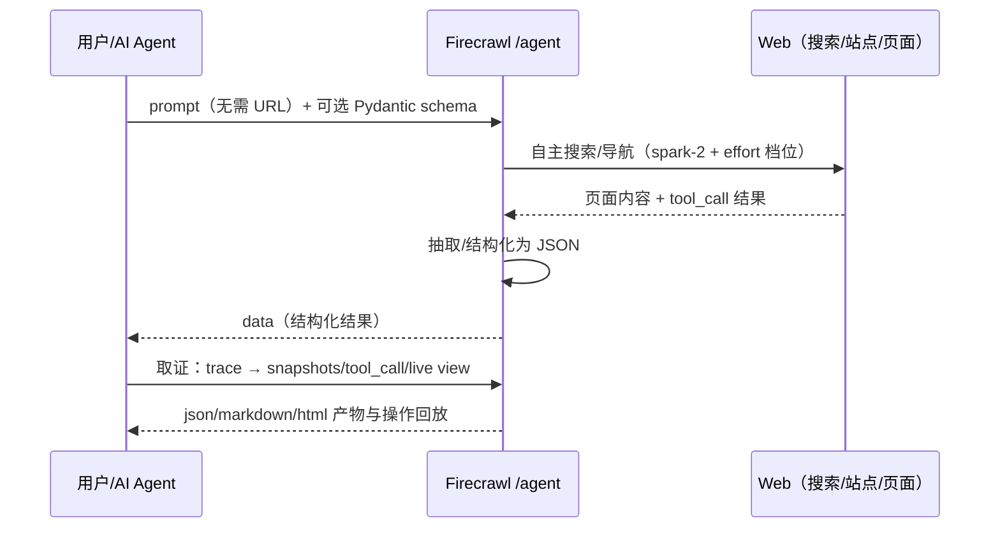

# Agent 数据工作流：从 /extract 进化到 spark-2

> 机制层（How）：拆解 Firecrawl 最具差异化的 Agent 能力——它与 /extract 的真实关系、结果可溯源的精确机制、结构化输出、模型演进现状，以及 Actions 与媒体解析两项配套能力。本篇多处包含对博文口径的精确化修正。

## 1. Agent 是 /extract 的进化版（但 /extract 没下线）

官方 README 原话：**"Agent is the evolution of our `/extract` endpoint: faster, more reliable, and doesn't require you to know the URLs upfront."**（F-018，逐字核实）。选型指南的表述是 "the successor to /extract"，并给出明确迁移建议 **"Use `/agent` instead"**（F-053）。

但「进化版」不等于旧端点已消失，精确状态是（F-053）：

- `/agent` 适合**不知道 URL** 的任务：只给 prompt，URL 可选，Agent 自行搜索/导航/取证；
- `/extract` 适合**已知 URL 集合**的定向抽取；
- `POST /v2/extract` 在当前 API Reference 仍正常文档化，开源版与云端都还提供，**未被正式标记 deprecated**——官方只是"建议迁移"，属于软弃用，不要写成"/extract 已下线"。

### 「返回来源链接」的精确机制（博文口径修正）

博文称 Agent「返回结果的同时还会附上来源链接，数据可溯源」（F-018）。官方文档显示可溯源成立，但机制比"随结果附链接清单"更分层（F-053）：

- Agent 标准完成响应只含 `success / status / data / expiresAt / creditsUsed`，**没有顶层 sources 或 citations 字段**；
- 来源数据通过执行 trace 获取：`artifact.updated` 事件 + `GET /agent/{jobId}/snapshots/{snapshotId}`（可取 json/markdown/html 产物）、各 `tool_call.finished` 的 result，以及 live view 实时浏览器会话；Playground 还可公开分享整次运行过程；
- 官方原话界定："Artifacts are the run's output, not a page-by-page archive."
- 如果要传统的「响应体内直接带 sources 数组」，目前是 **/extract 的 `showSources=true` 参数**提供。

## 2. 结构化输出：Pydantic 描述即所得

Agent 接受用 Pydantic 定义的 Schema，直接返回符合结构的 JSON（F-019）。README 的示例正是「找出 Firecrawl 的创始人」，返回三位创始人结构化信息（F-020）：

```python
# 示例转自官方 README（非作者实测；v2 SDK，firecrawl-py 4.43.0，F-028/F-060）
from pydantic import BaseModel, Field
from firecrawl import Firecrawl

class Founder(BaseModel):
    name: str
    role: str

class FoundersSchema(BaseModel):
    founders: list[Founder]

app = Firecrawl(api_key="fc-YOUR_API_KEY")
result = app.agent(
    prompt="Find the founders of Firecrawl",
    schema=FoundersSchema,
)
```

该示例的真实输出为 Eric Ciarla、Nicolas Camara、Caleb Peffer 三人、role 均为 Co-founder（F-040）；三人姓名与职务另有官网 About 页独立证实（F-061）。

## 3. 模型现状：spark-1 全系弃用，请求统一路由 spark-2

博文用「spark-1-mini 默认、便宜 60%；spark-1-pro 做复杂研究」的二分框架介绍模型（F-021）。核验发现这段描述涉及**官方页面之间的口径冲突与已过期信息**（F-038/F-052）：

| 信源 | 时点 | 口径 |
|------|------|------|
| 官方发布文《Introducing Spark 1 Pro and Spark 1 Mini》 | 2026-01-14 | **"Spark 1 Mini (Default)"**，"Mini is 60% cheaper and handles most extraction tasks with solid accuracy；Pro delivers exceptional recall for complex, multi-step research"——博文说法与该文一致 |
| README「Model Selection (Legacy)」表 | 现行 main | 写 **spark-1-pro (default)**、mini "60% cheaper"——与发布文矛盾 |
| docs.firecrawl.dev/features/agent | 现行 | **"Spark 1 models are deprecated. The Spark 1 model names remain accepted for backwards compatibility, but requests that use them route to spark-2."** |

**现状结论（以现行 Agent 文档为准）**：spark-1-mini 与 spark-1-pro 都已弃用，名字保留仅为向后兼容，任何 spark-1 请求都会路由到当前默认模型 **spark-2**（官方称比 spark-1 更便宜更快、精度相当）（F-052）。"60% 便宜"是 2026-01 发布时点的厂商自述报价，不应作为当前选型依据。另注意官网英文 /features/models 页仍残留 spark-1 旧表（官方文档自身未同步），引用时以 Agent 页弃用声明为准。

### 现在怎么调"推理档位"：effort 而非 model

取代"选 mini 还是 pro"的现行机制是 **effort 三档**（F-039）：

- `low`：简单单站查询；`medium`：多步多页；`high`：深度研究、复杂导航；
- **每个 effort 级别运行的都是 spark-2**——effort 调的是推理预算，不是模型；
- `model` 与 `effort` 同时发送会返回 400（二者互斥）。

## 4. Actions：给爬虫一只能干活的手

Interact 背后的页面操作能力（Actions）覆盖**点击、滚动、输入、等待、按键**五类（README 原文 click, scroll, write, wait, press），可在抓取前后编排执行，例如「帮我搜机械键盘」再「点开第一个结果」这类提示词驱动的真实网页操作（F-013/F-023）。

REST 层交互端点为 `POST /v2/scrape/{scrapeId}/interact`，响应含可旁观的 liveViewUrl（F-041）。**重要边界**：在官方开源 vs 云端对比表中，**Interact/Actions 与 Browser sandbox 同属云端专属能力**，开源自托管默认栈不支持页面动作（依赖另行部署的 Fire-engine）（F-055，详见 [02 接入与边界](02-access-license-boundaries.md)）。

## 5. 媒体解析：网页里的 PDF/DOCX 也能直接变成 Markdown

Firecrawl 可解析网页内嵌文件而无需先下载再单独处理（F-022）。核验补全的官方口径（F-059）：

- 限定词：README 原文说的是 **web-hosted（网页托管的）** PDF/DOCX；
- 支持格式：**PDF、DOCX、DOC、ODT、RTF、XLSX、XLS、HTML** → "clean, layout-aware Markdown"；
- 用法：scrape/crawl 可带 `parsers: ["pdf"]`；**PDF 解析按 1 credit/页计费**；
- 开源解析栈为官方开源的 AnyDoc 与 pdf-inspector（F-047）。

## 6. 一张图看懂 Agent 工作流



> 下一篇 [02 接入与边界](02-access-license-boundaries.md) 梳理九种 SDK/CLI/MCP 接入、开源版与云端的能力分界、AGPL-3.0 许可证边界与合规底线。
