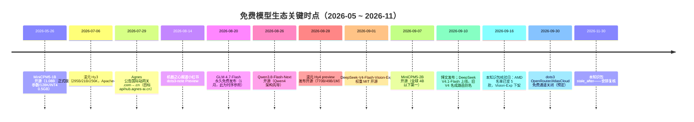

# 免费模型平台全景（2026-09）

> 本篇是知识包的**发布事实层（What/When/Who）**：三个免费平台各自免费什么、怎么注册、截至核验日（2026-09-16）的真实状态。机制原理见 [01 平台机制深潜](01-platform-deep-dive.md)，选型决策见 [02 选型矩阵](02-selection-matrix.md)。
>
> ⚠️ 本篇所有"现行状态"均为 2026-09-16 核验口径（F-062 ~ F-088），博文原始口径（F-001 ~ F-061）在有出入处并列对照。免费政策按周变动，接入前以控制台当日显示为准（F-004）。

## 1. 三平台一句话定位

| 平台 | 是什么 | 免费什么（核验后口径） | 免费期限 |
|---|---|---|---|
| **Agnes AI** | 全模态模型平台，OpenAI 兼容统一网关，含文本/图像/视频模型与 Agnes Code 桌面端（F-006/F-009） | 核心文本模型 agnes-3.0-flash + image/video-2.5-flash 现价 ¥0；文本实际约 20 RPM、4K 图 1 张/分（F-067/F-066） | FAQ 原文"**无限期免费**"，但限流数值可按产品策略调整，视频页用"限时免费"措辞（F-067/F-066） |
| **小红书 dots3** | 小红书（品牌名"点点"，运营关联 askdiandian.com）的预览版多模态模型 dots3-note-prev，280B/16B MoE（F-069/F-070） | 512K 上下文、四模态输入，60 RPM/150 万 TPM，认证用 `api-key` 头（F-071） | **预览期限时免费**：官方直连截止日未公布；OpenRouter/AtlasCloud 免费通道 **2026-09-30 关闭**（F-072） |
| **AMD Radeon Cloud** | AMD 中国开发者平台的 **Token Factory（BETA）** 免费窗口，推理跑在 AMD GPU 云上（F-074） | 核验日 5 款模型（见下）；积分制不扣钱，输入 0.14/输出 0.28/缓存读 0.0028 pts/百万 token（F-076） | 无明确到期日；experimental/BETA，模型名单 6 天内即变更一次，随时可能调整（F-075/F-077） |

**三平台共性**（F-007/F-008，均核验确认）：国内直连无需代理；注册免绑卡；均提供 OpenAI 兼容协议，一把 API Key 即可接入各类客户端。

## 2. AMD 免费名单：博文 4 款 vs 核验日 5 款

博文（2026-09-09 口径）列 4 款"2 LLM + 2 VLM"（F-040）；该名单在 2026-09 初成立，但 **2026-09-16 核验时官方页面已变为 5 款**（F-075）：

| 核验日在列模型（以官网当日为准） | 类型 | 状态 | 与博文名单关系 |
|---|---|---|---|
| DeepSeek-V4-Flash-0731 | LLM | Free | 博文有（注：旧 V4-Flash 名 09-10 起已路由 V4.1-Flash，F-079） |
| Qwen3.8-Flash-Next | 多模态（文本/图像/视频） | Free | 博文有，125B/6B、Qwen4 架构先导（F-080） |
| MiniCPM5-2B | LLM | Free | **取代博文的 MiniCPM5-1B**；2026-09-07 开源的 2B 新版（F-078） |
| Qwen3.8-27B | LLM | Limited Free | **新增**（博文发布后上架） |
| MinerU2.5-Pro | 文档解析向 | Limited Free | **新增**（博文发布后上架） |
| ~~DeepSeek-V4-Flash-Vision-Exp~~ | VLM | — | **已下架**：模型卡返回 "Model card not found"（F-075） |

> 博文将 0.5GB/128K 的端侧规格安在"MiniCPM5-1B"名下、正文另处又写"MiniCPM5-2B 是 4B 斩杀线创造者"——两个型号都真实存在但被混用（F-078）：1B 发布于 2026-05-26（1.08B 参数/128K/INT4 0.5GB/Apache-2.0），2B 发布于 2026-09-07。本地端侧部署请按 HuggingFace `openbmb/MiniCPM5-*` 当日型号选择。

## 3. 注册门槛对照

| 维度 | Agnes AI | dots3 | AMD Token Factory |
|---|---|---|---|
| 平台入口 | platform.agnes-ai.cn（国内站，推荐）/ platform.agnes-ai.com（国际站）（F-009） | https://dots.ai/platform（F-034） | https://developer.amd.com.cn/radeon/modelapis（F-039/F-074） |
| 登录方式 | 国内邮箱/手机号（国内站）；Gmail/GitHub（国际站）（F-009） | +86 手机号 / 小红书扫码（F-069） | 手机号/邮箱/GitHub/CSDN/魔搭 ModelScope（F-041） |
| 绑卡 | 免绑卡 | 免绑卡 | 免绑卡 |
| Key 形态 | 控制台创建，仅展示一次（F-013） | 创建后只展示一次，丢了只能重建（F-034） | 一个 `rc-` 开头 Key 全模型通用（F-074） |
| 账号注意 | 两站账号 9 月现状互不通用（F-011/F-064）；7·29 官方曾承诺无需重新注册，政策有过收紧 | 单平台体系 | 第三方登录仅请求基础公开信息（F-041） |

## 4. 客户端背景：OpenAI 兼容与两个"Buddy/Work"

三平台都用 **OpenAI 兼容协议**接入：客户端只需配置 Base URL + API Key + 模型名三要素（F-005），无需官方 SDK。博文面向的两款客户端归属经核验厘清（F-088）：

- **WorkBuddy**：腾讯云 CodeBuddy 团队（内部代号"小龙虾"）出品的全场景 AI 办公桌面工作台，支持文档/表格/PPT/数据分析，内置混元 Hy3/Hy4，并允许添加 OpenAI 兼容自定义模型——这正是本知识包所有自定义接入的落点。
- **TraeWork**：**字节跳动**产品（2026-06 由 TRAE SOLO 改名，含 Work/Code/Design 模式），与 WorkBuddy 是腾讯 vs 字节同赛道的直接竞品，**不是同一产品**。博文将"WorkBuddy / Trae Work 等 OpenAI 兼容客户端"并列举例，归属未混淆。

> Trae（IDE）侧接入的认证约束与 WorkBuddy 不同（dots3 直连会 401），详见 [01 平台机制深潜 §4](01-platform-deep-dive.md) 与 [dots3 接入演练](../examples/01-dots3-walkthrough.md)。

## 5. 关键时点时间线

> Mermaid 时间线事实分别来自 F-063、F-069、F-072、F-075、F-078、F-079、F-080、F-081。

## 6. 术语最小集

博文 §7 提供约 30 条术语表（F-059），接入前最易踩坑的五条：

1. **Base URL**：调用根地址，各家都必须带 `/v1` 后缀，漏写报 404（F-005/F-017）。
2. **Bearer vs api-key**：Agnes/AMD（OpenAI 端点）用 `Authorization: Bearer <Key>`；**dots3 两端点都用 `api-key: <Key>`**；AMD 的 Anthropic 端点用 `x-api-key`（F-035/F-071/F-074）。
3. **RPM/TPM**：每分钟请求数/每分钟 token 数，超限返回 429，需退避重试（F-059）。
4. **VLM/四模态**：VLM 接收图像；dots3-note-prev 支持文本/图片/视频/音频四种输入但输出仅文本（F-069/F-071）。
5. **Prompt Cache**：重复上下文缓存读取极便宜（AMD 0.0028 pts/百万），多轮对话把历史整段传入可自动命中（F-044/F-076）。

---

**下一篇**：[01 平台机制深潜](01-platform-deep-dive.md)——三协议网关、Thinking 参数、图像尺寸/异步视频两步调用、积分制与认证差异的底层机制。
