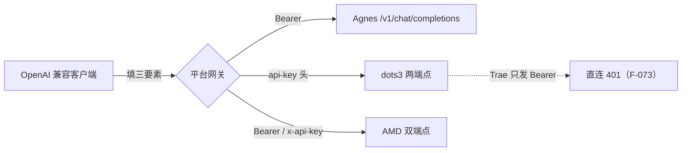
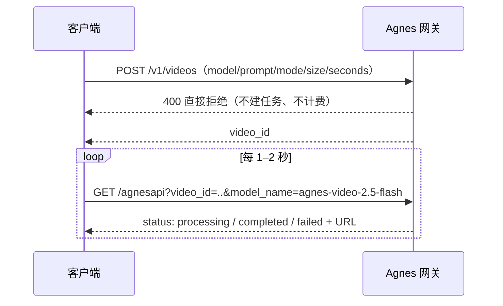

# 平台机制深潜

> 事实层见 [00 平台全景](00-free-model-landscape.md)。本篇解释三平台"怎么工作、为什么这样接"，所有可操作步骤在 [examples/](../examples/index.md)。
>
> ⚠️ 核验口径：本篇机制描述以 2026-09-16 官方文档为准（F-062 ~ F-089）；与博文不一致处显式标注勘误。

## 1. 统一接入模型：三要素 + 一个后缀

三个平台都对外暴露 **OpenAI 兼容接口**，任何支持自定义 OpenAI Provider 的客户端（WorkBuddy、Cherry Studio、Cursor、opencode 等）只需三要素（F-005/F-043）：

| 要素 | 含义 | 通用坑 |
|---|---|---|
| Base URL | 调用根地址 | **必须带 `/v1` 后缀**，漏写报 404（F-005/F-017） |
| API Key | 控制台创建的密钥 | 等同密码，只展示一次，泄露即重置（F-014/F-034） |
| 模型名 | 请求体 `model` 字段 | **区分大小写**，须从平台文档原样复制（F-017） |

> 网络自测技巧（Agnes 站）：浏览器直接开 Base URL 根地址，返回 404 或 JSON 错误都说明网关可达，"打不开"才是网络问题（F-015）。

## 2. 认证头矩阵：三家并不相同

博文把认证笼统写成 Bearer，核验确认三家存在三种口径，**401 故障 90% 出在这里**：

| 平台 | OpenAI 端点 `/v1/chat/completions` | Anthropic 端点 `/v1/messages` |
|---|---|---|
| Agnes AI | `Authorization: Bearer <Key>`（F-009/F-062） | 官方示例用 `x-api-key: <Key>` + `anthropic-version: 2023-06-01`（F-089；第三方实测 Bearer 亦可兼容，但以官方示例为准） |
| dots3 | **`api-key: <Key>`**（非 Bearer）（F-071） | **同样用 `api-key`**（也不是标准 Anthropic 的 x-api-key）+ `anthropic-version: 2023-06-01`（F-071） |
| AMD Radeon Cloud | `Authorization: Bearer <Key>`（F-074） | `x-api-key: <Key>` + `anthropic-version: 2023-06-01`，供 Claude Code 类客户端使用（F-074） |

dots3 的非标准 `api-key` 头是博文特别强调的"最大坑"（F-035），官方文档逐字确认"每次请求都需要通过 api-key 请求头传入"（F-071）。

## 3. Agnes：多协议网关与三代模型状态

### 3.1 一套 Key，三种协议

agnes-3.0-flash 在同一网关上同时提供（F-012，官方页逐字吻合）：

- `POST /v1/chat/completions` —— OpenAI Chat Completions
- `POST /v1/responses` —— OpenAI Responses 协议
- `POST /v1/messages` —— Anthropic Messages 协议

9 月现行国内网关统一为 `https://api.agnes-ai.cn/v1`（FAQ 原文"中国站统一使用以下 Base URL"，F-062）。国际站网关 `apihub.agnes-ai.com/v1` 主机仍存活（F-062）。

### 3.2 双站网关的两个时点（博文公告嫁接勘误）

博文称"官方公告：apihub.agnes-ai.com 切换为 api.agnes-ai.cn（apihub→api）"（F-010）。核验厘清为两件事（F-063）：

1. **2026-07-29 官方通稿**：切换目标是 `https://apihub.agnes-ai.cn/v1`——仅 `.com→.cn`，**主机名 apihub 保留**；通稿同时承诺"无需重新注册、无需换 Key"。
2. **2026-09 现行文档**：统一网关写作 `https://api.agnes-ai.cn/v1`（主机名变为 api），与 apihub.agnes-ai.cn 并行可达。

账号体系另有演变：7·29 通稿承诺两站互通，8–9 月多源实测显示两站 Key 已不通用、混用报"无效的令牌"（F-064）。**接入口径**：新用户直接注册国内站、用 `api.agnes-ai.cn`；不要把博文那句加引号当公告原文。

### 3.3 模型代际状态（博文灰度说法勘误）

| 模型 | 博文口径（F-006） | 核验状态（F-065） |
|---|---|---|
| agnes-3.0-flash | 新一代，"价格待公布" | 刊例价**已公布**：输入缓存命中 ¥0.035、输入 ¥0.35、输出 ¥1.00/百万 token，**当前三项现价 ¥0**；中文文档标上下文 512K |
| agnes-2.5-flash | "灰度中仍可用" | **已全量上线**，新接入可用 |
| agnes-2.0-flash | "灰度中仍可用" | 国际站文档标**已废弃**，建议迁移 2.5，不应在新教程中选用 |

能力侧（函数调用稳定性、多步工具编排、文本+**公开图像 URL** 输入、可信交付）与官方页逐字吻合（F-012/F-065）。注意图像输入是 URL 而非本地文件直传。

### 3.4 Thinking 模式开关

深度思考默认/可开关，两种协议两种写法（F-012/F-071 同款参数也出现在 dots3）：

- OpenAI 协议：`chat_template_kwargs.enable_thinking: true|false`
- Anthropic 协议：`thinking.type: "enabled"|"disabled"`（Agnes 官方 enabled 示例带 `budget_tokens: 2048`）

### 3.5 限流：看"实际 RPM"列

官方 Token Plan（2026-06-22 生效）对免费 default 用户（F-067/F-089）：

| 模型类 | 名义允许 RPM | 实际 RPM |
|---|---|---|
| 文本 | 30 | **20** |
| 图片 4K | 1 | **1** |
| 视频 | — | **1**（博文未提，F-089） |

博文"约 20 RPM、4K 图 1 次/分"精确对应"实际"列；官方声明数值可按产品策略调整（F-067）。FAQ 另有原文"核心 AI 模型可以**无限期免费**使用……完整多模态模型免费，包括文本、图像、视频"（F-067），但视频模型页措辞为"当前**限时**免费"（F-066）——两句话都真实，引用时需带上各自限定。

## 4. Agnes 图像/视频：参数机制与"失败不计费"设计

### 4.1 图像：尺寸是档位不是像素，参数放 extra_body

- `size` 取 1K/2K/3K/4K 四档，`ratio` 取 1:1、3:4、4:3、16:9、9:16、2:3、3:2、21:9 八种，两字段组合（F-020/F-066）。
- 传 1920x1080 这类精确像素会被**自动映射**到最近档位；要标准 16:9 素材应请求 `size:"2K"`+`ratio:"16:9"`，得到 **2624x1472** 再下游裁剪（F-020）。
- **关键机制坑**：`response_format` 不能放请求体顶层，必须放 `extra_body`（URL 输出 `extra_body.response_format:"url"`，图生图 Base64 用 `"b64_json"`）；图生图/多图合成的输入图放 `extra_body.image`（公共 HTTPS URL 或 Data URI Base64），不需要 `tags:["img2img"]`；文生图要 Base64 用 `return_base64:true`；返回读 `data[0].url` 或 `data[0].b64_json`（F-020，官方逐字确认）。
- 客户端超时建议 60–360s（F-020）。

### 4.2 视频：异步两步 + 严格参数校验

- 三种 `mode`：`text`（纯文生）、`keyframe`（首尾帧至少给一个）、`reference`（图片 ≤5 张或音频 ≤3 段；**传参考视频直接 400**）（F-024）。
- Flash 参数是**字符串枚举**：`size` 仅 `"720P"`；`seconds` 为 `"4"`–`"12"`、默认 `"5"`；`n` 固定 1（F-025）。
- 官方 720P 画幅像素表：21:9 1680x720、**16:9 1280x704**、4:3 960x720、1:1 720x720、3:4 720x960、9:16 720x1280（F-078）——博文"16:9 实测 1280x704"与官方表一致，并非偶发实测值。
- **计费友好设计**：参数校验在任务创建时同步完成，失败立即 400、不建任务不产生费用（F-025）。

## 5. dots3：一个非标准认证头引发的客户端分化

- 端点双协议：`https://note3-prev-api.askdiandian.com/v1/chat/completions` 与 `/v1/messages`，模型名 `dots3-note-prev`（F-035/F-071）。
- 上下文 512K 的口径是"**输入 token + 最大输出 token 之和** ≤ 524,288"，不是输入独享 512K（F-071）。
- 默认限流按**单个 API Key**计：60 RPM、150 万 TPM，官方措辞"默认限流值"（控制台另有 RateLimitManagement 页）（F-071）。
- 深度思考默认开启，关闭字段两家写法不同（OpenAI 用 `chat_template_kwargs.enable_thinking:false`，Anthropic 用 `thinking.type:"disabled"`）（F-038/F-071）。
- 视频输入的 TTFT 显著变长是官方文档明文（非博文体感），客户端必须预留超时（F-038/F-071）。

**Trae 直连障碍（博文路径勘误，F-073）**：Trae（IDE）自定义模型只发标准 Bearer、没有自定义请求头入口，而 dots3 强制 `api-key` 头——直连大概率 401。博文"Trae 桌面版可接入"方向不错，但可行路径实际是：① 借道 OpenRouter/AtlasCloud 的 **Bearer** 通道（AtlasCloud 已把 Trae 列入支持客户端）；② 本地头转换代理。注意通道 ① **2026-09-30 关闭**（F-072），关闭后需重新验证。WorkBuddy 自定义渠道允许任意配置，直连可行（F-036/F-073）。

## 6. AMD：积分是"相对用量"不是账单

- 官方品牌 **Radeon Cloud / Token Factory（BETA）**，一账户一个 `rc-` 开头 Key，所有共享模型通用，"想换模型改 model 字段就行"（F-074）。
- 端点：OpenAI `/radeon/api/v1/chat/completions`（Bearer）、Anthropic `/radeon/api/v1/messages`（x-api-key）与 `/v1/messages/count_tokens`（F-074/F-089）。
- 积分单价（pts/百万 token）：输入 0.14、输出 0.28、缓存读 0.0028——恰为 DeepSeek V4-Flash 原美元价的数值，模型卡 JSON 原文 `"Free to use. Points show relative usage—not a charge."`（em-dash，非博文逗号版，含义无损，F-076）。
- 重置节奏存在两个官方口径：credits/usage 页称按亚洲/上海时间每日重置，rate-limits 页称滚动周期——**以登录后控制台为准**（F-076）。
- 并发官方硬指标为每 Key 8（博文"并发 >5 排队"是个人体感，方向相容）；全站 BETA、稳定性字段 experimental（F-077）。
- 额度传言治理（F-077）："每天 $10"只是官方文档示例 JSON 中的数字且官方明示按账户浮动；"已缩到 $1/天"**查无实据且被相反口径覆盖，判传言，本知识包不予采信**；作者"200 万 token 耗 5%"与单价粗算不符（混合负载约 30–60%），仅保留为个人实测。

## 7. Agnes Code：桌面壳机制与三条单源边界

Agnes Code（爱思办公）= 桌面客户端 + CLI 两层壳，本身免费，价值是把账户积分能力图形化（F-027/F-030/F-068）：

- 桌面端连接本地工作空间、与爱思 Web 账户同步订阅/积分，底层**消耗的仍是 Agnes 账户积分**，不存在"桌面版免费额度"（F-030）。
- 安装包经官方 COS 桶分发（Apple/Intel 双 dmg、Windows exe x64、Linux deb x86_64），CLI 装完用 `agnes --version` 验证（F-067 对应官方页，F-068）。
- **三条仅博文单源、不得当官方事实引用**（F-068）：① "Linux 桌面版不与 CLI 混用（官方明示）"——官方页与安装脚本均无此句；② 精确最低系统 macOS 12.0+/Windows 10+——官方未列版本号；③ 八个内置技能 slug 清单——全网零命中，官方仅泛述"技能能力扩展"。

## 8. 横切机制：安全与限流应对

| 机制 | 三平台统一纪律 |
|---|---|
| Key 管理 | 不进代码库/前端/截图/日志/GitHub；丢了重建；泄露立刻重置（F-014/F-038/F-032） |
| 429 退避 | 超限返回 429，批量任务控节奏、勿多 Key 滥用（F-038）；AMD 侧调大客户端 retry（F-044） |
| 数据边界 | 医药、患者、未公开经营数据不传任何第三方云模型，走本地部署（Ollama / 端侧 MiniCPM5）（F-004/F-032/F-044） |
| 输出复核 | 预览/实验模型（dots3 预览版、AMD LIMITED FREE 模型）医疗/法律/财务场景须人工复核（F-038） |
| 缓存省钱 | 多轮对话把历史整段传入可命中 Prompt Cache（AMD 缓存读价仅输出价的 1%，F-044/F-076） |

---

**下一篇**：[02 选型矩阵与免费档全景](02-selection-matrix.md)——三平台横评、勘误后的国内免费档价格表与场景决策树。
