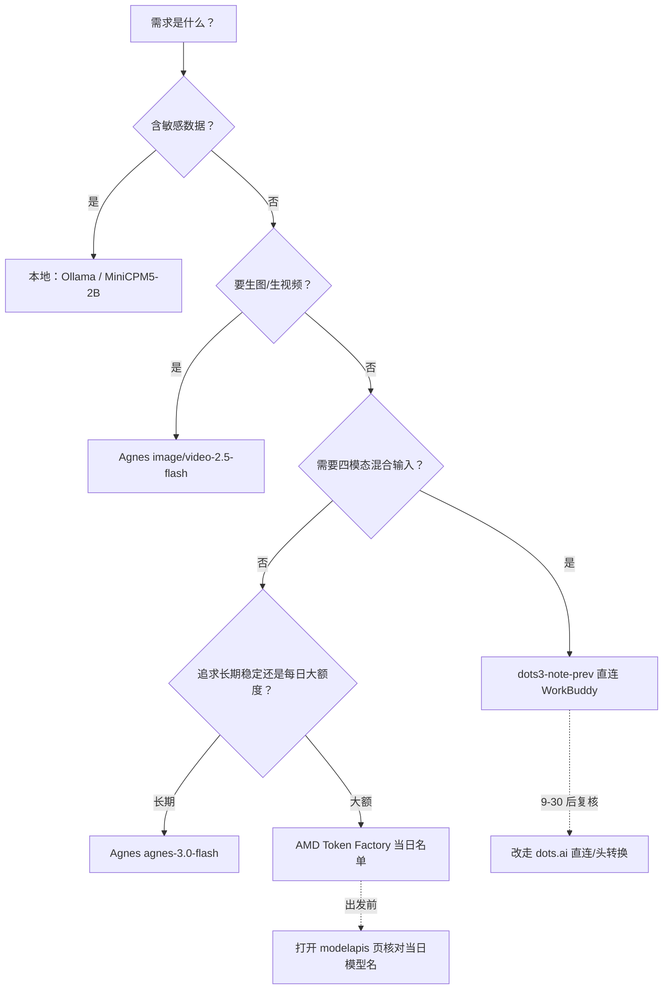

# 选型矩阵与免费档全景

> 机制原理见 [01 平台机制深潜](01-platform-deep-dive.md)。本篇是格局层（Which/When）：三平台横评、博文 §6 全局价格表的勘误版、场景决策树。
>
> ⚠️ 价格与免费档半衰期以**周**计（F-058）。本篇全部数字为 2026-09-16 核验口径，接入/采购前必须以官方控制台当日显示复核（F-004）。

## 1. 三平台横评（核验后口径）

| 维度 | Agnes AI | 小红书 dots3 | AMD Radeon Cloud |
|---|---|---|---|
| 主推免费模型 | agnes-3.0-flash（文本+图像 URL）；image/video-2.5-flash（F-006/F-012） | dots3-note-prev，四模态输入/仅文本输出，280B/16B MoE（F-069） | 核验日 5 款：0731、Qwen3.8-Flash-Next、Qwen3.8-27B、MiniCPM5-2B、MinerU2.5-Pro（F-075） |
| 上下文 | 512K（中文文档，F-063） | 512K=524,288（输入+最大输出合计，F-071） | 1M（0731/Vision 系）/262K 起（Qwen3.8）/128K（MiniCPM5，F-079/F-080/F-078） |
| 免费性质 | FAQ 称"无限期免费"，视频页用"限时免费"措辞；现价 ¥0 但**刊例价已公布**（F-065/F-067/F-066） | 预览期**限时免费**，官方直连截止日未公布（F-069/F-072） | BETA/experimental；积分制不构成真实扣费，名单按周变动（F-074/F-076/F-075） |
| 限流 | 文本实际 20 RPM；4K 图 1 RPM；视频 1 RPM（F-067/F-089） | 60 RPM、150 万 TPM（按 Key，默认值）（F-071） | 每 Key 并发 8；另有 RPM 共享池；"并发>5 排队"为作者体感（F-077） |
| 认证 | OpenAI 端点 Bearer；Messages 端点 x-api-key（F-089） | **两端点统一 `api-key` 头**（F-071） | OpenAI Bearer；Anthropic x-api-key（F-074） |
| 国内直连 | ✅（国内站 api.agnes-ai.cn，F-062） | ✅（dots.ai/askdiandian.com，F-070） | ✅（developer.amd.com.cn，F-074） |
| 绑卡 | 免 | 免 | 免 |
| 最大风险点 | 人多输出慢；免费措辞分层级（F-006/F-067） | OpenRouter Bearer 通道 **2026-09-30 关**；预览版幻觉（F-072/F-038） | 名单 6 天一变；速度慢、高峰排队；LIMITED FREE 可撤（F-075/F-077） |

## 2. 场景 × 推荐矩阵

| 场景 | 首选 | 备选/补充 | 依据 |
|---|---|---|---|
| 日常长周期白嫖文本/Agent/代码 | **Agnes**（无限期口径+三协议+函数调用） | GLM-4.7-Flash（永久免费，F-083） | 作者结论 F-046/F-060，经 F-067 强化 |
| 每日大用量、能接受排队 | **AMD**（每日重置积分，约 $10/天参考折算是二手口径，F-077） | Agnes | F-042/F-046；**$1/天说法已判传言不采信（F-077）** |
| 图文音视频混合输入 | **dots3-note-prev**（四模态输入，512K） | AMD Qwen3.8-Flash-Next（文本/图像/视频） | F-071/F-080 |
| 文生图/文生视频出素材 | **Agnes image/video-2.5-flash**（¥0，720P/4-12s） | — | F-020~F-025/F-066 |
| 端侧/本地部署 | **MiniCPM5-2B**（新，2026-09-07 开源）/ MiniCPM5-1B（0.5GB INT4） | Ollama 本地模型 | F-075/F-078 |
| 文档解析 OCR | AMD **MinerU2.5-Pro**（Limited Free，核验日新上架） | — | F-075 |
| Trae IDE 内使用 | 优先 Trae 内置现行模型；外接 dots3 需 Bearer 通道（**9-30 关**）或头转换 | Agnes（OpenAI 自定义，WorkBuddy 直连可行） | F-073/F-087 |
| 敏感数据（医疗/患者/未公开经营） | **不上第三方**：Ollama / 本地 MiniCPM5 | — | F-004/F-032/F-044 |

## 3. 国内免费档全景（博文 §6 勘误版）

> 博文 §6 表 13 行中 6 行有硬错或口径问题（verification.md 清单②③）。下表只保留经核验的数字，输出价单位为元/百万 token。

| 模型/产品 | 厂商 | 上下文 | 免费档（核验后） | 输出价（核验后） | 裁决 |
|---|---|---|---|---|---|
| agnes-3.0-flash | Agnes | 512K | 现价 ¥0；"无限期免费"FAQ 口径，视频为"限时免费" | 刊例 ¥1.00（缓存命中 ¥0.035） | ⚠️ F-065 勘博文"待公布" |
| dots3-note-prev | 小红书 | 512K | 预览期限时免费；OpenRouter 通道 9-30 关 | — | ✅ F-071/F-072 |
| GLM-4.7-Flash | 智谱 | 200K | 永久免费、约 30 并发、缓存免费 | 0 | ✅ F-083 |
| GLM 5.x（5/5.1/5.2/5.3） | 智谱 | 200K~1M | 新户 2000 万 token 体验包，**90 天有效且分包** | ¥24/28/26.6；GLM-5.3-Flash ¥2.66 | ⚠️ F-083（博文 8–28 元边界错，¥8 是 GLM-4.7 火山档） |
| DeepSeek V4-Flash | DeepSeek | **1M** | 新户 500 万/30 天（此项官方文档无载，❓） | 2026-09-10 起空闲 ¥4/高峰 ¥8（随 V4.1-Flash 降价） | ❌ F-079/F-086 勘博文 64K-128K 与"预告涨价" |
| Qwen-Turbo | 阿里 | 128K | "7000 万"实为**百炼全平台礼包总和**（各模型约 100 万、90 天） | 输出 ¥0.6、思考输出 ¥3 | ⚠️ F-085 |
| ERNIE-Speed-128K | 百度 | 128K | 永久免费不限量（QPS 50） | 0 | ⚠️ F-085：博文把 128K 安给了 Lite |
| ERNIE-Lite-8K | 百度 | **8K** | 永久免费 | 0 | ❌ F-085 勘博文"Lite 128K" |
| 豆包 Seed-2.0-Lite | 字节 | **256K**（最大输出 128K） | 每模型**一次性 50 万 token** 试用（非每月） | ¥3.6/5.4/10.8（按上下文档） | ❌ F-084 勘博文三项 |
| Kimi K2.5 | 月之暗面 | 256K | 网页/App 免费；"API 每月 10 万"无官方出处 | **¥21**（输入 ¥4，缓存命中 ¥0.7） | ❌ F-082 勘博文 6–12 元 |
| Hunyuan-lite | 腾讯 | 社区称 256K | 永久免费（多源一致，官方当前条款页未定位） | 0 | ⚠️ F-085 |
| 混元 Hy3 | 腾讯 | 256K | WorkBuddy 内限时免费；API 输入 ¥1/输出 ¥4 | ¥4 | ✅ F-081（295B/21B，Apache-2.0） |
| 混元 Hy4 preview | 腾讯 | 1M（960K 入+64K 出） | WorkBuddy 限时免费；API 输入 ¥6/输出 ¥18 | ¥18 | ✅ F-081（770B/49B，Apache-2.0） |
| Trae 内置模型 | 字节 | — | 现行：Seed-2.1 系/GLM-5.3 系/DeepSeek-V4.1/Kimi K2.7-Code 等；已转积分会员制 | — | ❌ F-087：博文 6 个型号整体为往代口径 |

> 表格纪律：标 ⚠️/❌ 的行，正文/演练一律采用"核验后"列数字；博文原数字只在 [verification.md](../references/verification.md) 留档对照。

## 4. 组合策略与"免费有尽头"

博文收尾的组合口诀（**作者观点**，F-060）经核验修正后保留：

- **主力组合**：Agnes（无限期口径，文本/生图/生视频）+ AMD（每日重置积分，跑量）；多模态混流交给 dots3。
- **两个必须接受的前提**：① 免费政策按周变动，"以控制台为准"不是客套话——AMD 名单在博文发布后 6 天即变更（F-075）；② 预览/BETA 模型不进生产，dots3 明确"只做开发测试"（F-038），AMD 稳定性字段为 experimental（F-077）。
- **博文"免费有尽头"三例的核验结论**：
  - dots OpenRouter 通道 9-30 关闭——✅ 坐实（F-072），但只是第三方托管通道，不是 dots.ai 官平台关停；
  - AMD Vision 标 LIMITED FREE——✅ 且已实际下架（F-075）；
  - DeepSeek"已预告涨价"——❌ 方向反了，博文发布当天（9-10）官方实施的是降价（F-086）。
- **本地兜底**：敏感数据与"薅不到"场景统一走本地（Ollama 教程合集为博文文末指引；端侧新基线是 2026-09-07 开源的 MiniCPM5-2B，F-078）。

## 5. 与既有知识包的分工（主题簇）

| 知识包 | 分工 | 关系 |
|---|---|---|
| 本束 `free-llm-api-hands-on` | 3 个平台 2026-09 的**深度实操**：注册/Key/curl/客户端配置，全部经官方核验 | 深度 |
| [free-llm-api-roundup](../../free-llm-api-roundup/index.md) | 40 家平台免费额度**广度目录**（2026-06 时点，已 flagged：GitHub Models 退役等） | 广度，用时须先看其勘误 |
| [agnes-ai/agnes-ai-models](../../agnes-ai/agnes-ai-models/index.md) | Agnes 2.5/2.1 代际与 API 系统教程（2026-08-22 基线） | 本束补 3.0/image-2.5/video-2.5 新代际与 9 月网关现状 |

---

**动手实操**：[examples/ 接入演练](../examples/index.md) 提供三个平台从注册到 curl 验证的完整走查。
