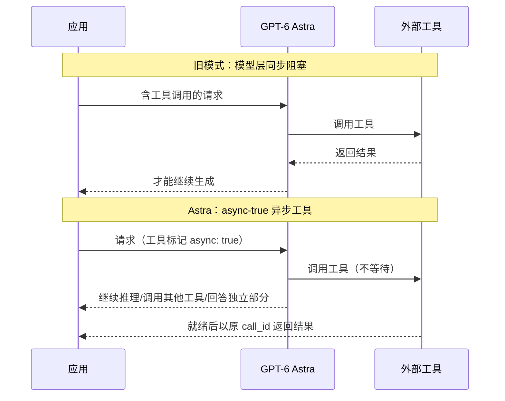
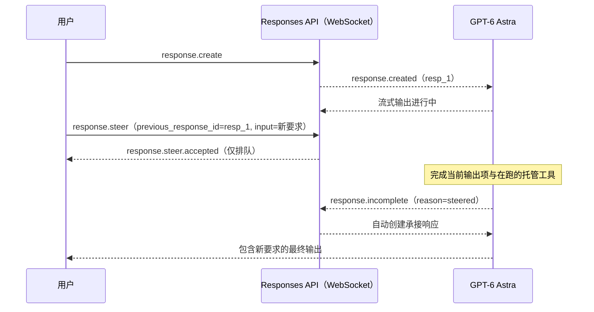

# GPT-6 Astra 发布事实与五项新特性

> 本篇为**发布事实层（What/When）**：模型定位、规格、五项新特性与限制。事实编号 F-0xx 对应 [references/article-source.md](../references/article-source.md)。
> 价格与规格为 **2026-09-16 核验时点**口径；博文发布于 2026-09-07。

## 1. 发布事实

GPT-6 Astra 是 OpenAI 的新旗舰模型，官方定位为"迄今最智能模型"，在 computer use、浏览、软件工程、科学与专业工作上达到 SOTA，尤其擅长跨代码、浏览器与专业软件的**多步工作流**；官方同时称其为最 aligned 的模型——注意边界、尊重任务范围、沟通透明（F-005）。

| 项 | 值 | 出处 |
|----|----|------|
| 发布日期 | **2026-09-03**（The Verge 等报道；博文 09-07 称"还没发布两天"为口语约数，F-006 ⚠️） | F-006 |
| API 模型 ID | `gpt-6-astra`（Responses API 设 `model` 字段） | F-007 |
| 上下文窗口 | 1,050,000 tokens | F-008 |
| 最大输出 | 128,000 tokens | F-008 |
| 知识截止 | 2026-04-30 | F-008 |
| 输入/输出模态 | 文本+图像输入，文本输出（不支持音频/视频） | F-008 |
| 推理档位 | `low` / `medium` / `high` / `xhigh` / `max`（不支持 `none`） | F-020 |
| 企业渠道 | 2026-09-08 起 Amazon Bedrock GA | F-010 |

定价（2026-09-16 模型页核验，博文未含，F-009）：

| 计费项 | 价格（每百万 tokens） |
|--------|----------------------|
| 输入 | $10.00 |
| 缓存输入 | $1.00 |
| 缓存写入 | $12.50 |
| 输出 | $50.00 |

- 输入超过 **272K tokens** 的请求，**整单**按输入/缓存 2x、输出 1.5x 计价
- Batch / Flex 为标准价 50%；Fast 模式为适用费率 2x；Free 档不可用
- 官方声称 Astra 在多项评测中以更少输出 token 取得更好结果，**每任务估计 API 成本**可能低于早期模型——该表述为官方自述，落地仍需以自有工作负载实测

## 2. 特性一：异步工具调用（Async tool calling）

以往标准 tool use 在**模型层**是同步阻塞的：必须等待应用返回工具结果，模型才能继续（开发者的程序可以并行/异步执行工具，但模型本身做不到）（F-011）。

Astra 在应用执行工具期间，模型可以继续推理、调用其他工具或回答请求中相互独立的部分（F-011）。机制（F-012）：

- 在 function 或 custom tool 上设置 `async: true`
- 工具结果就绪后，使用**原始 `call_id`** 返回
- **应用仍负责执行工具并管理 pending 工作**——模型层并发不等于免状态管理

工程含义：应用需要跟踪 pending 工具调用、保留标识符，并决定"晚到的工具结果如何影响已完成的工作"。

## 3. 特性二：中途引导（Mid-turn steering）

模型执行当前任务时，用户可直接插话修改要求或纠正方向，不必等它做完（F-013）。博文的关键分层解读（F-013）：Codex 产品既有的 steer（插队）/queue（排队）实现在**应用编排层**；Astra 将这项能力下沉到了 **Responses API**。

经官方《Mid-turn steering》核验的事件机制（F-014）：

- 仅 GPT-6 Astra 支持、**仅 WebSocket 连接**；GPT-5.6 及更早模型不支持 steering
- 收到 `response.created` 后，在同一连接发送 `response.steer`，只接受三个字段：`type`、`previous_response_id`、`input`
- API 回 `response.steer.accepted`——**仅表示输入已排队，不表示模型已执行**
- 创建自动承接响应前，服务器会先完成当前输出项与已在运行的托管工具；原响应以 `response.incomplete`（reason 为 `steered`）结束；失败事件为 `response.steer.failed`
- **边界**：steering 不改写已发送给应用的输出、不撤销已执行动作、不取消已启动的工具

## 4. 特性三：对话中切换推理强度并保留缓存

同一长对话内可按任务难度随时切换思考强度，无需从头开高档位（F-015）。博文示例：`low` 梳理项目结构 → `high` 认真分析复杂并发问题 → `low` 整理修改说明。

机制（F-016）：向输入添加 **`configuration_update` input item** 调整 reasoning effort；新档位持续生效，直到下一条 `configuration_update` 覆盖。用法要点：在标准单代理请求中使用，**请求级 `reasoning.effort` 保持不变**——这样原 prompt 前缀不被重写，缓存得以保留。

## 5. 特性四：偏离检测（Misalignment monitoring）

检测模型是否正确理解用户意图，聚焦三类后果敏感场景（F-017）：

| 博文场景例 | 对应官方类别 |
|-----------|-------------|
| 让删临时构建文件，却删了整个项目目录 | 破坏性变更（destructive changes） |
| 只授权读某客户数据，却访问其他客户数据 | 访问敏感数据（accessing sensitive data） |
| 让发公开报告，却把含密钥的配置一并发出 | 传输敏感数据（transferring sensitive data） |

系统在**后台异步审查模型的推理过程与操作行为**。关键语义（F-018）：发现问题时，前面的操作可能已经执行完；系统可以停止对话后续执行，但**不会撤销已完成的动作**。

生产集成必须掌握的覆盖面与工程细节（F-019）：

| 请求形态 | 监控 | 自动停止 |
|---------|------|---------|
| Responses API + persisted reasoning / WebSocket / OpenAI compaction | ✅ | ✅ 可识别对话续接并阻断 |
| Responses API（不用上述机制） | ✅ | ❌ 仅 webhook 告警 |
| Chat Completions API | ❌ 不在本监控覆盖（其他安全检查仍适用） | ❌ |

- 流式开始前阻断：HTTP `403`，error type `invalid_request_error`，code **`misalignment_policy_violation`**——代码按 code 匹配，不要按错误文案匹配
- 被阻工作流**不得自动重试**；API 不提供通用恢复入口
- 告警：项目订阅 `safety.alert.created` webhook（只含 alert ID），凭 `api.safety.alerts.read` 权限 `GET /v1/safety/alerts/{id}` 取详情（`request_paused` 为 true 也不代表动作已停或已回滚，需查应用侧任务状态与工具记录）
- 监控会漏报也会误报，**不替代应用侧防护**：最小权限、工具输入校验、敏感动作保持可逆、重大后果人工批准
- 术语注：persisted reasoning（持久化推理，跨调用保留推理过程）、OpenAI compaction（上下文压缩）均为官方提供的对话上下文保持机制；使用这些机制时系统才能把续接请求识别为同一对话并自动阻断

## 6. 两项限制

1. **不支持 `none` reasoning effort**（F-020）：没有 `reasoning: { effort: "none" }` 档位，最低为 `low`；共五档 `low/medium/high/xhigh/max`。迁移时现用 `none`/`minimal` 者建议从 `low` 起步对比效果。
2. **EU 数据驻留与 Fast 模式互斥**（F-021）：开启欧盟数据驻留的 API 项目不能对 Astra 使用 Fast——经核验 `service_tier: "fast"` 与 `"priority"` **均不支持**，须用 Standard 处理；Fast 模式本身不提供延迟 SLA。博文所说"与我们关系不大"即指此条对国内开发者影响有限。

## 7. 迁移要点速览

官方 Migration quickstart 核验要点（F-022）：

- **工具调用必须用 Responses API**（Chat Completions 可调用模型，但不支持工具调用）
- 移除不支持参数：`temperature`、`top_p`、`top_logprobs`；Chat Completions 另移除 `logprobs`，Responses 从 `include` 移除 `message.output_text.logprobs`
- 从 GPT-5.5 或更早迁移：`prompt_cache_retention` 替换为 `prompt_cache_options.ttl: "30m"`
- Codex 可安装 OpenAI Docs skill，执行 `$openai-docs migrate this project to GPT-6 Astra` 让 Codex 应用本指南的推荐改动

## 8. 工程责任小结

三项"不中断续接"能力都把状态管理责任留给了应用侧（本 bundle 基于 F-012/F-014/F-019 的归纳）：异步工具要跟踪 pending 调用与晚到结果；steering 不改写已发送输出、不撤销已执行动作、不取消已启动工具；偏离检测是异步告警/阻断而非回滚。生产集成中这些异常路径都需要独立处理，不能按普通网络错误重试。

---

下一篇：[01 五大行为模式](01-behavior-patterns.md) 解析这些特性背后的模型行为基线；Prompt 原文与使用方法见 [02 官方 Prompt 配方](02-prompt-recipes.md)。
