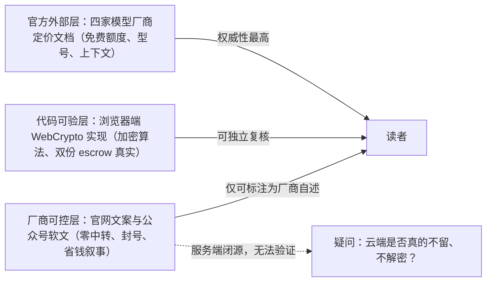

# BYOK 密钥聚合工具与省钱叙事

> **内容性质**：厂商自宣推广文的事实层梳理（非操作教程）。本篇只陈述"博文说了什么、哪些可查证"，安全机制原理见 [01-bring-your-own-key-security.md](01-bring-your-own-key-security.md)，免费模型核验见 [02-four-free-models.md](02-four-free-models.md)。

## 1. 博文在说什么

2026-09-04，微信公众号「风信旗」（作者：检校千牛卫）发布《同事偷偷用这个网站，一年省下5000块 Token 费用》（F-001~F-004）。全文按"问题—方案—资源—行动"四段展开：

| 章节 | 叙事功能 | 可验证性 |
|------|---------|---------|
| PART 01 涨价是真的，"用不起"是假象 | 制造焦虑：多数人按月交会员，会玩的人把免费/低价通道"串成流水线"（F-005/F-006） | 📝 观点，未给出任何具体涨价事实或价格数字 |
| PART 02 把钥匙握在自己手里 | 推出方案：inurl · 聚合 APIToken（F-009~F-016） | 厂商自述，部分有代码印证 |
| PART 03 4 个完全免费的模型 | 给资源：Agnes / GLM-4-Flash / 硅基流动 / LongCat（F-017~F-020） | 可对官方逐一核验，见 02 篇 |
| PART 04 搭一条自己的管道 | 行动号召：统一令牌串联、按成本自动路由（F-022） | 📝 仅口号，**无任何操作步骤** |
| LAST 写在最后 | 价值升华 + 注册引导（F-023/F-024） | 📝 观点 + CTA |

标题中的核心钩子"**一年省下 5000 块**"来自导语中语焉不详的"同事年度账单"（F-007），全文没有账单、没有用量假设、没有对比测算。核验结论：**该数字在产品官网、同公众号另两篇系列软文及全网检索中均查无出处**（F-029）；且从商业模式上，BYOK 工具不经手 token 售卖，用户仍按各厂商原价付费，最多省去中转加价，不产生 5000 元量级的直接价差。此数字不得作为事实引用。

## 2. 产品事实卡：inurl · 聚合 APIToken

> 以下为博文宣称 + 官网/前端代码核验后的对照（核验日 2026-09-16）。标注规则：✅ 代码或官网可直接印证；⚠️ 仅厂商自述、无法独立验证。

| 维度 | 博文/官网宣称 | 核验情况 |
|------|--------------|---------|
| 产品与域名 | inurl · 聚合 APIToken，token.inurl.link（F-009） | ✅ 站点真实在线，为功能完整的单页控制台（含注册人机验证、模型目录、付费套餐入口） |
| 核心定位 | BYOK（自带密钥），与"API 中转"切割（F-010） | ✅ 官网自我定位，设"不是中转，是 BYOK"对比章 |
| 统一令牌 | OpenAI/Anthropic/Gemini/DeepSeek 等 Key 收拢成一枚令牌，代码只认一个（F-011） | ✅ 官网原文+示例令牌 `byok_live_…`；教程页另列通义、智谱、Kimi、豆包、MiniMax、Groq、OpenRouter 及自定义 OpenAI 兼容厂商（F-027） |
| 密钥加密 | 浏览器本地主密钥加密，AES-256-GCM + PBKDF2，云端只存密文（F-012） | ✅ 算法真实：前端实测 PBKDF2（SHA-256，10 万次迭代）派生 AES-GCM 256 密钥，加解密在浏览器 `subtle` 完成；⚠️ "云端不解密"服务端闭源，无法独立证真（F-027） |
| 找回机制 | 双份 escrow 托管，凭恢复密语找回（F-013） | ✅ 注册时生成 escrow_pw 与 escrow_rec 两份密文上传，存在独立找回流程（F-027） |
| 调用路径 | 本机 Agent 发起全部调用、云端零厂商请求、厂商看到 Key 直连（F-014） | ⚠️ 仅厂商自述：本地代理（localhost:3003）闭源、无公开仓库，实际网络行为不可审计（F-028） |
| 协议适配 | OpenAI/DeepSeek/Mistral/Anthropic/Gemini 格式互转、流式归一（F-015） | ⚠️ 仅官网/教程自述，无开源代码与第三方实测 |
| 封号承诺 | 不会被判定"共享代理"封号（F-014） | ⚠️ 对第三方厂商服务条款执行结果的绝对化保证，封号判定权在各厂商 |

## 3. 信源距离：为什么必须打三层折扣

本 bundle 所有结论按信源距离分三层呈现，这是读者使用本文信息前最重要的前提：

- **第一层：营销叙事**——"5000 块""永不涨价弹药库""创作权不被绑票"（F-007/F-021/F-023），无证据或属观点，不具事实效力。
- **第二层：客户端实现**——加密算法与 escrow 双份机制在其前端代码中确有真实实现，不是纯文案（F-027）；但这只能证明"浏览器里发生了加密"，不能证明"服务端如何处理密文"。
- **第三层：第三方事实**——4 个免费模型的额度与能力以各自官方文档为准（见 02 篇），与 inurl 产品可信度无关。

## 4. 运营主体与独立证据风险

核验中发现两项博文完全未提及、但对使用决策至关重要的事实：

1. **运营主体完全匿名**（F-026）：域名 2018 年注册、注册人隐私遮蔽；站点无 ICP 备案号、无公司/团队名称、无隐私政策与服务条款、无任何联系方式；付费入口呈个人化支付宝特征。
2. **第三方独立证据为零**（F-029）：除其自有域名和「风信旗」同号系列软文（另见 2026-09-09《学生党福音！4个免费大模型…》、2026-09-15《AI 模型 API"中转"和"BYOK"…》）外，搜索引擎、GitHub、Gitee、npm、技术社区均无任何第三方报道、评测或开源仓库。

此外其启动器 `byok-launch.bat/.sh` 会自动拉取本地代理程序、且内嵌令牌与主密钥（F-028）。在匿名运营 + 闭源代理的组合下，合理使用姿势是：**技术尝鲜可以，不要存入高价值（付费额度大、可透支）的密钥，不要在生产环境运行其启动器**。安全机制的详细拆解与自查问题见 [01-bring-your-own-key-security.md](01-bring-your-own-key-security.md)。

## 本篇事实索引

F-001~F-016（博文元信息、观点与产品自述）、F-026（域名与主体）、F-027（前端代码）、F-028（本地代理）、F-029（第三方证据为零）；完整登记见 [../references/article-source.md](../references/article-source.md)，逐项核验见 [../references/verification.md](../references/verification.md)。
