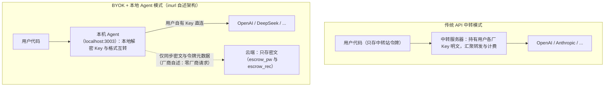

# BYOK 安全机制：与 API 中转的架构差异及信任边界

> **性质声明**：本篇机制描述基于 inurl 官网教程与其**前端代码实测**（2026-09-16），但该产品**本地代理闭源、服务端闭源、无第三方审计**。文中机制图为根据官网自述与客户端代码绘制的架构示意，**非官方文档**；凡服务端行为均标注"⚠️ 厂商自述"。

## 1. 两种多模型密钥管理架构

使用多家大模型 API 时，密钥管理有两种典型形态。博文主推的 BYOK 与常见"API 中转/聚合"的关键差异在**密钥与数据流是否经过服务商**：

| 对比维度 | API 中转 | inurl 自述的 BYOK 架构 |
|---------|---------|----------------------|
| Key 是否交给服务商 | 是，需向中转站登记各厂 Key 明文 | 官网称否：Key 在本地加密，云端仅密文（F-012，⚠️ 服务端未开源） |
| 厂商请求从哪发出 | 中转服务器 IP | 用户本机（本地 Agent，F-014） |
| 厂商看到的调用方 | 中转站共享 IP/账号行为，可能触发反滥用 | 用户自己的 Key 与本机网络环境（F-014，⚠️ 是否"绝不封号"无保证） |
| 服务商跑路/泄露影响 | Key 明文泄露，可被盗刷 | 官网称仅密文泄露；但密文安全性取决于主密钥强度与实现（F-016） |
| 用户需要安装什么 | 通常仅改 base_url | 本机运行 Agent（Node.js 18+ + 自动拉取的代理程序，F-028） |

> 注意：BYOK 不是免费午餐——信任从"信任中转商会善待你的 Key"转变为"信任本地代理程序的代码与更新渠道"。该代理自动下载更新且启动器内嵌凭据（F-028），一旦更新通道被攻破，本机所有 Key 仍可能被读取。

## 2. 客户端加密：AES-256-GCM + PBKDF2 在做什么

博文给出的算法名（F-012）在其前端代码中确有真实实现（F-027），两个原语各有分工：

- **PBKDF2（基于口令的密钥派生，SHA-256，实测 100000 次迭代）**：把用户记忆的主密码（口令）经十万次哈希迭代派生为加密密钥。迭代的意义是让离线暴力猜解口令的成本随迭代次数线性提高；10 万次是 OWASP 近年推荐量级的常见取值。
- **AES-256-GCM**：256 位密钥的 AES 分组密码 + GCM 认证加密模式，同时提供**保密性**（密文不可读）与**完整性**（密文被篡改可在解密时发现，GMAC 校验失败）。
- 流程（据代码调用顺序还原，**非官方文档**）：`主密码 → PBKDF2 派生 → AES-GCM 密钥 → 浏览器 SubtleCrypto 本地加密各厂商 Key → 仅密文上传`。

这解释了博文那句"云端数据库泄露，攻击者也只能拿到密文"（F-016）的**成立条件**：攻击者拿不到主密码、客户端实现无缺陷、服务端确实只存密文。三者任一不满足，结论即失效——而第三条因服务端闭源无法验证。

## 3. 双份 escrow 与恢复密语

"忘密码也能找回"与"云端不存明文"在密码学上本是矛盾诉求（密码丢了如何解密？），inurl 的解法（F-013，代码实测存在）是准备两份独立加密的主密钥副本：

| escrow 份 | 加密密钥派生自 | 用途 |
|-----------|---------------|------|
| `escrow_pw` | 登录密码 | 正常登录时恢复主密钥 |
| `escrow_rec` | 恢复密语（Recovery Secret，注册时仅展示一次） | 忘记密码时，凭恢复密语解密主密钥 |

两份密文注册时一并 POST 至 `/api/escrow`（F-027），站点提供 `/app?tab=recover` 找回流程。这是零知识（zero-knowledge）类密码管理器的通行设计（类似 W3Crypto/WebCrypto 实践），设计本身不新鲜；风险点在恢复密语的保存责任完全转移给用户——**密语丢失且密码遗忘 = 数据不可恢复**，密语泄露 = 等同主密码泄露。

## 4. 本地 Agent 与"永不中转"承诺的证据边界

官网教程描述的本地侧形态（F-028）：本机代理监听 `http://localhost:3003/v1`，暴露 OpenAI 兼容的 `/v1/chat/completions` 与 `/v1/models`；启动器 `byok-launch.bat/.sh` 内嵌统一令牌与主密钥、自动拉取代理程序（要求 Node.js 18+）。

博文/官网的三条强承诺，证据强度需要严格区分：

1. "所有厂商调用从本机发起、云端零厂商请求"（F-014）——**⚠️ 无法验证**。代理二进制闭源、无公开仓库，要证实它不向云端回传数据，需要网络抓包或源码审计；本工作流未执行动态抓包。
2. "格式互转、流式归一"（F-015）——**⚠️ 自述**。OpenAI 兼容接口形态与教程描述自洽，但五厂商互转覆盖度无实测。
3. "不会被判共享代理封号"（F-014）——**无证据的绝对化承诺**。反滥用判定是各厂商服务条款下的单方权利，任何第三方都无法保证其判定结果。

## 5. 读者自查清单（使用任何 BYOK/密钥聚合工具前）

在这类工具中存入 API Key 之前，建议逐项确认：

- [ ] **主体可追责**：运营方是谁？有无备案/公司名/服务条款/联系方式？（inurl 现状：全部缺失，F-026）
- [ ] **代码可审计**：客户端与本地代理是否开源？有无第三方安全审计？（inurl 现状：前端混淆可读但代理闭源，F-028）
- [ ] **网络可观测**：能否自行抓包确认代理只向各厂商 API 域名发请求？
- [ ] **Key 可限额**：存入的 Key 是否已设置消费限额/预算告警，即使泄露损失可控？
- [ ] **更新可信任**：自动更新机制是否可能下发未审查代码？启动器是否内嵌长期凭据？
- [ ] **密语有备份**：恢复密语是否离线保存（密码管理器/纸质），且未与账号信息同处存放？
- [ ] **封号风险自担**：是否理解"不封号"无任何保证，高价值账号不做试验田？

## 本篇事实索引

F-010~F-016（产品安全声明）、F-027（前端加密代码实测）、F-028（本地代理闭源）；完整登记与核验见 [../references/article-source.md](../references/article-source.md)、[../references/verification.md](../references/verification.md)。
