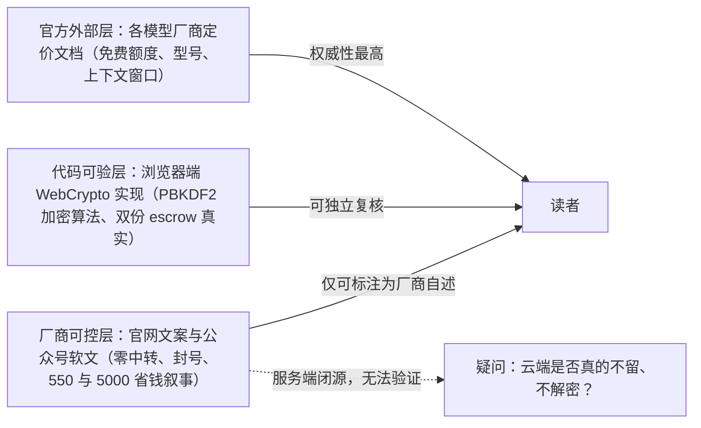

# 双博文档案与产品核验总览

## 1. 双博文档案（同一账号、相隔两天、同一产品）

| 项 | 信源 A：《省钱实录》 | 信源 B：《一年省下5000块》 |
|----|---------------------|---------------------------|
| 完整标题 | 《一个程序员的省钱实录：从月付 500 到 0 元，我是怎么用免费模型干完所有活的》（F-001） | 《同事偷偷用这个网站，一年省下5000块 Token 费用》；封面标「TOKEN 省钱实战 2026.08」（F-106） |
| 作者/账号 | 检校千牛卫 / 微信公众号「风信旗」（F-002） | 同一作者、同一账号，原创，IP 属地河南；账号自述「持续分享 AI 省钱实战与工具干货」（F-107） |
| 发布 | 2026-09-02 22:00，河南，原创（F-003） | 2026-09-04 22:00（F-106） |
| 栏目 | 风信旗 · AI 免费模型实用指南（F-004） | 同系列「AI 省钱实战」 |
| 篇幅 | 约 2800 字，4 张配图，无代码块 | 正文 2090 字符，3 张设计卡片，无表格/代码块（F-106） |
| 叙事结构 | 账单对比 → 三阶段（疯狂付费 → 免费踩坑 → 发现 token.inurl.link）→ 免费工作流 → 质量自辩 → 安全自辩 → 注册号召 | PART 01 涨价焦虑 → PART 02 inurl 方案 → PART 03 四家免费模型 → PART 04「搭管道」口号 → 写在最后 + 注册 CTA（F-122） |
| 核心钩子 | 「月付 550 → 0 元」「省 90%」 | 「同事年度账单省 5000 块」（F-109） |
| 外链 | 主站/教程/模型清单 + 立即体验 CTA | 正文 6 个 URL 全为产品自有/导流短链（4 条 `inurl.link/<厂商名>` + 注册页 + 官网），**无一条第三方信源**（F-116） |

两篇由同一匿名小产品的同账号相隔 42 小时发布，叙事互补（A 偏「个人账单+配置故事」，B 偏「架构原理解释+四家模型清单」），故 2026-09-28 合并为同一知识束；第二文 F-001~F-035 经逐条去重，14 条与信源 A 重复不另立编号、21 条独有原文归并登记为 **F-106~F-122**，完整映射见 [/references/article-source.md](/references/article-source.md) H 区。

## 2. 为什么两篇都判定为推广软文

信源 A 的四条结构性证据（F-005/F-006/F-042/F-043）：

1. **文首横幅广告**：「免费AI Token额度／输入即可领取 高效生成不中断／立即领取」；
2. **单一产品转折点**：全文所有痛点都由同一第三方产品 token.inurl.link 解决，无竞品对比、无替代方案；
3. **文末转化组件**：主站、使用教程、免费模型清单三条链接 +「🔗 立即免费体验」CTA；
4. **效果叙事极端化**：标题与结论均为「500 → 0」「干完所有活」「省 90%」，且成效数字无任何独立出处（F-033/F-038）。

信源 B 呈同样结构（F-108/F-114/F-115/F-116）：PART 01 以「涨价是真的，用不起是假象」制造焦虑却给不出任何具体涨价事实；PART 04「搭一条自己的管道」只有口号、**无任何操作步骤**；正文外链 100% 指向产品自有域或导流短链。此外该账号同期还发布《学生党福音！4个免费大模型…》（2026-09-09）、《AI 模型 API「中转」和「BYOK」…》（2026-09-15）等同系列软文（F-117），构成围绕同一产品的持续投放矩阵。

按博文转化工作流的信源距离分类，两篇均属最高营销叙事浓度的**厂商/推广自宣类**——产品技术声明与成效数字一律按 P0 核验，作者个人账单与「同事账单」一律标注「作者自述/转述」。

## 3. 第二文标题钩子核验：「一年省下 5000 块」❌

第二文标题与导语的核心钩子来自一句语焉不详的「同事年度账单」（F-109，原 byok F-007）。核验结论：

1. **全文无账单、无用量假设、无对比测算**——5000 这个数字在正文没有任何展开；
2. **查无出处**：产品官网、同公众号另两篇系列软文、Bing/百度/搜狗网页与微信检索均无该数字（F-117，原 byok F-029）；
3. **商业模式上不成立**：BYOK 工具不经手 token 售卖，用户仍按各厂商原价向各厂商付费，产品方只收 ¥9.9/¥29.9 月费——它最多替用户省去「中转加价」，不可能在用户年度 token 账单上产生 5000 元量级的直接价差；
4. **传播面旁证**：搜狗微信索引中未见该篇收录（F-122），与「第三方证据为零」互证。

**此数字不得作为事实引用。** 它与信源 A 的「550→0」同属省钱叙事的戏剧化锚点，但比 A 更弱——A 至少给出了账单明细（尽管总额与时间线不可核，见本文 §6），B 连明细都没有。

## 4. 信源距离：为什么结论必须分三层读

两篇博文混合了三类可信度完全不同的陈述，本束所有结论按信源距离分三层呈现：

- **第一层：营销叙事**——「550→0」「5000 块」「永不涨价弹药库」「创作权不被绑票」「0.1 秒切换」（F-038/F-109/F-113/F-115），无证据或属观点，不具事实效力；
- **第二层：客户端实现**——加密算法与 escrow 双份机制在其前端代码中确有真实实现（F-052），不是纯文案；但这只能证明「浏览器里发生了加密」，不能证明「服务端如何处理密文」；
- **第三层：第三方事实**——免费模型的额度与能力以各厂商官方文档为准（见 [01 免费模型图景](01-free-model-landscape.md)），与 inurl 产品可信度无关。

## 5. 产品核验总览：真实运营的个人项目

2026-09-16 对产品公开页面与公开接口的实测结论（未注册、未下载）：

| 维度 | 结论 | 证据 |
|------|------|------|
| 站点可达 | ✅ `/`、`/app`、`/guide`、`/models#free` 全部正常（HTTPS + Cloudflare） | F-044 |
| 后端真实性 | ✅ 不是静态文案壳：`/api/catalog` 实时返回约 424KB、**46 个 provider** 目录；`/api/billing/plans`、`/api/escrow`、`/api/turnstile` 均真实应答 | F-046/F-051 |
| 核心功能 | ✅ 统一令牌（`byok_live_` 前缀）、localhost:3003/v1 本地代理、inurl/inurl-code/inurl-image 路由别名、故障切换 | F-045/F-047/F-048 |
| 浏览器侧安全 | ✅ WebCrypto 实测：PBKDF2（10 万次、SHA-256）派生 AES-GCM-256，双份 escrow 密文，服务端只收密文 | F-052 |
| 商业模式 | ❌ 非「全免费」：免费档限 3 个厂商密钥；¥9.9/月（10 个）；¥29.9/月（无限） | F-051 |
| 本地代理安全边界 | ⚠️ 闭源、运行时下载、启动器内嵌令牌与主密钥——E2EE 不覆盖供应链层 | F-053 |
| 运营主体 | ⚠️ 产品站无公司名/ICP/邮箱/GitHub；域名 2018-12-14 注册（万网，Cloudflare NS，隐私遮蔽）；主域可追溯至河南个人站长（资深 SEO/网络营销）；页面含 VPN 机场广告与返佣短链 | F-056 |
| 第三方独立证据 | ❌ 除自有域名与「风信旗」同号系列软文外，搜索引擎/GitHub/Gitee/npm/技术社区无任何第三方报道、评测或开源仓库 | F-117 |
| 工程成熟度 | ⚠️ 任意路径裸 JSON 报错、生产页残留 Vite 调试探针（2026-09-28 复核：裸 JSON 仍在但精确为 401，HMR 探针已消失，F-085 🔄） | F-057/F-085 |

> WorkBuddy 不是该产品的组件：它是第三方 AI Agent 云沙箱（agentos-app.net 域名、腾讯云 CLB），官方教程只把它与 Cursor、OpenWebUI 并列为「支持 OpenAI 格式的客户端」（F-055）。

### 5.1 2026-09-28 二次复核摘要（站点直证，F-071~F-087）

> 用户指令驱动的提前复核（curl 直打公开页面/接口，未注册未下载），完整报告见 [/references/verification.md](/references/verification.md) §7。

- **核心勘误全部仍成立**：定价三档与免费档 3 密钥上限原样（F-072）、DeepSeek 仍归付费区（F-076）、5 个博文模型 id 仍在目录（F-074）、浏览器侧 PBKDF2/AES-GCM/双 escrow 加密链未变（F-075）。
- **站点目录继续传播已勘误口径**（F-079 ❌）：Agnes「百万级上下文」、百度「每月 100 万」、LongCat-2.0「1M/送千万」三处文案 12 天未修正；免费目录另有旧代/已废弃模型（F-080）——**站点目录不是免费政策的可信事实源**。
- **产品在迭代**：启动器新增 macOS/Linux `byok-launch.sh`（Node 18+）、FAQ 扩至 6 条、新增额度手填与用量统计、首页免注册「实时演示」（F-081/F-083）。
- **新增边界**：catalog 付费条目 19→29，其中 10 家 `public:false`（含 localhost 测试厂商 mock）随公开接口无鉴权下发（F-077）；inurl-video/inurl-audio 在现行 capabilities 下无厂商可路由（F-082）；四页加载主域自研 track.js 采集访问行为（F-084）；主域已变为「互联网精选导航」门户、获取 Key 链接系统化走返佣短链（F-086）；页脚仍无主体信息、机场广告仍在（F-087）。
- **裁决：维持 flagged。**

### 5.2 2026-09-28 三次复核补注（G5：/app 功能全景，F-088~F-105）

> 用户指定对 `/app`、`/#why`、`/models#paid`、`/guide` 四目标深度学习（curl 直打，**未注册、未下载、未运行代理**）。以下全部是**前端渲染文本与内联 JS 暴露出的"界面提供"证据**，证明功能入口与文案存在，不代表后端行为已经实测；完整裁决见 [/references/verification.md](/references/verification.md) §8。

- **零迭代基线**：当日 catalog 与 G4 为**字节级同一文件**（428,592 字节，SHA-256 `3F689C…BD0F1`，F-088）——结构计数（46 商/133 模型/10 家隐藏/caps 12 键无音视频）、定价、turnstile、短链、track.js 全部持续；三处已勘误口径三审未改（F-092 ❌）。
- **/app 控制台七区（界面显示）**：①仪表盘（模型调用量排行、每 4 秒采样的实时请求活动、厂商用量、每 Key 延迟，数据来自本机代理 :3003，F-094）；②厂商密钥库（内置厂商+自定义厂商）；③模型源同步；④设置（令牌/改密+「路由与压缩」面板）；⑤套餐；⑥邀请好友；⑦🛡️系统管理。
- **自定义厂商（界面+教程双证，F-096）**：支持 OpenAI 兼容 / Anthropic / Gemini 三类型，填 baseUrl、路径、逗号分隔的模型 ID、鉴权头与前缀；保存后进入模型目录与对话下拉。
- **运营后台八模块（界面显示，F-097）**：Turnstile 配置、邀请码批量生成、注册用户管理（统计/筛选/通知邮件）、广告管理、资讯模块（1 精选+4 列表）、厂商官网链接、catalog-overrides（**只覆盖展示、不改基础数据、免重新部署**）、**待核销订单——用户扫个人收款码付款后由管理员手动核销升级**。
- **两处支付路径并存（F-098 ⚠️）**：套餐页同时显示「模拟支付成功」按钮（`/api/billing/mock-paid`）与支付宝电脑网站支付（`/api/billing/checkout` 自动回调）+ 填单号等人工核销通道；模型源同步页自述 catalog 由 `shared/catalog.json` 构建期生成、`refresh_catalog.mjs` 索引。生产注册用户界面保留测试支付按钮，属测试设施外露。
- **公开运营接口（F-099/F-100）**：用户类 API 未鉴权返回 401、admin 类返回 403，分层正确；但 `/api/ads`、`/api/news` 无鉴权公开返回运营内容。当日 news 首条**标题（千问 3.8-MAX 首发）与摘要（GPT-4o 生图替代 DALL·E）文不对题**（F-100 ❌）——与 F-092 一同表明：功能开发活跃，但目录数据维护与运营内容校对偏弱。
- **#why 安全论据（F-101）**：首页以「不是中转，是 BYOK」立论——云端不调厂商、厂商看到用户自己的 Key、统一令牌只在本地；均为站点自述。自述统计（6 密钥/8+ 厂商/0/256/100%）未随实际 46 家目录更新。
- **裁决：flagged 第三次维持**（G5 计数 ✅8/⚠️8/❌2/🔄0）；新增对使用者的两条提示：套餐页勿点「模拟支付成功」；/models#paid 卡片整体落后当期旗舰 ≥1 大版本（F-103，详见 [01 免费模型图景](01-free-model-landscape.md)）。

## 6. 博文叙事的时间线硬伤（信源 A）

- 博文自述：**2025-10** 月费约 550 元 → **2026-03** 已降到 0 元（F-008/F-010）；踩坑期注册的服务里包括「新用户送 1000 万 Tokens」的美团 LongCat（F-014）。
- 官方时间线：LongCat「实名新用户 1000 万 tokens」是 **2026-06-30 LongCat-2.0 发布时**才推出的政策（F-059）。
- 两个时间点互斥（F-060 ❌）：要么账单月份是文学化拼贴，要么政策张冠李戴。这削弱了整篇「省钱实录」作为一手实测记录的可信度。

## 7. 为什么本束是 flagged

核验共覆盖两篇软文的全部技术声明（完整清单见 [/references/verification.md](/references/verification.md)），其中六项核心勘误直接打击两篇主结论：

1. **E1（信源 A 核心）**：「17 家 Key + 0 元」与产品自身价格表冲突——免费档只能录 3 家（F-070 ❌）；
2. **E2（信源 A）**：自动路由的免费后端 deepseek 实际收费，产品自己也把它归在付费区（F-064 ❌）；
3. **E3（信源 A）**：写作当天推荐的「GPT-4o / Claude Opus」均已过时（GPT-4o 已于 2026-02 退役）（F-069 ❌）；
4. **E7（信源 B 核心）**：「一年省 5000 块」无账单无测算、全网查无出处，且 BYOK 模式不产生该量级价差（F-109/F-117 ❌，见本文 §3）；
5. **E8（信源 B）**：Agnes「美国」国籍硬错（实为新加坡，F-118 ❌）；其「百万级上下文」与信源 A 同一硬错（官方 512K，沿用 E5/F-062）；
6. **E9（信源 B）**：Agnes「完全免费」实为阶段性 $0 优惠 + 免费层约 20 RPM + 付费档并存（F-119 ⚠️）。

产品不是骗局、架构设计在浏览器侧兑现承诺，但「0 元干完所有活」只在显著收窄的口径下成立，「一年省 5000 块」则纯属营销钩子。本束状态置 `flagged`，`stale_after: 2026-12-16`（取两束较早的复核安排）；2026-09-28 同日已完成 G4 二次复核、G5 三次复核与同主题合并：核心 ❌ 全部原样成立，维持 flagged（见 §5.1、§5.2）。

## 延伸阅读

- [免费模型额度事实与官方现状](/concepts/01-free-model-landscape.md)
- [BYOK 统一令牌与本地代理架构](/concepts/02-byok-unified-architecture.md)
- [成本叙事、分层策略与决策边界](/concepts/03-cost-strategy-boundaries.md)
- 同主题互链：[2026免费大模型API汇总（40家平台）](../../free-llm-api-roundup/index.md)（同为 flagged，免费额度时效性对照）、[EchoBird 模型枢纽桌面工具](../../echobird/index.md)（同形态产品）、[DeepSeek-V4 免费方案与 API 定价](../../deepseek-pricing/index.md)、[Agnes AI 大模型生态](../../agnes-ai/index.md)
