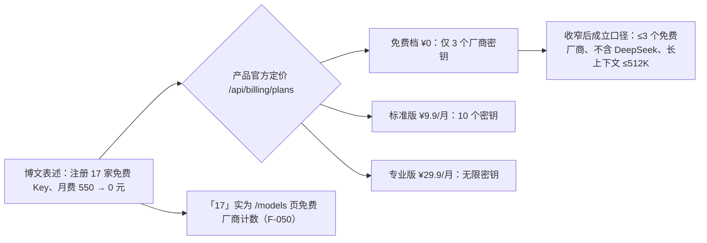

# P0 权威核验报告与勘误清单

> **⚠️ 核验结论：本 bundle 置 `status: flagged`。**
>
> 核验时间 **2026-09-16**，由三个相互独立的核验子代理完成（产品站点浏览器实测／国内模型官方口径检索／海外定价与时效检索），官方文档优先。博文是**推广软文**，其主结论「用 token.inurl.link + 免费模型，月付 500 → 0 元干完所有活」存在 **1 项核心口径冲突（E1）**，并有 **2 项失实（E2/E3）与 3 项口径差异（E4–E6）**。产品本身真实运营、浏览器侧加密兑现，并非诈骗站点，但「0 元全包」不成立。
>
> **🔁 2026-09-28 二次复核（站点直证，F-071~F-087，见 §7）：核心 ❌ 全部仍成立，flagged 维持。** 定价与免费档 3 密钥上限未变、DeepSeek 仍在付费区，且站点目录 12 天内未修正已勘误口径；同时记录产品迭代（跨平台启动器、额度管理、实时演示）与新增边界（测试厂商公开下发、video/audio 分类空转、track.js 行为采集）。
>
> **🔀 2026-09-28 同主题合并（信源 B《一年省下5000块》，F-106~F-122，见 §9）：flagged 维持。** 新增 E7（5000 块查无出处）、E8（Agnes 国籍硬错）、E9（Agnes 阶段性免费）三项勘误；勘误编号续接信源 A 的 E1–E6（第二文「百万上下文」与 E5 同错不另立）；`stale_after` 取两束较早者 **2026-12-16**。

## 1. 核验范围与方法

| 组 | 对象 | 方法 | 说明 |
|----|------|------|------|
| A | token.inurl.link 产品与 10 项功能声明 | browser_use 仅浏览公开页面与公开 GET 接口（`/api/catalog`、`/api/billing/plans`、`/api/turnstile`）与前端 JS | **未注册、未填信息、未下载**本地代理二进制；故代理运行时行为与「云端不中转」仅能验证到设计层 |
| B | GLM-4-Flash、LongCat、百度千帆、Agnes、qwen-coder、DeepSeek、硅基流动、OpenRouter | 厂商官方文档/公告/新闻优先，独立二手来源交叉 | 以 2026-09-16 当日页面为准 |
| C | ChatGPT Plus/Claude Pro 定价、Groq/OpenRouter 免费层、旗舰型号时效 | openai.com、claude.com、console.groq.com、openrouter.ai 官方页面 | 2025-10 历史价格依据官方页面连续无调价记录判定 |

## 2. 勘误四张清单结果

### 清单①　日期/版本/型号

| # | 博文口径 | 权威口径 | 结论 |
|---|---------|---------|------|
| 1 | 「复杂推理还是得 GPT-4o 或 Claude Opus」（F-036，2026-09-02 发布） | GPT-4o 已于 **2026-02-13 从 ChatGPT 退役**；2026-09 旗舰是 **GPT-5.6 Sol**（2026-07-09）；Claude 现旗舰 **Opus 5**（2026-07-24）。且 2025-10 账单时点 GPT-4o 也已非旗舰（GPT-5 于 2025-08 发布） | ❌ **E3：发布当日即过时** |
| 2 | 注册「会有人机验证，请完成 Cloudflare 验证框」（F-022） | Turnstile 组件确已集成（siteKey 存在），但 `/api/turnstile` 当日返回 `enabled:false` | ⚠️ **E6：文案与当下实现脱节**（非硬伤） |
| 3 | 「新用户送 1000 万 Tokens」的 LongCat 被用于「2026-03 已 0 元」叙事（F-010/F-014） | 1000 万政策随 LongCat-2.0 于 **2026-06-30** 才推出 | ❌ **E2b：时间线互斥** |

### 清单②　成效数字溯源表

| # | 博文数字 | 核验 | 处置 |
|---|---------|------|------|
| 1 | 月费 550 元、OpenAI $80 月账单、2026-03 为 0、三周零花费、省 90%（F-008~F-010/F-033/F-038） | 个人账单，天然无外部可核性；订阅单价部分（$20+$20）经官方证实 ✅ | 正文标「作者自述」，不升级为事实 |
| 2 | 限额「0.1 秒内切下一家」（F-025） | 故障转移机制在教程中有说明，但 0.1 秒无任何出处 | 标「厂商/作者自述性能数字」 |
| 3 | 「注册了 17 家免费模型的 Key」且月费 0（F-041） | 「17」是产品 /models 页**免费厂商数量**（F-050）；产品免费档**只允许 3 个厂商密钥**，10 个 ¥9.9/月、无限 ¥29.9/月（F-051） | ❌ **E1：核心口径冲突，详见 §3** |
| 4 | 首页自述「已托管密钥 6 / 支持厂商 8+ / 明文上云 0」（F-045） | 实时目录已含 46 provider（F-046），宣传数字为站点自选口径 | 记录为站点自述 |

### 清单③　口径对照表

| # | 博文口径 | 官方口径 | 结论 |
|---|---------|---------|------|
| 1 | 百度「每月 100 万，月中见底」（F-015） | 千帆 ModelBuilder **每模型** 100 万 tokens、**3 个月有效、不按月重置**；另有 ERNIE-Speed/Lite/Tiny/3.5-8K **永久免费不限量**（限 QPS≈50），博文漏报 | ⚠️ **E4：重置周期错误 + 漏报永久免费层** |
| 2 | 「Agnes AI 的百万上下文」作为免费长文档方案（F-030） | 免费 agnes-2.5-flash（及已废弃 2.0-flash）均为 **512K**；1M 仅付费 **agnes-2.5-pro**（2026-08-01）；6–7 月灰度 1M 高峰即降 512K | ⚠️ **E5：免费拿不到稳定 1M** |
| 3 | LongCat「1000 万 Tokens」隐含为长期免费额度（F-014） | 一次性实名奖励资源包、**30 天有效**；现行 LongCat-2.0 已按量付费（输入 ¥2/输出 ¥8 每百万，折扣价）；「1M 上下文」属该付费新模型 | ⚠️ 一次性礼包被叙述为长期供给 |
| 4 | DeepSeek 是免费自动路由后端（F-024/F-034） | 官方 API 收费（V3/V4 明码标价、V4 峰谷计价），仅小额新人赠送；硅基流动免费层仅 ≤9B 小模型；OpenRouter 免费名单 2026-09 已无 DeepSeek；仅 AMD/Hetzner/WorkBuddy 等限免活动可免费调用，产品 /models 也把 DeepSeek 归**付费 19 家** | ❌ **E2：失实** |

### 清单④　产品/引文逐字核对表

| # | 声明 | 核验 |
|---|------|------|
| 1 | 统一令牌收拢多厂商 Key（F-019/F-023） | ✅ 官网、`/app` 与 `/api/catalog`（46 provider）一致；令牌前缀 `byok_live_`；Unified Token/Recovery Secret 文案存在 |
| 2 | localhost:3003 OpenAI 兼容本地代理（F-020/F-028） | ✅ /guide 原文固定地址 `http://localhost:3003/v1`、`GET /v1/models`；控制台有真实本机轮询逻辑；代理二进制闭源未实测 |
| 3 | 「云端绝不中转、本机直连厂商」（F-020/F-039） | ✅ 设计自洽且有文档/代码佐证意图；⚠️ 属架构自证，依赖运营者自觉；**闭源本地代理 + 启动器内嵌主密钥（F-053）构成 E2EE 不覆盖的供应链层** |
| 4 | AES-256-GCM + PBKDF2 + 双份 escrow（F-027/F-039） | ✅ 前端 WebCrypto 逐字对应：PBKDF2 100000/SHA-256/AES-GCM-256、`escrow_pw`+`escrow_rec` 双密文 POST `/api/escrow` |
| 5 | 别名 inurl / inurl-code / inurl-image（F-026） | ✅ 另有 inurl-video、inurl-audio；旧名 auto 兼容；`AUTO_MODELS`/`AUTO_PROVIDER_ORDER` 可限池 |
| 6 | WorkBuddy 像产品自家客户端（F-029 语境） | ✅ 事实层澄清：WorkBuddy 是**第三方独立 AI Agent 云沙箱**（agentos-app.net、腾讯云 CLB），inurl 仅把它列为兼容客户端 |
| 7 | 产品零成本（软文整体印象） | ❌ 免费增值：免费档限 3 密钥；标准 ¥9.9/月、专业 ¥29.9/月；支付宝已接通（F-051） |

## 3. 核心勘误 E1：「17 家 Key + 0 元」为什么不成立

- 托管 17 家 Key 需要「无限密钥」档（¥29.9/月）；即便「10 个」也要 ¥9.9/月——「17 家全量托管」与「0 元」在产品自身价格表下互斥（F-070）。
- 即使只看模型侧：博文自动路由的两大代码/长上下文支柱中，DeepSeek 已归付费（F-064），Agnes 免费档 512K（F-062），LongCat 现行 1M 模型按量付费（F-059）。
- **可成立的最小口径**：3 个以内免费厂商密钥（如智谱 GLM 免费档 + Groq + OpenRouter :free）、本地代理免费档、不触达 DeepSeek/付费长上下文——能显著压缩 AI 开支，但不是「0 元干完所有活」。

## 4. 通过项（✅ 11 项）

1. 产品四 URL 可达、后端真实运营（F-044/F-046）；2. 统一令牌/恢复密语机制（F-023/F-052）；3. localhost:3003/v1 与 OpenAI 兼容（F-047）；4. 路由别名体系与故障切换设计（F-048）；5. GLM-4-Flash 免费与 429 限流（F-058）；6. LongCat 1000 万新人包确有出处（F-059，口径附条件）；7. qwen3-coder 免费渠道（F-063）；8. 硅基流动/OpenRouter 免费层（F-065）；9. ChatGPT Plus $20 历史与现价（F-066）；10. Claude Pro $20（F-067）；11. Groq 免费但额度有限（F-068）。

## 5. 信任画像与风险提示（产品侧）

- **真实但匿名**：产品在运营、代码层面兑现浏览器侧 E2EE；但无公司名、无 ICP、无联系方式、无开源仓库，主体可追溯至河南个人站长（资深 SEO/网络营销），页面含 VPN 机场广告与返佣短链（F-056）。
- **供应链风险**：`byok-launch.bat`/`local-agent.js` 闭源、运行时下载且内嵌令牌与主密钥（F-053）——E2EE 防得住「云端脱库」，防不住「代理被更新投毒」。
- **工程信号**：裸 JSON 错误页、生产残留 HMR 探针（F-057）。
- **建议**：只录入低额度/可随时作废的免费 Key；运行启动器前人工审阅脚本；不要绑定可大额消费的付费 Key；付费档无退款/主体保障条款。

## 6. flagged 管理与复核

- 触发依据：❌ 项命中博文主结论（0 元全免费工作流）——E1（F-070）、E2（F-064/F-060）、E3（F-069）。
- 复核安排：`stale_after: 2026-12-16`（2026-09-28 合并信源 B 后取两束较早者）前复核三件事——① inurl 免费档密钥数与定价是否变化；② LongCat/Agnes/DeepSeek/硅基免费政策是否再调整（硅基 ¥16 券活动官方截止日恰为 2026-12-31）；③ 两篇博文是否被公众号修订或删改。
- 复核后若主结论获官方修正口径支持，可升级 stable；否则维持 flagged 直至 deprecated。
- **复核记录**：2026-09-28 完成首次二次复核（G4，§7）、三次复核（G5，§8）与同主题合并（信源 B，§9），结论均维持 flagged。

## 7. 2026-09-28 二次复核（站点直证）

> 方法变化：首轮组 A 经 browser_use 子代理浏览；本次浏览器子代理受站点防护拦截零产出，改用 **curl 直打**（Chrome UA、未注册、未下载、未填任何信息）抓取 `/`、`/app`、`/guide`、`/models` 四页面 HTML 与公开 GET 接口（`/api/catalog[?all=1]`、`/api/billing/plans`、`/api/turnstile`、`/api/provider-meta`）及主域 `https://inurl.link/track.js`，本地解析。新增事实 F-071~F-087 双份登记。

### 7.1 原四项 ❌ 的复核结论

| 原勘误 | 2026-09-28 复核 | 结论 |
|--------|----------------|------|
| E1（F-070）免费档 3 密钥 vs「17 家 + 0 元」 | `/api/billing/plans` 三档价格、freeKeyLimit=3、邀请奖励**原样未变**（专业档仅新增「早期功能内测」权益描述，F-072） | ❌ 仍成立 |
| E2（F-064）DeepSeek 不是免费后端 | catalog 中 DeepSeek 仍 `tier=paid`（v4-flash/v4-pro/reasoner），付费区卡片保留（F-076） | ❌ 仍成立 |
| E2b（F-060）时间线互斥 | 属博文发布时点的历史事实，不随站点变化改变 | ❌ 不变 |
| E3（F-069）GPT-4o 发布当日已过时 | 同上，历史事实；本次未重查厂商标线（截点仍为 2026-09-16） | ❌ 不变 |

### 7.2 站点侧新增的反向证据：被勘误口径 12 天未修正

首轮站点目录与官方口径的三处冲突（当时作为 ⚠️ 背景记录）09-28 原样存在（F-079 ❌）：Agnes 卡仍写「agnes-2.5-flash 支持百万级上下文」（官方免费档 512K，F-062）；百度千帆卡仍写「新用户**每月**赠送 100 万」（官方每模型 100 万/3 个月，F-061）；LongCat 免费条目仍含已付费化的 LongCat-2.0 与「原生 1M/注册送 1000 万」表述（F-059）。免费目录另有陈旧条目：硅基免费通道仍列 DeepSeek-V2.5、Agnes 仍挂已废弃 2.0-flash、Gemini 免费层仍列 1.5/2.0-exp（F-080）。**站点目录不能作为免费政策事实源**——本束继续以厂商官方文档为准的处置原则获得二次支持。

### 7.3 产品迭代（真实运营的正面证据）

- 启动器跨平台：除 Windows `byok-launch.bat` 外新增 macOS/Linux `byok-launch.sh`，要求 Node.js 18+，/app 一键下载并自动检测连接（F-081）；
- /guide FAQ 扩至 6 条（支付自动回调、模型 id 必须逐字一致、catalog 更新需重启代理），新增每厂商「手填额度 − 已用 = 剩余」的用量统计（F-081）；
- 首页新增免注册「实时演示」（浏览器内模拟流式调用，明示不触真实密钥），hero 更新（F-083）；
- 浏览器侧加密链逐字未变（PBKDF2 100000/SHA-256/AES-GCM-256、双 escrow），并新核实恢复（`/api/recover`）与改密重加密（`/api/password`）流程与设计自洽（F-075）。

### 7.4 新增边界与风险信号

1. **测试/预留厂商经公开接口下发**（F-077 ⚠️）：catalog 共 46 家 = 17 free + **29 paid**（首轮页面口径 19 家），其中 10 家 `public:false` 不在 /models 渲染，却随 `/api/catalog` 与 `/api/provider-meta` 无鉴权下发——含 baseUrl 指向 `http://localhost:3002` 的「Mock Vendor (local test only)」与占位型「自定义 OpenAI 兼容（通用）」；`?all=1` 与默认响应 SHA-256 完全相同。
2. **分类路由宣传超出目录数据**（F-082 ⚠️）：catalog capabilities 仅有 text/code/image 三类标签（12 个模型），教程售卖的 inurl-video / inurl-audio 当前必然落入「当前没有支持该类别的厂商」提示。
3. **track.js 行为采集**（F-084 ⚠️）：四页面均加载主域 `inurl.link/track.js`——运营者自研的**通用多租户网站分析器**（脚本注释明示可被第三方站点 `data-site` 接入），采集页面、来源、语言、停留时长并心跳上报至主域 `/api/track`。属同主体第一方统计（非第三方域名），但与其短链/营销体系同域，信任画像（F-056）再加一笔。
4. **主域形态变化**（F-086 ⚠️）：inurl.link 根域已改为「互联网精选导航」门户；/models 36 张公开卡的「前往获取 Key」仅 5 个直连官方域（Google AI Studio、网易有灵、华为云、Cohere、Upstage），其余均走 inurl.link 返佣/统计短链（免费区顶部另挂机场广告短链 mojie-inurl）。
5. **工程信号部分修订**（F-085 🔄）：随机路径精确为 **HTTP 401** 裸 JSON（首轮笼统称「裸 JSON 404」，现订正）；原记录的 Vite HMR 探针残留已不复现（静态构建）。

### 7.5 二次复核裁决

- 计数：F-071~F-087 共 17 条，✅ 6 / ⚠️ 8 / ❌ 2（F-076、F-079）/ 🔄 1（F-085）。
- **维持 `status: flagged`，`stale_after: 2026-12-31` 不变。** 「可研究、谨慎托付真实密钥」的总建议不变；对潜在使用者新增两条操作提示：① video/audio 分类路由当前不可用；② 页面访问被第一方分析脚本采集，介意者应自行阻断 inurl.link/track.js。
- 下轮复核除 §6 三件事外，增加：④ 付费 public:false 厂商是否正式开放及目录计数牌是否同步；⑤ track.js/短链体系的数据使用是否有任何披露。

## 8. 2026-09-28 三次复核（G5：四目标页面深度学习）

> 同日第二轮（G5）。触发：用户指定对 `/app`、`/#why`、`/models#paid`、`/guide` 四目标「全面学习」。方法沿用 G4 的 **curl 直打**（Chrome UA、GET 只读、未注册、未下载启动器），新增三项机器化手段：① catalog 全量计数 + SHA-256 哈希审计；② /app 前端渲染文本与内联 JS 接口枚举（**证据形态限定为"界面显示"，未注册登录、未运行代理，不作为后端可用的实测结论**）；③ 对页面自认的外部参照实体 OmniRoute 做四源 WebSearch 交叉（官网/npm/GitHub/媒体）。新增事实 F-088~F-105 双份登记，OmniRoute 单独立页 [omniroute-benchmark.md](omniroute-benchmark.md)。

### 8.1 持续项裁决（站点对 G4 零迭代）

| G5 事实 | 回链 | 裁决 |
|---------|------|------|
| F-088 catalog 与 G4 **字节级同一文件**（428,592 字节，SHA-256 `3F689C…BD0F1`）；四目标全 200 | F-071/F-077 | ✅ 零迭代基线成立 |
| F-089 定价三档与 freeKeyLimit=3 原样 | F-072 | ✅ 持续；**E1（F-070）核心勘误证据第三次成立** |
| F-090 46=17 free+29 paid（19+10 隐藏）、133 模型、隐藏名单/mock 本地条目逐条不变 | F-077 | ⚠️ 持续 |
| F-091 capabilities 仍 12 键、无 video/audio | F-082 | ⚠️ 持续：video/audio 仍空转 |
| F-092 Agnes 百万/百度每月 100 万/LongCat 1M·千万三处口径三审未改 | F-079（F-061/F-062/F-059） | ❌ **持续**：站点 12+ 天未修正 |
| F-093 Turnstile 仍关闭同 siteKey、guide 仍写需验证；38 条短链结构不变 | F-073/F-086 | ⚠️ 持续 |
| F-101 #why 三论据与 6/8+/0/256/100% 自述统计未变（实际目录已 46 家） | F-045/F-083 | ✅/⚠️ 持续（论据为自述，数字未随目录更新） |
| F-105 track.js 四页仍在、页脚仍无主体/备案、机场广告仍在 | F-084/F-087 | ⚠️ 持续 |

原四项历史 ❌（F-060/F-064/F-069/F-070）均不随后续站点变化改变；其中 E1 的产品侧证据（3 密钥上限）经 F-089 第三次原样确认，E2（DeepSeek 付费）经 F-090 同目录结构第三次间接确认。

### 8.2 新增项裁决：/app 功能面（界面证据）

以下均为**未注册账户下的前端渲染文本/JS 接口证据**，证明"产品界面提供该功能入口与文案"，**不等于后端行为已实测**。

| 事实 | 裁决 | 理由 |
|------|------|------|
| F-094 仪表盘四组件（调用排行/4 秒采样实时活动/厂商用量/每 Key 延迟，数据源 :3003） | ✅ | 界面功能存在；数据准确性需登录+实跑代理方可验证 |
| F-095 19 路由策略 + 5 档压缩 + Combo，页面自认 OmniRoute 同款 | ✅/⚠️ | 功能界面可证；压缩率（15/30/50/75%、RTK 60–90%）页面自标"估算值"，不做成效承诺；开源原型经 F-104 核实 |
| F-096 自定义厂商三协议（OpenAI 兼容/Anthropic/Gemini）与字段集 | ✅ | /app 表单与 /guide 步骤 2 双证；实际协议适配未实测 |
| F-097 系统管理后台八模块（含个人收款码**人工核销**待核销订单） | ⚠️ | 功能存在；个人收款码+管理员手动升级=小规模手工运营信号，付款到账依赖人工且无自动化凭证 |
| F-098 catalog 构建自述（shared/catalog.json + refresh_catalog.mjs）；套餐页并存 mock-paid 与支付宝 checkout | ⚠️ | 生产注册用户控制台保留「模拟支付成功」测试按钮，属测试设施外露（是否对真实订单流造成混乱需登录验证，本轮不判） |
| F-099 用户类 401 / admin 类 403 分层明确；/api/ads、/api/news 无鉴权公开 | ⚠️ | 鉴权分层本身正确；运营内容接口公开是设计行为，但使运营素材（含跳转短链）可被无差别枚举，指纹面扩大 |
| F-102 guide 细化（AUTO_MODELS/AUTO_PROVIDER_ORDER、别名等价、自启/停止命令） | ✅ | 文档持续完善且与界面一致；仍为站点教程口径，未经实机复验 |

### 8.3 新增项裁决：运营内容、付费时效与外部对标

1. **运营资讯文不对题（F-100 ❌）**：无鉴权的 `/api/news` 首条标题为「阿里云千问3.8-MAX预览版首发Token Plan」（徽章「首发」），摘要却是「基于 GPT-4o 在 ChatGPT 和 API 中直接生成高质量图像，替代原有的 DALL·E 集成」——标题（千问文本新模型）与摘要（OpenAI 图像能力）指向两个不相干实体，属发布前未校对的运营事故；4 条 news + 1 条 ads 跳转全部走 inurl.link 短链。叠加 F-092（三处技术口径 12+ 天未改），站点**运营内容校对能力弱**得到第二次独立支持。
2. **付费目录整体陈旧（F-103 ⚠️）**：付费公开卡仍列 gpt-4o/4o-mini/gpt-3.5-turbo、claude-3-5-sonnet-latest/3-5-haiku-latest/3-opus-latest、grok-2/2-mini、gemini-1.5-flash/1.5-pro（无 -002 后缀）/2.0-flash-exp；以 F-069 权威证据（GPT-4o 2026-02-13 退役、2026-09 旗舰 GPT-5.6 Sol、Claude Opus 5）对照，**付费区落后官方当期至少 1 个大版本**。G4 的 F-080（免费区陈旧）信号由此扩展至付费区：用户即便付费，目录卡片也不反映当期旗舰，付费转用决策须自行回厂商官网核对。
3. **OmniRoute 对标实体为真（F-104 ✅）**：四源交叉确认 OmniRoute 是 MIT 许可的本地优先开源 AI Gateway（npm `omniroute` v3.8.49、:20128、19 策略/Combo/RTK+Caveman 压缩自述 15–95%、GitHub diegosouzapw/OmniRoute）。inurl 的 19 策略数、Combo 概念与 RTK 命名有明确开源原型，且 inurl 页面**主动自认**「同款思路」「Combo 一致」。机制相似层在本机代理的路由/压缩，整体架构（闭源云+闭源代理 vs 纯本地开源）不同；详见 [omniroute-benchmark.md](omniroute-benchmark.md)。**本束不做抄袭/侵权判定**（MIT 允许借鉴，代码级比对超出公开复核范围），双方压缩率数字均为自述、未经独立基准测试。

### 8.4 三次复核裁决

- 计数：F-088~F-105 共 18 条，**✅ 8 / ⚠️ 8 / ❌ 2（F-092、F-100）/ 🔄 0**（其中 F-095、F-101 为 ✅ 带 ⚠️ 附注）。
- **维持 `status: flagged` 第三次成立。** 同日合并信源 B 后 `stale_after` 统一取两束较早者 **2026-12-16**（见 §9）。三轮（首轮/G4/G5）证据链一致指向同一画像：产品真实运营、文档与界面持续打磨（G4 启动器/用量，G5 路由面板/自定义厂商/后台），但**目录数据维护与运营内容校对明显弱于功能开发**——字节级零迭代的 catalog、三审未改的三处错误口径、付费区整体落后一代、news 标题摘要失配同时存在；核心勘误 E1（免费档 3 密钥 vs「17 家 0 元」）的定价证据三次原样成立。
- 总建议沿用并增补：可研究其 BYOK 架构与路由面板设计（亦可直接对照 MIT 开源的 OmniRoute），谨慎托付真实密钥；新增操作提示：③ /app 套餐页存在「模拟支付成功」按钮，若注册后看到该入口，付款与升级以支付宝收银台回调为准、勿点击 mock 按钮；④ 选型付费模型时以厂商官网当期型号为准，勿按 /models#paid 卡片。
- **下轮复核触发条件**（满足其一即值得重审）：① catalog SHA-256 变化（当前 `3F689C07…BD0F1`）；② 付费卡更新到 GPT-5.6/Claude Opus 5 等当期旗舰；③ 三处勘误口径或 news 失配被修正；④ mock-paid 按钮在生产控制台下线；⑤ OmniRoute 口径出现重大变化导致对标小节需修订。

## 9. 2026-09-28 同主题合并：第二信源（09-04 博文）核验增量

> 本节为原姊妹束 `inurl-byok-free-models/` 核验报告的合并摘要（原核验 2026-09-16，4 个独立子代理分组执行：① inurl 产品 ② Agnes ③ 智谱/硅基 ④ LongCat；本库 agnes-ai、free-llm-api-roundup 两束交叉佐证）。原 F-001~F-035 编号已按 [article-source.md](article-source.md) H 区去重映射：14 条重复并入信源 A 编号，独有内容为 F-106~F-122。勘误编号续接 E1–E6。

### 9.1 新增三项勘误（E7/E8/E9）

| 编号 | 博文 B 声明（F） | 核验结论 |
|------|-----------------|---------|
| **E7** | 「同事年度账单一年省 5000 块」（F-109，转述） | ❌ 无账单/无用量假设/无对比测算；产品官网、同号另两篇系列软文、Bing/百度/搜狗精确检索均查无（F-117）；**归因逻辑不成立**——BYOK 不经手 token 售卖，用户按厂商原价付费，产品方仅收 ¥9.9/¥29.9 月费，最多省去中转加价，不可能形成 5000 元量级年度直接价差 |
| **E8** | Agnes AI「美国」（F-110） | ❌ 国籍硬错：**新加坡** Sapiens Technology Pte. Ltd.，PRNewswire 2025-05-01 新闻稿 302443885、App Store 上架主体、Tech in Asia 2026-03 融资报道三源一致（F-118） |
| **E9** | Agnes「完全免费」（F-110） | ⚠️ agnes-2.5-flash 当前 $0 为**阶段性优惠**（官方明示结束时间以公告为准），刊例 $0.05/$0.15 每 MTok；免费层名义 30 RPM、实测约 20 RPM/1,000 RPD；Token Plan 订阅、2.5-pro（$0.45/$0.90）、视频计费并存，免费层无 SLA（F-119） |

> 第二文「agnes-2.5-flash 百万级上下文」与信源 A **E5 同一硬错**（官方 512K，F-062），不另立编号；该交叉重合也是两束必须合并的直接证据之一。
>
> 结构性风险新增一条：信源 B 核验时全网检索确认**第三方独立证据为零**（F-117），与信源 A 的 F-056（主体匿名）互补——匿名主体 + 零外部证据 + 闭源代理，三重信号一致。

### 9.2 勘误四张清单（第二信源增量）

**① 日期/版本/型号增量**

| 博文 B 口径 | 官方口径（2026-09-16） | 性质 |
|------------|----------------------|------|
| agnes-2.5-flash「百万级上下文」（F-110） | 512K/65.5K 输出；1M 是已废弃 2.0-flash 临时窗口（2026-06 已回退 256K）（F-062） | ❌ 同 E5 |
| 未提型号更替 | GLM-4.5-Flash 2026-01-30 下线→路由 GLM-4.7-Flash；GLM-4-Flash-250414 仍在线免费（并入 F-058） | 预防认错型号 |
| 「万亿参数 MoE / 原生 1M」指 LongCat 全系列（F-112） | 仅 LongCat-2.0（2026-06-30）：1.6T 总参/平均激活 48B/1M；Flash 六模型 560B/128K 已 2026-05-29 停调（F-121） | ⚠️ 以旗舰代全系列 |

**② 成效数字溯源增量**

| 博文 B 数字 | 溯源结果 | 性质 |
|------------|---------|------|
| 「一年省 5000 块」（F-109） | 官网/同号软文/全网查无；BYOK 归因逻辑不成立 | ❌ E7 |
| LongCat 1000 万 Tokens（F-112） | 美团官网活动海报有数字，但须**实名领取、30 天有效、限时**（F-121） | ⚠️ 数字真、三前提缺失（与 F-059 互证） |
| Agnes「注册即送、完全免费」（F-110） | 注册可建 Key、当前 $0 属实，但阶段性优惠 + 20 RPM（F-119） | ⚠️ E9 |
| 硅基「新老用户都有免费 Token」（F-111） | 免费小模型全员 0 元成立；¥16 券仅实名手动领取、180 天、至 2026-12-31（F-120） | ⚠️ 两种「免费」混说 |

**③ 口径对照增量**

| 博文 B 口径 | 正确口径 | 性质 |
|------------|---------|------|
| Agnes AI（美国） | 新加坡 Sapiens Technology（三源，F-118） | ❌ E8 |
| 硅基可零成本体验「Qwen/DeepSeek/GLM 等开源模型」 | 免费档 9B 级（Qwen3-8B、R1-Distill-Qwen-7B、glm-4-9b-chat）；**无 GLM-4-Flash 型号**，满血 DeepSeek 付费（F-120） | ⚠️ 易被读成满血 |
| 「万亿参数」 | LongCat-2.0 总参 1.6T、平均激活仅 48B；总参≠激活参数（F-121） | ⚠️ 参数口径 |
| PART 03 标题「4 个完全免费」 | 仅 GLM-4-Flash 长期 ¥0；Agnes 阶段性 $0；硅基为小模型免费+券；LongCat 为 30 天礼包 | ⚠️ 标题拔高 |

**④ 引文逐字核对增量**：「密钥从不离开你的设备」「连官方都看不到明文 Key」「不会被判共享代理封号」（第二文产品声明，去重后对应 F-052/F-053）——处置与信源 A 清单④第 3/4 行完全相同：浏览器加密真实、服务端闭源不可证、封号为无证据绝对化承诺，不另作结论。

### 9.3 信源可信度分级（第二信源增量）

| 层级 | 信源 | 用于 |
|------|------|------|
| 一级（官方） | wiki.agnes-ai.com、PRNewswire 302443885、docs.bigmodel.cn、siliconflow.cn 公告与文档、meituan.com/tech.meituan.com、longcat.chat | 公司身份、免费政策、型号参数 |
| 二级（独立第三方） | Tech in Asia、App Store 主体、dev.to 百供应商压测、arXiv 2509.01322、RDAP/urlscan | 主体背景、免费层实测限速、参数报告 |
| 三级（仅厂商） | token.inurl.link 文案与第二文博文本身 | 仅可标「厂商自述」 |
| 查无 | 「5000 块」成效数字、inurl 第三方评测/开源仓库 | 不得作为事实，仅作勘误对象 |

### 9.4 残留不确定性（第二信源）

1. **LongCat 1000 万活动现状**：活动页需登录，未登录状态无法确认领取窗口仍开放；以登录后活动页为准（F-121）；
2. **硅基免费模型实时名单**：完整清单仅登录后模型广场可见，9B 级名单采用官方规则 + 2026-09 第三方追踪旁证（F-120）；
3. **Agnes $0 优惠结束时点**：官方未公布，仅称「以平台公告为准」（F-119）；
4. **博文索引状态**：搜狗微信索引未见本篇（F-122），可能未被索引或有删改，不影响 URL 实际内容采集；
5. **服务端行为**：与信源 A 同一未知项——前端加密为真，「云端零厂商请求、不存明文」只能听其自述（F-053），两文均未提供新证据。

### 9.5 合并裁决

- 计数：F-106~F-122 共 17 条，按裁决列首要标记 **✅ 10 条**（F-106/F-107 元数据、F-116 营销结构、F-117~F-121 查证，其中 **F-111 为 ✅ 带 ⚠️ 附注**、F-122 结构留档）、**⚠️ 1 条**（F-112）、**❌ 2 条**（F-109=E7、F-110 含 E8/E9/E5 三重勘误）、**📝 4 条观点**（F-108/F-113/F-114/F-115）；14 条重复事实不另立编号（H.2 映射表）。
- **`status: flagged` 维持，`stale_after: 2026-12-16`**（取两束较早者；届时一并复查：inurl 主体信息与第三方证据是否出现、Agnes $0 优惠是否结束、LongCat 活动是否续期、硅基 ¥16 券 2026-12-31 截止后政策）。
- 两篇软文的勘误互相补强：信源 B 独立复核了 Agnes 512K（E5 交叉坐实），信源 A 的站点直证回答了第二文「产品是否真实」——合并后证据链比单束更完整，flagged 结论不变。
