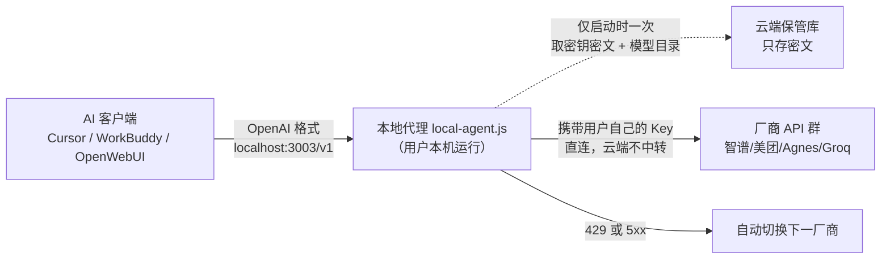

# BYOK 统一令牌与本地代理架构

> 本篇描述的是产品**声称并经公开页面/前端代码部分核实**的架构，非官方 API 文档。本地代理二进制闭源、核验时未运行，凡推断处均显式标注。

## 1. 它解决什么问题

博文把免费模型的摩擦归为三类（📝 作者体验，F-012/F-017/F-022）：

1. **接入碎片化**：各厂商 Endpoint、模型名、鉴权头不同，Cursor 里要手配多个自定义源；
2. **额度焦虑**：免费档并发低（智谱约 1 并发）、日请求有限（Groq 1000 RPD）、一次性礼包会耗尽；
3. **选模认知负担**：代码、中文、长文本各有强弱，手动按任务切模型。

token.inurl.link 的答案是「**一个令牌 + 一个本地端点 + 自动路由**」：多厂商 Key 在浏览器端加密后托管，客户端只对接本机 OpenAI 兼容代理，由代理在用户已录入的 Key 之间选址与故障切换（F-019/F-020）。

## 2. 架构与请求路径

- 代理地址固定 `http://localhost:3003/v1`，实现了 OpenAI 兼容的 `GET /v1/models`（F-047）；
- 可双击 Windows 启动器 `byok-launch.bat`，或手动以 `AGENT_TOKEN=… AGENT_MASTERKEY=… node local-agent.js` 启动（F-047）；
- 云端只在代理启动时交付密钥密文与模型目录，业务请求路径上没有云端节点（F-020）——这是它自称「不是中转是 BYOK」的依据。

## 3. 三类逻辑名与路由策略

| 逻辑模型名 | 用途 | 说明 |
|-----------|------|------|
| `inurl` / `inurl-text` | 文本对话（默认，旧名 `auto` 仍兼容） | 在用户已添加 Key 的文本厂商间选址 |
| `inurl-code` | 代码场景 | 仅从带 code 能力标签的模型中选 |
| `inurl-image` / `inurl-video` / `inurl-audio` | 图像/视频/音频 | 路由到对应多模态厂商 |

- 故障切换：某厂商返回 429/5xx 时自动切到下一家（F-048）；博文宣称「0.1 秒内」完成（F-025），**无任何可核验出处，属厂商/作者自述数字**。
- 路由池不是全局固定的：实测目录里博文点名的五个模型 id 均存在（`qwen/qwen-coder-plus`、`deepseek/deepseek-v4-flash`、`zhipu-free/glm-4-flash`、`longcat/LongCat-Flash-Chat`、`agnes/agnes-2.5-flash`，F-049），但实际只在**用户自己录入了 Key 的厂商**之间轮询；可用环境变量 `AUTO_MODELS` / `AUTO_PROVIDER_ORDER` 手动限定。
- 本地模型也可入池：免费 17 家目录含「Ollama（本机）」，隐私场景可在网络模型与本地模型间混合（F-032/F-050）。

## 4. 密钥安全模型：兑现了什么，不覆盖什么

### 4.1 浏览器侧 E2EE——代码层面已核实 ✅

前端 WebCrypto 与产品文案逐字对应（F-052）：

- `deriveKeyFromSecret`：**PBKDF2（100000 次迭代、SHA-256）** 派生 **AES-GCM-256** 主密钥；
- 注册时生成两份托管密文：`escrow_pw`（密码派生密钥加密主密钥）与 `escrow_rec`（恢复密语派生密钥加密主密钥），POST 到 `/api/escrow`——即「双份 escrow」：忘密码可用恢复密语（Recovery Secret）找回；
- 服务端只接收密文，因此「云端数据库被拖库不泄露明文 Key」在**该威胁模型下成立**（F-039/F-040 的合理部分）。

### 4.2 不被 E2EE 覆盖的两层风险 ⚠️

1. **闭源本地代理供应链**：`local-agent.js`/`byok-launch.bat` 由同一匿名运营者分发、运行时下载，且教程自述启动器「已内嵌你的统一令牌与主密钥」（F-053）。浏览器加密再强，也无法约束运营者日后对代理推送的代码——代理本身就运行在持有全部明文 Key 的位置。
2. **运营主体无追责渠道**：产品站无公司名、无 ICP 备案、无联系方式、无开源仓库（F-056）。

与「明文中转平台」的对比因此要精确表述：**云端脱库风险显著更低（可证实）；本机代理被投毒/运营者作恶风险无法评估（闭源+匿名）。**

## 5. 商业模式与「0 元」架构边界

| 档位 | 价格 | 厂商密钥数 | 其他 |
|------|------|-----------|------|
| 免费版 | ¥0 | **3 个** | 本地代理 |
| 标准版 | ¥9.9/月 | 10 个 | 邮件支持；邀请奖励送 7 天 |
| 专业版 | ¥29.9/月 | 无限 | 多会话/多 Agent、优先支持 |

数据来自公开接口 `/api/billing/plans`（支付宝已接通，F-051）。这意味着架构上「统一管理 17 家 Key」必须配专业档——博文把 /models 页「免费厂商 17 家」的目录计数（F-050）叙述成自己「注册并托管了 17 家 Key」（F-041），二者不是一回事（勘误 E1，F-070）。

## 6. 同形态设计在行业中的位置

- **[EchoBird（百灵鸟）](../../echobird/index.md)**：同为「多模型一个入口」思路，但走 Tauri+Rust 桌面端与 Model Nexus 注册表层；
- **OpenRouter**：云端路由 + `:free` 免费模型，与 BYOK 本地代理相反，密钥与请求都过平台；
- **[上下文与 Token 成本优化](../../context-optimization/index.md)**：从压缩/缓存侧降本，与「多免费源聚合」正交，可叠加；
- 通用技术本质：OpenAI 兼容协议作为最小公约数 + 适配器模式（多厂商格式互转）+ 熔断器模式（429/5xx 切换）。理解模式后，即使不用该产品，也可用 LiteLLM、one-api/new-api 等**开源**自建同类网关，规避闭源供应链风险。
