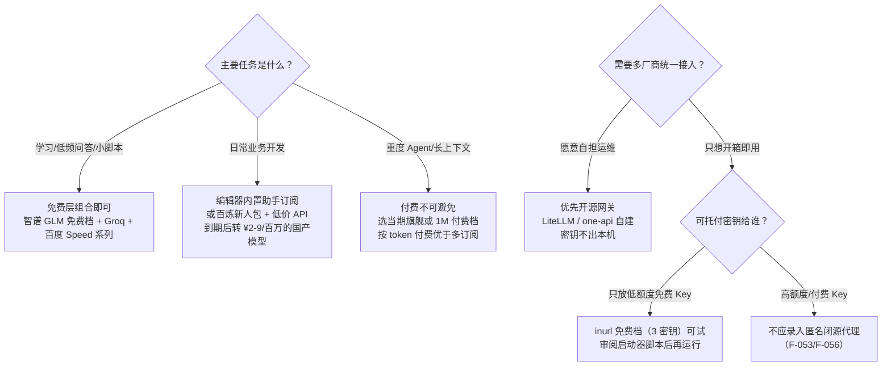

# 成本叙事、分层策略与决策边界

## 1. 账单：哪些可核，哪些不可核

博文账单（F-008~F-010）拆解：

| 账单项 | 2025-10 博文口径 | 核验 |
|--------|----------------|------|
| ChatGPT Plus | $20/月 | ✅ 官方 $20，自 2023 年起至 2026-09 未调价（F-066） |
| Claude Pro | $20/月 | ✅ 官方月付 $20（年付 $200，折 $17/月）（F-067） |
| OpenAI API | $35/月（另有一月 $80） | 📝 作者自述，无外部可核性（F-008/F-009） |
| 各种小工具订阅 | 「≈人民币 550 元/月」总额 | 📝 作者自述；$75 订阅按当期汇率约 ¥540，加 API 后总额口径本身偏松 |
| 2026-03 = 0 元 | 全部免费模型 | 📝 作者自述；且与 LongCat 政策时点矛盾（F-060 ❌） |

可确认的是：**两条付费订阅本身真实存在且价格准确**；不可确认的是 API 用量、总金额与「0 元」结果。叠加产品侧勘误（免费档 3 密钥、DeepSeek 付费、百万上下文付费化，F-070），账单的戏剧化对比应作为**营销叙事**而非财务证据阅读。

## 2. 作者「90/10 策略」的可取之处与修正

📝 作者观点（F-034~F-038）：90% 日常任务用免费模型、10% 复杂任务偶尔付费，月支出压到几十元。这个分层方向成立，但论据需要三处修正：

| 作者说法 | 修正（2026-09） |
|---------|----------------|
| 免费代码靠 qwen-coder + deepseek | qwen3-coder 有 90 天新人免费额度；**deepseek 官方收费**，免费只有限免活动（F-063/F-064） |
| 复杂任务靠 GPT-4o / Claude Opus | GPT-4o 已于 2026-02 退役；当期旗舰为 **GPT-5.6 Sol / Claude Opus 5**，另有 $8/月的 Go、$100/月的 Pro/Max 等中间档（F-066/F-067/F-069） |
| 「90% 的人 90% 时间不需要顶级推理」 | 无数据出处的口号；但「日常小模型 + 关键任务旗舰」的**分层消费**本身是合理工程实践 |

## 3. 真实的成本量级（核验时点）

- **趋近 0 元**：智谱 GLM 免费档（限速）、Groq 免费层（30 RPM/1000 RPD）、OpenRouter :free（20 RPM/50–1000 RPD）、百度 ERNIE-Speed/Lite 系列（限 QPS 不限量）、硅基流动 ≤9B 模型——足以支撑低频学习、脚本辅助、日常问答；
- **几十元/月**：inurl 专业档 ¥29.9（若真要聚合无限 Key）、API 按量付费在轻度使用下通常远低于订阅费（LongCat-2.0 折扣价 ¥2/¥8 每百万、DeepSeek 峰谷价同量级）；
- **两三百元级**：ChatGPT Plus/Claude Pro 单订阅（$20）+ 少量 API——这也是博文「10% 偶尔充」的现实落点；
- **隐性成本**：多平台注册/实名时间、429 与切换的注意力损耗、把代码与资料发给免费端点的隐私让渡（OpenRouter 明示可能记录提示词）。

## 4. 读者决策树

## 5. 使用本束时必须保留的四条边界

1. **信源边界**：所有「0 元/省 90%/0.1 秒/三周」均为推广文作者自述（F-025/F-033/F-038），不是独立测量结果；
2. **口径边界**：免费礼包都是一次性资源包（30–90 天），「免费」长期供给只有限速不限量的小模型档；
3. **信任边界**：匿名个人运营、闭源本地代理——只放随时可作废的低额度 Key（F-053/F-056）；
4. **时效边界**：免费政策与产品定价月级变动，本束数字截点 2026-09-16，`stale_after: 2026-12-31`；型号推荐请以当期旗舰为准。
