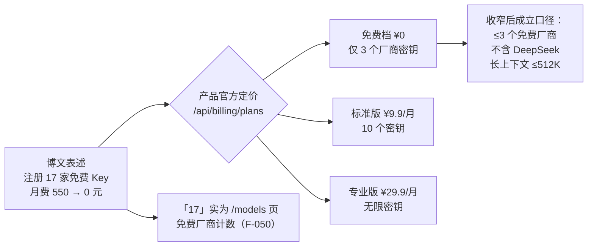

# P0 权威核验报告与勘误清单

> **⚠️ 核验结论：本 bundle 置 `status: flagged`。**
>
> 核验时间 **2026-09-16**，由三个相互独立的核验子代理完成（产品站点浏览器实测／国内模型官方口径检索／海外定价与时效检索），官方文档优先。博文是**推广软文**，其主结论「用 token.inurl.link + 免费模型，月付 500 → 0 元干完所有活」存在 **1 项核心口径冲突（E1）**，并有 **2 项失实（E2/E3）与 3 项口径差异（E4–E6）**。产品本身真实运营、浏览器侧加密兑现，并非诈骗站点，但「0 元全包」不成立。

## 1. 核验范围与方法

| 组 | 对象 | 方法 | 说明 |
|----|------|------|------|
| A | token.inurl.link 产品与 10 项功能声明 | browser_use 仅浏览公开页面与公开 GET 接口（`/api/catalog`、`/api/billing/plans`、`/api/turnstile`）与前端 JS | **未注册、未填信息、未下载**本地代理二进制；故代理运行时行为与「云端不中转」仅能验证到设计层 |
| B | GLM-4-Flash、LongCat、百度千帆、Agnes、qwen-coder、DeepSeek、硅基流动、OpenRouter | 厂商官方文档/公告/新闻优先，独立二手来源交叉 | 以 2026-09-16 当日页面为准 |
| C | ChatGPT Plus/Claude Pro 定价、Groq/OpenRouter 免费层、旗舰型号时效 | openai.com、claude.com、console.groq.com、openrouter.ai 官方页面 | 2025-10 历史价格依据官方页面连续无调价记录判定 |

## 2. 勘误四张清单结果

### 清单①　日期/版本/型号

| # | 博文口径 | 权威口径 | 结论 |
|---|---------|---------|------|
| 1 | 「复杂推理还是得 GPT-4o 或 Claude Opus」（F-036，2026-09-02 发布） | GPT-4o 已于 **2026-02-13 从 ChatGPT 退役**；2026-09 旗舰是 **GPT-5.6 Sol**（2026-07-09）；Claude 现旗舰 **Opus 5**（2026-07-24）。且 2025-10 账单时点 GPT-4o 也已非旗舰（GPT-5 于 2025-08 发布） | ❌ **E3：发布当日即过时** |
| 2 | 注册「会有人机验证，请完成 Cloudflare 验证框」（F-022） | Turnstile 组件确已集成（siteKey 存在），但 `/api/turnstile` 当日返回 `enabled:false` | ⚠️ **E6：文案与当下实现脱节**（非硬伤） |
| 3 | 「新用户送 1000 万 Tokens」的 LongCat 被用于「2026-03 已 0 元」叙事（F-010/F-014） | 1000 万政策随 LongCat-2.0 于 **2026-06-30** 才推出 | ❌ **E2b：时间线互斥** |

### 清单②　成效数字溯源表

| # | 博文数字 | 核验 | 处置 |
|---|---------|------|------|
| 1 | 月费 550 元、OpenAI $80 月账单、2026-03 为 0、三周零花费、省 90%（F-008~F-010/F-033/F-038） | 个人账单，天然无外部可核性；订阅单价部分（$20+$20）经官方证实 ✅ | 正文标「作者自述」，不升级为事实 |
| 2 | 限额「0.1 秒内切下一家」（F-025） | 故障转移机制在教程中有说明，但 0.1 秒无任何出处 | 标「厂商/作者自述性能数字」 |
| 3 | 「注册了 17 家免费模型的 Key」且月费 0（F-041） | 「17」是产品 /models 页**免费厂商数量**（F-050）；产品免费档**只允许 3 个厂商密钥**，10 个 ¥9.9/月、无限 ¥29.9/月（F-051） | ❌ **E1：核心口径冲突，详见 §3** |
| 4 | 首页自述「已托管密钥 6 / 支持厂商 8+ / 明文上云 0」（F-045） | 实时目录已含 46 provider（F-046），宣传数字为站点自选口径 | 记录为站点自述 |

### 清单③　口径对照表

| # | 博文口径 | 官方口径 | 结论 |
|---|---------|---------|------|
| 1 | 百度「每月 100 万，月中见底」（F-015） | 千帆 ModelBuilder **每模型** 100 万 tokens、**3 个月有效、不按月重置**；另有 ERNIE-Speed/Lite/Tiny/3.5-8K **永久免费不限量**（限 QPS≈50），博文漏报 | ⚠️ **E4：重置周期错误 + 漏报永久免费层** |
| 2 | 「Agnes AI 的百万上下文」作为免费长文档方案（F-030） | 免费 agnes-2.5-flash（及已废弃 2.0-flash）均为 **512K**；1M 仅付费 **agnes-2.5-pro**（2026-08-01）；6–7 月灰度 1M 高峰即降 512K | ⚠️ **E5：免费拿不到稳定 1M** |
| 3 | LongCat「1000 万 Tokens」隐含为长期免费额度（F-014） | 一次性实名奖励资源包、**30 天有效**；现行 LongCat-2.0 已按量付费（输入 ¥2/输出 ¥8 每百万，折扣价）；「1M 上下文」属该付费新模型 | ⚠️ 一次性礼包被叙述为长期供给 |
| 4 | DeepSeek 是免费自动路由后端（F-024/F-034） | 官方 API 收费（V3/V4 明码标价、V4 峰谷计价），仅小额新人赠送；硅基流动免费层仅 ≤9B 小模型；OpenRouter 免费名单 2026-09 已无 DeepSeek；仅 AMD/Hetzner/WorkBuddy 等限免活动可免费调用，产品 /models 也把 DeepSeek 归**付费 19 家** | ❌ **E2：失实** |

### 清单④　产品/引文逐字核对表

| # | 声明 | 核验 |
|---|------|------|
| 1 | 统一令牌收拢多厂商 Key（F-019/F-023） | ✅ 官网、`/app` 与 `/api/catalog`（46 provider）一致；令牌前缀 `byok_live_`；Unified Token/Recovery Secret 文案存在 |
| 2 | localhost:3003 OpenAI 兼容本地代理（F-020/F-028） | ✅ /guide 原文固定地址 `http://localhost:3003/v1`、`GET /v1/models`；控制台有真实本机轮询逻辑；代理二进制闭源未实测 |
| 3 | 「云端绝不中转、本机直连厂商」（F-020/F-039） | ✅ 设计自洽且有文档/代码佐证意图；⚠️ 属架构自证，依赖运营者自觉；**闭源本地代理 + 启动器内嵌主密钥（F-053）构成 E2EE 不覆盖的供应链层** |
| 4 | AES-256-GCM + PBKDF2 + 双份 escrow（F-027/F-039） | ✅ 前端 WebCrypto 逐字对应：PBKDF2 100000/SHA-256/AES-GCM-256、`escrow_pw`+`escrow_rec` 双密文 POST `/api/escrow` |
| 5 | 别名 inurl / inurl-code / inurl-image（F-026） | ✅ 另有 inurl-video、inurl-audio；旧名 auto 兼容；`AUTO_MODELS`/`AUTO_PROVIDER_ORDER` 可限池 |
| 6 | WorkBuddy 像产品自家客户端（F-029 语境） | ✅ 事实层澄清：WorkBuddy 是**第三方独立 AI Agent 云沙箱**（agentos-app.net、腾讯云 CLB），inurl 仅把它列为兼容客户端 |
| 7 | 产品零成本（软文整体印象） | ❌ 免费增值：免费档限 3 密钥；标准 ¥9.9/月、专业 ¥29.9/月；支付宝已接通（F-051） |

## 3. 核心勘误 E1：「17 家 Key + 0 元」为什么不成立

- 托管 17 家 Key 需要「无限密钥」档（¥29.9/月）；即便「10 个」也要 ¥9.9/月——「17 家全量托管」与「0 元」在产品自身价格表下互斥（F-070）。
- 即使只看模型侧：博文自动路由的两大代码/长上下文支柱中，DeepSeek 已归付费（F-064），Agnes 免费档 512K（F-062），LongCat 现行 1M 模型按量付费（F-059）。
- **可成立的最小口径**：3 个以内免费厂商密钥（如智谱 GLM 免费档 + Groq + OpenRouter :free）、本地代理免费档、不触达 DeepSeek/付费长上下文——能显著压缩 AI 开支，但不是「0 元干完所有活」。

## 4. 通过项（✅ 11 项）

1. 产品四 URL 可达、后端真实运营（F-044/F-046）；2. 统一令牌/恢复密语机制（F-023/F-052）；3. localhost:3003/v1 与 OpenAI 兼容（F-047）；4. 路由别名体系与故障切换设计（F-048）；5. GLM-4-Flash 免费与 429 限流（F-058）；6. LongCat 1000 万新人包确有出处（F-059，口径附条件）；7. qwen3-coder 免费渠道（F-063）；8. 硅基流动/OpenRouter 免费层（F-065）；9. ChatGPT Plus $20 历史与现价（F-066）；10. Claude Pro $20（F-067）；11. Groq 免费但额度有限（F-068）。

## 5. 信任画像与风险提示（产品侧）

- **真实但匿名**：产品在运营、代码层面兑现浏览器侧 E2EE；但无公司名、无 ICP、无联系方式、无开源仓库，主体可追溯至河南个人站长（资深 SEO/网络营销），页面含 VPN 机场广告与返佣短链（F-056）。
- **供应链风险**：`byok-launch.bat`/`local-agent.js` 闭源、运行时下载且内嵌令牌与主密钥（F-053）——E2EE 防得住「云端脱库」，防不住「代理被更新投毒」。
- **工程信号**：裸 JSON 错误页、生产残留 HMR 探针（F-057）。
- **建议**：只录入低额度/可随时作废的免费 Key；运行启动器前人工审阅脚本；不要绑定可大额消费的付费 Key；付费档无退款/主体保障条款。

## 6. flagged 管理与复核

- 触发依据：❌ 项命中博文主结论（0 元全免费工作流）——E1（F-070）、E2（F-064/F-060）、E3（F-069）。
- 复核安排：`stale_after: 2026-12-31` 前复核三件事——① inurl 免费档密钥数与定价是否变化；② LongCat/Agnes/DeepSeek 免费政策是否再调整；③ 博文是否被公众号修订或删改。
- 复核后若主结论获官方修正口径支持，可升级 stable；否则维持 flagged 直至 deprecated。
