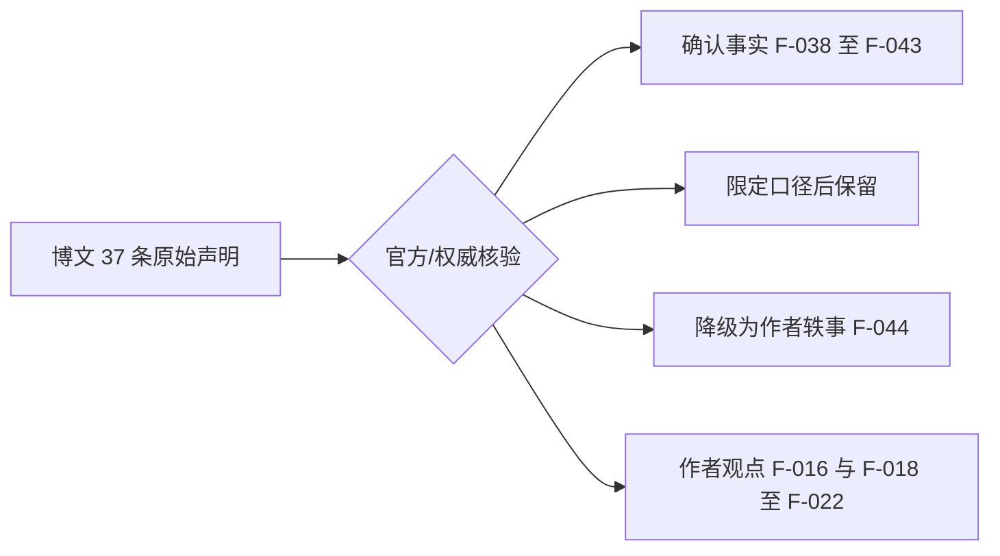

# llama.cpp 是什么：项目身份与信源边界

> 事实层（What / Who / When）。本文所有数字均带核验时点；作者主观体验段落统一标注“作者观点”，不作为客观结论。

## 一句话定位

llama.cpp（[github.com/ggml-org/llama.cpp](https://github.com/ggml-org/llama.cpp)）是一个用 **C/C++ 编写的大语言模型推理框架**，GitHub 官方描述为 “LLM inference in C/C++”（F-007、F-038）。它的核心价值是让大模型在消费级硬件上**本地推理**：CPU 路径即可运行，运行预编译二进制时不要求 Python 环境或 CUDA 工具链（F-009、F-010，准确边界见下节）。

## 身份卡片

| 项目 | 值 | 出处 |
|------|-----|------|
| 仓库 | https://github.com/ggml-org/llama.cpp | F-038 |
| 组织 / 主语言 | `ggml-org` / C++ | F-038 |
| 创建时间 | 2023-03-10 | F-038 |
| 许可证 | MIT | F-038 |
| 项目主页 | https://llama.app | F-038 |
| 默认分支 | `master` | F-038 |
| Star | 博文发布时点（2026-07-31）口径 **121K**（F-037）；GitHub API 2026-09-16 实测 **127,752**（F-038，V 阶段独立复核一致） | F-037/F-038 |
| Fork | 22,995（2026-09-16） | F-038 |

> 博文标题中的“121K 星标”是**发文时点口径**，引用时须带时点；本知识包数字以 2026-09-16 官方 API 快照为准（F-037、F-038）。

## “连依赖都不用装”的准确口径

博文称“连依赖都不用装，下载就能用”“不需要 Python 环境、不需要 CUDA”“一个可执行文件加一个模型文件就能开始”（F-008、F-009、F-010、F-011）。经官方安装文档核验，这一说法在 **CPU 预编译二进制**场景下基本成立，但要补充三条边界：

- 运行 CPU 版预编译 `llama-cli`/`llama-server` 时，不必安装 Python、PyTorch 或 CUDA Toolkit（F-009、F-010、F-039）。
- 仍需下载**与操作系统/CPU 匹配的二进制**——包管理器、GitHub Releases 预编译包或 Docker 镜像（F-039）。
- 模型文件必须是 llama.cpp 可读的 **GGUF 格式**；“一个模型文件”隐含这一格式前提（F-011 补充、F-041）。
- 若要 CUDA、ROCm、Vulkan、SYCL、MUSA 等 GPU 加速，通常对应专门的 Docker 镜像变体或源码构建选项，不是“下载即用”的 CPU 包路径（F-039、F-042）。

## 官方四种安装形态

| 形态 | 适用场景 | 加速支持 | 出处 |
|------|---------|---------|------|
| 包管理器快速安装 | 入门体验 | 通常仅包含 CPU 支持 | F-039 |
| GitHub Releases 预编译二进制 | 免编译直接运行 | 按发布物区分平台/后端 | F-023、F-039 |
| Docker 镜像 | 自托管 / 一致环境 | CPU 与 CUDA、ROCm、Vulkan、SYCL、MUSA 等变体 | F-039、F-047 |
| 源码构建 | GPU 加速、自定义配置 | 全部后端可选 | F-039、F-042 |

## 信源边界与可信度分层

本知识包源自微信公众号「开源君笔记」文章《121K星的开源神器，本地跑大模型不用显卡了》（2026-07-31，F-001~F-004）。原文约 888 字、8 个自然段，无章节标题、列表、代码块或外链（F-005、F-006），属**第三方个人体验/科普**，信源距离为“作者个人体验”，不是官方发布：

- **已升级为官方信源的事实**：仓库身份与热度（F-038）、安装形态（F-039）、server 与 API 能力（F-040、F-047）、GGUF 与内存量级（F-041）、后端矩阵（F-042）、迁移要点（F-046）。
- **作者观点（不得转述为官方结论）**：台式机速度翻倍（F-016）、M 系列比同价位 Windows 快不少（F-018）、质量与 GPT-3.5 差不太多（F-019）、推理能力不输云端 API（F-020）、量化不破坏核心能力（F-021）、本地与 API 体验几乎一样（F-022）、迁移成本几乎为零（F-029）、一行配置即可切换（F-030）、节省硬件成本（F-033）、闲置机比租云划算（F-035）、推荐人人安装（F-036）。
- **被核验推翻的泛化说法**：4GB 内存旧笔记本通用运行 Q4 7B 且达到 20–30 token/s（F-044，详见 [01 量化、硬件与本地服务](01-quantization-hardware-server.md) 与 [核验报告 §4](../references/verification.md)）。

## 延伸阅读

- [01 量化、硬件与本地服务](01-quantization-hardware-server.md)——GGUF/Q4、内存预算、后端矩阵、llama-server 与树莓派边界
- [02 本地 API 采用与云端取舍](02-local-api-adoption.md)——OpenAI 兼容迁移清单、隐私/成本/质量三维取舍与反模式
- [博文原文事实清单](../references/article-source.md) / [P0 核验报告](../references/verification.md)
