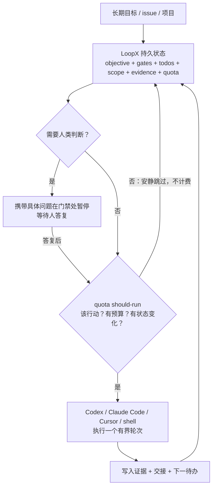

# 控制面工作机制

> 本篇对应博文"功能详情"六小节（状态内核 / 配额机制 / 人类门禁 / 个人工作台 / 多工具支持），并以官方 README 的"五个控制面承诺"重构叙述。所有机制描述以 F-010~F-018、F-044~F-047 为据。

## 一个循环：状态内核如何驱动宿主



图据官方 README 控制流与博文 F-007/F-012~F-015 重绘（非官方原图）。

## 内核的五个控制面承诺

官方把 LoopX 内核机制折叠为五个问题，每个问题对应一个产品承诺：

| 问题 | LoopX 保持可见的东西 | 博文对应 |
|---|---|---|
| 目标是什么？ | 当前活跃 goal、显式 scope、当前权限 | F-006/F-007 |
| 下一步发生什么？ | 有序的用户/Agent 待办、归属、认领（claim）与租约（lease） | F-007 |
| 什么需要人判断？ | **具体的用户门禁**，而非含糊的"等待所有者" | F-014 |
| 什么证据发生了变化？ | 紧凑运行历史、校验、阻塞项、被接受的 writeback | F-019 证据沉淀 |
| 循环可以继续吗？ | 配额、能力、安全兜底、调度提示与停止条件 | F-012/F-013 |

## 状态内核：本地文件即权威

目标建立之后，范围、进展、每轮证据等状态全部落在**本地文件**，不经过云服务（F-010）。因此宿主会话关闭、电脑重启、甚至隔一周再打开，都能从上一轮停下的位置继续，不必翻聊天记录去猜（F-011）。

本地运行态目录（官方建议 gitignore，F-046）：

- `.loopx/`——注册表与 Goal 状态（连接成功的标志之一是存在 `.loopx/registry.json`）；
- `.codex/goals/`——Codex 侧 Goal 数据；
- `.local/`——本地运行态。

官方心智模型是"**面向长程工作的、Agent 原生的看板（Kanban）**"：卡片携带身份、权限、证据与续做点，claim/gate/monitor/writeback 是被校验的操作；看板只是投影，LoopX 状态才是事实源。注册的各 Agent 是对等节点（peer），靠认领、租约、任务边界与类型化续做决定谁行动，不需要持久的领导者身份。

## quota 闸门：每轮执行前先回答"该不该花钱"

博文作者称之为"个人最喜欢的设计"（作者偏好，F-012）：每次调度触发前先跑一次 `loopx quota should-run`，同时回答三件事——**现在该行动吗？还有预算吗？有没有实际的状态变化？**

官方核心 tick 只有五条很小的命令：

```text
loopx quota should-run      # 该注册 Agent 现在行动吗？
loopx todo claim            # 这个切片归谁？
loopx todo update           # 发生了什么变化？
loopx refresh-state         # 下一轮该看到什么？
loopx quota spend-slot      # 为已完成且校验过的切片记账
```

计费规则有官方原文背书（F-044）：

> "Quiet skips, preflight failures, and dry-run previews do not spend."
> （安静跳过、预检失败、试运行预览均不扣费。）

并且自动轮次必须**先查配额、在经验证的 writeback 之后才追加 spend**；当某条车道被用户门禁阻塞时，另一条经审计的安全兜底车道可以继续工作，但**不得绕过该门禁**。这正面回应了博文开头的痛点——定时器只负责"定时触发"，无法回答"触发了但没事可做要不要花钱"（F-004/F-005 为作者观点）。

## 人类门禁：停下来时必须带着具体问题

长任务的汇报频率很难拿捏：问太勤烦人，全程不问又怕跑偏。LoopX 把需要人拍板的节点做成**显式门禁**：循环走到门禁即暂停，并附上一个具体问题，例如"这个改动要不要合入""这条路线还要不要继续"，人答复后才继续（F-014）。

边界划得很硬（F-015，官方逐字确认）：危险权限、对外发布、生产环境写操作与最终所有权始终属于人——"LoopX is not an autonomous production controller"。1.0 工作台进一步把受保护改动做成"类型化预览 → 显式确认 → 回执（receipt）"的流程。

## 个人工作台：浏览器里的本地总控面板

安装后执行 `loopx dashboard` 即在浏览器拉起本地工作台（F-016）：

- 哪些目标需要你、哪些在跑、哪些被监视、哪些是定时或已停状态，一屏可见；
- 上周开的目标这周再打开，仍停在原处，证据与剩余待办都在；
- 可**同时挂多个 Agent 会话**：Codex 干一段、Claude Code 接一段，Goal 状态与证据不丢（F-017，官方原文同述）。

1.0 形态更新（F-049）：dashboard 是官方受支持的浏览器/PWA 启动路径；另提供原生桌面预览（macOS Apple Silicon 有签名的自动更新但未公证；Windows 预览版需手动更新且 CLI 独立安装）；并新增飞书/Lark 异步收件箱与 Manager 群"消息可见性 ≠ Turn 权限"的上下文契约。

## 多宿主接入：博文列举是官方子集

博文称"主流 AI 编程工具基本都有现成接入方式"（F-018），核验属实且官方表范围更大（F-045）：

| 宿主 | 接入要点 |
|---|---|
| Codex App | 让 Agent 连接项目并跑 `loopx doctor`，随后用 `$loopx <任务>` 或 /skills 选择；心跳自动化按 `quota should-run.scheduler_hint` 刷新 |
| Codex CLI | 项目内启动 codex 连接诊断后用 `$loopx`/`/skills`；可见 `/goal` 入口，默认无隐藏无头执行 |
| Claude Code | 安装 opt-in 适配器，`/loopx <任务>` 后 `/loop`；原生 /loop 受 LoopX 门禁约束 |
| Cursor / shell / 自定义 runner | 安装器 + `loopx doctor`，手动连接或在自己的 runner 中调用 |
| DeepSeek Harness（dsh） | 原生 dsh 插件（1.0 路径，extra `loopx[deepseek-harness]`）或 dsh goal-mode 适配器（无头轮次） |
| 其他 | KunlunCode、OpenCode、Pi、ZCode、Antigravity CLI（agy）、Kiro CLI 等，均通过各自 facade/适配器把每轮续做送回 quota should-run |

自定义 runner 的最小示例为 `examples/custom-runtime-minimal-cli-turn-smoke.py`，完整指南见官方 "Embed LoopX in Your Agent Runner"——多 Agent 协作时，一个实现、一个评审（官方 cross-runtime review demo 即 Claude 实现 / Codex 评审），所有权、证据、配额、交接全程显式。

## 无遥测与依赖口径

- **无遥测**：官方首跑反馈 issue 模板明确 "contains no telemetry"，且要求不附日志、路径、凭证、内部项目名与目标内容；`loopx first-run-report` 只在本地打印预填链接、不发送任何内容（F-047）。该结论限于官方声明口径，未做源码级审计。
- **依赖**：0.4/0.5 的 PyPI 包为零强制运行时依赖（博文"没有三方依赖"的依据）；**1.0 起新增外部前置 Node.js 22.18.0+**（TypeScript Effect 内核由 LoopX 托管启停），Python 包本身的 `requires_dist` 仍无强制 runtime 依赖（F-038/F-040/F-041）。

## 延伸阅读

- [00 LoopX 是什么](00-loopx-overview.md)——定位、热度与版本演进
- [02 200 小时证据与适用边界](02-evidence-and-fit.md)——机制如何在真实长任务中留证
- [安装与自检实操](../examples/00-install-and-doctor.md)
