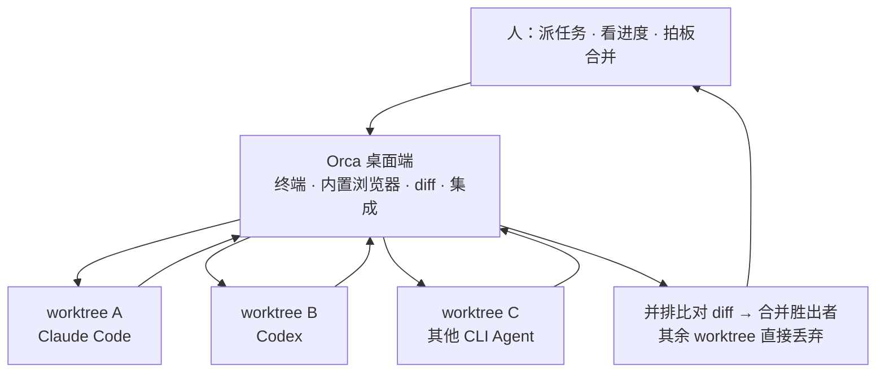

# Orca 是什么——管理并行 Agent 舰队的开源桌面 ADE

## 一句话定位

Orca 是 **Stably AI 开源的桌面工具，用于管理一支并行的 AI 编程 Agent 舰队**——它不是一个新模型、也不是传统意义上的编辑器，而是把多个已在本地登录的 CLI Agent 收进同一个界面，让它们各自在隔离的 git worktree 里并行干活，再由人并排比对、择优合并（F-001、F-003、F-014~F-018）。

官方仓库描述的原句为：

> "Orca is the ADE for working with a fleet of parallel agents…"（F-064，仓库 description 逐字）

官方标语则写作 "**Ship 100x with the agent IDE**"（F-074），`docs` 首页自称 "a desktop **IDE**"（F-074）——注意：官方在同一站内**交替使用 ADE / agent IDE / desktop IDE 三种说法**，这直接引出下节的定位口径问题。

## "ADE" 定位的口径边界（重要勘误，双口径阅读）

博文给 Orca 的定位是"官方给它的定位叫 ADE，Agent Development Environment"（F-005）。核验后须拆成两层看（E-4）：

**官方字面口径（✅ 证实）**

- 仓库 description 使用缩写 **ADE**（F-064）；
- 官网另有句 "**An ADE is built for you and your agents**"（F-074）；
- 但官方从未展开这个缩写的全称，同站更常用 "agent IDE" 与 "desktop IDE" 自指（F-074）。

**第三方外推口径（⚠️ 无官方出处）**

- "**Agent Development Environment**" 这一全称**没有官方出处**，仅见于第三方文章与 GitHub topic 标注（E-4）。

> 引用建议：可写"官方称其为 **ADE**"，**不要**直接断言"官方全称是 Agent Development Environment"。本包标题中的"ADE"同样取自官方的缩写字面用法。

## 与传统 IDE 的分工差异

博文作者给出的对比是（F-006，**作者观点**，P2 单源，不作为事实引用）：传统 IDE 里 AI 只是插件，人仍是敲代码的主力；而在 Orca 里，**干活主力变成了 Agent，人主要负责派任务和看进度**。这也解释了官方为何把自己描述成"IDE 之外的 ADE"——它编排的是"Agent 的作业"，而非"人的编辑动作"。

## 谁做的：Stably AI（YC W22）

| 项 | 值 | 出处 |
|---|---|---|
| 开源方 | Stably AI（F-003） | 仓库 + YC 公司页 |
| YC 批次 | **Winter 2022**，Active（F-072） | YC 公司页 "Stably AI (Orca)" |
| 地点 / 团队规模 | 旧金山 / Team 25（F-072） | 同上 |
| 创始人 | Jinjing Liang（CEO）、Neil Parker（F-073） | 同上 |
| 公司主营 | Stably——AI 测试平台 stably.ai（F-073） | 同上 |
| 仓库建仓 | 2026-03-17，主语言 TypeScript（F-063） | GitHub API |

> **待澄清**：Orca 仓库建仓于 **2026-03**，而 YC 批次为 **W22**（2022 年冬），两者相隔约四年。**官方未解释这一时序关系**（facts.md 未覆盖边界④）；不宜据 YC 批次的 2022 年份反推 Orca 项目的年龄。

## 开源、免费与账号口径

**许可与计费（口径清晰）**

- License 为 **MIT License**（F-062，GitHub API）；
- 官网首页明确 "**Free and open source.**"（F-080）；`/pricing` 返回 **404**，全站无计费页（F-080）；
- 官方另声明 "Orca does **not** sell managed VPS hosting"、"your provider account, images, and billing stay yours"（F-081）——即不代售托管算力。

**账号口径（官方自相矛盾，双口径呈现）**

| 口径 | 官方原文 | 出处 |
|---|---|---|
| 桌面端 | "**Orca has no account system**" | telemetry 文档（F-078） |
| 移动端 | 需 "signed into the same Orca account"，"sign-in is required for **Relay only**" | mobile 文档（F-079） |

博文"**也不需要注册什么 Orca 账号**"（F-008）只对桌面端主路径成立；**移动端配对走 Relay 时明确要求登录同一 Orca 账号**（E-2，**部分失真**）。官方尚未澄清这一矛盾（facts.md 未覆盖边界⑤）。准确表述应为：**桌面端不需要 Orca 账号；移动端远程（Relay）需要。**

## 热度与版本（三方数字，须带时点）

博文标题与正文称 Orca 已有 "**6.7 万 Star**"（F-002、F-059）。核验后应按下表分层引用：

| 口径 | 值 | 时点 / 出处 |
|---|---|---|
| 博文 | 6.7 万 Star，仍在增长 | 博文发布日 2026-09-14（F-002/F-059） |
| 官方仓库实测 | **66,453**（≈6.6 万） | GitHub API，核验日 2026-09-20（F-061） |
| 第三方统计 | **70.5K**（gstars.dev）/ **71.4K**（stably.ai 官网页面） | 2026-09-17（F-099） |

> **量级成立、时点有别**（E-3）：66,453 为核验日快照，第三方 70.5K–71.4K 为不同时点统计；引用 star 数务必带时点，勿把博文的 "6.7 万"当作当前精确值。

**版本**：最新正式版 **v1.4.205**（2026-09-17，F-067）；Homebrew tap 的 `Casks/orca.rb` 同步声明 `version "1.4.205"`（F-070）。属周级迭代的活跃项目（见"已知边界"的时效提示）。

## 支持平台与分发

- **桌面端三平台**（F-068）：macOS、Windows、Linux。Release 资产为 `orca-macos-arm64.dmg`、`orca-macos-x64.dmg`、`orca-windows-setup.exe`（.exe）、`orca-linux.AppImage`、`orca-linux-arm64.AppImage`，另有 `.deb`/`.rpm`；**macOS 没有 zip 安装包**（E-7 补充）。
- **移动端**（F-093、F-035）：iOS 与 Android 均有配套 App。
  - iOS：App Store 条目 "**Orca IDE**"，副题 "Manage Coding Agents Remotely"，免费，另给 TestFlight 链接（F-093、F-094）；
  - Android：**仅走 GitHub Releases APK**，核验日未发现 Google Play 官方条目（F-095）——且官方两处 Android 版本号不一致：官网写 "APK 0.0.48"，README 链接为 `mobile-android-v0.0.50`（F-096、E-6）。
- **安装入口的硬错误纠正**（E-1）：官网真实域名为 **`onorca.dev`**（F-069），macOS 安装命令为：

```bash
brew install --cask stablyai/orca/orca
```

  该命令经 Homebrew tap 源码逐字证实（F-043、F-070）。
- **同名混淆提醒**（F-071）：Homebrew 官方仓库 `homebrew/cask` 里的 cask `orca` 是 **plotly 的图表工具**（无关），故本包命名为 `orca-ade`，且安装**必须使用全限定名** `stablyai/orca/orca`。

## 人—Orca—Agent 舰队的分层关系



图据官方仓库描述（F-064）与并行 worktree 机制（F-014~F-018）绘制（非官方原图）；机制细节见 [01 机制篇](/concepts/01-fleet-worktree-mechanism.md)。

## 延伸阅读

- [01 Agent 舰队与工作树编排机制](/concepts/01-fleet-worktree-mechanism.md)——并行隔离、终端、Design Mode、远程与 CLI
- [02 支持清单、成本真相与生态位](/concepts/02-ecosystem-and-fit.md)——官方三处口径差异、token 成本、适用判断与同分组生态位对比
- [核验报告](../references/verification.md)——E-1~E-7 勘误的完整来源记录