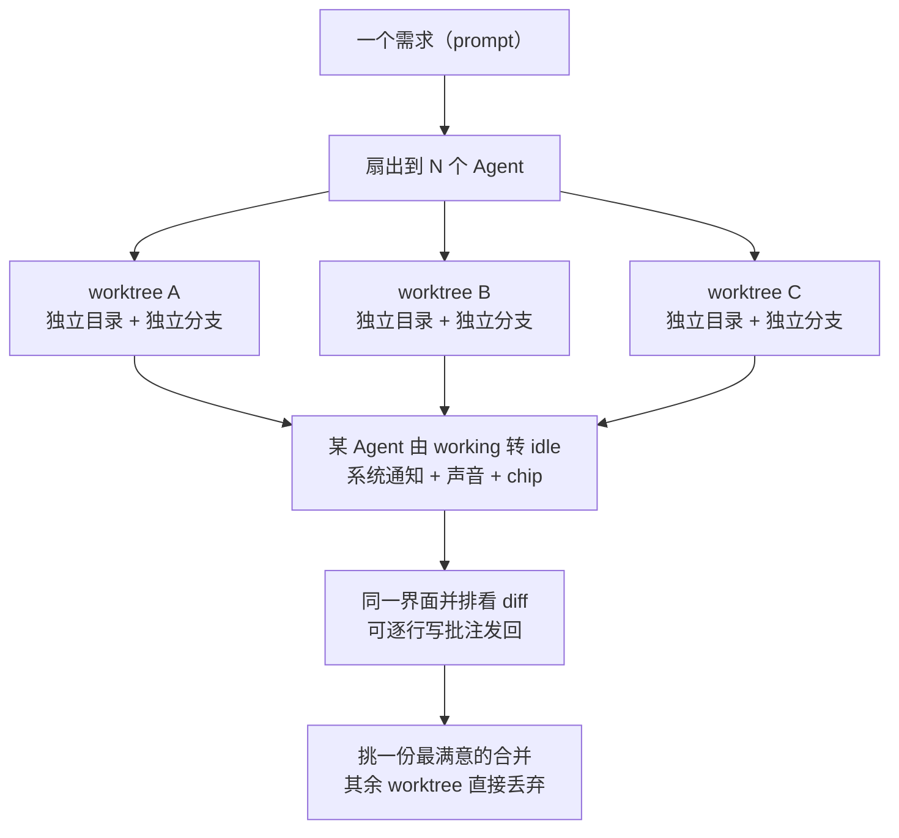

# Agent 舰队与工作树编排机制

> 本篇对应博文"功能详情"诸小节，并以官方 worktrees / terminal / design-mode / review / ssh / mobile / usage-tracking / cli 文档重构叙述。机制描述以 F-014~F-042、F-082~F-097 为据。

## 主回路：派任务 → 并行 worktree → 通知 → 比对 → 合并



图据官方 worktrees / notifications 文档（F-082、F-086）重绘（非官方原图）。

## 核心机制：一个 prompt 扇出到多个 Agent，各占一个 git worktree

这是 Orca 与"单个 Agent 聊天窗口"最本质的区别（F-014、F-015），官方 worktrees 文档原句为：

> "**Fan one prompt across five agents, each in its own isolated git worktree — compare the results and merge the winner.**"（F-082，官方逐字）

官方 first-session 文档用一句更短的表述概括同一件事：

> "**Three branches. Three diffs. Same prompt.**"（F-083，官方逐字）

**隔离是怎么实现的**（F-016、F-017）：每个 Agent 分到的是一个**独立 git worktree**——既有**独立目录**，又有**独立分支**，因此各 Agent 改文件**互不干扰**（官方用词 "isolated git worktree"）。跑完之后，人在同一界面里**并排查看各自的 diff，挑一份最满意的合并，其余直接丢弃**（F-018）。

**与旧路径的对比**（F-019，**作者观点**，P2 单源）：博文作者称，过去做同样的事需要**手动开多个终端、自己建 worktree、再用人工记住"哪个窗口对应哪个任务"**——Orca 把这套手工记账收进了一个界面。此对比为作者经验描述，非官方基准，不作为事实引用。

## 终端层：分屏、持久回滚与完成通知

官方 terminal 文档的定位原句为：

> "**Ghostty-class terminals with WebGL rendering, infinite splits, and scrollback that survives restarts**"（F-084，官方逐字）

对应到博文的功能描述（全部经官方证实）：

| 能力 | 官方表述 | 博文口径 |
|---|---|---|
| 渲染方式 | **WebGL rendering**（F-084） | 博文称"WebGL 渲染"（F-020） |
| 分屏 | **infinite splits**（F-084） | "支持无限分屏"（F-021） |
| 回滚持久 | **scrollback that survives restarts**（F-084） | "终端回滚记录重启后还在"（F-022） |
| 多 Agent 输出 | 所有输出平铺在一个窗口（F-023） | 同 |
| 完成通知 | Agent 由 working 转 idle 触发系统通知 + 声音 + chip（F-086） | "干完了会有通知，不用一直盯屏"（F-024） |

> **渲染口径的双档**（须双口径阅读，F-085）：**同一篇**官方 terminal 文档里，另有一处称其为 "the same **xterm.js-based** terminal VS Code uses"（F-085）。即官方文本中 **WebGL 渲染**与 **xterm.js 内核**两种表述并存，博文只取了前者。引用时宜写作"基于 xterm.js、以 WebGL 渲染的终端"，不要单押其一。

## 反馈闭环三件套：Design Mode、Diff 批注、任务直开 worktree

Orca 把"人给 Agent 提反馈"的三个入口都做进了界面（F-025~F-030）：

1. **Design Mode（内置 Chromium 浏览器中取元素）**——官方 design-mode 文档原句：
   > "Click any UI element in a real **Chromium** window to send its **HTML, CSS, and a cropped screenshot** straight into your agent's prompt."（F-087，官方逐字）

   博文口径为"点击页面元素，该元素的 HTML、CSS 和截图一起发给 Agent"（F-025、F-026）；官方文档另补充会附带 **computed styles 与 source map**（F-026 核验结论）。
2. **Diff 行级批注**——官方 annotate 文档原句：
   > "**Drop comments on any diff line and ship them back to the agent**"（F-088，官方逐字）

   即可在 diff 视图的任意一行写评论，写完一起发回让 Agent 继续改（F-027）。博文称"该流程和人工 review 代码差不多"——此为**作者观点**（F-028）。
3. **GitHub / Linear 任务一键开 worktree**——官方原文 "**GitHub & Linear, Native** — Browse PRs, issues, and project boards in-app — **open a worktree from any task**"（F-089，官方逐字）：PR、Issue、项目看板可在 Orca 内直接看（F-029），看到要做哪个任务即可**从该任务开出新 worktree**（F-030）。

## 远程与移动：SSH 远程 worktree + 手机远程指挥

**SSH 远程 worktree**（F-031~F-034，官方 ssh 文档 F-090）：可把 Agent 放到远程服务器上跑，远程场景下**文件编辑、git、终端能力都是完整的**（F-032）；官方原文 "**auto-reconnect and port forwarding included**"、"Orca reconnects and re-attaches"（F-090）——对应博文的"断线自动重连"（F-033）与"端口转发"（侧栏 Ports tab 一键转发，F-034）。

**移动端**（F-035~F-037，官方 mobile 文档 F-091）：iOS 与 Android 均有配套 App；与桌面端配对后，"**get notified when an agent finishes and send follow-ups from anywhere**"，且 "**Pairing is one-time**"（F-091）——即 Agent 跑完手机收通知（F-036），人不在电脑前也能发后续指令（F-037），配对为一次性。

> 注意：移动端走 Relay 时要求登录同一 Orca 账号（F-079），详见 [00 事实篇的账号口径](/concepts/00-orca-overview.md)。

## 治理与自动化：用量显示、多账号热切换、Orca CLI

**用量与限流治理**（F-038、F-039，官方 usage-tracking 文档 F-092）：状态栏直接显示 **Claude 和 Codex 的用量与限流重置时间**（5 小时/日/周三个重置周期，并在 80% 处给警告 chip），并可 **hot-swap accounts without re-logging in**——多账号一键切换、无需重新登录。

**Orca CLI**（F-040~F-042，官方 cli 文档 F-097）：Orca 自带一条命令行 `orca`（随桌面端附带），可脚本化地建 worktree、打快照、点界面等操作，例如：

```text
orca worktree create     # 脚本化建 worktree
orca snapshot            # 打快照
orca click / orca fill   # 模拟点击 / 填表
orca serve               # 无头 Linux
```

同时在另一方向上，官方称 "**Agents drive Orca too**"（F-042）——**Agent 反过来也能驱动 Orca**，从而把整个并行流程接进自动化流水线。

## 延伸阅读

- [00 Orca 是什么](/concepts/00-orca-overview.md)——定位、ADE 口径、厂商背景与版本
- [02 支持清单、成本真相与生态位](/concepts/02-ecosystem-and-fit.md)——机制落地的成本与适用边界
- [安装与首个会话实操](../examples/00-install-and-first-session.md)
- [并行 worktree 与 CLI 实操](../examples/01-parallel-worktrees-and-cli.md)